# 机器学习对板球运动员进行聚类

> 原文：<https://towardsdatascience.com/machine-learning-to-cluster-cricket-players-1d53beeb69b4?source=collection_archive---------17----------------------->

## k-means 聚类、层次聚类和 DBSCAN 聚类的应用

板球和数据科学这两者都一直令我着迷。当我偶然发现 IPL(印度超级联赛)数据时，我很好奇要对这些数据进行某种数学分析，从中得出一些有趣的东西。这些数据包含了 IPL 中每个投球的细节。有趣的是，首先将这些数据转换成球员级别的数据，然后尝试识别数据中的模式，将具有相似表现的球员分组在一起。这完全符合聚类问题。

聚类是一种“无监督的机器学习”，没有定义的标签，模型可以基于该标签进行训练。相反，它在数据中寻找模式，并根据模式对数据进行逻辑分组。组合在一起的最后一组数据称为聚类，它包含一组同质点。

在本文中，我们将应用一些流行的聚类算法，如 k-means 聚类、层次聚类和密度聚类(DBSCAN ),对在印度超级联赛(IPL)中表现相似的板球运动员进行分组。

我们将根据 2008 年至 2020 年的表现，提取 IPL 球员的内在素质。为了确保样本具有可比性，我们设定了一个最低标准，即每个玩家必须至少打了 10 局才有资格进行分析。

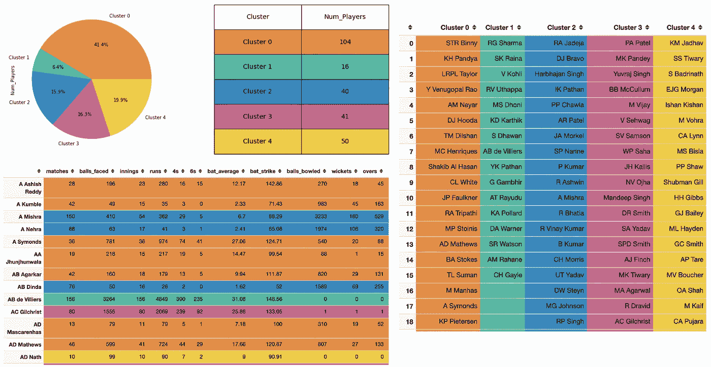

**创建玩家集群—示例**(图片由作者提供)

# 数据集和源代码

该数据集包含从 2008 年 IPL 第一版到 2020 年第 13 个赛季的所有比赛的详细信息和每场比赛的详细信息。

请参考页面底部的数据集和源代码的链接。

# 聚类玩家-属性

以下是分析中考虑的球员的一些关键属性

*   **击球统计**像得分、击球、局数、4 分、6 分、击球率
*   **保龄球统计数据**像三柱门被占，得分，失分，保龄球经济
*   一般统计数据如比赛次数、接球次数、最佳球员人数

# 聚集玩家——方法

概括地说，该分析包括以下 3 个步骤:

**步骤 1:** 将逐球原始数据转换为玩家级别的统计数据

**步骤 2:** 将不同的聚类技术应用于该玩家数据

**第 3 步:**使用 ipywidgets 构建一个简单的 UI，使用超参数

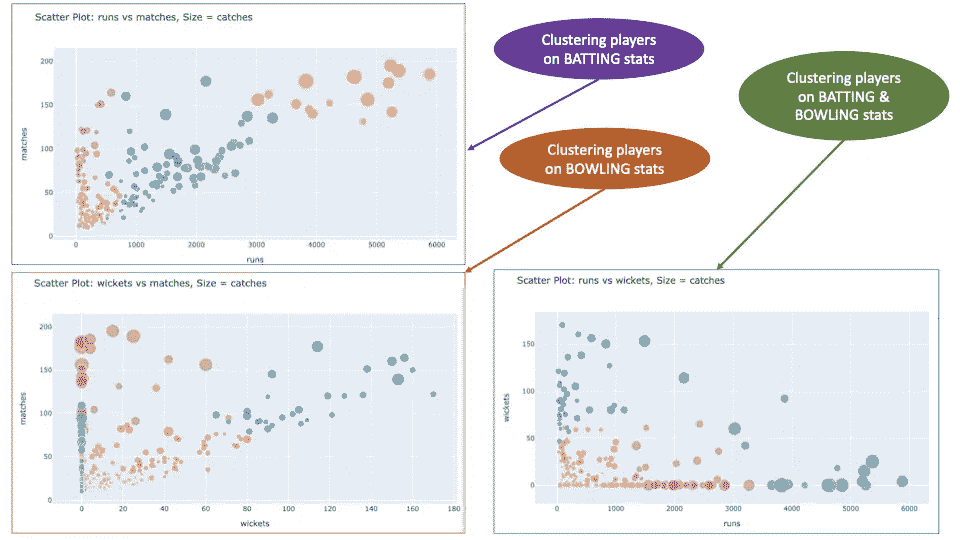

**基于击球、保龄球的玩家聚类&综合统计**(图片由作者提供)

**注意:**完整的源代码可以在上一节提到的 GitHub repo 中找到。这里只添加了部分代码流片段以供参考。

# *偷窥期待什么*

带着一点乐趣学习集群——游戏开始！！

**玩家聚类——玩数据**

在这篇文章的结尾，你将能够应用不同的聚类算法来回答下面的一些问题

> 识别 IPL 中表现像 Virat Kohli 的球员？
> 
> 找到类似 Ravindra Jadeja 的全才。
> 
> IPL 里谁能打得像 Jasprit Bumrah？
> 
> 有多少玩家和萨钦·坦杜尔卡尔一样掉进了同一个桶里？

# 步骤 1:从原始数据中创建玩家统计数据

## 窥探原始数据

这里是原始数据的快速浏览——比赛数据和逐球数据

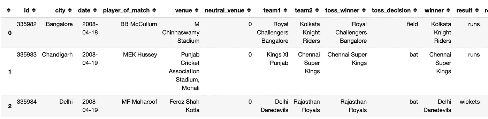

**偷窥比赛数据**(图片由作者提供)

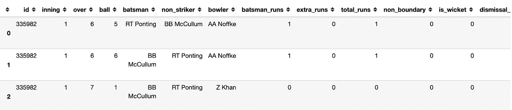

**逐球窥探数据**(图片由作者提供)

## 创建击球统计

**每位选手的击球统计**

## 创建保龄球统计

**每位玩家的保龄球统计**

## 合并数据

## 过滤玩家

让我们检查一下每个运动员参加的比赛的分布情况

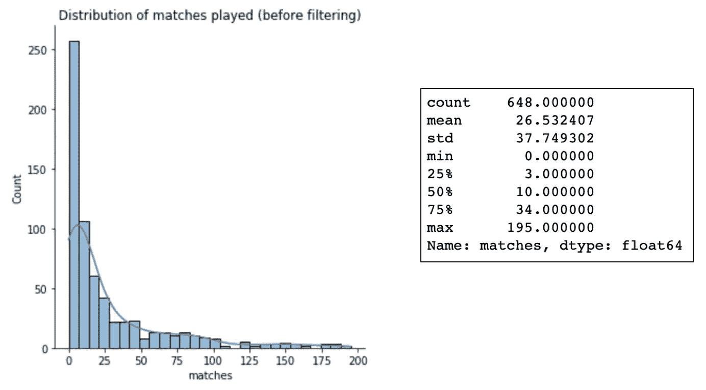

**比赛分布—过滤前**(图片由作者提供)

正如这里看到的，几乎 50%的球员打了不到 10 场比赛。

在这个分析中，我们将只考虑至少打了 10 场比赛的玩家，这样最终创建的玩家集群才有意义。

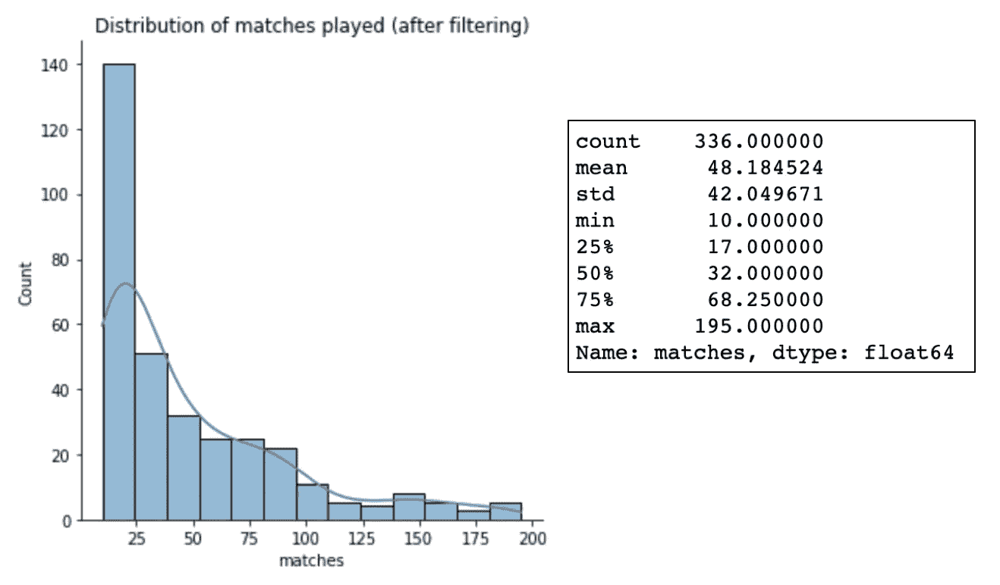

**比赛分布——过滤后**(图片由作者提供)

经过筛选，总共有 336 名球员将被考虑作进一步分析。

## 缩放数据

在运行聚类分析算法之前对数据进行缩放是一种很好的做法，这样可以防止具有较大缩放比例的变量控制聚类的定义方式。

在此分析中，我们应用了标准定标器，以确保变量以平均值 0 为中心，标准差为 1。

# 步骤 2:将聚类算法应用于玩家数据

我们将探索以下三种流行的聚类技术:

1.  k 均值聚类
2.  分层聚类
3.  DBSCAN 聚类

# k 均值聚类

在 k-均值聚类中，数据集中所需的聚类数(k)应该指定为算法的输入。下面是 k-means 聚类算法的内部工作原理。

## **K-Means 聚类算法**

**先决条件**:决定要创建的集群数量(k)

**第一步:**随机挑选 k 个点作为聚类中心

**步骤 2:** 对于每个数据点，计算到每个聚类中心的欧几里德距离

**步骤 3:** 将数据点分配给具有最小欧几里德距离的聚类。

**步骤 4:** 根据步骤 3 中分配的数据点重新计算聚类质心

**步骤-5:** 重复步骤 2 至 4，直到质心不再更新或达到最大迭代次数

## K-均值聚类中的代价函数

我们在 k-means 聚类算法中试图最小化的成本函数是数据点和聚类质心之间的平方距离之和。这可以表示如下:

成本函数—K-均值聚类

通过最小化成本函数，K-Means 算法旨在最大化聚类的紧密度/接近度，使得在给定特定特征向量的情况下，聚类内的数据点彼此相似。

# 寻找最佳的聚类数

有许多方法可以找到 k 的最佳值。在本文中，我们将通过两种这样的方法，即肘方法和剪影方法。

## 肘法

*   elbow 方法对 k 值范围运行 k 均值聚类算法。
*   对于 k 的每个值，它计算一个分数。
*   默认情况下，它会计算失真分数，即每个数据点到其指定中心的平方距离之和。
*   绘制 k 值与该分数的关系图会得到一个肘形图，因此得名。
*   失真下降最多的点是**肘点**，这给出了 k 的**最佳值。**

绘制肘形曲线 Python 代码

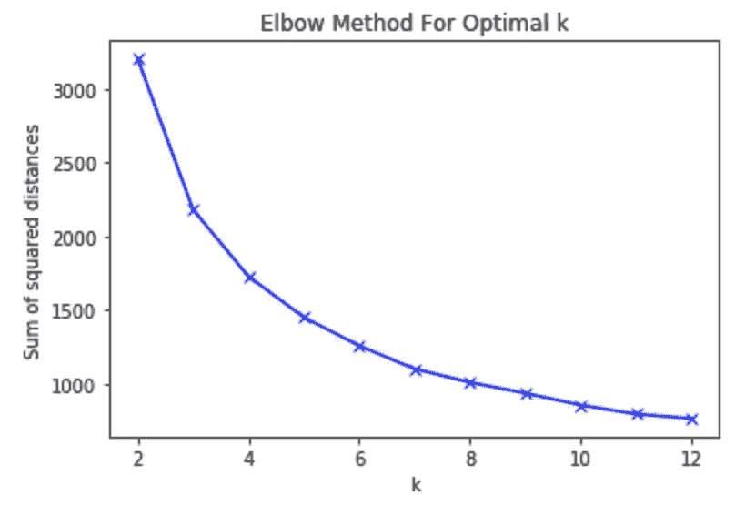

**肘子情节** —作者图片

正如这里看到的，一个好的 k 值看起来大约是 5 或 6。

在肘图不能给出最佳聚类数的决定性结果的情况下，可以应用剪影方法。

## 剪影法

按照 [wiki](https://en.wikipedia.org/wiki/Silhouette_(clustering)) ，*的说法，剪影值是一个对象与其自己的聚类(内聚)相比与其他聚类(分离)有多相似的度量。*

**剪影评分**

其中，
' *b'* 是到不属于
的最近聚类中的点的平均距离。 *'a'* 是到其自己的聚类中所有点的平均聚类内距离

剪影的分数范围在-1 到 1 之间。分数越接近 1 表示该点与聚类中的其他点非常相似。接近-1 的值表示该点与聚类中的其他点不太相似。

对每个数据点都这样做，取平均值来确定 k 值的轮廓得分。轮廓得分的最大值将给出 k 的最佳值。

**用 Python 计算剪影分数**

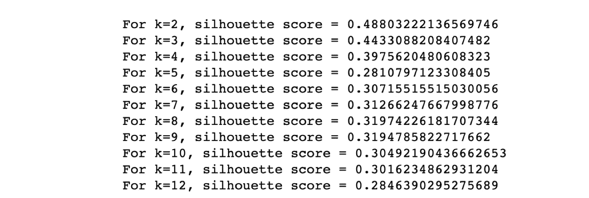

**不同 k 值的轮廓得分**

因此，k 的最佳值应该根据业务需求和统计分析的结果来决定。

## Python 中的 K-Means 聚类

既然我们已经了解了 k-means 聚类算法的工作原理，并且知道如何选择聚类数，那么让我们用 Python 来实现它。

群集的大小和分组将根据所需群集的数量而变化。下面显示了 4 个集群和 7 个集群的分布。

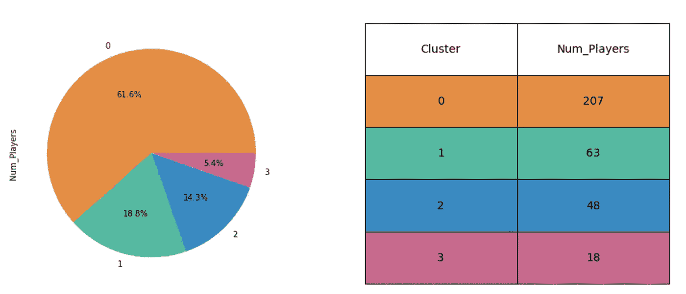

**K-均值聚类，k=4**

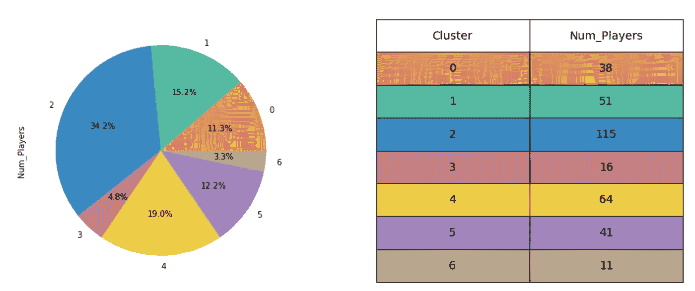

**K = 7 的 K-均值聚类**

笔记本的末尾有一个“操场”。使用小部件来试验不同的 k & max_iter 值。

# 分层聚类

分层聚类是用于识别数据集中的组的另一种聚类技术。它创建了数据点的基于树的表示，称为树状图。

## 分层聚类算法

基于方法，层次聚类可以分为两种类型，凝聚型和分裂型。

**先决条件**:决定相异度——通常是欧几里德距离

## 1.凝聚层次聚类

*   这采用了自底向上的方法来形成集群。
*   首先将每个数据点视为一个集群
*   融合/合并具有最低相异度测量的点以创建新的更大的聚类
*   反复重复上述步骤，直到形成单个大簇

## 2.分裂层次聚类

*   这种方法使用自顶向下的方法来形成集群
*   首先考虑所有点都在一个聚类中
*   在迭代的每一步，最不均匀的集群被分成两部分。分割基于最远距离或最小相似度。
*   迭代重复上述分割，直到所有数据点形成单独的聚类

## 测量相异度——链接法

有许多方法可以用来确定两个聚类之间的距离。连锁的选择对聚类的大小和树状图的形状有影响。

下面列出了 Scipy 包提供的链接方法:

*   **单一连锁**:最小的相异度分数作为连锁标准
*   **完全连锁**:以最大相异分数作为连锁标准
*   **平均连锁度**:平均相异度分数作为连锁度标准
*   **质心连锁**:被视为连锁标准的聚类的质心之间的不相似性
*   **中位数链接**:使用中位数计算聚类之间的相异度得分
*   **加权联动**:对精简距离矩阵进行加权/WPGMA 联动
*   **沃德联动**:使用沃德方差最小化算法。这里，具有最小聚类间距离的聚类被合并。

## Python 中的层次聚类

Scipy 包提供了非常易于使用的接口来创建树状图和执行聚类。下面的示例代码将通过应用完整的链接来创建一个树状图。该方法可以被改变为应用于聚类算法的任何上述链接类型。

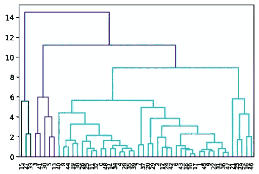

**树形图样本图像(50 名玩家)** —作者提供的图像

从树状图中可以估计出聚类的数目。这被提供作为创建聚类的输入。

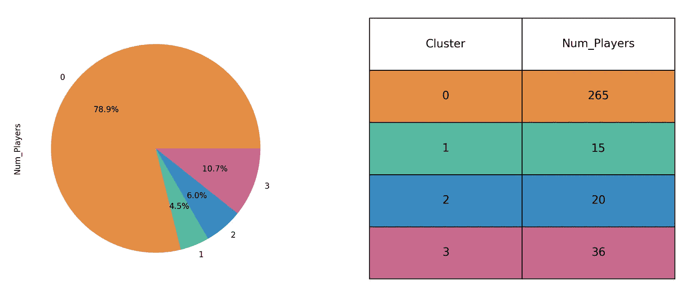

**形成的集群的样本输出摘要** —图片由作者提供

尽管层次聚类的优点是不需要从已知数量的聚类开始，但它会计算每个点与其他点之间的距离，因此计算量会很大。因此，基于可用的资源和手头的问题，必须选择是否可以应用分层聚类。

# DBSCAN 聚类

DBSCAN(基于密度的含噪声应用程序空间聚类)是另一种流行的聚类技术，它将数据集划分为高密度区域。

## DBSCAN 参数

DBSCAN 有两个主要参数

1.  **最小样本**:形成密集区域或聚类的最小点数
2.  **ε**:定义搜索附近邻居的半径

## DBSCAN 聚类算法

**先决条件**:定义ε的值和最小点数

**步骤 1** : 拾取数据集中的任意点

**步骤 2** :检查半径ε内该数据点周围的数据点数。如果数据点的数量至少是定义的最小样本大小，那么所有这些数据点被认为是在同一个聚类内。

**步骤 3** :对所有数据点重复进行邻域计算

## DBSCAN 点

DBSCAN 聚类完成后有三种类型的点。

1.  **核心点**:周围采样点数最少的数据点
2.  **边界点**:周围没有最小数量的采样点，但在半径ε内有一个核心点的数据点
3.  **噪声点**:既不是核心点也不是边界点的点。被视为数据中的异常值。

## Python 中的 DBSCAN 聚类

Scipy 包提供了包 DBSCAN 来执行这种基于密度的聚类。ε(EPS)和聚类中最小点数(min_samples)的值被用作函数中的参数。

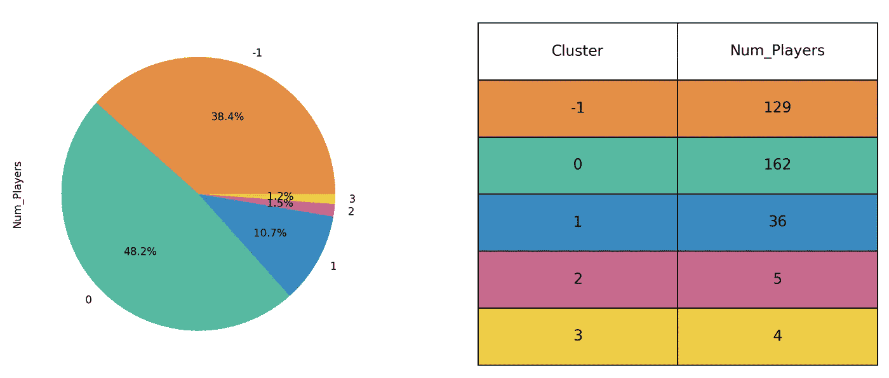

**DBSCAN 聚类总结** (eps = 0.9，min_samples=5) —图片作者

聚类值-1 表示噪声点。在这个数据集中，对于 eps 和 min_samples 的给定值，有 129 个噪声点。其余的数据点被分成 4 组，如上面的分布所示。

# 数据集和源代码

原始数据已从这里下载: [IPL 原始数据](https://www.kaggle.com/patrickb1912/ipl-complete-dataset-20082020) <https://www.kaggle.com/patrickb1912/ipl-complete-dataset-20082020> 这包含了从 2008 年到 2020 年所有 IPL 比赛的逐球和比赛级别细节。

Git 路径:[https://github.com/Lakshmi-1212/IPL_PlayerClusters](https://github.com/Lakshmi-1212/IPL_PlayerClusters)

# 摆弄配置

既然我们已经介绍了在数据上运行所有三种聚类算法的基础知识，我们就可以开始处理数据了，看看参与者是如何根据输入配置归入不同的聚类的。

这里我们已经使用 ipywidgets 在 Jupyter 笔记本上构建了 UI。它易于使用，适合构建简单的 ui。

克隆 GitHub repo，亲自体验一下吧！！

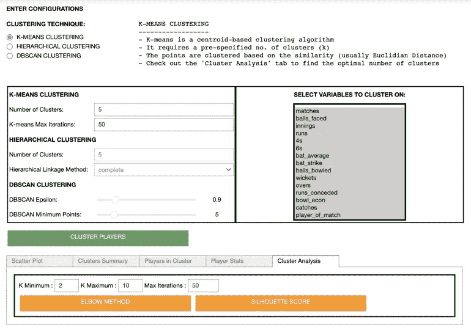

**使用集群配置**

# 结论

可以看到，我们可以试验不同的聚类技术，使用超参数来获得最佳模型。这里的目标仅限于理解不同类型的聚类，并将它们应用于 cricket 数据以获得一些有用的信息。

一旦玩家被聚类，该数据可以进一步用于不同的目的。示例:教练可以使用它来为每个集群制定具体的策略，或者组建一个全面的团队。他们甚至可以在拍卖过程中使用这些信息来检查新玩家可能适合哪个集群。这样的例子不胜枚举:-)

***实验&边学边乐！！***