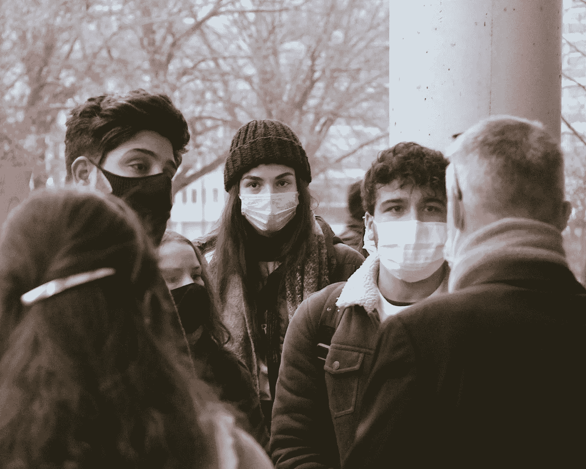
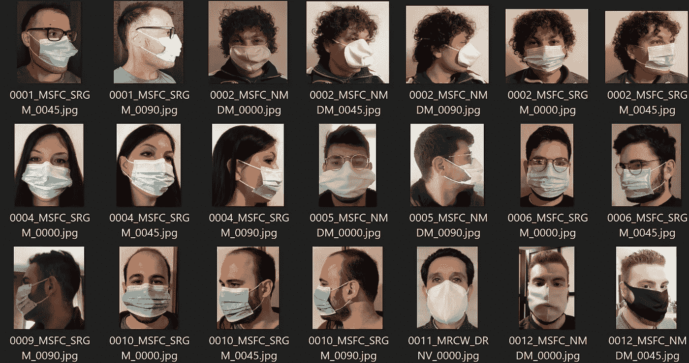
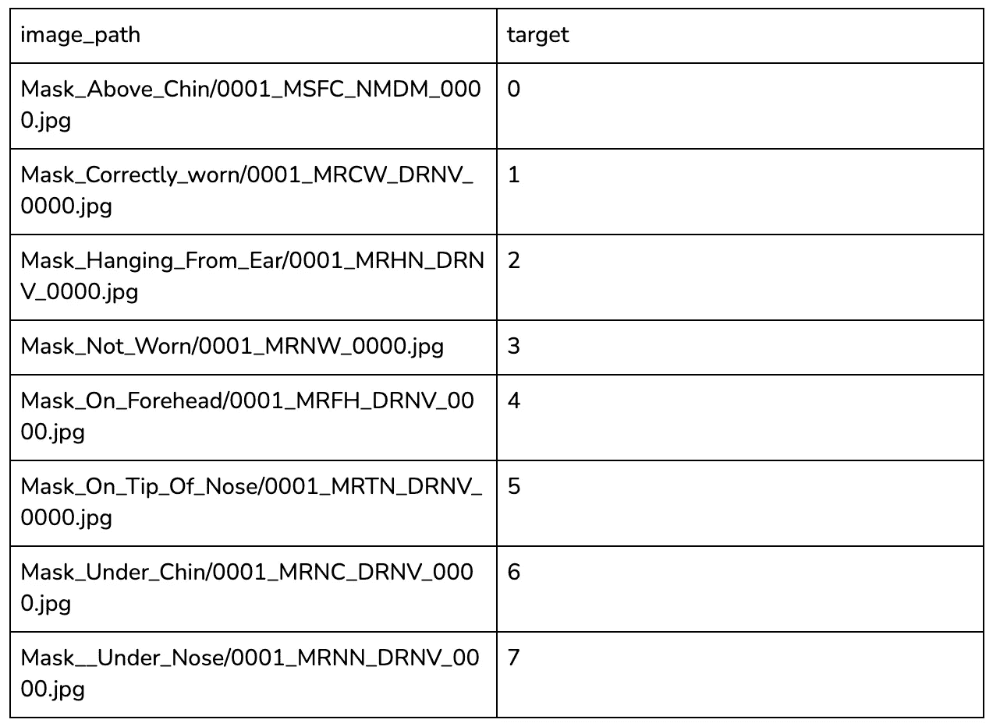
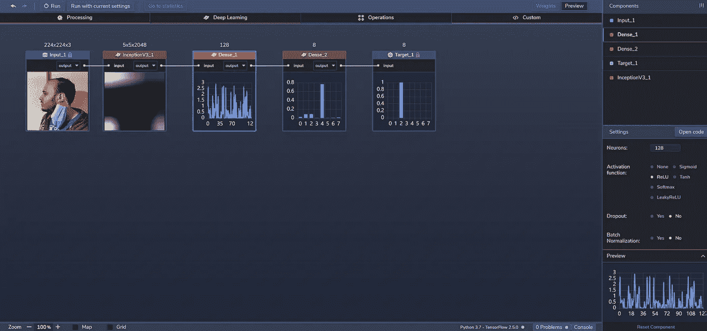
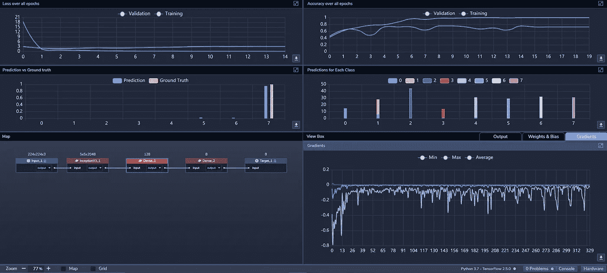
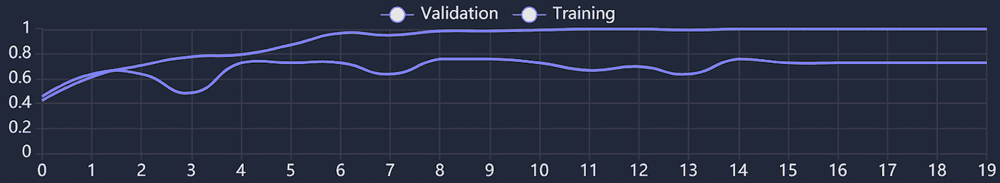
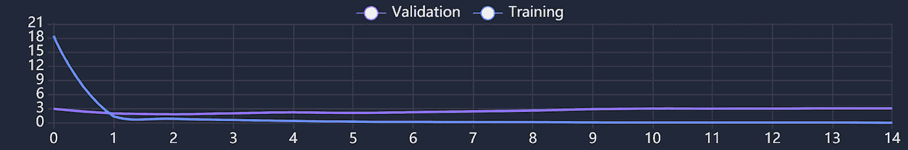

# 机器学习用例:对佩戴口罩的方式进行分类

> 原文：<https://towardsdatascience.com/machine-learning-use-case-classifying-ways-to-wear-a-face-mask-f90af8562530?source=collection_archive---------25----------------------->

新冠肺炎期间，街上的人们戴着口罩——图片来源。

无论您是在医疗行业、工业环境中佩戴面罩或呼吸器，还是作为公众中的一员，面罩的使用和正确放置对于最大程度的保护至关重要。

现在，随着新冠肺炎的传播，许多地方(如机场、工作场所等。)要求戴上面罩，并将其正确放置在鼻子和嘴上。为了帮助检测和执行这些要求，我们开始在 PerceptiLabs 中建立一个图像识别模型，该模型可以对人们佩戴面具的不同方式进行分类。然后，像这样的模型可以用于检查站、入口和其他位置，以帮助工作人员或当局识别不遵守其组织的口罩佩戴规则的个人。

**数据集**

为了训练我们的模型，我们获取了[佩戴口罩或呼吸器的方式数据库(WWMR-DB)](https://ieee-dataport.org/open-access/ways-wear-mask-or-respirator-wwmr-db) ，其中包含了佩戴口罩的人的图像，如图 1 所示。

*图 1:来自数据集的图像示例—图像* [*来源*](https://ieee-dataport.org/open-access/ways-wear-mask-or-respirator-wwmr-db) *。*

数据集包括。jpg 图片分为八类，描绘了最常见的佩戴口罩或呼吸器的方式。

根据戴面具的人，原始数据集被分成一系列子目录。为了使事情变得更顺利并与 PerceptiLabs 兼容，我们通过创建对应于八个分类的八个子目录来简化这一点，然后将适当的图像移动到相应的子目录中。然后，使用 PerceptiLabs 的[数据向导](https://docs.perceptilabs.com/perceptilabs/references/ui-overview/data-wizard)中的调整大小功能，将每个图像调整为 224x224 像素。

为了将分类映射到图像，我们创建了一个. csv 文件( *mask_log.csv* )，该文件将每个图像文件与一个数字标签相关联，以便使用 PerceptiLabs 的数据向导加载数据:

> 0:下巴上方的遮罩
> 
> 1:正确佩戴面罩
> 
> 2:面具挂在佩戴者的耳朵上
> 
> 3:没有戴口罩
> 
> 4:额头上的面具
> 
> 5:鼻尖上的面具
> 
> 6:下巴下的面膜
> 
> 7:鼻下面具

下面是一个部分的例子。csv 文件看起来:

*的例子。csv 文件，用于将数据加载到将图像文件映射到其关联标签的 PerceptiLabs 中。*

**车型总结**

我们的模型仅由三个组件组成:

组件 1: [InceptionV3](https://keras.io/api/applications/inceptionv3/) ，include_top=no

成分 2:密集，激活= [ReLU](https://machinelearningmastery.com/rectified-linear-activation-function-for-deep-learning-neural-networks/) ，神经元=128

组件 3:密集，激活= [Softmax](https://en.wikipedia.org/wiki/Softmax_function) ，神经元=8

注意，尽管 InceptionV3 要求图像为 229x229 像素，但是将 **include_top** 设置为 **no，**允许使用其他尺寸的图像(例如，224x224 像素)。

*图 2:感知实验室中模型的拓扑结构-图像* [*来源*](http://www.perceptilabs.com) *。*

**训练和结果**

**我们用 32 个**批量 20 个历元训练模型，使用 [ADAM](https://machinelearningmastery.com/adam-optimization-algorithm-for-deep-learning/#:~:text=Adam%20is%20a%20replacement%20optimization,sparse%20gradients%20on%20noisy%20problems.) 优化器，学习率 0.001，交叉熵[损失](https://blog.perceptilabs.com/choosing-and-customizing-loss-functions-for-image-processing/)函数。图 3 显示了训练期间 PerceptiLabs 的统计视图。

*图 3: PerceptiLabs 在训练时的统计视图—图片* [*来源*](http://www.perceptilabs.com) *。*

在大约 34 分 28 秒的训练时间内，**我们能够实现 99.4%的训练准确率和 77.1%的验证准确率。**较低的验证精度反映了在面部检测相关数据上训练模型的难度

在下面来自 PerceptiLabs 的屏幕截图(图 4)中，您可以看到在前六个左右的时期中，训练验证准确性如何上升，之后它保持相当稳定。在最初的几个时期，训练大部分是上升的，并且在稳定下来之前波动，直到第 14 个时期左右:

*图 4:精度图。*

图 5 中的截屏显示了前 14 个时期在训练和验证过程中的相应损失:

*图 5:损失图。*

这里我们可以看到，在稳定之前的第一个时期，训练损失显著下降，而验证损失开始较低，并始终保持相对稳定。

**垂直应用**

像这样的模型可以用于安全或健康和安全目的，以确保工人或游客有一个面具，并在进入前正确佩戴。例如，该模型可用于分析通过现场安全摄像头获取的照片或视频帧。该模型本身也可用作[转移学习](https://blog.perceptilabs.com/when-to-use-transfer-learning-in-image-processing/)的基础，以创建用于检测其他类型健康或安全设备的存在和正确使用的附加模型。

**总结**

此使用案例是如何使用图像识别来帮助确保健康和安全的示例。如果你想建立一个类似这样的深度学习模型，[运行 PerceptiLabs](https://docs.perceptilabs.com/perceptilabs/getting-started/quickstart-guide) 并获取我们的。来自 [GitHub](https://github.com/PerceptiLabs/Ways-to-Wear-a-Face-Mask) 的 csv 文件。