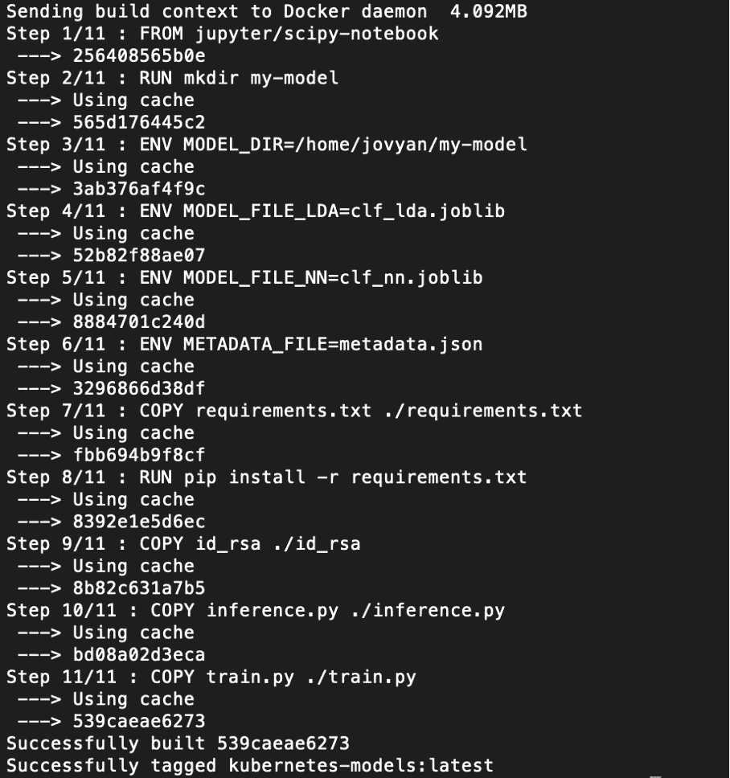
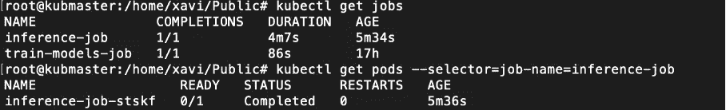
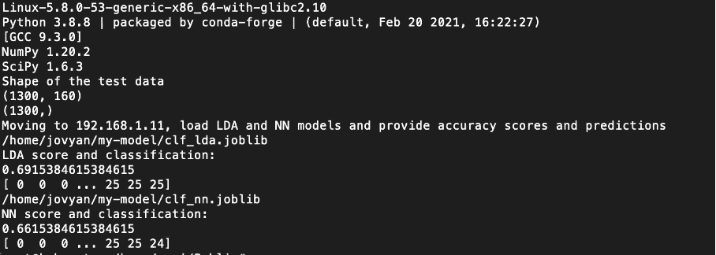

# 使用 Docker 和 Kubernetes 的机器学习:批量推理

> 原文：<https://towardsdatascience.com/machine-learning-with-docker-and-kubernetes-batch-inference-4a25328f23c7?source=collection_archive---------17----------------------->

## Kubernetes、Docker、Python 和 Scikit——学习机器和深度学习:如何扩展数据科学家的工作


Annamária Borsos 摄影

在这一章中，我们将从我们在前一章中开发和安装的 Kubernetes 集群中的训练模型中实现一个批量推理:[https://xaviervasques . medium . com/machine-learning-with-docker-and-Kubernetes-training-models-CBE 33 a 08 c 999](https://xaviervasques.medium.com/machine-learning-with-docker-and-kubernetes-training-models-cbe33a08c999)

你可以在 [GitHub](https://github.com/xaviervasques/kubernetes.git) 上找到本章用到的所有文件。

为了开始，我们需要对之前的**文档**进行如下修改:

与之前的 **Dockerfile** 相比，我们只是增加了 **inference.py** :

在 **inference.py** 中，我们开始导入必要的库，读取 Docker 映像中设置的环境变量，并读取存储在 [GitHub](https://raw.githubusercontent.com/xaviervasques/kubernetes/main/test.csv) 上的新数据(test.csv ),以便为我们的序列化模型提供预测并提供准确度分数。这里，我们将使用 SSH 从远程服务器(192.168.1.11)下载存储在指定目录(/home/xavi/output)中的先前训练的模型(线性判别分析和一个多层感知器神经网络)。

现在，我们可以进入下一步，构建 docker 映像，运行它以在本地测试我们的应用程序，在 Docker Hub 注册表上用映像存储库的名称标记它，并将其推送到注册表，准备在我们的 Kubernetes 集群中使用该映像:

```
docker build -t kubernetes-inference -f Dockerfile .
```



为了测试我们的代码是否正常，我们将在本地运行我们的容器来测试图像:

```
docker run kubernetes-inference python3 train.py rm ./id_rsa
```

如果一切正常，我们可以使用 CLI 将新映像推送到存储库:

```
docker logindocker tag kubernetes-inference:latest xaviervasques/kubernetes-inference:latestdocker push xaviervasques/kubernetes-inference:latest
```

# 为 Kubernetes 创建配置文件

一旦图像成功上传到注册表，我们就转到我们的项目目录(连接到 kubmaster)并创建一个配置文件 **inference.yaml** ，它执行我们的 python 代码:

等效的 docker 命令应该是:

```
docker run kubernetes-inference python3 inference.py rm ./id_rsa
```

我们终于准备好让我们的应用程序在 Kubernetes 上运行了。启动以下命令:

```
kubectl create -f inference.yaml
```

通过运行以下命令检查作业对象:

```
kubectl get jobskubectl get pods — selector=job-name=inference-job
```



我们可以查看流程的日志(我们代码的输出):

```
kubectl logs inference-job-stskf
```



# 后续步骤

Kubernetes 是一个有效部署模型的优秀框架。我们可以使用 Kubernetes 将我们的每个模型部署为独立的轻量级微服务。这些微服务可以用于其他应用。我们还可以与 Kubernetes 合作，安排我们的训练和推理过程定期运行。现在，下一步将是使用 REST APIs 部署在线推理。您可以在这里找到使用 REST APIs 的在线推理的部署示例:

[](https://xaviervasques.medium.com/machine-learning-prediction-in-real-time-using-docker-python-rest-apis-with-flask-and-kubernetes-fae08cd42e67) [## 使用 Docker、Python Rest APIs 和 Flask 和 Kubernetes 进行实时机器学习预测…

### 用于机器和深度学习的 Kubernetes、Docker、Python、Scikit-Learn 和 Flask:如何扩展数据科学家的工作

xaviervasques.medium.com](https://xaviervasques.medium.com/machine-learning-prediction-in-real-time-using-docker-python-rest-apis-with-flask-and-kubernetes-fae08cd42e67) 

**来源**

[https://developer . IBM . com/technologies/containers/tutorials/scalable-python-app-with-kubernetes/](https://developer.ibm.com/technologies/containers/tutorials/scalable-python-app-with-kubernetes/)

【https://mlinproduction.com/k8s-jobs/ 