# Docker 和 Kubernetes 的机器学习:从头开始安装集群

> 原文：<https://towardsdatascience.com/machine-learning-with-docker-and-kubernetes-install-a-cluster-from-scratch-9dc73bfdc55a?source=collection_archive---------19----------------------->

## Kubernetes，Docker，Python 和 sci kit-机器和深度学习的学习:如何扩大数据科学家的努力


Annamária Borsos 摄影

如果我们想要扩展我们的机器和深度学习工作，开源容器编排平台 Kubernetes 无疑是最重要的工具之一。为了理解 Kubernetes 对数据科学家的效用，我们可以考虑一下我们开发和容器化的所有应用程序。我们将如何协调和安排所有这些集装箱？我们如何在不中断服务的情况下升级我们的机器学习模型？我们如何扩展模型并通过互联网提供给用户？如果我们的模型被更多我们认为的人使用会发生什么？如果我们之前没有考虑架构，我们将需要增加计算资源，当然还需要手动创建新实例并重新部署应用程序。Kubernetes 调度、自动化和管理基于容器的架构的任务。Kubernetes 部署容器、更新它们、提供服务发现、监控、存储供应、负载平衡等等。如果我们谷歌“Kubernetes”，经常会看到对比 Docker 和 Kubernetes 的文章。这就像比较苹果和苹果派。首先要说的是，Kubernetes 是设计在集群上运行的，而 Docker 是在单个节点上运行的。Kubernetes 和 Docker 在创建、部署和扩展容器化应用程序方面是互补的。还有 Kubernetes 和 Docker Swarm 之间的比较，Docker Swarm 是一个用于集群和调度 Docker 容器的工具。Kubernetes 有几个选项可以提供真正重要的优势，例如高可用性策略、自动扩展功能、管理运行在公共、混合、多云或内部环境上的复杂和数十万个容器的可能性。

你可以在 [GitHub](https://github.com/xaviervasques/kubernetes.git) 上找到本章用到的所有文件

# 库伯内特词汇

在 Kubernetes，我们需要了解不同的概念。我们有 Kubernetes 主节点，它是在我们的集群的一个节点上运行的一组三个进程，我们称之为主节点: **kube-apiserver** 、 **kube-controller-manager** 和 **kube-scheduler** 。我们集群中的每个节点(不包括主节点)运行两个进程: **kubelet** ，它与 Kubernetes 主节点通信，以及 **kube-proxy** ，它是一个网络代理，反映了每个节点上的 Kubernetes 网络服务。API 服务器用于组件之间的通信，控制器管理器根据期望的状态检查状态，调度器决定应该在哪些 pod 上运行。 **kubelet** 是在每个节点上运行的主要“节点代理”。 **kube-proxy** 是运行在每个节点上的 Kubernetes 网络代理。

在 Kubernetes 中，我们有**控制平面**(主节点)，它是协调器，**节点**是机器(物理服务器、虚拟机等)。)来运行您的容器化应用程序。这些节点由主节点控制。然后，我们有 **Pod** ，它是 Kubernetes 的基本构建模块。Pods 是我们可以在 Kubernetes 中创建和管理的最小可部署计算单元。它由一个或多个容器组成。例如，我们可以考虑创建一个 Pod 来训练我们的机器学习模型(代码在单个容器中)。我们还必须处理创造一个或多个豆荚的**工作**。作业将确保 pod 的执行是成功的。我们可以创建一个作业来训练我们的模型，执行批量推理，或者将训练元数据等信息存储到外部存储或预测中。Kubernetes 可以通过简化向他人展示模型的过程，真正帮助我们将机器和深度学习模型投入生产。我们将看到，我们需要遵循几个步骤，例如创建一个部署，指定要运行哪个容器以及我们要创建多少个副本，使用一个服务来公开部署，该服务允许我们定义将 pod 相互公开以及向互联网公开的规则。Kubernetes 的一个非常重要的特性是负载平衡，以处理副本之间的流量平衡工作，并自动调整资源以满足不断增长的需求。

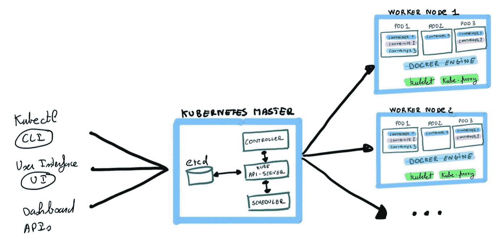

典型的 Kubernetes 建筑

# Kubernetes 快速安装

我们可以使用不同的方法来安装 Kubernetes。所有这些在 Kubernetes 网站上都有很好的解释:

我们可以在终端上输入:

```
brew install kubectl
```

或者，我们可以键入:

**Ubuntu / Debian**

```
sudo apt-get update && sudo apt-get install -y apt-transport-httpscurl -s [https://packages.cloud.google.com/apt/doc/apt-key.gpg](https://packages.cloud.google.com/apt/doc/apt-key.gpg) | sudo apt-key add -echo “deb [https://apt.kubernetes.io/](https://apt.kubernetes.io/) kubernetes-xenial main” | sudo tee -a /etc/apt/sources.list.d/kubernetes.listsudo apt-get updatesudo apt-get install -y kubectl
```

**红帽/ CentOS**

```
cat <<EOF | sudo tee /etc/yum.repos.d/kubernetes.repo
[kubernetes]
name=Kubernetes
baseurl=https://packages.cloud.google.com/yum/repos/kubernetes-el7-\$basearch
enabled=1
gpgcheck=1
repo_gpgcheck=1
gpgkey=https://packages.cloud.google.com/yum/doc/yum-key.gpg https://packages.cloud.google.com/yum/doc/rpm-package-key.gpg
exclude=kubelet kubeadm kubectl
EOF

*# Mettre SELinux en mode permissif (le désactiver efficacement)*
sudo setenforce 0
sudo sed -i 's/^SELINUX=enforcing$/SELINUX=permissive/' /etc/selinux/config

sudo yum install -y kubelet kubeadm kubectl --disableexcludes=kubernetes

sudo systemctl enable --now kubelet
```

使用以下命令检查安装:

```
kubectl version --client
```

安装所有的 Kubernetes 二进制文件(kubeadm，kubelet，kubectl):

```
sudo apt-get install -y kubelet kubeadm kubernetes-cnisystemctl enable kubelet
```

# 安装 Kubernetes 集群

为了熟悉 Kubernetes，我们将使用一个工具来构建和管理虚拟机。流浪者通过使用名为**流浪者文件**的配置文件在单个工作流中创建和配置轻量级环境。让我们安装流浪者。

**Ubuntu / Debian**

```
curl -fsSL [https://apt.releases.hashicorp.com/gpg](https://apt.releases.hashicorp.com/gpg) | sudo apt-key add -sudo apt-add-repository “deb [arch=amd64] [https://apt.releases.hashicorp.com](https://apt.releases.hashicorp.com) $(lsb_release -cs) main”sudo apt-get update && sudo apt-get install vagrant
```

**红帽/ CentOS**

```
sudo yum install -y yum-utilssudo yum-config-manager --add-repo [https://rpm.releases.hashicorp.com/RHEL/hashicorp.repo](https://rpm.releases.hashicorp.com/RHEL/hashicorp.repo)sudo yum -y install vagrant
```

如果我们想把它安装在其他平台上，请不要犹豫检查:[https://www.vagrantup.com/downloads](https://www.vagrantup.com/downloads)

vagger 依赖于与供应商(如 VirtualBox、VMware 或 Hyper-V)的交互，为 vagger 提供运行开发环境的资源。需要安装其中的一个。

我们可以安装 **virtualbox** :

```
sudo apt updatesudo apt install virtualboxsudo apt install virtualbox-dkms
```

并创建一个“流浪文件”:

```
sudo vagrant init bento/ubuntu-20.04
```

对于我们的项目，我们将创建或编辑一个特定的流浪文件来构建我们自己的环境，如下所示:

正如你在流浪者文件中看到的，我们正在创建一个名为“kubmaster”的主节点，它有一个 Ubuntu 版本 20.04，2Gb 内存和 2 个 CPU，一个 IP 地址(192.168.56.101)和 docker。然后，我们创建两个节点(kubnode1 和 kubnode2 ),它们的配置与主节点相同。

编辑后，切换到 root 并在终端中键入(Vagranfile 所在的位置):

```
vagrant up
```

该命令将根据我们编辑的 Vagrantfile 创建和配置来宾机器。完成该过程后，我们可以在您的终端中使用以下命令连接到客户机:

```
vagrant ssh kubmastervagrant ssh kubnode1vagrant ssh kubnode2
```

我们必须在主节点(kubmaster)和每个节点(kubnode1 和 kubnode2)上禁用交换。我们连接到每台客户机，以执行以下命令:

```
swapoff -avim /etc/fstab
```

在 *fstab* 文件中，我们需要注释掉交换行。

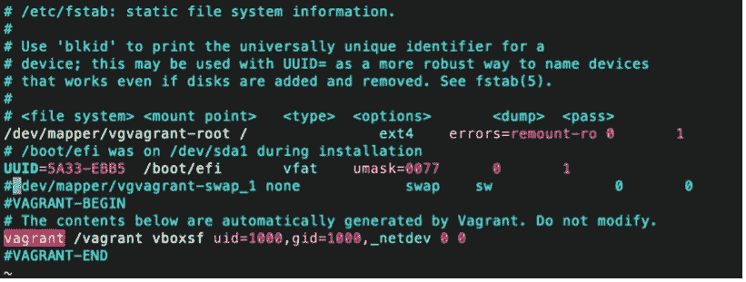

我们也在每台机器(kubmaster，kubnode1，kubnode2)上安装一些包，比如 curl 和 apt-transport-https:

```
apt-get update && apt-get install -y apt-transport-https curl
```

然后，我们执行一个 *curl* 来获取 gpg 密钥，这将允许我们使用 Kubernetes 二进制文件:kubectl、kubeadm、kubelet。

```
curl -s https://packages.cloud.google.com/apt/doc/apt-key.gpg | apt-key add -
```

我们添加了对 Google 存储库的访问权限([http://apt . kubernetes . io](http://apt.kubernetes.io/))，这将允许我们下载并安装二进制文件:

```
add-apt-repository “deb [http://apt.kubernetes.io/](http://apt.kubernetes.io/) kubernetes-xenial main”
```

要安装二进制文件，我们需要执行以下操作:

```
apt-get install -y kubelet kubeadm kubectl kubernetes-cnisystemctl enable kubelet
```

# Kubernetes:初始化和内部网络

现在，我们已经在所有节点中安装了必要的包，我们将进行初始化和网络工作，以连接 Kubernetes 集群的不同部分。

要启动主节点，请连接到主节点并键入:

```
root@kubmaster:~# kubeadm init --apiserver-advertise-address=192.168.56.101 --node-name $HOSTNAME --pod-network-cidr=10.244.0.0/16
```

192.168.56.101 是我们之前定义的主节点的 IP 地址，10.244.0.0/16 是 Kubernetes 内部网络的 IP 地址，定义了 Kubernetes 在其网络内用于分配 IP 地址的范围。

我们看到以下输出，其中包含一个为加入不同节点而生成的令牌:

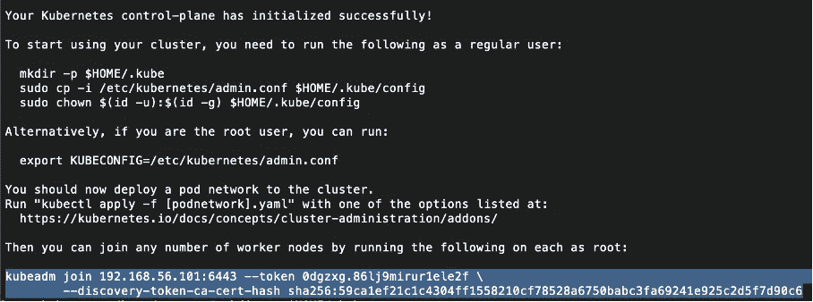

正如您在输出中看到的，要开始使用我们的集群，我们需要创建配置文件来使用 kubectl:

```
root@kubmaster:~# mkdir -p $HOME/.kuberoot@kubmaster:~# cp -i /etc/kubernetes/admin.conf $HOME/.kube/configroot@kubmaster:~# chown $(id -u):$(id -g) $HOME/.kube/config
```

为了建立内部网络，我们需要在集群中的节点之间提供一个网络。为此，我们将使用法兰绒，这是配置为 Kubernetes 设计的第 3 层网络结构的一种非常简单易行的方法。存在不同的解决方案，如 WeaveNet、Contiv、Cilium 等。法兰绒在每台主机上运行一个名为 *flanneld* 的二进制代理。法兰绒还负责从更大的预配置地址空间中为每台主机分配子网租约。

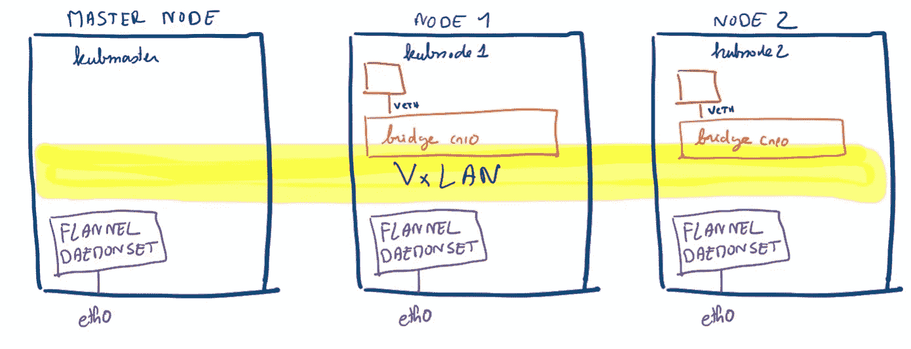

我们添加了 pod 以提供管理内部网络的可能性(在所有节点中启动命令):

```
sysctl net.bridge.bridge-nf-call-iptables=1
```

然后，我们通过在主节点中键入以下命令，在在线配置文件(kube-法兰绒. yml)的帮助下安装法兰绒网络:

```
kubectl apply -f [https://raw.githubusercontent.com/coreos/flannel/master/Documentation/kube-flannel.yml](https://raw.githubusercontent.com/coreos/flannel/master/Documentation/kube-flannel.yml)
```

我们检查主节点中 pod 的状态(法兰绒网络、kube-调度程序、kube-apiserver、kube-控制器-管理器、kube-代理、管理内部 DNS 的 pod、存储 etcd 配置的 pod 等):

```
kubectl get pods --all-namespaces
```

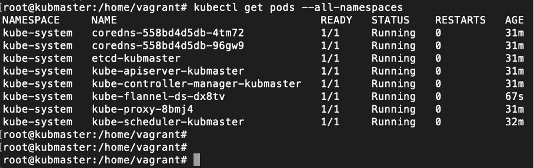

有时有必要通过编辑网络(从 10.244.0.0/16 到 10 . 10 . 0/16)来修改我们的法兰绒配置。为此，您可以执行以下操作:

```
kubectl edit cm -n kube-system kube-flannel-cfg# edit network 10.244.0.0/16 to 10.10.0.0/16
```

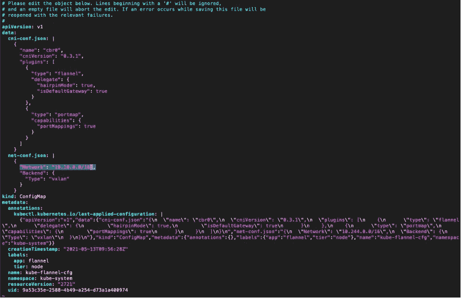

如果您在主节点中键入以下命令，我们可以看到我们的主节点已准备就绪:

```
kubectl get nodes
```

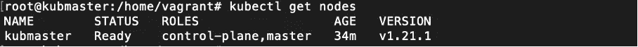

现在是将节点连接到主节点的时候了。为此，我们复制先前生成的令牌，并在两个节点(kubnode1 和 kubnode2)中键入以下命令:

```
kubeadm join 192.168.56.101:6443 --token 0dgzxg.86lj9mirur1ele2f \  --discovery-token-ca-cert-hash sha256:59ca1ef21c1c4304ff1558210cf78528a6750babc3fa69241e925c2d5f7d90c6
```

我们将看到以下输出:

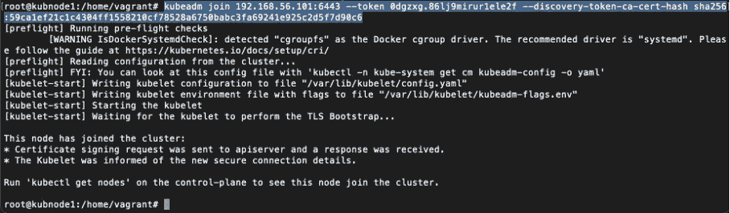

回到主节点，键入以下命令检查状态:

```
kubectl get pods --all-namespaces
```


```
kubectl get nodes
```


我们应该看到状态为“就绪”的节点。我们还可以做一个 *docker ps* 来查看主节点和其他节点中所有已启动的容器(coredns、法兰绒等……)。

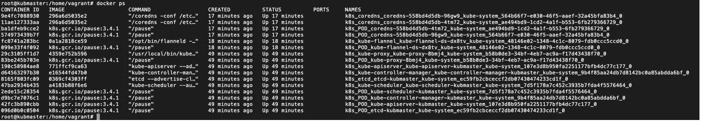

最后一点是关于集群访问。如果我们键入主节点:

```
kubectl get nodes
```

我们可以看到，我们的 kubmaster 和节点具有相同的内部 IP:

```
kubectl get nodes -o wide
```

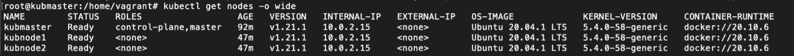

我们需要打开并编辑/etc/hosts，并添加我们的主节点 IP:

```
vim /etc/hosts
```

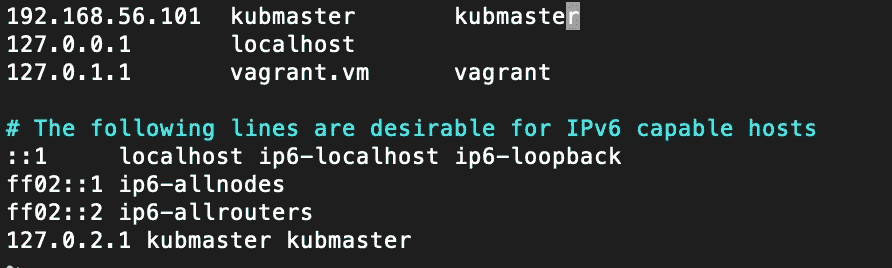

每个节点(kubnode1 和 kubenode2)中的 */etc/hosts* 文件也需要修改:

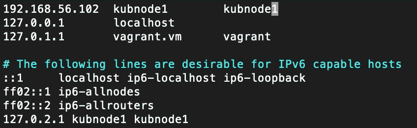

然后，我们可以通过键入主节点来删除每个法兰绒:

```
kubectl get pods -n kube-system
```

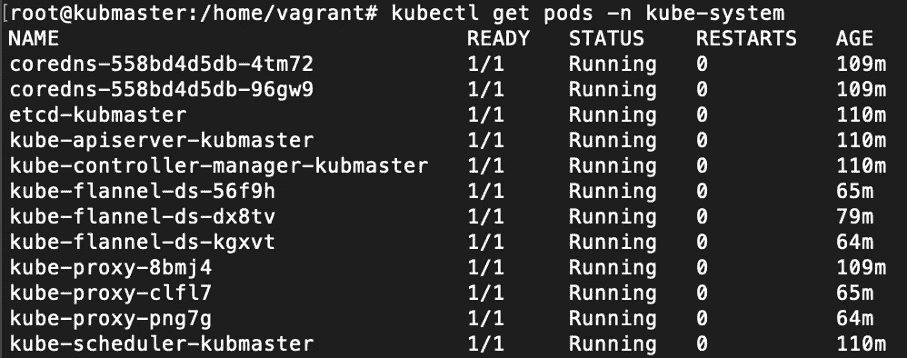

然后，

```
kubectl delete pods kube-flannel-ds-56f9h -n kube-systemkubectl delete pods kube-flannel-ds-dx8tv -n kube-systemkubectl delete pods kube-flannel-ds-kgxvt -n kube-system
```

Kubernetes 的神奇之处在于，它可以在不失去服务的情况下重新配置，并拥有新的 flannels:

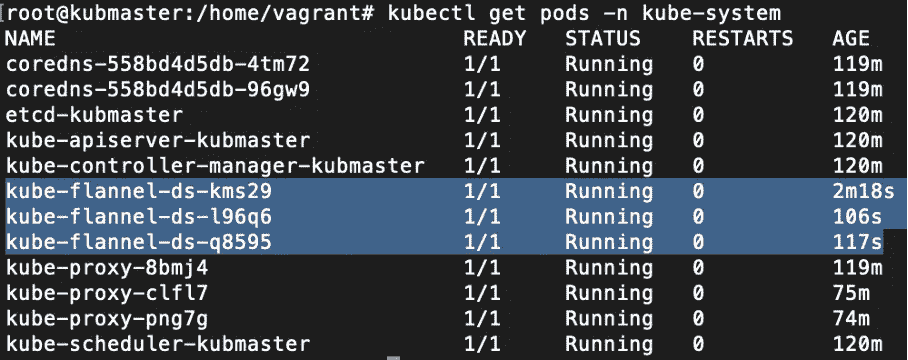

我们将看到我们拥有正确的 IP 地址:

```
kubectl get nodes -o wide
```

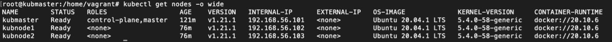

为了更加方便，我们还可以通过键入以下内容来添加自动完成功能:

```
apt-get install bash-completionecho “source <(kubectl completion bash)” >> ~/.bashrcsource ~/.bashrc
```

# 后续步骤

现在我们知道如何安装 Kubernetes 集群，我们将能够创建 Kubernetes 作业，这些作业将创建 pods(以及容器),例如，允许训练我们的机器学习模型，序列化它们，将模型加载到内存中，并执行批处理或在线推理。我们在这里探讨了这些概念:

[](https://xaviervasques.medium.com/machine-learning-with-docker-and-kubernetes-training-models-cbe33a08c999) [## Docker 和 Kubernetes 的机器学习:训练模型

### Kubernetes，Docker，Python 和 sci kit-机器和深度学习的学习:如何扩大数据科学家的努力

xaviervasques.medium.com](https://xaviervasques.medium.com/machine-learning-with-docker-and-kubernetes-training-models-cbe33a08c999) [](https://xaviervasques.medium.com/machine-learning-with-docker-and-kubernetes-batch-inference-4a25328f23c7) [## 使用 Docker 和 Kubernetes 的机器学习:批量推理

### Kubernetes，Docker，Python 和 sci kit-机器和深度学习的学习:如何扩大数据科学家的努力

xaviervasques.medium.com](https://xaviervasques.medium.com/machine-learning-with-docker-and-kubernetes-batch-inference-4a25328f23c7) [](https://xaviervasques.medium.com/machine-learning-prediction-in-real-time-using-docker-python-rest-apis-with-flask-and-kubernetes-fae08cd42e67) [## 使用 Docker、Python Rest APIs 和 Flask 和 Kubernetes 进行实时机器学习预测…

### 用于机器和深度学习的 Kubernetes、Docker、Python、Scikit-Learn 和 Flask:如何扩展数据科学家的工作

xaviervasques.medium.com](https://xaviervasques.medium.com/machine-learning-prediction-in-real-time-using-docker-python-rest-apis-with-flask-and-kubernetes-fae08cd42e67) 

**来源**

https://phoenixnap.com/blog/kubernetes-vs-docker-swarm

【https://kubernetes.io/fr/docs/concepts/ 

[https://kubernetes.io/fr/docs/tasks/tools/install-kubectl/](https://kubernetes.io/fr/docs/tasks/tools/install-kubectl/)

[https://www.vagrantup.com/downloads](https://www.vagrantup.com/downloads)

[https://git lab . com/xavki/presentations-kubernetes/-/tree/master](https://gitlab.com/xavki/presentations-kubernetes/-/tree/master)

[https://github.com/flannel-io/flannel](https://github.com/flannel-io/flannel)