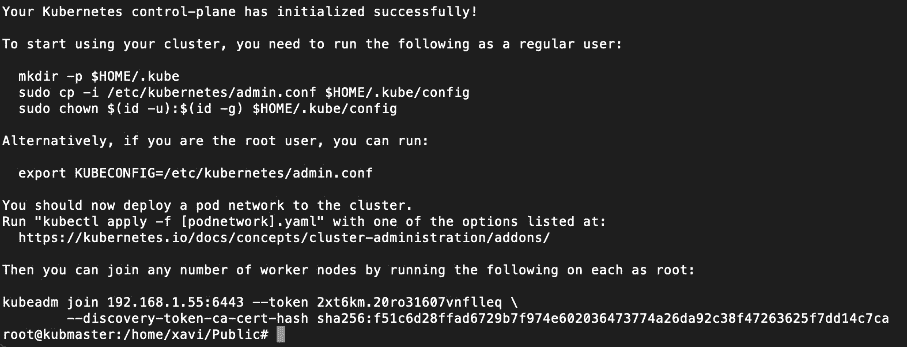
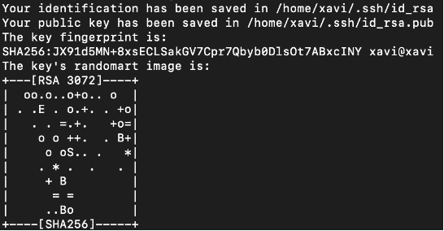
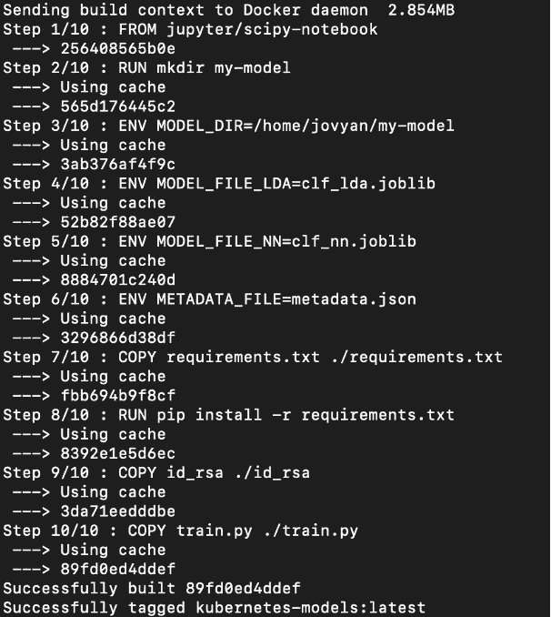

# Docker 和 Kubernetes 的机器学习:训练模型

> 原文：<https://towardsdatascience.com/machine-learning-with-docker-and-kubernetes-training-models-cbe33a08c999?source=collection_archive---------2----------------------->

## Kubernetes，Docker，Python 和 sci kit-机器和深度学习的学习:如何扩大数据科学家的努力


Annamária Borsos 摄影

# Kubernetes Jobs:模型训练和批量推理

在这一章中，我们将研究 Kubernetes 的工作，以及我们如何使用这些工作来训练机器学习模型。一个作业创建一个或多个 pod。这是一个 Kubernetes 控制器，确保 pod 成功终止其工作负载。当指定数量的 pod 终止时，作业被视为完成。如果一个 Pod 失败，作业将创建一个新的 Pod 来替换它。

我们的目标将是创建一个 Kubernetes 作业，让我们称之为“训练作业”，它加载存储在 GitHub 中的训练数据，训练一个机器学习模型，序列化该模型，并将其存储在集群外部。为了在我们的集群之外存储数据，我们可以使用不同的位置，例如公共云、私有云或内部。在我们的例子中，我们将在 Kubernetes 集群和外部服务器之间使用 SSH。我们之所以使用外部存储，是因为作业将创建彼此独立的 pod 运行容器。我们需要借助外部存储来持久化我们的模型对象。

你可以在 [GitHub](https://github.com/xaviervasques/kubernetes.git) 上找到本章用到的所有文件

# 创建并准备虚拟机

要安装我们的 Kubernetes 集群，让我们创建虚拟机或使用裸机服务器。本文中的所有指令都是使用 Ubuntu 版本 20.04 创建的虚拟机进行测试的:

-kub master:2 vpus，4096MB 内存，20GB 驱动器空间

-kube node 1:2 vcpu，4096MB 内存，20GB 驱动器空间

我们启用了虚拟机和主机之间的流量。

切换到 root，确保关闭交换，并在/etc/fstab 中注释掉引用交换:

```
swapoff -avim /etc/fstab
```


# Kubeadm 装置

首先，我们将在每个虚拟机中安装 docker 引擎(在我们的例子中:kubmaster 和 kubenode1)。要安装它，你可以选择你喜欢的方法(【https://docs.docker.com/engine/install】T2)。我们将使用存储库。下面的不同步骤将更新 apt 包索引，安装包以允许 apt 通过 https 使用存储库，添加 Docker 的官方 GPG 密钥，设置稳定的存储库，并安装最新版本的 Docker 引擎和 containerd。

```
sudo apt-get updatesudo apt-get install \ apt-transport-https \ ca-certificates \ curl \ gnupg \ lsb-releasecurl -fsSL [https://download.docker.com/linux/ubuntu/gpg](https://download.docker.com/linux/ubuntu/gpg) | sudo gpg —-dearmor -o /usr/share/keyrings/docker-archive-keyring.gpgecho \
  "deb [arch=amd64 signed-by=/usr/share/keyrings/docker-archive-keyring.gpg] https://download.docker.com/linux/ubuntu \    
  $(lsb_release -cs) stable" | sudo tee /etc/apt/sources.list.d/docker.list > /dev/nullsudo apt-get updatesudo apt-get install docker-ce docker-ce-cli containerd.io
```

然后，在切换到 root (sudo -s)之后，我们执行一个 *curl* 来获取 gpg 密钥，这将允许我们使用 Kubernetes 二进制文件:kubectl、kubeadm、kubelet

```
curl -s [https://packages.cloud.google.com/apt/doc/apt-key.gpg](https://packages.cloud.google.com/apt/doc/apt-key.gpg) | apt-key add -
```

我们添加了对 Google 存储库( [http://apt.kubernetes.io](http://apt.kubernetes.io/) )的访问，这将允许我们下载并安装二进制文件:

```
add-apt-repository “deb [http://apt.kubernetes.io/](http://apt.kubernetes.io/) kubernetes-xenial main”
```

要安装二进制文件，我们需要执行以下操作:

```
apt-get install -y kubelet kubeadm kubectl kubernetes-cnisystemctl enable kubelet
```

所有这些步骤都必须在集群的所有节点(主节点和节点)中完成。

# 创建一个 Kubernetes 集群

现在，我们已经在所有节点中安装了必要的包，我们将进行初始化和网络工作，以连接 Kubernetes 集群的不同部分。

要启动主节点，请连接到主节点并键入:

```
root@kubmaster:~# kubeadm init --apiserver-advertise-address=192.168.1.55 --node-name $HOSTNAME --pod-network-cidr=10.244.0.0/16
```

192.168.1.55 是我们之前定义的主节点(kubmaster)的 IP 地址，10.244.0.0/16 用于定义 Kubernetes 内部网络的范围，Kubernetes 将使用该范围来分配其网络内的 IP 地址。

我们得到以下输出:



正如您在输出中看到的，要开始使用我们的集群，我们需要创建配置文件来使用 kubectl(作为一个普通用户):

```
mkdir -p $HOME/.kubecp -i /etc/kubernetes/admin.conf $HOME/.kube/configchown $(id -u):$(id -g) $HOME/.kube/config
```

为了建立内部网络，我们需要在集群中的节点之间提供一个网络。为此，我们将使用法兰绒，这是配置为 Kubernetes 设计的第 3 层网络结构的一种非常简单易行的方法。我们需要提供管理内部网络的可能性(在所有节点启动命令):

```
sysctl net.bridge.bridge-nf-call-iptables=1
```

然后，我们通过在主节点中键入以下命令，在在线配置文件(kube-法兰绒. yml)的帮助下安装法兰绒网络:

```
kubectl apply -f [https://raw.githubusercontent.com/coreos/flannel/master/Documentation/kube-flannel.yml](https://raw.githubusercontent.com/coreos/flannel/master/Documentation/kube-flannel.yml)
```

我们检查主节点中 pod 的状态(法兰绒网络、kube-调度程序、kube-apiserver、kube-控制器-管理器、kube-代理、管理内部 DNS 的 pod、存储 etcd 配置的 pod 等):

```
kubectl get pods --all-namespaces
```

如果一切都在运行，是时候将节点加入主节点了。为此，我们复制先前生成的令牌，并在节点(kubenode1)中键入以下命令:

```
kubeadm join 192.168.1.55:6443 --token 08hcql.zbbieukn1h96f1px \   
--discovery-token-ca-cert-hash sha256:851d02642c9b2177dd89c8e7cf7178c36185d61799eaaec4fec99b172809373f
```

回到主节点，键入以下命令检查状态:

```
kubectl get pods --all-namespaces
```


如果您在主节点中键入下面的命令，我们可以看到我们的主节点和 kubnode1 都准备好了:

```
kubectl get nodes
```


# 将训练模型 Python 应用程序容器化

正如我们在前面章节中所做的，我们需要创建我们的 **Dockerfile** 来指示 Docker 一个基本映像、我们需要的设置和要执行的命令。我们将使用 **jupyter/scipy-notebook** 图像作为我们的基本图像。

正如您所看到的，我们设置了环境变量，并安装了 **joblib** ，以允许序列化和反序列化我们训练过的模型，以及 **paramiko** ，它是 SSHv2 协议的 Python 实现( **requirements.txt** )。

我们从一开始就设置环境变量来持久化训练好的模型，并添加数据和元数据。我们将 **train.py** 文件复制到映像中。我们还复制我们将使用 *ssh-keygen* 生成的 *id_rsa* 文件，以便能够通过 ssh 连接到远程服务器。

我们必须设置 RSA 密钥身份验证，以建立集群和外部服务器之间的连接。我们需要生成一个公钥( *id_rsa.pub* )和私钥( *id_rsa* )，我们可以用它们来进行身份验证:

```
ssh-keygen -t rsa
```



我们将 id_rsa.pub 的内容复制/粘贴到~/中。ssh/authorized_keys 文件(在目标系统上):

```
vim /home/xavi/.ssh/id_rsa.pub
```

如果需要，我们可以将 *id_rsa* 文件复制到我们当前的目录中，并用 chmod 修改权限:

```
sudo cp /home/xavi/.ssh/id_rsa .sudo chmod a+r id_rsa
```

然后我们将使用 *docker run* 命令删除 id_rsa 文件。

对于这一步，我们可以使用不同的方法，比如通过确保在构建过程结束时删除 *id_rsa* 文件来编写一个 docker 文件:

```
ARG SSH_PRIVATE_KEYRUN mkdir /root/.ssh/RUN echo “${SSH_PRIVATE_KEY}” > /root/.ssh/id_rsa# […]RUN rm /root/.ssh/id_rsa
```

并使用以下内容构建 docker 映像:

```
sudo docker build -t kubernetes-models -f Dockerfile --build-arg SSH_PRIVATE_KEY=”$(cat ~/.ssh/id_rsa)” .
```

这并不是本章的主题，但是我们需要注意不要在 Docker 图像中留下痕迹。即使我们正在删除一个文件，它仍然可以在我们将推送的图像的一个层中查看。我们可以使用–squash 参数将原点和最新阶段之间的多个图层减少到一个。此外，可以使用–squash 参数通过删除不再存在的文件来减小图像的大小。我们还可以在单个 Docker 文件中处理多阶段构建，在该文件中我们构建多个 Docker 映像。只有最后一个会坚持，会留下痕迹。

```
# This is intermediateFROM ubuntu as intermediate# […]# Final imageFROM ubuntu# […]
```

出于安全原因，我们还可以使用 Kubernetes secret 对象来存储和管理敏感信息，比如密码、OAuth 令牌和 ssh 密钥。将这些信息放在秘密中比硬放在 Pod 的定义或图像容器中更安全、更灵活:[https://kubernetes.io/docs/concepts/configuration/secret/](https://kubernetes.io/docs/concepts/configuration/secret/)。

现在我们有了 other 文件，让我们看看其他文件。在 **train.py** 中，我们首先导入必要的库，读取 Docker 映像中为持久模型设置的环境变量，加载存储在 [Github](https://raw.githubusercontent.com/xaviervasques/kubernetes/main/train.csv) 上的训练数据(train.csv)，训练两个模型(线性判别分析和多层感知器神经网络)，序列化它们，执行交叉验证，将训练好的模型和交叉验证结果上传到远程服务器(192.168.1.11)和指定目录(/home/xavi/output/)。我们还可以将 URL、指定的目录和 IP 地址定义为环境变量。

我们可以进入下一步，构建 docker 映像，运行它以在本地测试我们的应用程序，在 Docker Hub 注册表上用映像存储库的名称标记它，并将其推送到注册表，准备在我们的 Kubernetes 集群中使用该映像:

```
docker build -t kubernetes-models -f Dockerfile .
```



为了测试我们的代码是否正常，我们将在本地运行您的容器并测试我们构建的映像:

```
docker run kubernetes-models python3 train.py rm ./id_rsa
```

如果一切正常，我们可以使用 CLI 将新映像推送到存储库:

```
docker logindocker tag kubernetes-models:latest xaviervasques/kubernetes-models:latestdocker push xaviervasques/kubernetes-models:latest
```

# 为 Kubernetes 创建配置文件

一旦映像成功上传到注册表，我们就转到我们的项目目录(连接到 kubmaster)并创建一个执行我们的 python 代码的作业配置: **job.yaml.**

正如 Kubernetes 文档中所解释的，与所有其他 Kubernetes 配置一样，一个作业需要 **apiVersion** 、 **kind** 和 **metadatafields** 。一份工作也需要一个 [**。规格**部分](https://git.k8s.io/community/contributors/devel/sig-architecture/api-conventions.md#spec-and-status)。 **apiVersion** 指定要使用的 Kubernetes API 的版本，**kind**Kubernetes 资源的类型，我们可以提供一个带有**元数据**的标签。 **.spec.template** 是**的唯一必填字段。spec** 表示一个 pod 模板，因为除了没有嵌套 **apiVersion** 或 **kind** 之外，它具有相同的模式。英寸我们给每个容器一个名字，我们想要使用的图像和我们想要在容器中运行的命令。这里我们想运行 **train.py** 并删除我们的 *id_rsa* 文件。

等效的 docker 命令应该是

```
docker run kubernetes-models python3 train.py rm ./id_rsa
```

由于有了 **imagePullPolicy** ，Kubernetes 将从注册表中查找图像，而不是使用缓存的图像。最后，我们设置容器在失败时是否应该重新启动(Never 或 OnFailure ),并决定在将作业视为失败之前的重试次数(默认情况下，退避限制设置为 6 分钟)。

我们终于准备好让我们的应用程序在 Kubernetes 上运行了。启动以下命令:

```
kubectl create -f job.yaml
```

通过运行以下命令检查作业对象:

```
kubectl get jobskubectl get pods --selector=job-name=train-models-job
```


我们可以查看流程的日志:

```
kubectl logs train-models-job-vd5rq
```


所有文件都存储在远程服务器上。

# 删除集群的几个命令

我们可以在 Kubernetes 文档中找到几个有用的命令。例如:

**删除作业**

```
kubectl delete job train-models-job
```

**重置 kubeadm**

```
sudo kubeadm reset
```

**删除整个集群**

```
kubeadm resetsudo apt-get purge kubeadm kubectl kubelet kubernetes-cni kube*sudo apt-get autoremovesudo rm -rf ~/.kube
```

# 后续步骤

下一步将是通过从我们训练好的模型中加载预测来进行批量推断/评分，并使用 REST APIs 进行实时在线推断。我们在这里探讨了这些概念:

<https://xaviervasques.medium.com/machine-learning-with-docker-and-kubernetes-batch-inference-4a25328f23c7>  <https://xaviervasques.medium.com/machine-learning-prediction-in-real-time-using-docker-python-rest-apis-with-flask-and-kubernetes-fae08cd42e67>  

**来源**

[https://kubernetes . io/docs/concepts/workloads/controllers/job/](https://kubernetes.io/docs/concepts/workloads/controllers/job/)

[https://vsupalov . com/build-docker-image-clone-private-repo-ssh-key/](https://vsupalov.com/build-docker-image-clone-private-repo-ssh-key/)

[https://kubernetes . io/fr/docs/concepts/configuration/secret/](https://kubernetes.io/fr/docs/concepts/configuration/secret/)

[https://developer . IBM . com/technologies/containers/tutorials/scalable-python-app-with-kubernetes/](https://developer.ibm.com/technologies/containers/tutorials/scalable-python-app-with-kubernetes/)

[https://docs.docker.com/engine/install/ubuntu/](https://docs.docker.com/engine/install/ubuntu/)