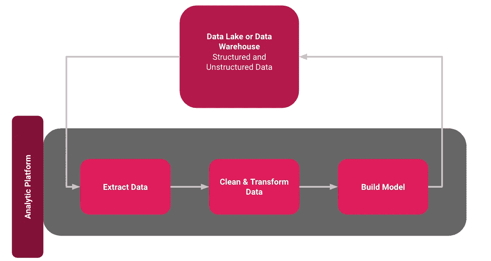
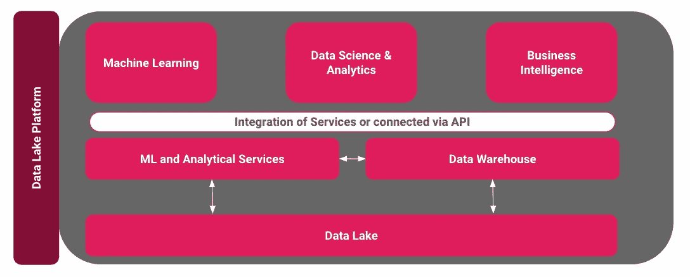
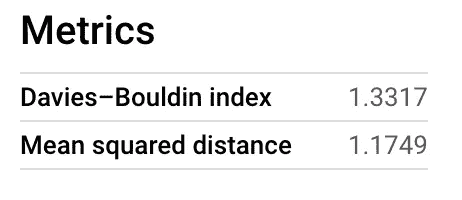
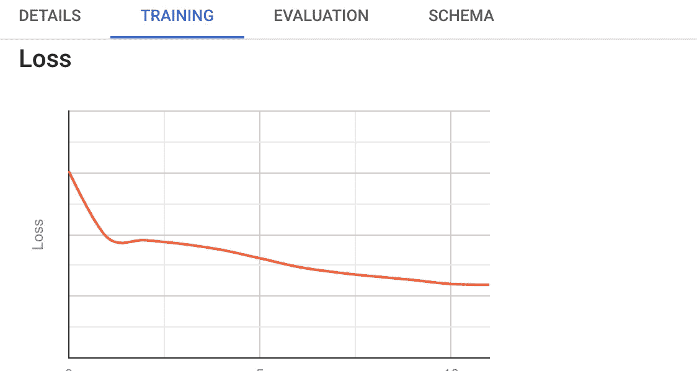

# 用谷歌的 BigQuery 进行机器学习

> 原文：<https://towardsdatascience.com/machine-learning-with-googles-bigquery-6602e734bf74?source=collection_archive---------26----------------------->

## 如何使用 SQL 轻松创建和部署 ML 模型


彼得·奥勒克萨在 [Unsplash](https://unsplash.com/s/photos/utah?utm_source=unsplash&utm_medium=referral&utm_content=creditCopyText) 上拍摄的照片

从数据仓库或数据湖中提取数据的传统方法——然后用它清理、转换和建立模型——正在慢慢被一种叫做 ***的新方法所取代。这种新方法将计算引入数据，或将机器学习/算法引入数据***【1】***。*在像 Google 的 BigQuery 这样的服务中，传统的数据库系统甚至用 ML 工具进行了内部扩展[2]。**

# 新范式的优势

新方法的优势包括简化的基础架构。如果我们看一下下面的简化架构，就可以清楚地看到，如果服务已经可以在云环境中相互通信，或者集成在一个服务中，那么就不需要第三方系统的进一步接口。**这大大缩短了这些环境的设置和维护时间。**



经典分析过程架构—作者图片

另一个重要因素是**数据科学流程可以显著简化**。每个数据科学家和工程师都知道这一过程有多耗时，因此将您需要的一切都放在云环境甚至服务中的方法大大简化了这一过程。



集成的数据湖和分析平台—作者图片

第三点是**可编程性的简化**——比如分析师只用 SQL 就能轻松完成机器学习任务。下面，我想用 BigQuery 中的一个简单例子来说明这一点。如果您想更深入地了解数据平台现代化这一主题，您可能会对这篇文章感兴趣。

# BigQuery ML 示例

为了展示解决方案如何简化数据分析过程，我将使用 BigQuery 及其 ML 功能。这里，我使用了公共数据集，其中包含了爱荷华州所有批发购买的酒。

在这个例子中，我只是想做一些聚类。这个例子非常简单，但是很好地展示了可能性和您必须采取的步骤。

**第一步:创建模型**

```
CREATE OR REPLACE MODEL DATA.iowa_bottle_clusters OPTIONS (model_type=’kmeans’, num_clusters=3, distance_type = ‘euclidean’) ASSELECT item_description, AVG(state_bottle_cost) AS state_bottle_cost,FROM `bigquery-public-data.iowa_liquor_sales.sales`WHERE EXTRACT(YEAR FROM date) = 2018GROUP BY item_description;
```

上面，您可以看到我使用了 k-Means 算法，并将聚类数的参数设置为 3。对于这个高度简化的例子，我的想法是使用变量*state _ bottle _ payed*(酒精饮料部门为订购的每瓶酒支付的金额)将其分为三个价格类别。

**第二步:评估模型**

创建模型后，BigQuery 会自动为您提供一些指标。这些允许对聚类算法进行评估。对于*戴维斯-波尔丁指数*，目标将是最低的可能值【3】。



指标—按作者分类的图像

另一个很棒的特性是我们得到的损失图表。



损失-作者提供的图像

随着

```
SELECT * FROM ML.TRAINING_INFO(MODEL Data.iowa_bottle_clusters);
```

和

```
SELECT davies_bouldin_index FROM ML.EVALUATE(MODEL Data.iowa_bottle_clusters);
```

如果需要，您可以稍后查询结果。

**第三步:预测**

经由*毫升。预测*我们将看到特定品牌属于哪个集群。

```
SELECT
 centroid_id,
 item_description,
 state_bottle_cost
FROM
 ML.PREDICT(MODEL Data.iowa_bottle_clusters,(SELECT
  item_description,
  AVG(state_bottle_cost) AS state_bottle_cost
 FROM
  bigquery-public-data.iowa_liquor_sales.sales
 WHERE
  date <= '2018-02-02'
  AND date >='2018-01-01'
 GROUP BY
  item_description) )
 ORDER BY
  centroid_id;
```

**第四步:检查结果**

现在让我们检查结果是否有意义。以下是三个集群的示例:

第一组中只有一个项目，似乎是高级产品:

*1 —雷米·马丁路易十三干邑— 1599.19*

在第二组中，我们有更多的瓶子，似乎被认为是中产阶级，例如:

*2 —达尔莫尔雪茄麦芽苏格兰威士忌— 93.33*

*2 —卡瓦兰雪利酒橡木单一麦芽— 73.33*

*2 —吉姆梁酒厂的杰作— 104.91*

还有一组产品，你可能会将它们与可乐或其他软饮料混合在一起:

*3 —斯米尔诺夫葡萄— 8.25*

*3 —斯米尔诺夫酸青苹果— 8.25*

*3 —伯内特水果潘趣酒— 4.48*

所以最终的结果并没有那么糟糕——但当然可以优化。这里您需要的只是 BigQuery 和一些基本的 SQL。

## 结论

在这篇短文中，我想提供一些关于将机器学习或算法转移到数据的范式**的理论基础知识**。此外，相对于传统方法的优势是显而易见的。尤其是在设置和维护方面，以及在节省时间方面的实际数据分析过程。BigQuery ML 使机器学习的使用民主化。数据科学家和分析师可以使用 BigQuery ML 来构建和运行模型，而不必访问新的商业智能工具和表。预测分析有助于商业决策。最后，我展示了现在只使用 SQL 和 Google 的 BigQuery 开发一个机器学习模型是多么容易。有关更多信息，请单击下面的链接。

## 资料来源和进一步阅读

[1]唐斯，B. N .，奥菲姆，D. M .，黑尔，w .，Xi，l .，多纳霍，L. A .，&卡拉，D. (2014)。将计算引入数据的实际例子。生物分子技术杂志:JBT ， *25* (增刊)，S5。

[2] Google，[什么是 BigQuery ML？](https://cloud.google.com/bigquery-ml/docs/introduction?hl=en) (2020 年)

[3]戴维斯博士，波尔丁博士(1979 年)。“一个集群分离措施”。IEEE 模式分析与机器智能汇刊。PAMI-1 (2)，第 224 至 227 节。