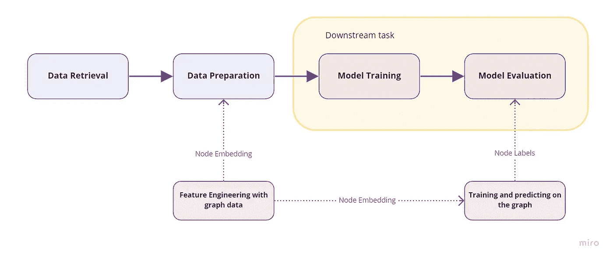
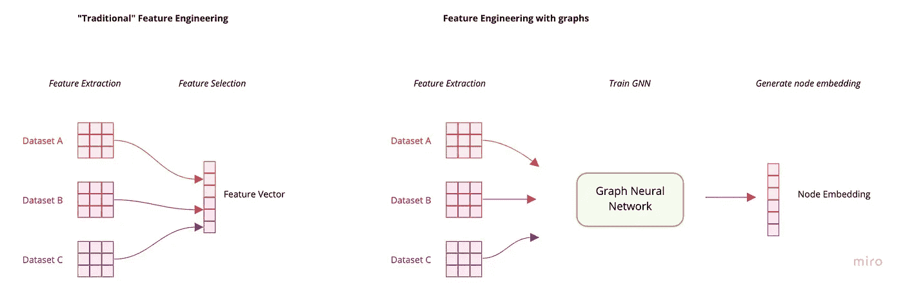
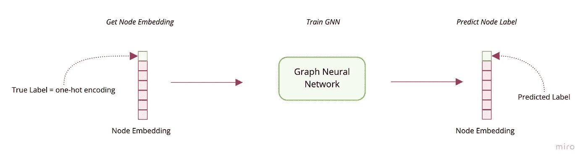

# 带图的机器学习:开发工作流概述

> 原文：<https://towardsdatascience.com/machine-learning-with-graphs-workflow-4ad40b50a32c?source=collection_archive---------36----------------------->

## [实践教程](https://towardsdatascience.com/tagged/hands-on-tutorials)

## 在 ML 生命周期中，带有图形的机器学习任务发生在何处的概念性概述。

图片由作者提供。

使用图形的机器学习帮助建立预测模型的方式与众所周知的无监督和半监督方法应用于监督模型的方式非常相似。这意味着通常有两种方法可以将带有图形的机器学习部署到 ML 工作流中。第一种方法是创建一个所谓的节点嵌入，并将其传递给下游的机器学习任务。对图形应用机器学习的第二种方式是直接在图形数据结构上进行标签和链接预测。早些时候，我写了一篇关于机器学习的[介绍，带图](/introduction-to-machine-learning-with-graphs-f3e73c38d4f8)以及包括哪些任务。这篇文章是对那篇文章的补充，将集中于给出这些任务如何嵌入 ML 工作流的简明概述。

## 机器学习开发工作流程

一个典型的机器学习开发工作流程由以下用蓝框表示的阶段组成:

在特征工程和模型训练期间用图形学习技术增强的监督机器学习工作流。图片由作者提供。

机器学习开发工作流从数据检索开始，其中(大部分)非结构化原始数据是从源中获取的。此后，在数据准备步骤中，目标是将数据转换为结构化格式，以便它可以用于模型训练。模型经过训练后，可以使用各种性能和验证方法对其进行评估。在数据准备阶段，必须完成一项称为特征工程的关键任务。*特征工程是将原始数据转换为特征的过程，这些特征可以更好地代表预测模型的潜在问题，从而提高未知数据的模型准确性*因此，数据科学家必须设计并决定哪些特征在预测目标标签时是重要的。因此，拥有用例的适当的业务领域知识是执行特性工程任务的先决条件。

## 使用图形数据的特征工程

这就是使用图形结构化数据的特征工程可以提供帮助的地方。这种工作原理的基本假设是，数据点不是孤立存在的，它们是通过与数据集中的其他记录进行交互而出现的。我们可以在此阶段构建一个机器学习模型，根据数据集中数据点(记录)之间的关系属性生成特征，而不是依赖数据科学家的创造力和领域知识来得出对他们来说重要的特征。这些特性被称为节点嵌入，其中每个节点都是一个数据点。因此，每个节点嵌入都是它与数据集中其他数据点的结构关系的表示。节点之间的相互作用与他们的邻居节点被捕获在结果节点嵌入。创建节点嵌入的方法有很多种。这些方法中的许多使用图形神经网络(GNN)或其深度学习变体(例如图形卷积网络(GCN))将局部邻域节点和边的属性聚集到嵌入中。本质上，GNN 试图将节点属性及其与其他节点的关系编码到潜在空间的向量中。然而，这些图形学习技术是另一个主题，我将在另一篇文章中讨论。此阶段的结果是节点嵌入，它将作为一个特征传递给下游任务，用于任何分类或回归预测。

左图:传统的特征工程步骤要求数据科学家在特征选择过程中手工挑选他或她认为与预测相关的特征。右图:图的特征工程没有特征选择，而是训练一个图神经网络来确定节点属性和关系，以及图统计，包括以节点嵌入的形式确定特征向量。图片由作者提供。

## 图形上的训练和预测

在上面的方法中，来自特征工程的结果导致节点嵌入，该节点嵌入然后将被用作另一个下游机器学习模型的输入特征向量。然而，也可以直接从图结构数据中预测节点或节点之间的链接。这些任务就是所谓的节点分类和链路预测。这里的关键是，不是手动挑选哪个关系结构导致更好的预测，而是训练模型来找到最重要的结构模式和节点属性集，以分配标签和预测关系。

使用图形神经网络来训练节点嵌入，以预测节点标签或边。输入是嵌入了节点标签的一次性编码向量的节点，输出是预测的节点标签。图片由作者提供。

通常，通过以完全监督的方式训练图形神经网络来实现节点分类，其中损失函数被定义在节点嵌入(在上述早期特征工程步骤中创建)和指示节点所属类别(标签)的独热向量上。因此，模型将在节点嵌入时被训练，并且图形神经网络的输出将标记每个节点。结果，节点已经被标记，因此不需要将节点嵌入作为特征向量传递到下游任务以进行分类或回归。

## 结论

首先，使用图的机器学习可以在特征工程阶段代替特征选择任务。传统的机器学习工作流依赖于数据科学家的洞察力来选择特征，而 ML with graphs 训练图形神经网络来输出每个节点的特征向量，称为节点嵌入。然后，该节点可以被传递到任何下游分类器中。其次，也可以直接在图形数据结构上进行预测。在这种情况下，一个节点嵌入将被传递到一个图形神经网络来预测其标签。

## 来源

**图形表示学习** [https://www.cs.mcgill.ca/~wlh/grl_book/](https://www.cs.mcgill.ca/~wlh/grl_book/)

**图的表征学习:方法与应用** [https://arxiv.org/abs/1709.05584](https://arxiv.org/abs/1709.05584)

**发现特征工程** [https://machine learning mastery . com/Discover-Feature-Engineering-how-to-engineer-features-and-how-to-get-good-it/](https://machinelearningmastery.com/discover-feature-engineering-how-to-engineer-features-and-how-to-get-good-at-it/)