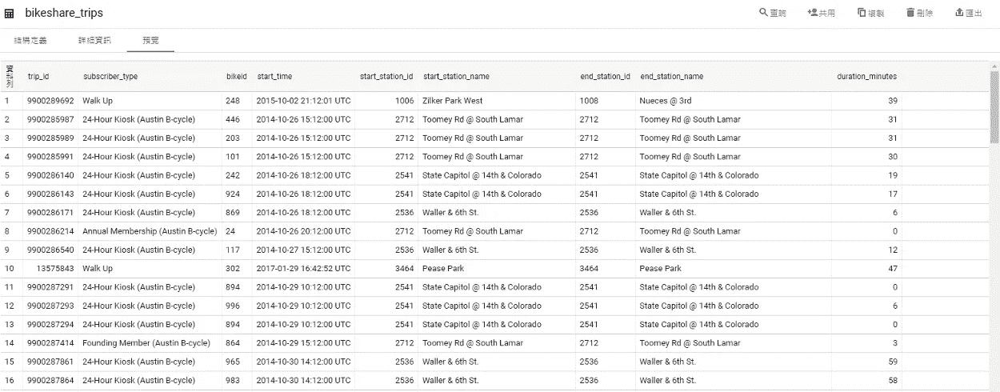
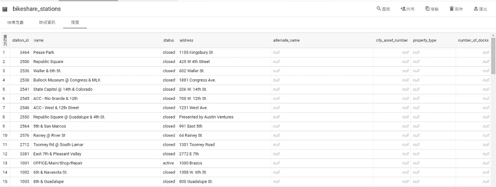
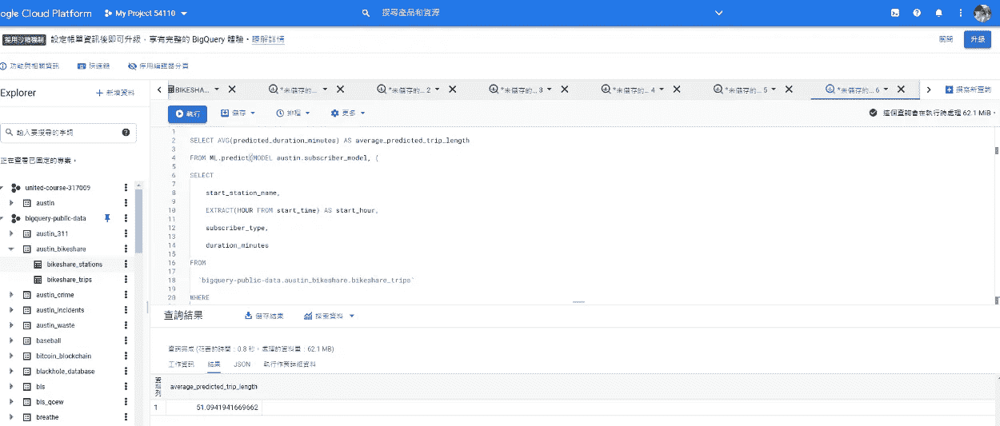
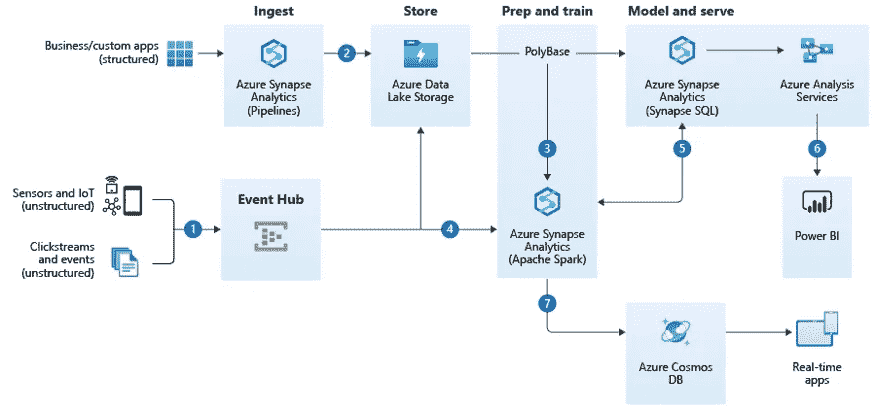

# 仅使用 SQL 的机器学习—使用 BigQuery 识别共享自行车的目标受众

> 原文：<https://towardsdatascience.com/machine-learning-with-only-sql-using-bigquery-to-identify-the-target-audience-for-shared-bike-aa3a4041be3a?source=collection_archive---------19----------------------->

## 关于如何比较假设和提示以提高准确性的案例

佐伊·赖在 [Unsplash](https://unsplash.com/photos/Uqkwu7swTW8) 上的照片

我们不能用 Python 做机器学习的原因有很多:

*   我们仍在学习新的编程语言
*   我们需要尽快交付结果，并且更喜欢分析数据所在的位置
*   没有访问 Python 的权限

无论你有哪种情况，我都将分享如何只用 SQL 进行机器学习，了解影响自行车共享旅行持续时间的关键特征，以及我对数据仓库发展的观察。

# 内容

*   用例:预测自行车共享出行的平均持续时间
*   挑战
*   第一步:假设关键特征
*   步骤 2:定义指标
*   步骤 3:构建并评估模型
*   第四步:预测结果
*   第五步:如何提高你的模型的准确性？
*   思想

# 用例:预测自行车共享出行的平均持续时间

自行车共享旅行的平均持续时间与共享自行车业务的收入直接相关，就像零售的平均订单价值一样。为了更深入地了解影响持续时间的关键因素，我使用了谷歌云平台上的公共数据集 [Austin Bikeshare](http://console.cloud.google.com/bigquery?p=bigquery-public-data&d=austin_bikeshare&t=bikeshare_trips&page=table) 。要分析，登录 bigquery 后指向 big query-public-data:Austin _ bike share。

# 挑战

当仔细查看表 bikeshare_trips 和 bikeshare_stations 时，有许多功能可供培训选择。一种方法是利用 AutoML，但这不是我们在本文中的重点。本文将开发两个假设，并通过将它们训练成模型并用度量标准对它们进行评估来对它们进行比较。

BigQuery Web 界面(按作者)

BigQuery Web 界面(按作者)

# 第一步:假设关键特征

这里有两个假设:

*   假设 A:关键因素是起点站、起点站的位置、一周中的哪一天以及旅行开始的时间
*   假设 B:关键因素是始发站、用户类型和旅行开始的时间。

# 步骤 2:定义指标

在训练模型之前，确定评估指标是至关重要的。毕竟如果要比较两个结果，就要把标准说清楚。机器学习是基于特征、参数和框架的排列和组合。我们需要的是选择一个精确度最高的。

有许多度量标准。以下是回归中常用的一些指标:

*   绝对平均误差
*   均方根误差

如果你和我一样健忘，不用担心，卡恩学院很好地解释了平均绝对偏差和均方根误差

# 步骤 3:构建并评估模型

然后，我们使用选择的特性和期望的结果(在这个例子中是持续时间)来使用 CREATE MODEL 和 ML 构建一个回归模型。评估语法。

我们发现，在假设 B 中，平均绝对误差和均方根误差要小得多，这意味着假设 B 的特征与期望的结果正相关。

BigQuery Web 界面(按作者)

# 第四步:预测结果

最后，使用 ML。预测得出 2019 年数据集中的平均时长将为 51 分钟的结果。

# 第五步:如何提高你的模型的准确性？

如何提高准确性是数据科学家最感兴趣的问题之一。

我曾经[分解一个过程中的步骤](/introducing-2-tools-to-speed-up-your-power-bi-10x-e354cce355ae)并逐一解决。

以下是我的思考过程:

*   数据
*   特征
*   算法
*   参数

让我们把重点放在基本面上，比如数据和特性。我们已经做了一个调整**特性**的小实验。如果更深入地研究**数据**，可以使用一些基本的观察统计数据，例如观察平均值、最大值和最小值，看看它们是否有意义。例如，表中的一些数据没有意义，持续时间超过 30，000 小时，或长度< 0。

如果我们能剔除这些数据，预测结果的可信度会更令人满意。

# 思想

# BigQuery 让用 SQL 实现 ML 成为可能

不是每个人都可以使用 Python，但是如果我们无论如何都需要交付呢？对于一些数据库管理员或数据分析师来说，熟悉 Python 可能不是“必备”技能。BigQuery 内置 ML 让我们无需掌握一门新语言就能交付业务结果。

# 简化流程，让您可以专注于最重要的事情

在进入机器学习项目之前，我经常看到我的企业客户在各种先决条件之间跑来跑去。因此，由于数据移动、安全检查、访问控制和网络设置，交付结果更加耗时。现在，许多解决方案提供商集成了工具，使流程更加顺畅。比如做数据分析的时候，我们以前都是下载数据库里的数据，发送数据，导入 IDE。现在，只有 Mount 函数可以完成这项工作，就像使用 USB 堆栈将数据加载到计算机中一样。

# 数据仓库正在发展，将 BI 和 ML 结合为一个数据分析平台

在过去，数据仓库只是一个并行数据处理和存储的工具。随着时间的推移，它还结合了商业智能和机器学习等新元素，用于更复杂的分析工作。此外，许多数据仓库提供实时分析，以满足大数据场景中的流需求。下面的架构展示了如何将 Synapse(微软的数据仓库解决方案)用于物联网设备和 web 点击数据分析。

来源:[大数据架构实时分析](https://docs.microsoft.com/en-us/azure/architecture/solution-ideas/articles/real-time-analytics)

声明:这是在完成[用 BigQuery ML](https://google.qwiklabs.com/quests/146?catalog_rank=%7B%22rank%22%3A1%2C%22num_filters%22%3A0%2C%22has_search%22%3Atrue%7D&search_id=11706616) 创建 ML 模型之后的一篇文章。如果你需要更多的细节，请随时参考[我的问题](https://github.com/wanchunghuang/Create-ML-Models-with-BigQuery-ML-Challenge-Lab/blob/main/query)。

# 保持联系

*   在 [Medium](https://medium.com/@wanchunghuang) 上关注我，了解更多类似的故事
*   在 [LinkedIn](https://www.linkedin.com/in/wanchung-huang/) 上连接
*   你怎么想呢?留下评论