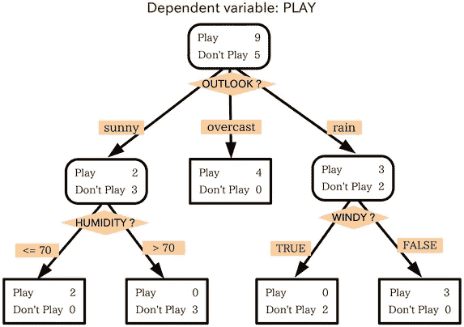
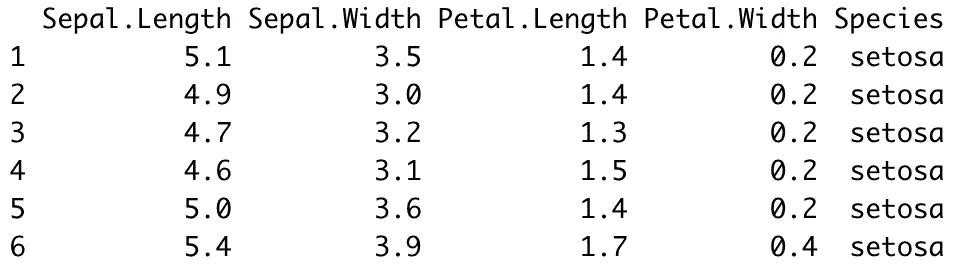
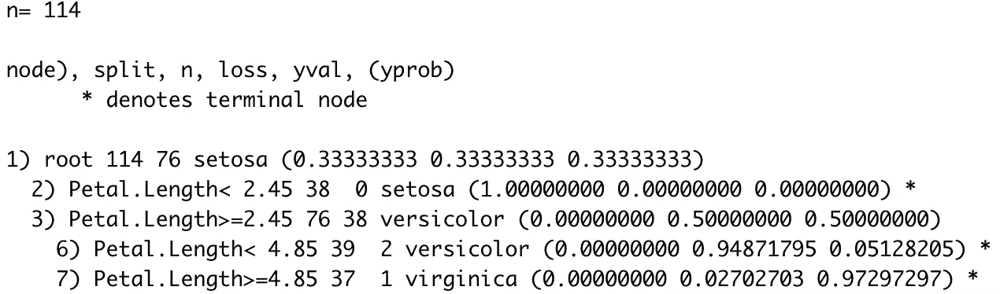
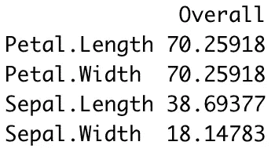
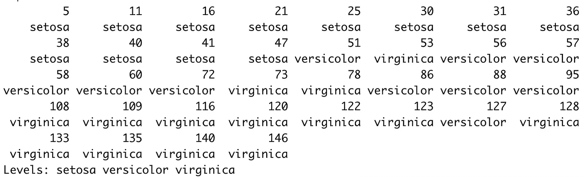
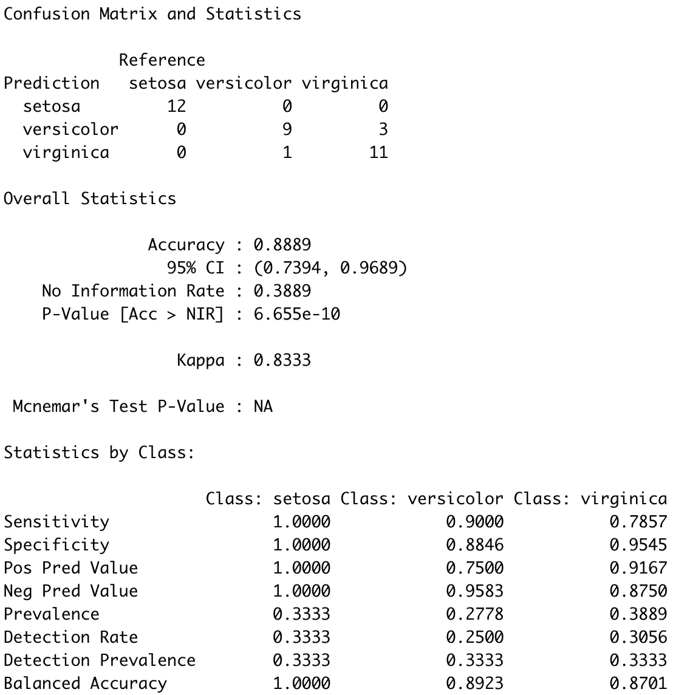

# 带 R 的机器学习:决策树完全指南

> 原文：<https://towardsdatascience.com/machine-learning-with-r-a-complete-guide-to-decision-trees-1d4dfc88bc20?source=collection_archive---------30----------------------->

## 用决策树进行机器学习和分类的简单明了的指南。

由 [Fabrice Villard](https://unsplash.com/@fabulu75?utm_source=medium&utm_medium=referral) 在 [Unsplash](https://unsplash.com?utm_source=medium&utm_medium=referral) 拍摄的照片

决策树是监督机器学习中最基本的算法之一，用于处理回归和分类任务。简而言之，你可以把它看作是一个美化的 if-else 语句的集合，但是后面会有更多的介绍。

今天，您将学习决策树算法背后的基本理论，以及如何用 r 实现该算法。

这篇文章的结构如下:

*   决策树介绍
*   数据集加载和准备
*   建模
*   做预测
*   结论

# 决策树介绍

决策树很直观。他们所做的只是问一些问题，比如性别是男性还是某个特定变量的值高于某个阈值。基于答案，要么问更多的问题，要么进行分类。简单！

为了预测类标签，决策树从根(根节点)开始。计算哪个属性应该表示根节点是很简单的，归结起来就是计算哪个属性最好地分隔了训练记录。计算是通过**基尼系数**公式完成的。这是简单的数学，但是如果你有很多属性的话，手动计算会很繁琐。

在确定根节点之后，树“分支”以更好地分类在根节点中发现的所有杂质。

这也是为什么经常听到决策树=多个 if-else 语句类比的原因。这种类比在一定程度上是有道理的，但是条件语句是自动计算的。简单来说，机器学习你的数据的最佳条件。

让我们来看看下面的决策树表示法，以进一步阐明这些观点:

图 1 —示例决策树([来源](https://commons.wikimedia.org/wiki/File:Decision_tree_model.png))

如你所见，变量*展望？*、*湿度？*和*刮风？*用于预测因变量——*起*作用。

现在您已经知道了算法背后的基本理论，接下来您将学习如何在 R 中实现它。

# 数据集加载和准备

没有数据就没有机器学习，没有库就没有数据工作。你需要这些来跟随:

如您所见，我们将使用 Iris 数据集来构建决策树分类器。这是前几行的样子(来自`head()`函数调用的输出):

图 2 —虹膜数据集头部(图片由作者提供)

对于任何有一周数据科学和机器学习经验的人来说，数据集都非常熟悉，因此不需要进一步介绍。此外，数据集非常干净，这将为我们节省大量时间。

在继续进行预测建模之前，我们唯一要做的事情是将这个数据集随机分成训练和测试子集。您可以使用以下代码片段以 75:25 的比例进行拆分:

就是这样！接下来我们从建模开始。

# 建模

我们使用`rpart`库来构建模型。构建模型的语法与线性回归和逻辑回归相同。您需要将目标变量放在左边，将特性放在右边，用~符号隔开。如果您想使用所有功能，请在前面加一个点(。)而不是功能名称。

另外，不要忘记指定`method = "class"`，因为我们在这里处理的是一个分类数据集。

以下是训练模型的方法:

调用`model`的输出如下图所示:

图 3 —决策树分类器模型(图片由作者提供)

仅从这张图片中，您就可以看到用于进行分类的“规则”决策树模型。如果您想要更直观的表示，您可以使用`rpart.plot`包来可视化树:

图 4-决策树的可视化表示(图片由作者提供)

您可以通过检查底部节点来查看有多少分类是正确的(在训练集中)。 *setosa* 每次都被正确分类，5%的时间里*杂色*被错误分类为*海滨*，3%的时间里*海滨*被错误分类为*杂色*。这是一个简单的图表，但你可以从中读出一切。

决策树对于检查特征的重要性也很有用，因此，每个特征有多少预测能力。你可以使用`varImp()`功能来了解一下。以下代码片段计算重要性，并按降序对它们进行排序:

结果如下图所示:

图片 5 —特征重要性(作者图片)

到目前为止，您已经构建并探索了模型，但是还没有任何用处。下一节将向您展示如何对以前未见过的数据进行预测并评估模型。

# 做预测

预测新实例现在是一项微不足道的任务。您所要做的就是使用`predict()`函数并传递测试子集。此外，确保指定`type = "class"`以使一切正常工作。这里有一个例子:

结果如下图所示:

图 6-决策树预测(图片由作者提供)

但是这些预测有多好呢？我们来评价一下。混淆矩阵是评估分类模型最常用的度量之一。在 R 中，它还输出其他度量的值，比如灵敏度、特异性等。

以下是打印混淆矩阵的方法:

结果如下:

图 7 —测试集上的混淆矩阵(图片由作者提供)

正如你所看到的，在*云芝*和*海滨*类中有一些错误的分类，类似于我们在训练集中看到的。总体而言，该模型的准确率略低于 90%，这对于简单的决策树分类器来说是可以接受的。

# 结论

决策树是整个基于树的算法家族的优秀入门算法。它通常被用作基线模型，更复杂的基于树的算法(如随机森林和梯度推进)需要胜过它。

今天，您已经学习了决策树背后的基本逻辑和直觉，以及如何在 r 中实现和评估算法。您可以期待很快涵盖整个基于树的算法套件，如果您想了解更多，请继续关注。

*喜欢这篇文章吗？成为* [*中等会员*](https://medium.com/@radecicdario/membership) *继续无限制学习。如果你使用下面的链接，我会收到你的一部分会员费，不需要你额外付费。*

 [## 通过我的推荐链接加入 Medium-Dario rade ci

### 作为一个媒体会员，你的会员费的一部分会给你阅读的作家，你可以完全接触到每一个故事…

medium.com](https://medium.com/@radecicdario/membership) 

# 保持联系

*   在[媒体](https://medium.com/@radecicdario)上关注我，了解更多类似的故事
*   注册我的[简讯](https://mailchi.mp/46a3d2989d9b/bdssubscribe)
*   在 [LinkedIn](https://www.linkedin.com/in/darioradecic/) 上连接
*   查看我的[网站](https://www.betterdatascience.com/)

*原载于 2021 年 2 月 10 日 https://appsilon.com**的* [*。*](https://appsilon.com/r-decision-treees/)