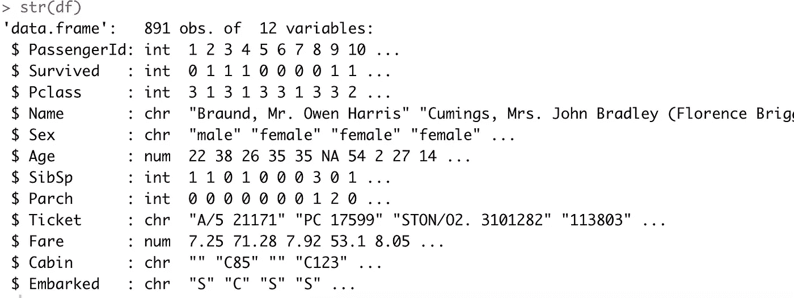
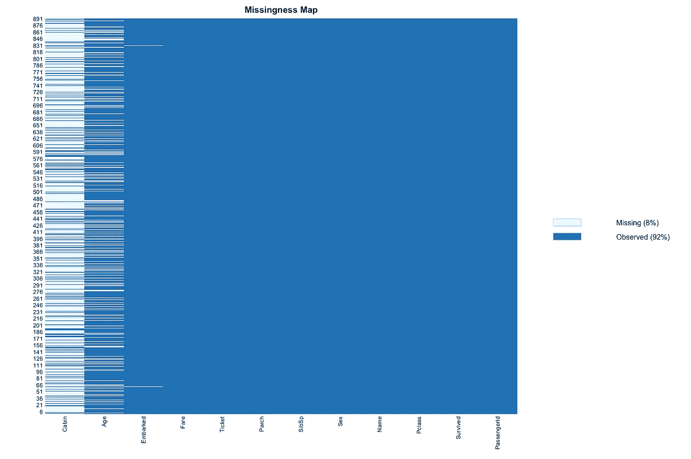
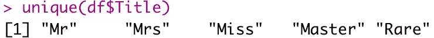
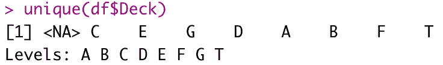
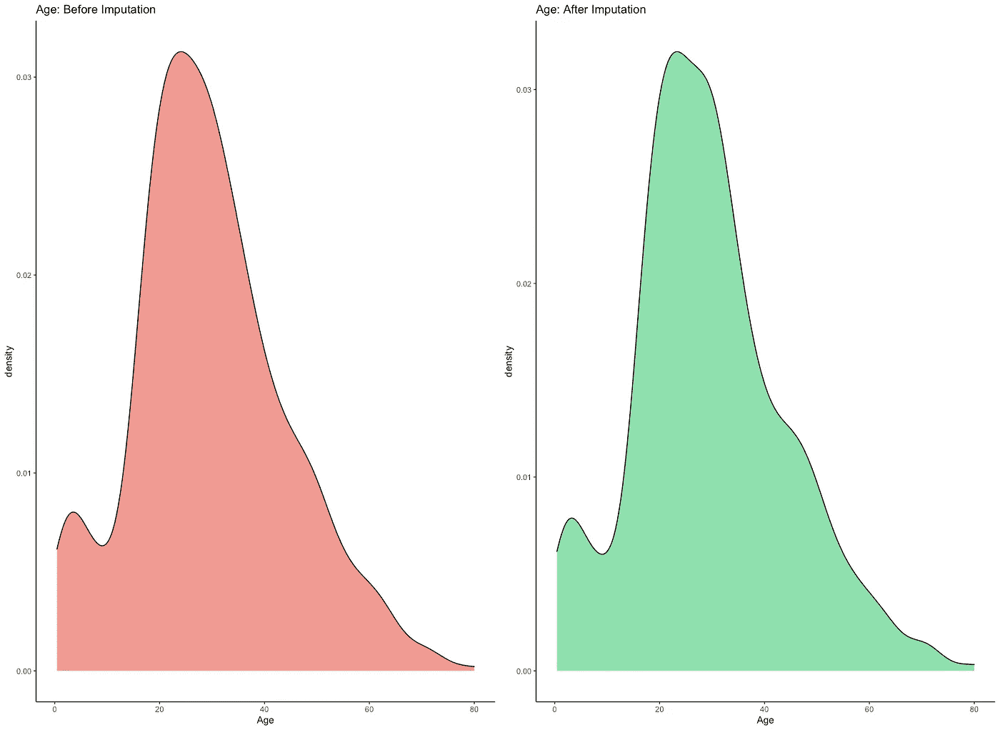
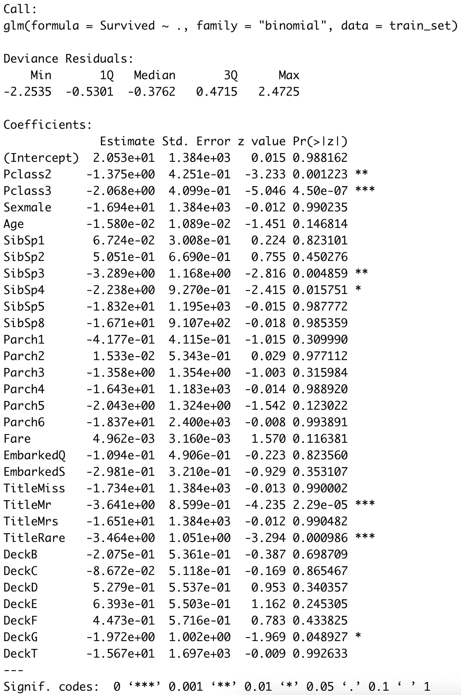
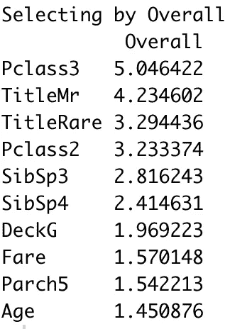
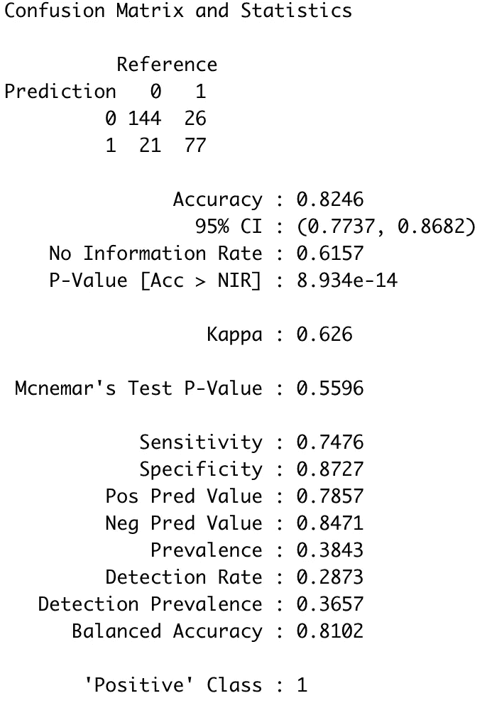

# 带 R 的机器学习:逻辑回归完全指南

> 原文：<https://towardsdatascience.com/machine-learning-with-r-a-complete-guide-to-logistic-regression-16e93e609443?source=collection_archive---------24----------------------->

## 带 r 的机器学习和逻辑回归最简单指南。

凯尔·汉森在 [Unsplash](https://unsplash.com?utm_source=medium&utm_medium=referral) 上的照片

逻辑回归是统计学中最基本的算法之一，通常用于机器学习。它不用于生成 SOTA 模型，但可以作为二元分类问题的优秀基线。

> *对初学者的机器学习感兴趣？* [*下面是关于 R*](/machine-learning-with-r-a-complete-guide-to-linear-regression-6fad412f778) *线性回归的详细指导。*

今天，您将学习如何在 R 中实现逻辑回归模型，并提高您的数据清理、准备和特性工程技能。

这篇文章的结构如下:

*   逻辑回归介绍
*   数据集加载和浏览
*   特征工程和处理缺失数据
*   建模
*   生成预测
*   结论

# 逻辑回归介绍

逻辑回归是一种在统计学和机器学习中都使用的算法。机器学习工程师经常将其用作基线模型——一个其他算法必须超越的模型。它也经常被首先使用，因为它很容易解释。

在某种程度上，逻辑回归类似于线性回归，但后者不用于预测连续值(如年龄或身高)。相反，它被用来预测**二元分类**——客户是否被搅动，病人是否幸存，或者疾病是恶性的还是良性的。为了简化，逻辑回归用于预测*是/否*类型的响应。

那不完全正确。逻辑回归告诉我们响应的**概率**是*是*，然后我们使用预定义的阈值来分配类别。例如，如果概率大于 0.5，则分配的类别为*是*，否则为*否*。使用不同的阈值评估性能可以减少误报或漏报的数量，这取决于您希望如何进行。

如您所想，逻辑回归可以处理连续数据和分类数据。这意味着您的数据集可以包含任何类型的数据，只要它准备充分。

您可以使用逻辑回归模型来检查**特性的重要性。**稍后，您将通过动手示例了解如何操作。了解哪些特性是重要的，可以让您构建更简单、维度更少的模型。因此，预测和模型更容易解释。

这就是逻辑回归背后的基本直觉。接下来让我们把手弄脏。

# 数据集加载和浏览

最著名的二元分类数据集之一是 Titanic 数据集。目标是根据许多输入特征(如年龄、乘客级别等)预测乘客是否在事故中幸存。

您不必下载数据集，因为在 r 中有一个专门的包。您将在整篇文章中只使用训练数据集，因此您不必做两次准备和特性工程。

以下代码片段加载到每个必需的包中，将训练数据集存储到名为`df`的变量中，并打印其结构:

下面是相应的结构:

图 1-泰坦尼克号数据集结构(图片由作者提供)

需要做很多工作。例如，某些列中缺失的值用空字符串标记，而不是用`NA`标记。这个问题很容易解决，一旦你解决了它，你就可以绘制一个**缺失图**。它将显示丢失值的位置:

缺失图如下所示:

图 2 —缺失图(作者提供的图片)

前三列包含缺失的数据。您将在下一节看到如何解决这个问题。

# 特征工程和处理缺失数据

您需要特征工程，因为默认特征要么格式不正确，要么不能以最佳方式显示信息。只要看看*图 1* 中的`Name`列——一个算法无法以默认格式处理它。

但是这个功能还是挺有用的。你可以从中提取乘客头衔(例如*小姐*、*先生*等等)。最后一步，您可以检查乘客是否有罕见的头衔(例如，*多娜*、*女士*、*少校*等等)。

下面的代码片段就是这样做的:

在下图中，您可以看到我们现在拥有的所有独特标题:

图 3-独特的乘客标题(作者图片)

您可以对`Cabin`列应用类似的逻辑。默认情况下这是无用的，但可以用来提取甲板号。方法如下:

下图显示了唯一的牌组编号:

图 4——唯一的甲板号(作者图片)

您现在已经完成了一些功能工程，这意味着可以删除原始的列。下面的代码片段删除了这两个，还有`PassengerId`和`Ticket`，因为它们没有提供任何有意义的信息:

最后，您可以将焦点转移到缺失的值上。将使用两种方法——模式和 MICE 插补。

您将对`Embarked`列使用众数(最频繁值)插补，因为它只包含几个缺失值。老鼠插补将需要更多的工作。将分类变量转换成因子是必须的，插补是通过排除目标变量来完成的。

以下是输入缺失值的完整代码片段:

作为健全性检查，您可以绘制插补前后连续变量的密度图。这样做可以显示插补是否扭曲了分布。`Age`是唯一的连续变量，所以让我们做一个前后密度图:

可视化如下所示:

图 5 —插补前后的年龄密度图(作者提供的图片)

当然，有些变化是看得见的，但总体分布大致保持不变。这个变量中有很多缺失值，所以分布的一些变化是不可避免的。

最后，您可以将插补结果分配给原始数据集，并将`Deck`转换为因子:

现在，您已经具备了开始预测建模所需的一切，接下来让我们开始吧。

# 建模

在进行建模之前，您需要将数据集分成训练和测试子集。这些从 Titanic 数据集开始就可用，但您必须手动进行分割，因为我们只使用了训练数据集。

以下代码片段以 70:30 的比例随机分割数据。如果您想要相同的分割，不要忘记将种子值设置为 42:

现在，您可以在训练集上训练模型。r 使用`glm()`函数来应用逻辑回归。语法与线性回归相同。你需要把目标变量放在左边，特性放在右边，用`~`符号分开。如果您想使用所有功能，请在前面加一个点(。)而不是功能名称。

另外，不要忘记指定`family = "binomial"`，因为这是逻辑回归所必需的:

以下是该模型的摘要:

图 6-逻辑回归模型摘要(作者图片)

这里最有趣的是 P 值，显示在`Pr(>|t|)`列中。这些值表示变量对预测不重要的概率。通常使用 5%的显著性阈值，因此如果 P 值为 0.05 或更低，我们可以说它对分析不显著的可能性很低。

您还可以使用`varImp()`函数明确地探索特性的重要性。以下是如何获得十个最重要的特征，排序如下:

这些功能如下所示:

图 7-逻辑回归模型的特征重要性(图片由作者提供)

到目前为止，您已经构建并探索了模型，但是还没有任何用处。下一节将向您展示如何根据以前未见过的数据生成预测并评估模型。

# 生成预测

如引言部分所述，逻辑回归是基于概率的。如果概率大于某个阈值(通常为 0.5)，您可以将此实例视为阳性。

评估机器学习模型最常见的方式是通过检查**混淆矩阵**。它是一个正方形矩阵，显示有多少预测是正确的(真阳性和真阴性)，有多少预测是阴性但被归类为阳性(假阳性)，有多少预测是阳性但被归类为阴性(假阴性)。在我们的例子中，*阳性的*指的是在事故中幸存的乘客。

下面的代码片段显示了如何获取概率和类别，以及如何打印混淆矩阵:

以下是相应的结果:

图 8 —逻辑回归模型的混淆矩阵(图片由作者提供)

268 条记录中有 221 条分类正确，准确率为 82.5%。假阳性 26 个，假阴性 21 个。您可以尝试使用分类阈值(现在是 0.5)，看看这些错误分类是如何变化的。

这足以让你开始一般的逻辑回归和分类。让我们在下一部分总结一下。

# 结论

逻辑回归经常被用作基线二元分类模型。更复杂的算法(基于树的或神经网络)必须胜过它才有用。

今天，您已经学习了如何以一种易于遵循和理解的方式进行数据清理、准备和特性工程。您还学习了如何使用逻辑回归应用二元分类建模，以及如何评估分类模型。

*喜欢这篇文章吗？成为* [*中等会员*](https://medium.com/@radecicdario/membership) *继续无限制学习。如果你使用下面的链接，我会收到你的一部分会员费，不需要你额外付费。*

 [## 通过我的推荐链接加入 Medium-Dario rade ci

### 作为一个媒体会员，你的会员费的一部分会给你阅读的作家，你可以完全接触到每一个故事…

medium.com](https://medium.com/@radecicdario/membership) 

## [加入我的私人邮件列表，获取更多有用的见解。](https://mailchi.mp/46a3d2989d9b/bdssubscribe)

*原载于 2021 年 1 月 9 日*[*【https://appsilon.com】*](https://appsilon.com/r-logistic-regression/)*。*