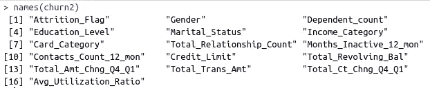
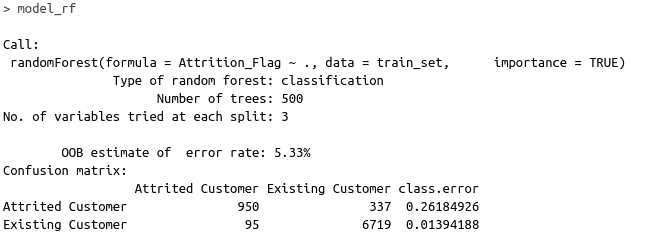
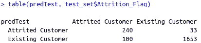

# 带 R 的机器学习:流失预测

> 原文：<https://towardsdatascience.com/machine-learning-with-r-churn-prediction-be5d2b4dba93?source=collection_archive---------30----------------------->

## R 编程语言实用指南


蒂姆·莫斯霍尔德在 [Unsplash](https://unsplash.com/s/photos/programming-language?utm_source=unsplash&utm_medium=referral&utm_content=creditCopyText) 上的照片

r 是数据科学生态系统中的主要语言之一。它主要是为统计计算和图形设计的。r 使得有效实现统计技术变得简单，因此它是机器学习任务的绝佳选择。

在本文中，我们将创建一个随机森林模型来解决一个典型的机器学习问题:流失预测。

注:*如果你想阅读这篇西班牙语文章，它发表在*[*Planeta Chatbot*](https://planetachatbot.com/machine-learning-r-prediccion-churn-rate-954a477c6e35)*上。*

客户流失对每个企业来说都是一个重要问题。在寻找扩大客户组合的方法的同时，企业也注重保持现有的客户。因此，了解现有客户流失(即离开)的原因至关重要。

数据集[可在 Kaggle 上获得。我们将使用 r 的 randomForest 库。第一步是安装和导入库。](https://www.kaggle.com/sakshigoyal7/credit-card-customers)

```
install.package("randomForest")
library(randomForest)
```

我使用 R-studio IDE，但也有其他替代方案。下一步是将数据集读入表中。

```
> churn <- read.table("/home/soner/Downloads/datasets/BankChurners.csv", sep = ",", header = TRUE)
```

某些列是冗余的，或者与另一列高度相关。因此，我们将删除 7 列。

```
> churn2 <- churn[-c(1,3,10,16,19,22,23)]
```

上面的代码根据给定的列索引列表过滤表。我们在列表前添加一个减号，表示这些列将被删除。

我写了一篇单独的[文章](/practical-data-analysis-with-pandas-and-seaborn-8fec3cb9cd16)作为这个数据集的探索性数据分析。如果你想知道为什么我们删除了一些列，我建议你读一下。

以下是剩余列的列表:



(图片由作者提供)

流失标志列是我们的目标变量，指示客户是否流失(即离开公司)。其余的列载有关于客户及其与银行的活动的信息。

下一步是将数据集分成训练和测试子集。我们首先创建一个分区，并用它来分割数据。在分割数据集之前，我们需要分解目标变量(Attrition _ Flag ),以便模型知道这是一项分类任务。

```
> churn2$Attrition_Flag = as.factor(churn2$Attrition_Flag)> set.seed(42)
> train <- sample(nrow(churn2), 0.8*nrow(churn2), replace = FALSE)
> train_set <- churn2[train,]
> test_set <- churn2[-train,]
```

我们随机选择 80%的观察值(即行)进行训练。其余的存储在测试集中。

下一步是创建一个随机森林模型并训练它。

```
> model_rf <- randomForest(Attrition_Flag ~ ., data = train_set, importance = TRUE)
```

我们创建随机森林模型并指明目标变量。波浪号(~)运算符后的点告诉模型，所有其他列都作为独立变量在训练中使用。

下面是随机森林模型的摘要:



(图片由作者提供)

默认情况下，林中使用的树的数量是 500。我们可以使用 ntree 参数来改变它。

评估的关键指标是误差率的 OOB(开箱)估计值。在详细讨论误差的 OOB 估计之前，我想简单解释一下随机森林算法是如何工作的。

随机森林使用 bootstrap 采样，这意味着通过替换从训练数据中随机选择样本。每个引导样本包含来自整个数据集的随机样本。不在 bootstrap 样本中的观察值称为袋外数据。为了获得模型的无偏和更准确的评估，使用了袋外误差。

OOB 误差率为 5.33%，这意味着模型的准确度约为 95%。

混淆矩阵也是评估分类模型的重要工具。它显示了每个类别中正确和错误预测的数量。

为了在测试集上评估模型，我们首先进行预测。

```
> predTest <- predict(model_rf, test_set, type = "class")> mean(predTest == test_set$Attrition_Flag)  

[1] 0.9343534
```

我们比较预测值和测试集的目标变量(Attrition _ Flag ),并取平均值。该模型在测试集上的分类准确率为 93.4%，略低于在训练集上的准确率。

我们还可以在测试集上生成预测的混淆矩阵。



测试集上的混淆矩阵(图片由作者提供)

与现有客户相比，该模型在预测流失客户(即流失客户)方面表现不佳。这个问题的主要原因是阶级分布不平衡。搅动的客户数量比现有客户数量少得多。克服这个问题的一个方法是使用上采样来增加流失客户类中的观察数量。

超参数调整是模型建立的重要组成部分，尤其是对于复杂模型。例如，改变随机森林中的树的数量或单棵树的最大深度被认为是超参数调整。

超参数调优需要对算法的超参数有全面的了解。仅仅尝试随机值是没有效率的。

## 结论

我们已经介绍了 R 编程语言中的 randomForest 库。语法相当简单，模型评估工具非常直观。

Python 和 R 是数据科学和机器学习中最常用的两种编程语言。他们都有丰富的库和框架可供选择，这使得数据科学家和机器学习工程师的生活更加轻松。

我不认为在数据科学相关的任务方面，一个比另一个优越。我建议两者都学，以便有利于两者的一些特色。

感谢您的阅读。如果您有任何反馈，请告诉我。