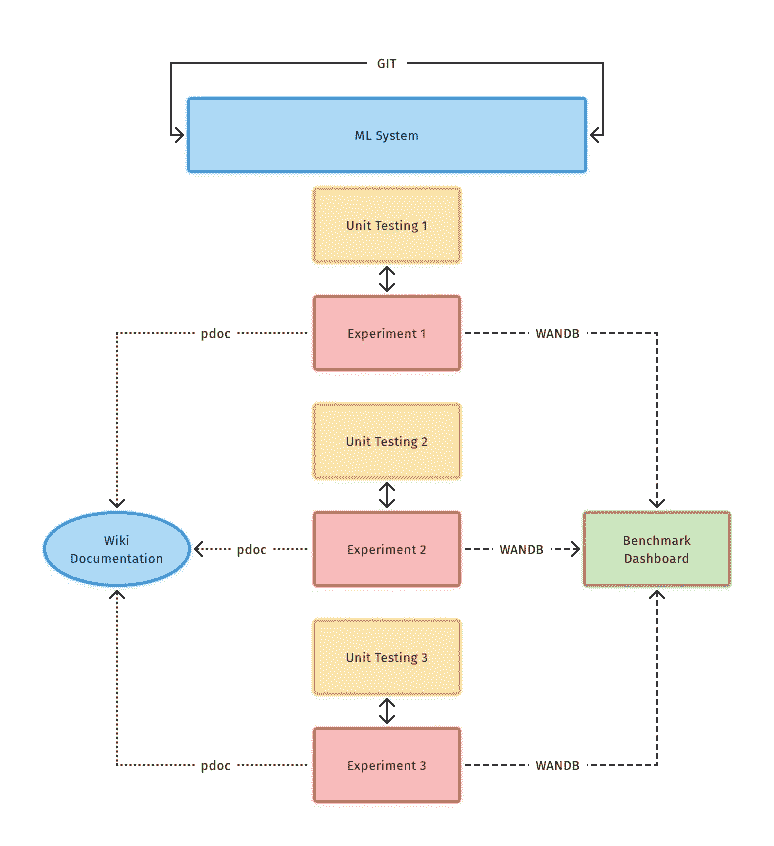

# 研究科学家的机器学习工作流程

> 原文：<https://towardsdatascience.com/machine-learning-workflow-for-research-scientists-fb582538aac1?source=collection_archive---------50----------------------->

## [实践教程](https://towardsdatascience.com/tagged/hands-on-tutorials)

## 协作式机器学习开发入门的简单设置。

由[活动创作者](https://unsplash.com/@campaign_creators?utm_source=medium&utm_medium=referral)在 [Unsplash](https://unsplash.com?utm_source=medium&utm_medium=referral) 上拍摄的照片

## 这个维基是给谁的？

Python 和 Github 工作流教程的列表很长。也有很多机器学习教程。但是没有一个容易遵循的机器学习-ML 云服务-本地开发-标杆工作流程。我将谈论三个免费服务，任何人都可以通过基本的互联网接入使用——Google co laboratory(ML 云服务), VS Code(本地 ML 开发),以及 Weights and Biases(基准测试)。TL；DR-这是一个作为研究者部署你的 ML 模型的过程指南！

## 你学不会什么？

如何用 Python 编码或开发机器学习模型或学习 Pytorch。

## 你会学到什么？

*   如何为结构良好的项目贡献代码
*   使用多个 Google 协作笔记本
*   创建简单的 Python 文档
*   随着您的项目和团队的复杂性和规模的增长而扩展
*   基准和项目跟踪

# 机器学习环境设置

## 谷歌联合实验室

机器学习最简单的入门方法(免费！)正在使用 [Colab](http://colab.research.google.com) 。让我们来看看最简单的开箱即用的设置，让你开始。

1.  将您的 Google 帐户链接到存储笔记本。
2.  设置存储。

*   添加文件可以很容易地通过笔记本左窗格的 Colab 用户界面完成，方法是点击文件夹图标，然后点击上传符号。但是，如果您的实例超时，这很容易发生，这取决于您的网络、RAM 使用情况、您使用的是 Colab Pro 还是免费版本，您可能更喜欢一个更永久的解决方案。
*   永久的解决方案是使用你的 Google Drive 来存放你的文件，尤其是较大的数据集。有很多方法可以将 Colab 连接到 AWS 之类的外部数据存储。然而，对于大多数研究目的和较小的项目，Google Drive 方法工作得很好。您可以在[数据存储连接](http://tinyurl.com/td9i6ttb)查看其他方法。现在让我们来看看 Google Drive 的挂载方法([参考](https://enjoymachinelearning.com/posts/colab-with-google-drive/))

安装 Google Drive 并将数据集传输到 Colab 笔记本电脑，以大幅加速

这里，我们使用前两个命令挂载驱动器。接下来是加速训练，我们将实际数据从驱动器传输到 Colab 笔记本。在这里，我们首先将数据集存储为一个 zip 文件。每次重新连接 Colab 实例时，我们都需要重新运行这些命令，但是这可以大大加快训练和数据管理的速度。

在 Colab 中使用 pip 安装 Python 包

简单明了，大多数软件包都应该开箱即用。您可以从*开始运行其他系统命令！*(感叹号)也是。

如果你有一个真正强大的机器，或者如果你只是喜欢在本地运行你的文件，我推荐使用 VS 代码。它不仅是开源的，而且有强大的扩展来模拟笔记本、代码完成和大量 python 专用工具。我最推荐的扩展是(排名不分先后):

*   Python for VSCode(语法)
*   Visual Studio IntelliCode(用于笔记本电脑)
*   Pylance(超级巨蟒)
*   代码运行器(轻松运行代码片段)

您需要安装 python3 和 pip3。

使用 pip loc 安装您的软件包

# Git、Github 和桌面管理

使用 Git 的标准方式是通过终端。另一种方法是在 [Github](http://desktop.github.com) 桌面使用 Github 的官方应用。它支持最常见的操作系统发行版。

这里有一些简单且无错误的协作标准方法(针对本地文件)**注:**改编自科研人员的[R](https://nicole-brewer.com/r-for-research-scientists/git.html#merge-upstream-changes-into-your-own-master-branch)

# 从远程库设置本地库

1.  初始化您的远程仓库

首先分叉上游存储库。接下来访问您的远程 fork 的 url 并克隆它，并将这个远程 url 设置为将更改推送到的源。最后，将原始存储库(您克隆的存储库)设置为您的上游。

设置您的远程资料库

2.在开始编码之前

总是、总是和总是从上游(父)存储库中获取任何更改。否则，您在本地进行的更改可能会在合并时产生问题(将您的代码推向上游)。

在开始本地工作之前，用对父存储库所做的更改来更新您的本地存储库

3.添加新功能

创建一个新分支来编码一个新特征，避免破坏主分支

4.用修正防止微小的错误

确保您的源代码也与 dropbox 等云服务同步，或者您正在使用 Colab。这确保您不会因为*未保存*或电源故障而丢失数据。

修正而不是做出小的改变

5.在重新设定特征分支的基础之前，合并上游变更

通过将新功能提交重新设置到主分支的顶部来合并新功能

如果您遇到问题，请使用以下链接进一步排除故障，[故障排除](https://happygitwithr.com/pull-tricky.html)或谷歌查看 [StackOverflow](https://stackoverflow.com/)

1.  在 GitHub 上创建一个资源库，或者决定使用现有的资源库
2.  转到您的 Colab 文件
3.  接下来，选择*文件- >在 GitHub 中保存一份副本*
4.  授权您的 GitHub 帐户并选择适当的存储库，添加提交消息并按 OK！
5.  要使用版本控制，对代码进行更改并重复步骤(2)-(4)

## 长期选择

Colab 提供了将源代码下载到计算机的选项。可以去*文件- >下载。ipynb* 或*文件- >下载。py* 并将笔记本存储为本地笔记本或转换为 python 文件。接下来，您可以使用本地 Git 方式来维护版本控制。然而，要访问 Colab 中的文件，您必须使用 Colab 中的 *File- > Open Notebook* 选项将文件重新加载到 Colab。

# 单元测试

用 python 创建单元测试最简单的方法是使用模块 *unittest* 。让我们看一个简单的例子(来自 [GeeksforGeeks](https://www.geeksforgeeks.org/unit-testing-python-unittest/)

Python 中的示例单元测试示例

上面的例子不言自明。它测试了两个简单的函数——将一个字符串乘以 4 次，并将一个字符串转换成大写。这些测试对于确定性函数非常有用。然而，为梯度下降创建这样的测试可能并不容易。然而，如果我们知道函数输出的可能界限，我们可以创建函数来测试它们。一个简单的 ML 测试库确实可用于 T [ensorFlow(在 TF 2.0 中已废弃)](https://medium.com/@keeper6928/mltest-automatically-test-neural-network-models-in-one-function-call-eb6f1fa5019d)和 [PyTorch](https://github.com/suriyadeepan/torchtest) 。unittest 可以很好地用于定义类似于 PyTorch 代码审查中展示的东西。

这些库检查以下项目:

*   变量是否会改变
*   如果某些变量是固定的，那么它们在迭代中保持固定吗
*   输出值是否合理(即在一定范围内)？
*   模型是否连接良好(即所有输入都有助于训练操作)？

# 证明文件

维护文档很难。获得自动化文档的最简单方法*(不推荐，看看* [*我如何判断文档质量？*](https://www.ericholscher.com/blog/2014/feb/27/how-i-judge-documentation-quality/) *)* 正在使用 *pdoc* 模块。让我们开始安装和维护。

使用以下命令为 python-3 安装 *pdoc*

用 pip 安装 pdoc

为了自动化文档创建，我们需要使用 [Google docstrings](https://github.com/google/styleguide/blob/gh-pages/pyguide.md#38-comments-and-docstrings) 格式添加注释。让我们来看一个用于将两个数字相加的函数的快速示例(存储在文件 *Test_Example.py* 中)

添加两个数字演示 Google 文档字符串的简单示例

现在，为了输出 *html* 文件中的文档，我们将使用下面的命令。

使用 pdoc 为单个 Python 文件创建文档

这里的 *Test_Example.py* 是源代码。*输出目录*参数为 wiki 提供了存储 *html* 文件的位置。文档如下所示。但是，该命令对*无效。ipynb* 文件。创建文档的最佳方式是下载*。然后使用 *pdoc* 命令。将笔记本转换为 python 文件的另一种方法是使用命令。*

轻松地将您的 IPython 笔记本转换为 Python 文件

此外，要为整个 python 源代码文件夹创建文档，我们可以使用下面的 *pdoc* 命令。为了输出 *html* 文件中的文档，我们将使用以下命令。

使用 pdoc 创建 Python 项目的文档(文件夹)

这里， *src-folder* 是存放 Python 源代码的文件夹。

# 标杆管理

ML 系统非常容易变得超级复杂。您必须跟踪项目、这些项目中的实验、每个实验中的度量、每个度量集合的超参数等等。此外，多次实验运行会降低实验阶段的速度，并使跟踪结果变得更加困难。最近，ML 系统得到了很好的升级。现在，用户可以把所有超级有趣的东西放到一个看起来很酷的仪表盘上。输入 [*重量和偏差*](https://gist.github.com/thehimalayanleo/wandb.ai) 。你不仅可以获得一个免费的学术帐户，还可以邀请一个团队进行协作！尤其是当你从事研究和/或开源的时候。weights and bias(WANDB)可让您轻松控制数据、存储多次实验结果并比较结果！

让我们看看让 WANDB 在您的项目上运行的最简单的方法。在 [wandb.ai](http://wandb.ai) 上创建项目后，您可以找到类似的代码设置。

通过安装 wandb 模块并登录您的帐户，初始化您的权重和偏差项目

样本权重和偏差代码，用于跟踪数据集、模型超参数和指标

# 把所有的放在一起

## 工作流程

机器学习研究项目的标准化工作流程[图片由作者提供]

对 ML 项目中良好合作的整个工作流程的概述。

Colab 和 VS 代码入门超级简单。然而，为了避免长期项目和合作的麻烦，最好在早期建立合理的实践。希望遵循这个指南和这里的许多参考资料能给你必要的安心。代码打开！

# 参考

[1] N. Brewer，“RStudio 中的出版物”，2020 年 3 月 10 日。[https://nicole-brewer.com/r-for-research-scientists/](https://nicole-brewer.com/r-for-research-scientists/)(2021 年 2 月 6 日访问)。

*最初发布于* [ML 科研人员工作流程(thehimalayanleo.github.io)](https://thehimalayanleo.github.io/MLForResearchScientists/)