# 机器翻译

> 原文：<https://towardsdatascience.com/machine-translation-b0f0dbcef47c?source=collection_archive---------28----------------------->

## 统计机器翻译——SMT 和神经机器翻译——NMT:带和不带注意机制的编码器-解码器结构和最先进的转换器架构。

照片由[张诗钟·戈伦德](https://unsplash.com/@johnygoerend)在 [Unsplash](https://unsplash.com/?utm_source=medium&utm_medium=referral) 拍摄

机器翻译在当今数字化和全球化的世界中发挥着至关重要的作用。它通过处理和翻译一种自然语言为另一种自然语言造福社会。随着技术的进步，不同地区使用不同的语言交流着大量的信息。这使得对机器翻译的需求在过去几十年里呈指数级增长。正因为如此，在过去的几年里，机器翻译已经成为一个活跃的研究领域。它可以分为三种不同的方法:基于规则的方法、统计方法和神经方法。在本文中，我将主要关注统计和神经方法。

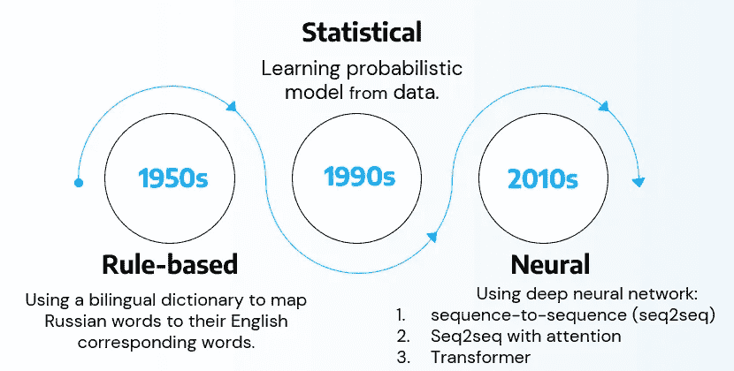

图 1:不同的机器翻译方法及其时间表。

# 介绍

机器翻译是将一种语言(源语言)的句子翻译成另一种语言(目标语言)的句子的任务。它是计算语言学的子领域，旨在利用计算设备自动将文本从一种语言翻译成另一种语言。机器翻译研究始于 20 世纪 50 年代初(冷战时期)。在此期间，需要将俄语文档翻译成英语。由于俄语专家不多，翻译又很费时间，所以机器翻译是有针对性的应用。当时开发的系统大多是基于规则的，使用双语词典将俄语单词映射到其英语对应单词。尽管效果不太好，但在 20 世纪 80 年代末，它让位于基于统计的系统。在 20 世纪 90 年代，基于统计单词和短语的方法变得流行起来，这种方法几乎不需要语言信息。统计机器翻译(SMT)的核心思想是从数据中学习概率模型。在 2010 年代，随着深度神经网络的出现，神经机器翻译成为一个主要的研究领域。NMT 是一种使用深度神经网络进行机器翻译的方法。神经架构被称为序列对序列(seq2seq)。普通的 seq2seq NMT 包括两个递归神经网络(RNN) [1]。NMT 的研究开创了自然语言处理(NLP)的许多最新创新，研究人员发现了香草 seq2seq 的许多改进，其中一个主要改进是注意力机制的使用[2]。受注意力机制的启发，论文“注意力是你所需要的全部”介绍了一种称为 Transformer 的新颖架构，这是目前最先进的语言模型[3]。这种架构完全依赖于注意力机制，没有任何 RNN，其变体如 BERT 已经应用于许多 NLP 任务，并能够实现最先进的性能。

# 统计机器翻译

统计机器翻译(SMT)从数据中学习概率模型。假设如果我们从德语翻译成英语，我们想要找到最好的英语句子 y，给定德语句子 x。SMT 将制定任务如下:

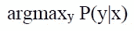

意思是在所有可能的 y 中，我们要找到最好的一个。通过使用贝叶斯规则，我们可以将上面的公式转换成下面的公式:

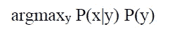

P(x|y)被称为**翻译模型**,它使用并行数据来模拟单词和短语应该如何翻译。并行数据的一个例子是成对的人工翻译的德语-英语句子。P(x|y)被进一步分解成 P(x，a|y ),其中 a 是单词对齐，即源句子 x 和目标句子 y 之间的单词级和短语级对应

P(y)被称为**语言模型**,它使用单语数据来模拟在一种语言中生成字符串的概率。语言模型是一个函数，它对从词汇序列中提取的字符串进行概率度量。给定长度为 n 的字符串 y，我们可以将语言模型概率 P(y)推导为:

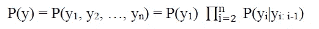

然而，给定一个词的整个历史来计算它的概率是低效的，我们可以通过使用 n-gram 模型来近似它。在 n-gram 模型中，它作出马尔可夫假设，即 yᵢ将只依赖于前面的 n-1 个单词。

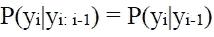

二元模型示例

为了计算 argmax，我们可以枚举每个可能的翻译 y 并计算概率，然而，这在计算上是昂贵的。因此，它使用解码，一种启发式搜索算法，通过删除低概率的假设来搜索最佳翻译。这是 SMT 工作原理的一个简要概述。最好的 SMT 系统极其复杂，许多重要的细节没有在这里讨论。SMT 的开发既昂贵又耗时，因为它需要大量的功能工程和人力来维护。[4]

# 神经机器翻译

深度神经网络已经在各种应用中实现了最先进的性能。沿着使用神经网络进行 SMT 的研究路线，神经机器翻译(NMT)成为主要的研究领域。它使用单个端到端神经网络架构，称为序列到序列(seq2seq ),涉及两个 RNN:编码器 RNN 和解码器 RNN。编码器 RNN 将使用一个编码向量对源序列进行汇总，解码器 RNN 将根据先前的编码向量生成目标句子。seq2seq 模型是一个条件语言模型，**直接计算 P(y|x)** ，因为解码器 RNN 是通过对源句子 x 进行条件化来预测目标句子 y 的下一个单词，seq2seq 模型还可以用于许多其他自然语言处理任务，如摘要、对话聊天机器人等。

## 序列间(Seq2Seq)

在如图 2 所示的标准 seq2seq 中，编码器 RNN(蓝色块)分析源语言中的输入句子，并使用称为隐藏状态向量的历史向量对输入序列进行编码。最后的隐藏状态或编码向量被传递给解码器 RNN(红色块)作为初始隐藏状态。解码器初始隐藏状态与源语句的<eos>一起将生成一个隐藏状态，然后传递给线性层。</eos>

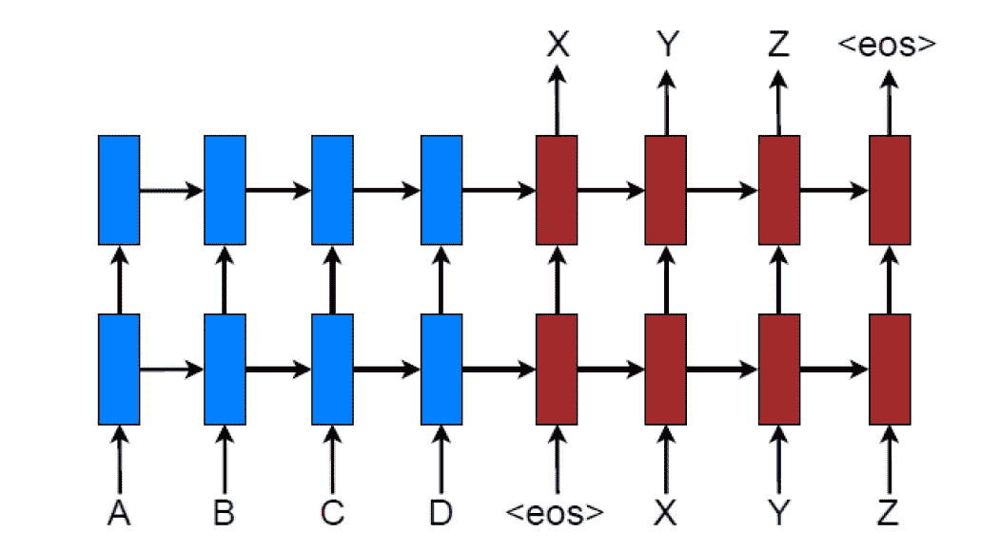

图 2:NMT——一个将序列 A B C D 翻译成 X Y Z 的堆叠 RNN seq2seq 模型<eos>是句尾。[2]</eos>

Softmax 后面的线性层将输出目标语言的整个词汇的概率分布。根据该概率分布，它将选择具有最高概率的记号作为第一个字，即 X，并且它将被用作解码的第二输入。来自前一步骤的第二隐藏状态和第一生成的字 X 将被输入到解码器 RNN 的第二步骤。并且将重复相同的过程，直到它产生一个<eos>令牌。从解码器 RNN 生成的令牌序列将是 seq2seq 模型的结果。[1]</eos>

与 SMT 相比，NMT 的优势在于它具有更好的性能，并且需要更少的人力。但是，它的可解释性较差，很难调试，也很难控制。

## Seq2Seq 注意

如前所述，在标准 seq2seq 模型中，编码器 RNN 的最后隐藏状态被用作解码器 RNN 的初始状态，这意味着关于源句子的所有信息将被编码为单个向量，并且它是来自源句子的唯一信息来解码目标句子。因此，编码器 RNN 的最后一个隐藏状态可以成为**信息瓶颈**，因为它必须仅用一个向量来捕获关于源句子的所有信息。注意机制已经被用来解决这个问题，在翻译过程中有选择地关注源句子的部分。核心思想是，在解码器的每一步，它都使用与编码器的直接连接来获得源序列的加权关注。图 3 展示了如何将注意力层添加到一个普通的 seq2seq 模型中。在解码过程中的每个时间步长 t，注意力层将导出捕获相关源序列信息的上下文向量 cₜ，以帮助预测当前目标词 yₜ.

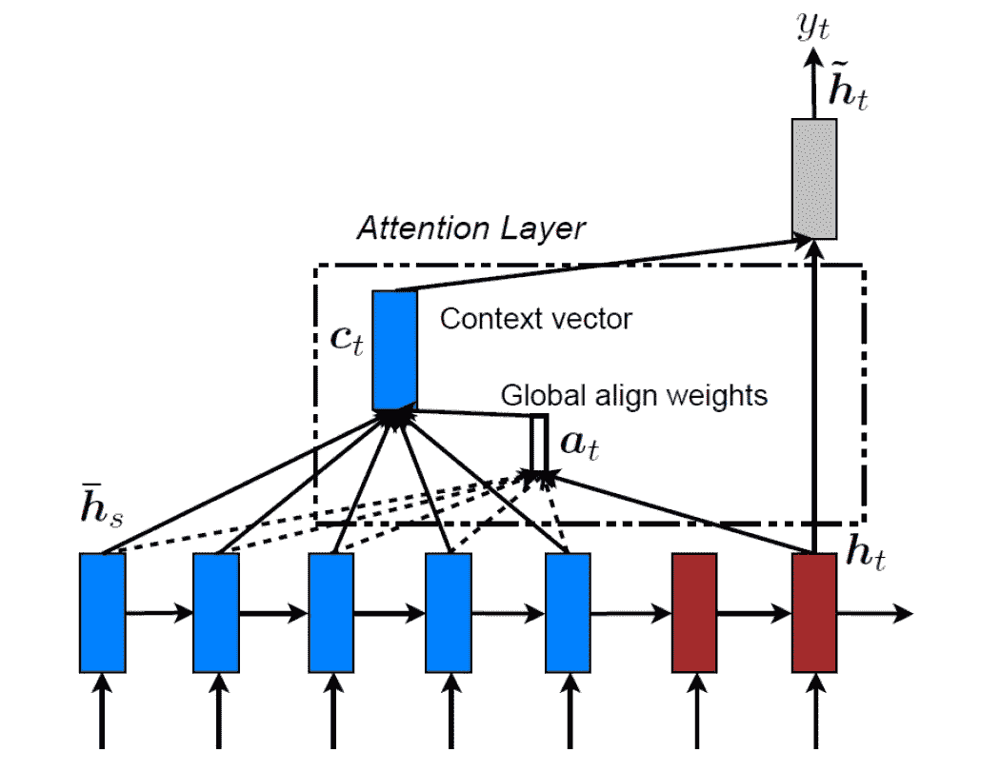

图 3:带有注意机制的 seq2seq。[2]

注意力分布 aₜ是通过使用当前目标隐藏状态 hₜ和编码器ℎ̅ₛ.的所有隐藏状态来计算的为了获得注意力分布，它将首先计算注意力分数，然后应用 Softmax 将分数转换为概率分布。有三种不同的方法来计算注意力分数:

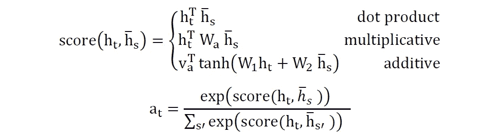

通过使用这个对准向量 aₜ作为权重，可以将上下文向量 cₜ计算为所有编码器隐藏状态的加权平均值。上下文向量或注意力输出将主要包含来自获得高注意力分数的编码器的隐藏状态的信息。该上下文向量然后将与解码器的隐藏状态连接，解码器的隐藏状态然后将选择具有最高概率的目标语言标记，如在普通 seq2seq 模型中一样。有时，来自前一步骤的上下文向量可用于与通常的解码器输入一起馈入解码器。

**注意机制**显著地**提高了 NMT 的表现**，并成为 NLP 研究的关键数学结构。注意，目标序列中的每个单词只需要找到它与源序列中的几个单词的匹配。它以某种方式解决了 RNN 中的长期依赖性的限制，即目标序列中的任何单词都可以与源序列中的所有单词进行通信。此外，注意力机制提供了一些可解释性，因为网络被训练来自己学习软对齐，并且我们可以通过检查注意力分布来看到解码器正在关注什么。

在机器翻译任务中仍然存在许多困难，例如词汇表之外的问题、训练和测试数据之间的领域不匹配、在长序列上维护上下文、标签数据不太可用的低资源语言对。

## 变压器

基于具有注意力的最佳性能 seq2seq 模型，论文《注意力是你所需要的全部》在 2017 年提出了一种新的架构，称为 Transformer，如图 4 所示。主要思想是基本上只使用注意力作为表示学习，因为在之前的 seq2seq 注意力模型中，证明了编码器和解码器之间的注意力在 NMT 中是至关重要的。

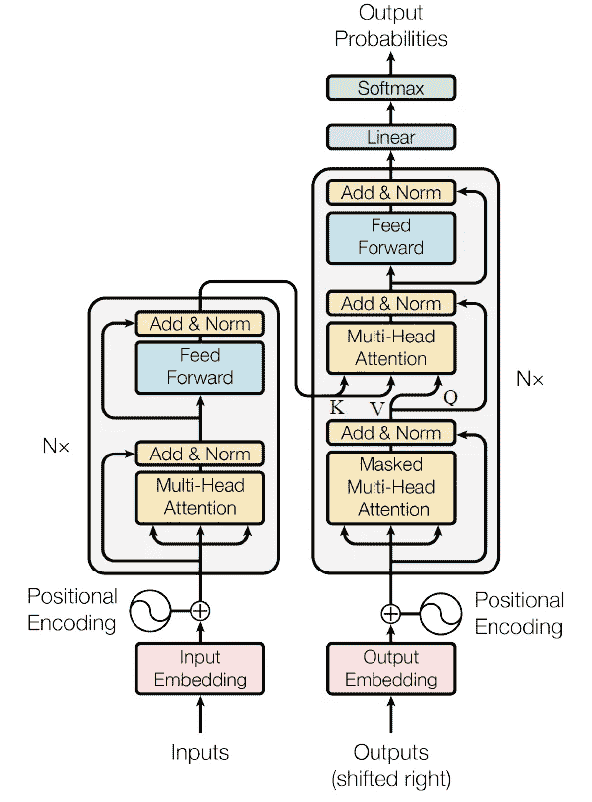

图 4:变压器模型架构，左侧模块是编码器，右侧模块是解码器。[3]

我将从《变形金刚》中用于表征学习的自我关注的主要概念开始。考虑 Q，K，V 是单词嵌入向量。q 矩阵(查询)是序列中一个单词的向量表示，K 矩阵(键)是序列中所有单词的向量表示，V 矩阵(值)是序列中所有单词的向量表示。

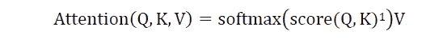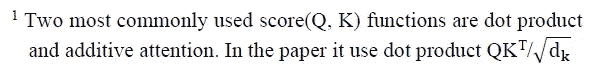

代替使用单个注意函数，该论文提出使用“多头注意”来线性地投射具有不同可学习权重的 Q、K、V h 次。这提供了多个表示子空间，并允许模型关注不同的位置。

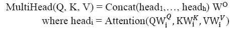

与 RNN 不同，《变形金刚》中的自我关注是**顺序不变的**，这意味着它不会捕捉序列信息。因此，添加了**“位置编码”**来使用正弦函数注入每个令牌的位置信息。这种解决方案提供了确定性的方法来合并序列信息，而不增加可学习参数的数量。

在 Transformer 编码器中，在注入位置编码后，编码器的输入嵌入将首先流经多头注意层，其输出随后将馈入前馈神经网络。在 Transformer 解码器中，有两个注意力层，称为掩蔽多头注意力和编码器-解码器注意力。通过屏蔽未来字，屏蔽多头解码器对先前生成的输出进行自我关注。编码器-解码器注意使用来自屏蔽多头的查询；编码器输出的键和值。通常，解码器输出将传递到线性层和 Softmax 函数，以获得目标令牌的概率分布。注意层和前馈层之间的每个子层具有残差连接(跳过连接),其后是层归一化，以改变输入，使每层具有均值 0 和 1。

Transformer 通过提供仅需要一次计算的成对并行化乘法交互(自关注),取代了以前的 seq2seq RNN 模型中使用的顺序计算。该架构是当前最先进的架构，提供了高性能和可解释性。

# 评估方法

评估机器翻译最常用的方法是双语评估替角(BLEU)。它将机器书面翻译与一个或几个人类书面翻译进行比较，并基于 n-gram(通常是 1、2、3 和 n-gram)精度计算相似性得分。BLEU 非常有用，大多数机器翻译系统都是用 BLEU 来评估的。然而，它并不完美，因为有各种方法来翻译一个句子。一个好的翻译可能会得到一个糟糕的 BLEU 分数，因为它与人类翻译的 n-gram 重叠很低。

# 参考

[1] K. Cho 等人，“使用统计机器翻译的 RNN 编码器-解码器学习短语表示”，em NLP 2014–2014 Conf .Empir。方法 Nat。郎。过程。继续。糖膏剂，第 1724–1734 页，2014 年。

[2] M. T. Luong、H. Pham 和 C. D. Manning，“基于注意力的神经机器翻译的有效方法”，计算语言学协会，2015 年。

[3] A. Vaswani 等人，“注意力是你所需要的一切”，2017 年。

[4] A. Garg 和 M. Agarwal，《机器翻译:一个文献综述》，2018 年。