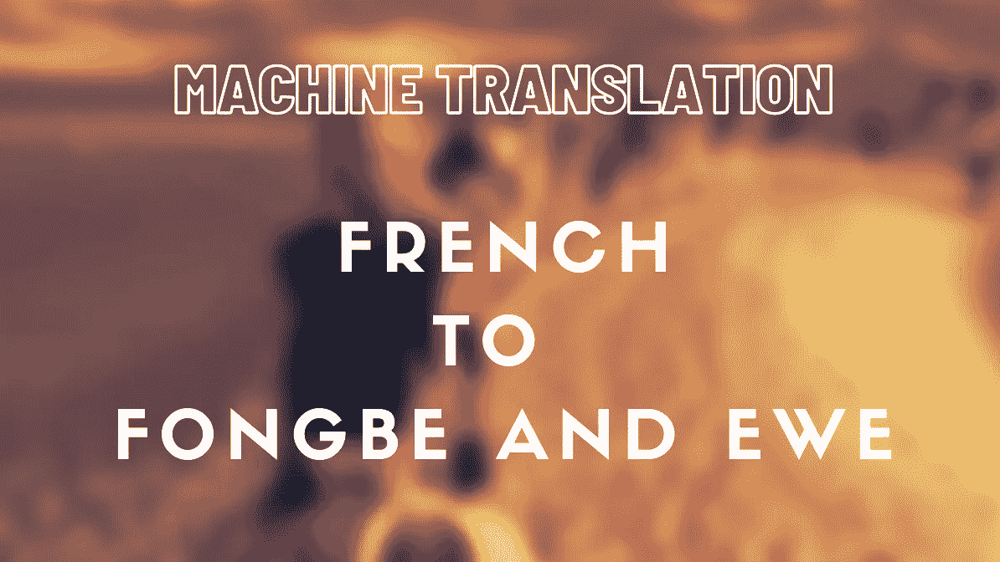
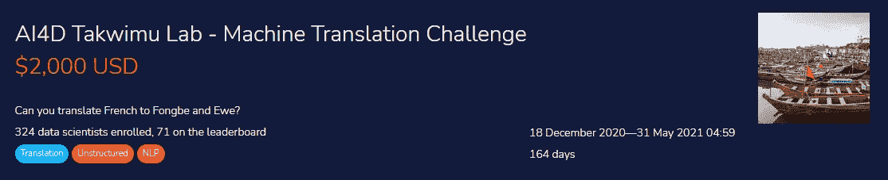
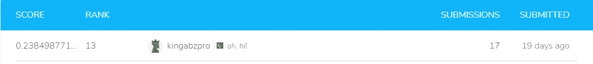

# 低资源语言的机器翻译

> 原文：<https://towardsdatascience.com/machine-translation-on-low-resource-languages-65cb268fcab1?source=collection_archive---------26----------------------->

MT 使用简单的变形金刚|图片由作者提供

## 在 Deepnote 平台上使用简单的 transformer 将法语翻译成 Ewe 和 Fongbe。

# 介绍

埃维语和丰贝语是尼日尔-刚果语，是通常被称为 gbe 的相关语言群的一部分。丰贝语是贝宁主要的 gbe 语言(约有 410 万人使用)，而埃维语在多哥和加纳东南部被约 450 万人作为第一语言使用，另有 100 万人作为第二语言使用。它们是密切相关的音调语言，并且都包含音调符号，这使得它们难以学习、理解和翻译。更多信息请访问[津迪](https://zindi.africa/competitions/ai4d-takwimu-lab-machine-translation-challenge)。

[津迪 MT 挑战赛](https://zindi.africa/competitions/ai4d-takwimu-lab-machine-translation-challenge/data)

# 目标

这项挑战的目标是创建一个能够将文本从法语转换成 Fongbe 语或 Ewe 语的机器翻译系统。我将使用相同的模型来训练和翻译这两个数据集，以缓解处理能力和内存问题。

# 简单变压器

这个库是基于 HuggingFace 的变形金刚库。简单的变压器让您快速训练和评估变压器模型。初始化模型、训练模型和评估模型只需要 3 行代码。更多信息请访问 [GitHub](https://github.com/ThilinaRajapakse/simpletransformers) Repo。

**支架**

*   序列分类
*   令牌分类(NER)
*   问题回答
*   语言模型微调
*   语言模型训练
*   语言生成
*   T5 型号
*   Seq2Seq 任务
*   多模态分类
*   对话式人工智能。
*   文本表示生成。

# 安装和加载库

# 数据

我只使用了 35k 样本，这样我的 GPU 就不会耗尽内存，并且我使用了未经预处理的原始数据。

清理功能在英语翻译中很有用，但在这种情况下，如果我们清理数据，结果会很差。所以，我们要把它关掉。

基于语言将训练和测试数据分成两个数据帧。

# 训练 Fongbe 模型

使用简单的 transformer seq2seq 我已经下载了在我们的情况下效果最好的`Helsinki-NLP/opus-mt-en-mul`，并使用特定的`Seq2SeqArgs`来设置模型的参数。

**自变量:**

*   数量 _ 训练 _ 时期= 30
*   batch_size = 32
*   最大长度= 120
*   src_lang ="fr "
*   tgt_lang ="fon "
*   覆盖输出目录=真

## 培训/评估分割

## 争论

我尝试了多种模型的论证，并产生了最好的可能，给我们更好的结果。

## 初始化模型

## 评估指标

## 培训模式

## 单一预测

该模型运行准确。

## 预测成形试验数据并保存

## 将模型保存到模型中

# 训练母羊模型

使用简单的 transformer seq2seq 我已经下载了在我们的情况下效果最好的`Helsinki-NLP/opus-mt-en-mul`，并使用特定的`Seq2SeqArgs`来设置模型的参数。

**论据:**

*   数量 _ 训练 _ 时期= 30
*   batch_size = 32
*   最大长度= 120
*   src_lang ="fr "
*   tgt_lang ="ewe "
*   覆盖输出目录=真

## 模型参数

我尝试了多种模型的论证，并产生了最好的可能，给我们更好的结果。

## 初始化 Ewe 模型

## 培训模式

## 预测和保存 cv

## 保存模型

# 加入两个机器翻译预测翻译

# 创建提交文件

# **排行榜**

本次比赛的误差指标是 [Rouge Score](https://pypi.org/project/rouge-score/) ，ROUGE-N (N-gram)评分(Rouge1)，报告 F-measure。

[Zindi 排行榜](https://zindi.africa/competitions/ai4d-takwimu-lab-machine-translation-challenge/leaderboard)

# 最后的想法

由于谷歌翻译和其他巨头使翻译变得完美，机器翻译在 NLP 的世界中被低估了，但他们没有提供所有的语言，一些低资源语言甚至没有做到。这是一个有趣的旅程，因为我开始使用 seq2seq 模型关注变形金刚，然后偶然发现赫尔辛基 NLP 语言模型。我有内存和 GPU 的问题，即使这样，我也没有提高我的分数，因为在处理大量数据时有许多限制。在花了一个月的时间后，我偶然发现了简单的变形金刚，这些变形金刚是为了让微调变得简单和容易。最后，我对结果感到满意，同时使用有效和快速的方法有效地训练和预测来自非洲的低资源语言。

**代码可用在**[**GitHub**](https://github.com/kingabzpro/French-to-Fongbe-and-Ewe-MT)**和**[**Deepnote**](https://deepnote.com/publish/e019ab02-6596-4ab8-a99f-fb27d5d7445f)**上。**