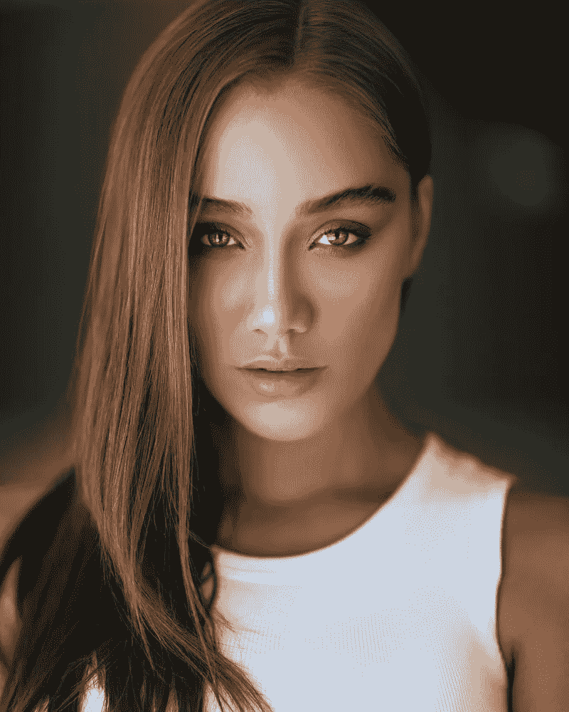
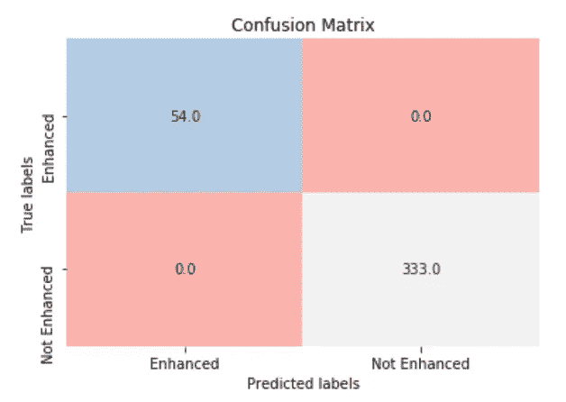
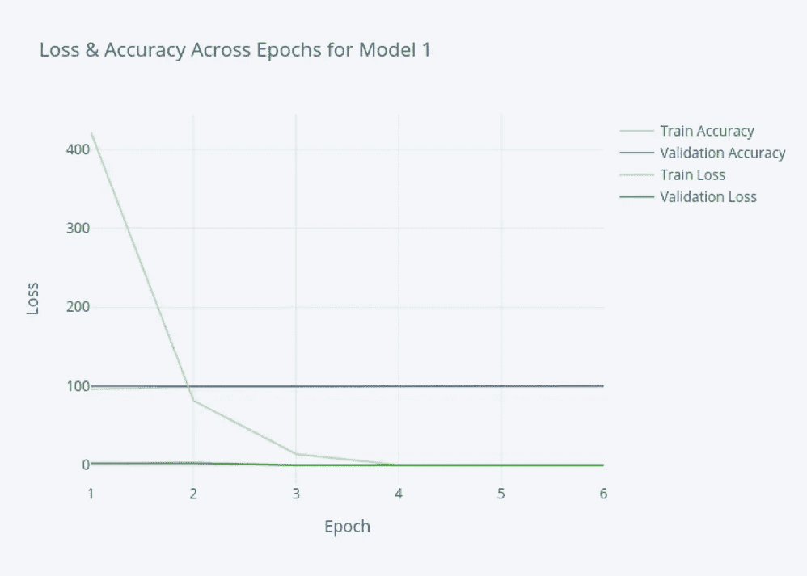
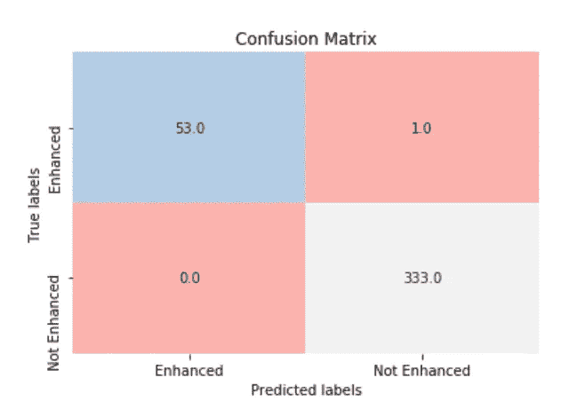
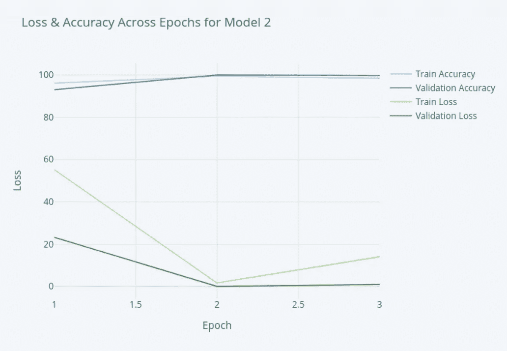
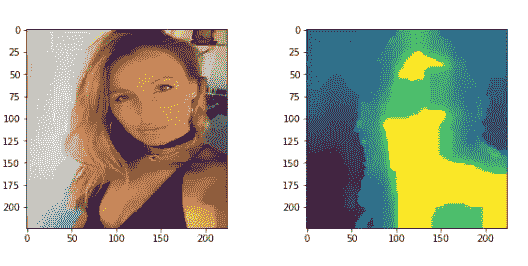

# 用于面部增强识别的机器视觉

> 原文：<https://towardsdatascience.com/machine-vision-for-facial-enhancement-recognition-52c26b807065?source=collection_archive---------36----------------------->

## 案例研究

## [Github 储存库此处](https://github.com/akleinbort/FacialEnhancementRecognition)

图片由诺扬·纳姆达通过 Unsplash 提供—【https://unsplash.com/photos/dUtizJyby4E 

## 问题陈述

在当今技术驱动的世界，知道一张脸是否经过数字增强可能很困难，这产生了一系列问题，从假新闻到社交媒体引发的精神疾病。在这里，我们开发了一个分类模型来预测一张脸是否经过了数字增强，是否经过了修饰、面部替换(如鼻子、眼睛等)。)或整形编辑(即矫正牙齿、改变鼻子大小等。).

## 行动纲要

**数据**

非 PS 过的人脸图像是从 [FEI 人脸数据库](https://fei.edu.br/~cet/facedatabase.html)中获得的，它包括 1400 张图片(100 个人，一半是女性，一半是男性)。同一个人的不同图像包含在每个建模集(训练、验证或测试)中。

为了包含不同类型的增强，PS 过的人脸图像是从几个数据集编译而来的。第一个数据集是[真假人脸检测数据](https://www.kaggle.com/ciplab/real-and-fake-face-detection/data)，其中人脸是使用来自几个人脸的单个片段构建的(被标记为“容易识别是 PS 过的”的人脸被排除在外)。接下来，我们加入了谷歌搜索 Facetune 的图片，因为这是社交媒体上有影响力的人以及一些名人使用的最受欢迎的面部编辑应用程序。这两个 PS 过的人脸集合总共有 791 张图片，每张图片都是独一无二的。

这给了我们 63%的基线准确度。

所有图像都被标准化并重新调整为 224 x 224，我们注意到数据集的包容性水平可以提高，特别是对于非二进制的人。

**模型和结果**

开发卷积神经网络(CNN)来进行这种分类。我们能够通过消除池层的存在实现 100%的准确性，代价是创建一个缓慢的模型。反过来，我们创建了第二个模型，其中合并了一个池层。速度提高了 6 倍，准确率达到 99%。

使用原始模型，我们测试了 RGB 和灰度，以确保 CNN 不仅仅依赖于颜色和光线，而是依赖于面部的形状。这是必要的，因为数据集不包括使用 studio lightning 的非增强图像(这些图像无法大量找到)。再次达到 100%的准确性，表明该模型可能受益于颜色，但不依赖于颜色。

# CNN 模型和评估

**模型 1 评估**

模型 1 是百分之百准确的。如前所述，我们排除了池层。背后的原因是“皮肤模糊”效应(几乎总是出现在增强的面部)和合并图层都是平均像素，削弱了这种类型的面部编辑的存在。

下面，我们可以看到在训练过程中损失和准确性如何波动。我们还看到了测试集的混淆矩阵。

作者图片—【https://chart-studio.plotly.com/~ambar132/1/? share _ key = uyspthgbhuc 9 o 672 crozt #/

这个混淆矩阵是使用测试集构建的，其中来自增强数据集的个体数量是来自非增强数据集的两倍。它看起来不平衡，因为这仍然产生了很多未增强的个人照片，但所有图像的基线是 63%。在未来，我们的目标是在建立模型之前，使用计算方法来解释阶级的不平衡。

## 模型 2 评估

这里，我们有一个 99%准确的模型，有 1 个假阴性。这个精度还是很不错的，而模型快了 6 倍。

作者图片—【https://chart-studio.plotly.com/~ambar132/3/? share _ key = mg riz 4 ymmbfb r5 tnalfvpz #/

## 黑白测试结果

我们用灰度重建了模型 1，得到了同样的结果。这表明，虽然该模型可以从 RGB 通道中提取不同的特征，但它们对于成功的分类并不是必需的。如果我们想在浓妆艳抹或工作室灯光的图片上使用该模型，这一点尤为重要。

## 显著性检查

显著性是指图像中哪些像素突出。在这里，我们有一个简单的显著性图，以探索模型可能获得的重要特征。最突出的是皮肤，证实了合并层的排除是相关的。

图片作者—灵感来自[真假人脸检测数据](https://www.kaggle.com/ciplab/real-and-fake-face-detection/data)

随着时间的推移，我们可以绘制我们的模型在每一层检测到的显著性，正如我们在结论和未来方向一节中讨论的那样。

## 结论和未来方向

我们的两个模型都可以预测一张脸是否已经成功地进行了数字增强。模型 1 以 100%的准确度做到了这一点，并且在彩色或黑白中，二进制交叉熵损失实际上为 0。这一点很重要，因为未经增强的面部图片的颜色由于缺少工作室照明而不太明亮，但情况可能并不总是如此。模型 2 达到了 99%的准确率，由于采用了池层，速度提高了 6 倍。这些百分比远远高于 63%的基线。我们可以部署这些模型中的任何一个来检测涉及将某人的脸放在照片上的假新闻，或者让社交媒体用户能够检查谁编辑了他们的照片。

在未来，我们希望使数据集多样化，使其对非二进制人群更具包容性，并进一步严格解决数据中的阶级不平衡问题。我们的目标还包括其他类型的面部改善，如整形手术，以及由 GANs 创造的面部。

此外，更多的时间将允许我们探索每一层的显著性图，并确定每张图片的哪些区域在被编辑时突出。这可能用于跟踪对哪些图片进行了哪些编辑。