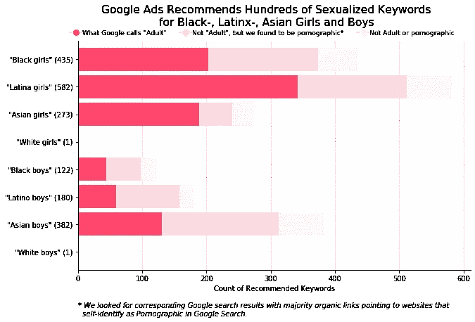
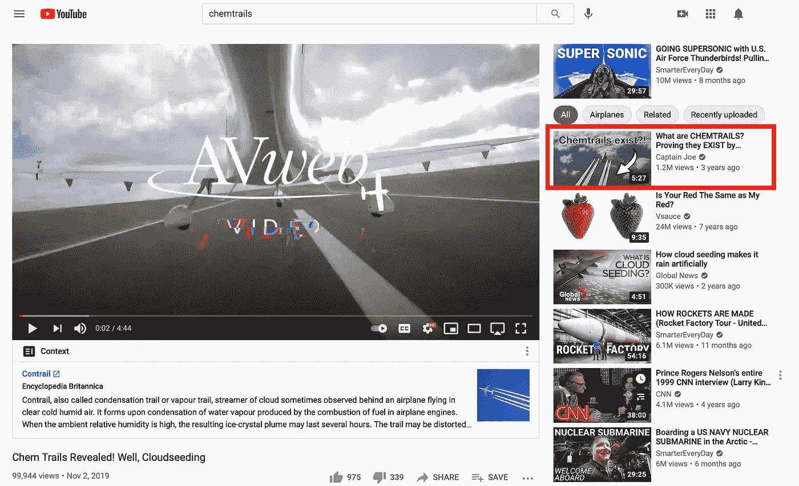

# 机器行为不端:62 项科学研究显示大型科技公司的算法如何危害公众

> 原文：<https://towardsdatascience.com/machines-misbehaving-62-scientific-studies-showing-how-big-techs-algorithms-can-harm-the-public-e27e584d291c?source=collection_archive---------34----------------------->

## 是时候创建一个“算法 FDA”了吗？

[李中清](https://unsplash.com/@picsbyjameslee?utm_source=unsplash&utm_medium=referral&utm_content=creditCopyText)在 [Unsplash](https://unsplash.com/?utm_source=unsplash&utm_medium=referral&utm_content=creditCopyText) 上拍照

在美国，目前没有联邦机构保护公众免受有害算法的影响。

我们可以购买鸡蛋，接种疫苗，并在高速公路上行驶，因为我们知道有保护我们安全的系统:[美国农业部](https://en.wikipedia.org/wiki/United_States_Department_of_Agriculture)检查我们的鸡蛋中的沙门氏菌,[美国食品和药物管理局](https://en.wikipedia.org/wiki/Food_and_Drug_Administration)检查疫苗的安全性和有效性, [NHTSA](https://en.wikipedia.org/wiki/National_Highway_Traffic_Safety_Administration) 确保高速公路转弯平稳平缓。

但是当我们在谷歌上搜索或者在亚马逊上查找一个产品的时候呢？我们对这些系统背后的算法的安全性了解多少？虽然一些[管辖区正在寻求监督](https://www.wired.com/story/new-york-city-proposes-regulating-algorithms-hiring/)，但如果你愿意的话，算法仍然没有 [FDA。](https://heinonline.org/HOL/LandingPage?handle=hein.journals/admin69&div=7&id=&page=)

> 如果你愿意的话，没有“算法的 FDA”。

为了帮助说明为什么这如此令人不安，我最近对 62 项研究进行了文献综述，这些研究揭示了大型科技公司的算法系统如何对公众造成一系列伤害，如谷歌搜索中的[掠夺性广告](https://ojs.aaai.org/index.php/ICWSM/article/view/7276)或亚马逊上推荐的[误导性健康产品](https://www.seattletimes.com/business/amazon/amazon-algorithms-promote-vaccine-misinformation-uw-study-says/)。虽然政府机构尚未实施监管，但研究人员和记者已经做了惊人的工作来收集算法危害的经验证据。

随着算法系统渗透到我们更多的数字生活中，这些“算法审计”只会变得更加重要。

在这篇博文中，我解释了我通过文献综述发现的四种主要的算法危害([这里是完整的预印本](https://jackbandy.com/files/algorithm-audits-review-cscw2021.pdf)，如果你喜欢的话):

*   **歧视，**就像亚马逊筛选简历的算法系统[歧视女性](https://www.reuters.com/article/us-amazon-com-jobs-automation-insight/amazon-scraps-secret-ai-recruiting-tool-that-showed-bias-against-women-idUSKCN1MK08G)。
*   **扭曲，**就像亚马逊的搜索算法[如何为疫苗相关的搜索查询推广误导性的健康产品](https://www.seattletimes.com/business/amazon/amazon-algorithms-promote-vaccine-misinformation-uw-study-says/)。
*   **利用，**像谷歌的广告系统[利用关于药物滥用的敏感信息进行定向广告](https://www.forbes.com/sites/edstacey/2020/02/20/can-ai-ever-treat-all-people-equally/)。
*   **误判**，就像脸书的人工智能[错误地停止了小企业的广告活动](https://www.bloomberg.com/news/articles/2020-12-21/facebook-s-small-advertisers-say-they-re-hurt-by-ai-lockouts)。

要证明这些问题在算法中是如何体现的，不是一件容易的事情。当一个算法只需要按字母顺序对联系人列表进行排序，或者在 excel 电子表格中添加一列时，就有一个“正确”的答案，可以很容易地检查该算法是否有效。

但是今天的技术背后的算法通常没有“正确”的答案。想想为你推荐 YouTube 视频的算法，或者建议你应该在谷歌新闻上阅读哪些文章的算法。这些“主观决策者”可能会带来各种各样的危害(用泽内普·图费克奇的话说)，而且没有单一的正确答案来检查算法是否“正确”，更不用说安全有效了。在我回顾的研究中，研究人员应用了各种不同的“安全检查”来审计面向公众的算法。

# 区分的算法

社会问题体现在算法中。虽然越来越多的人，包括亚历山大·奥卡西奥-科尔特斯这样的立法者，现在认识到算法系统如何加剧歧视等问题，但这一想法获得关注需要 T2 做很多工作。一些研究对实现这一目标尤为重要。

## 算法歧视的早期证据

文献综述中最早、最具形成性的两项研究聚焦于谷歌搜索算法中的歧视。在[2013 年发表的一项研究](https://dl.acm.org/doi/10.1145/2460276.2460278)， [Latanya Sweeney](https://twitter.com/LatanyaSweeney) 测试了在搜索黑人名字和白人名字时出现的广告。一个模式很快出现了:犯罪报告广告出现在黑人名字的搜索结果中(在报纸上，搜索“拉坦亚·斯威尼”会返回一个广告说“拉坦亚·斯威尼被捕了？”)

但是相比之下，搜索像“克里斯汀”这样听起来像白人的名字，并没有提到逮捕、犯罪记录或诸如此类的事情。

同年，Latanya Sweeney 发表了她的[报告](https://dl.acm.org/doi/10.1145/2460276.2460278)， [Safiya Noble](https://twitter.com/safiyanoble) 发表了另一篇关于谷歌搜索歧视的[开创性研究](http://ivc.lib.rochester.edu/google-search-hyper-visibility-as-a-means-of-rendering-black-women-and-girls-invisible/)。在她的优秀著作《压迫的算法》中，诺布尔描述了她在 2010 年研究的起源，当时她正在网上搜索她继女和侄女可能感兴趣的东西。谷歌的搜索结果令人震惊，十大搜索结果中有五个是色情化的。

在 2013 年的研究中，诺布尔简要解释了为什么搜索结果中的歧视如此具有影响力:

> “在搜索中不能忽视在线种族差异，因为它是信息通信技术激增的组织逻辑的一部分，互联网既在复制社会关系，也在我们参与的基础上创造新的关系形式” [*(萨菲亚·诺布尔，2013)*](http://ivc.lib.rochester.edu/google-search-hyper-visibility-as-a-means-of-rendering-black-women-and-girls-invisible/)

许多技术专家认为这种问题是可以解决的小故障。但是在她的书 [*科技之后的竞赛*](https://bookshop.org/books/race-after-technology-abolitionist-tools-for-the-new-jim-code/9781509526406) 中，Ruha Benjamin 指出小故障既不是小问题也不是容易解决的——它们总是指向更大的系统问题。持续的证据支持本杰明:诺布尔发表她的结果七年后，[标记显示](https://themarkup.org/google-the-giant/2020/07/23/google-advertising-keywords-black-girls)谷歌仍然在他们的广告平台上犯同样惊人的错误。下面是他们对谷歌“关键词规划”功能的调查图表:

作者使用来自标记的[数据和代码生成的图像](https://github.com/the-markup/investigation-google-keyword-planner/blob/master/notebooks/1-analysis.ipynb)

## 计算机视觉及其他

算法歧视的另一项基础研究是由 Joy Buolamwini 和 Timnit Gebru 进行的开创性的“性别差异”审计。这项研究揭示了微软和 IBM 制造的面部分析工具的差异:浅色皮肤的男性通常能被正确识别，而深色皮肤的女性则不能。Buolamwini 和 Inioluwa Deborah Raji 在进行的后续研究[发现了其他几个商业系统的性能差异，但也发现一些系统正在改进。](https://dl.acm.org/doi/abs/10.1145/3306618.3314244)

在我阅读的文献中，这些早期的审计为正在进行的检查算法歧视的工作奠定了基础并点燃了火花。最近，在 2020 年发表的[份审计报告中，研究人员](https://ojs.aaai.org/index.php/ICWSM/article/view/7276)[约书亚·阿斯普兰](https://www.joshasplund.com)、[莫塔黑尔·埃斯拉米](http://motahhare.com)、[哈里·孙达拉姆](http://sundaram.cs.illinois.edu/index.html)、[克里斯蒂安·桑德维格](http://www-personal.umich.edu/~csandvig/)和[凯瑞·卡拉哈利斯](http://social.cs.uiuc.edu/people/kkarahal.html)发现，模仿白种人会导致浏览互联网时出现更多与住房相关的广告，而模仿非裔美国人会导致更多掠夺性的租赁-拥有程序的广告。

随着美国就业焦虑的加剧，公众也应该关注招聘算法中的歧视。在 2019 年的一项研究中，玛利亚·德·阿尔蒂加和其他人在就业分类系统中发现了显著的性别差距。同样研究性别歧视的还有，[沙欣·杰姆·格伊克](http://www.cs.rpi.edu/~geyiks/)、[斯图尔特·安布勒](http://www.zulazon.com)和[克里希纳拉姆·肯塔帕迪](http://www-cs-students.stanford.edu/~kngk/)展示了一种[方法](https://dl.acm.org/doi/10.1145/3292500.3330691)来提高 LinkedIn 人才搜索系统上的性别比例。

所有这些惊人的工作仍然只是触及表面:文献综述确定了 21 项探索歧视的研究——肯定有一些我错过了！如果您有兴趣了解更多信息，请查看[全文](https://jackbandy.com/files/algorithm-audits-review-cscw2021.pdf)和/或[歧视审计列表](https://github.com/comp-journalism/list-of-algorithm-audits)。

# 扭曲的算法

许多算法审计引用了一项研究,表明 39%的未决定投票者会将他们的投票行为转移到搜索结果中喜欢的候选人身上。因此，如果 100 名尚未做出决定的选民搜索候选人托纳德·德拉姆普，而搜索结果支持德拉姆普，那么大约 39 名选民可能也会支持德拉姆普。这种现象是*失真*的一个例子，这是算法审计研究的另一个焦点，突出了算法的把关能力。

刚刚描述的“[搜索引擎操纵效应](https://www.pnas.org/content/112/33/E4512?)”(由 Robert Epstein 和 [Ronald E. Robertson](https://ronaldedwardrobertson.com) 研究)已经导致许多审计检查搜索引擎是否有党派倾向。这是一个复杂的问题，没有简单的“是或不是”的答案，尤其是因为“党派偏见”是如此难以衡量。以下是关于这个主题的三项重要研究:

*   罗纳德·e·罗伯逊(Ronald E. Robertson)和其他人在 2018 年进行的一项研究发现，谷歌上的新闻条目略微左倾，但“谷歌的排名算法使(搜索引擎结果页面)的平均倾斜度略微向右移动。”
*   斯坦福大学研究人员在 2018 年中期进行的一项[研究](https://dl.acm.org/doi/abs/10.1145/3359231)观察到，民主党人和共和党人之间的来源党派分布“几乎没有差异”。
*   我的同事 Daniel Trielli 和我的顾问 Nick Diakopoulos 进行的另一项研究发现“头条新闻”栏确实有更多来自左倾来源的文章，但这反映了互联网的整体趋势(基于一个名为 GDELT 的大型新闻数据库)。

## 回声室

党派扭曲只是研究人员一直在探索的许多不同类型中的一种。扭曲也是我给那些专注于“回音室”或“过滤气泡”的研究贴上的标签，据称这些研究只给人们提供他们想看的内容。如同党派之争一样，过滤器泡沫现象的经验证据有限。 [证据](https://journals.sagepub.com/doi/abs/10.1177/1461444817724170)实际上表明，互联网用户在算法平台上看到了更多样化的信息来源。算法*确实*个性化你的在线体验，只是没有到制造泡沫的程度。

Aniko Hannak 和他的同事进行的早期个性化审计显示，平均只有 11.7%的搜索结果是个性化的，像“小工具”和“地点”这样的搜索更容易出现个性化 Hannak、 [Chloe Kliman-Silver](https://twitter.com/chklimansilver) 和其他人的[后来研究表明，大多数个性化是位置的结果。我的实验室](https://dl.acm.org/doi/abs/10.1145/2815675.2815714)最近的一项研究[发现，即使用户使用不同的党派术语进行搜索(例如“beto orourke pros”与“lies by beto orourke”)，谷歌也会产生主流化效应，并显示出相似、一致的结果。](https://www.tandfonline.com/doi/abs/10.1080/1369118X.2020.1764605)

但是主流化也意味着算法系统可以将注意力集中到一小部分来源上，正如我们在对苹果新闻的研究中发现的那样。这在导致来源排除时尤其成问题，例如，[最近由](https://www.washingtonpost.com/politics/2020/12/22/how-google-is-hurting-local-news/) [Sean Fischer](https://seanfischer.me/) 、 [Kokil Jaidka](https://kokiljaidka.wordpress.com) 和 [Yphtach Lelkes](https://www.ylelkes.com) 进行的审计发现，谷歌经常将本地新闻排除在结果之外。据彭妮·缪斯·阿伯纳西(Penny Muse Abernathy)的研究显示，通过分流本地新闻业的流量，谷歌可能会导致本地新闻业的危机以及“新闻沙漠”在美国的蔓延。

## 误报

最后一种扭曲与低质量媒体有关，如虚假信息、垃圾新闻或其他投机内容。(如今，“假新闻”这个词已经没什么用处了，因为它被政客、阴谋家和极端分子借用了)。[由](https://ojs.aaai.org/index.php/ICWSM/article/view/3360) [Rediet Abebe](https://www.cs.cornell.edu/~red/) 领导的一项审计发现，对艾滋病毒/艾滋病的搜索结果可能暗示“自然疗法”，而这些疗法已被证明无效甚至有害。

研究人员还在 YouTube 上发现了[错误信息兔子洞，尽管一些类似“化学痕迹”的兔子洞似乎已经得到解决。在 YouTube 上快速搜索，搜索结果和推荐都指向带有事实解释的视频:](https://dl.acm.org/doi/10.1145/3392854)

作者截图，灵感来自[侯赛因等人](https://dl.acm.org/doi/10.1145/3392854)

总的来说，文献综述包括 29 项集中于失真的审计，所以这只是一个抽样。完整的列表在这里是，包括一些新增加的内容，这些内容没有在[的论文](https://jackbandy.com/files/algorithm-audits-review-cscw2021.pdf)中，因为它们还没有发表。

# 利用的算法

“大型科技公司从你的数据中获利”的说法最近变得越来越流行，一些审计关注于这将如何发展。大多数公共对话集中在侵入性的数据收集上，事实上，研究表明了为什么公众应该被打扰。在由胡塞·贡萨雷斯·卡巴尼亚斯领导的一项研究中，研究人员发现脸书的解释具有误导性，并且掩盖了脸书是如何利用敏感属性进行定向广告的。由阿米特·达塔领导的另一项研究在谷歌上发现了类似的案例。

第二种类型的利用包括为算法系统产生信息的劳动。例如，[一项研究](https://ojs.aaai.org/index.php/ICWSM/article/view/14883)表明，如果没有来自维基百科、推特和 StackOverflow 等网站的用户生成内容，谷歌的搜索引擎将无法正常工作。由我的同事 [Nick Vincent](https://www.nickmvincent.com/#/) 领导的一项[后续研究](https://ojs.aaai.org/index.php/ICWSM/article/view/3248)发现，通过自愿劳动创造的维基百科内容出现在 81%的趋势搜索结果页面中，以及 90%的关于“死刑”或“巴以冲突”等热门争议的搜索结果页面中这项研究还发现，谷歌严重依赖新闻媒体获得搜索结果，尽管谷歌仍然没有向出版商支付有意义的费用。

这种利用是将[数据视为劳动力](http://radicalmarkets.com/chapters/data-as-labor/)并考虑平台如何补偿为其算法系统提供燃料的劳动力的基本概念。例如，利用人们数据的利润，[一个平台可以资助公共产品](https://www.datadividends.org)如公园、WiFi 和基础设施，或者简单地给每个用户开一张支票，[就像勇敢的浏览器所做的那样](https://basicattentiontoken.org)。

# 判断错误的算法

误判不同于其他类型的行为，是一个广泛的元范畴。在文献综述中，我建议未来的审计尽量关注更具体的有问题的行为，以尽可能清楚地说明算法的风险和危害。尽管如此，还是有一些关于一般“误判”的有趣研究值得一提。

一种重要的误判经常发生在广告平台上，如果你曾经疑惑过，你可能对此很熟悉，*我到底为什么会看到这个广告？*事实证明，算法系统经常为定向广告推断出错误的兴趣或错误的人口统计属性。[由](https://dl.acm.org/doi/abs/10.1145/3308558.3313666) [Giridhari Venkatadri](https://www.khoury.northeastern.edu/people/giridhari-venkatadri/) 领导的一项 2019 年研究发现，Epsilon 和 Experian 等平台上约 40%的目标属性“根本不准确”一个明显的例子是，一些被推断为公司高管的用户实际上是失业的。

这些错误可以被解释为潜在的“数字广告泡沫”的证据，作者 Tim Hwang 最近将其描述为“次贷注意力危机”简而言之(没有双关语的意思)，如果广告商知道 40%的目标特征“根本不准确”，他们可能不会为目标广告支付那么多钱。

# 结论

新技术总是给公众带来新的风险，通过[这篇文献综述](https://jackbandy.com/files/algorithm-audits-review-cscw2021.pdf)，我发现了 62 项研究([并且还在统计](https://github.com/comp-journalism/list-of-algorithm-audits/))强调了为谷歌、亚马逊、脸书和其他大型科技平台提供动力的算法的风险。从歧视，到扭曲，到剥削，到误判，研究人员已经表明，算法系统可以而且确实会伤害公众，不仅仅是在科幻情节或象牙塔假设中，而是在我们的现实世界中。

> 算法系统可能并且确实会伤害公众，不仅仅是在科幻情节中，而是在我们的现实世界中

这是坏消息。

好消息是，用阿兰达蒂·洛伊的话来说，“另一个世界不仅是可能的，她正在来的路上。”我们可以通过用户、研究人员、记者和其他利益相关者的合作来扭转局面。我们可以设计、建造和使用服务于公共利益的系统，而不仅仅是公司利益。

还有许多工作要做，道路上还有许多障碍，但是我们可以一起与我们的技术建立更好的关系。