# MADE —用于分布估计的屏蔽自动编码器

> 原文：<https://towardsdatascience.com/made-masked-autoencoder-for-distribution-estimation-fc95aaca8467?source=collection_archive---------10----------------------->

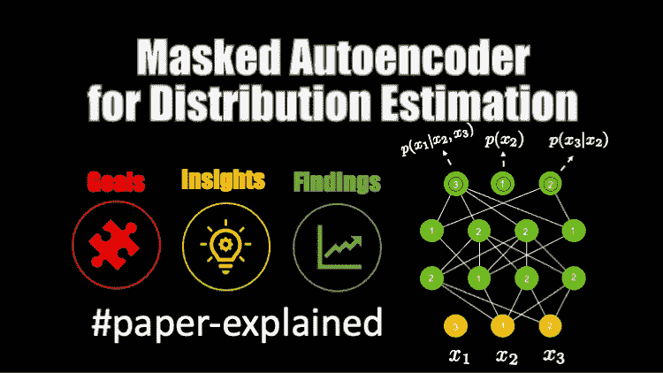

来源:作者

本文对 Mathieu Germain 等人在 2015 年[的论文中提出的一种技术进行了深入的解释。这里描述的技术现在用于现代分布估计算法，如掩蔽的](https://arxiv.org/abs/1502.03509)[自回归正态流](https://arxiv.org/abs/1705.07057)和[逆自回归正态流](https://arxiv.org/abs/1606.04934)。

**注意——我也有一个 YouTube 视频解释这个算法(如果你喜欢看&听)——**

制作的 YouTube 视频

# 目标/背景/解决的问题

很高层次的目标可以从论文本身的标题中理解，即设计一种技术来进行分布估计。

分布或密度估计是机器学习中最重要的领域之一，因为它有助于我们理解数据集的潜在统计属性，也使生成模型成为可能。

密度估计的方法通常分为以下几类

*   **参数化方法**。这些方法为你的观察假设一个概率分布，然后寻找它的参数。例如，如果假设的概率分布是正态分布，那么该方法将找到𝞵和𝝈.
*   **非参数方法**。这些方法并不假设您的观测值具有已知的概率分布，而是将其建模为经验分布。经验分布本质上对于每个数据点都有一个核函数。

本文中描述的技术是一种用于密度估计的参数方法，并且依赖自动编码器作为实现目标的设置。

也就是说，任何密度估计技术的主要挑战都来自数据集的维度。 ***维数灾难*** 有时会使密度估计的问题变得棘手，并且解决方案的性能(估计的精度和速度)通常很差。

## 为什么选择 Autoencoder？

我先解释一下“**为什么是神经网络？**”。如前所述，测试时间(部署时间)内的密度估计速度对于实际应用非常重要。神经网络的现代公式支持矢量化和加速器的使用，这有助于在测试期间达到临界速度要求。

自动编码器是一种在无监督设置中使用的神经网络(即，不需要地面实况/标签，实际上密度估计任务没有标签)，其工作是重新创建输入，同时学习数据的低维潜在表示。然后，这种潜在表示被用于许多应用中，例如特征提取和异常检测。

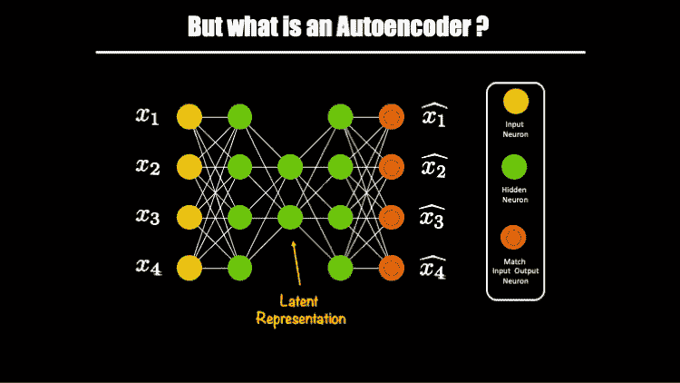

来源:作者

因此，自动编码器的主要目标是学习潜在表示，并通过限制隐藏层(潜在表示隐藏层)中神经元的数量(小于输入维度)来迫使神经网络这样做。

> 这是自动编码器学习潜在表示的唯一方式吗？

有一些其他的方法来约束自动编码器(把这种约束想象成“扭转手臂”或“强迫”)来学习一个适当的表示。

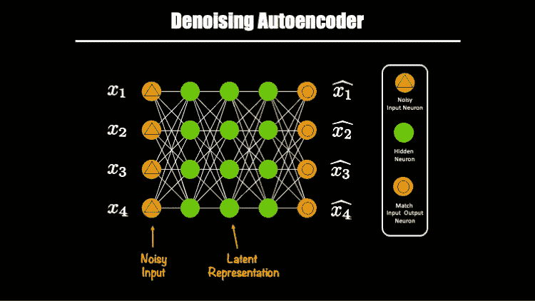

来源:作者

上面显示了一个自动编码器去噪的例子。在这里，噪声被添加到输入神经元，以约束(“扭曲”)网络来学习适当的表示。请注意，潜在表征在维度上与输入神经元的大小相同，但它可以更小或更大！

# 伟大的想法

> 可以限制自动编码器输出输入向量分量的概率分布吗？

下面是我们的自动编码器的样子:

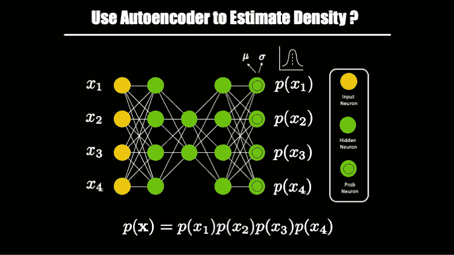

来源:作者

本质上，我们将让输出神经元预测我们假设的(组分的)分布参数。

但是上面的公式对组件之间的独立性做了非常强的假设😟。如果组件有条件依赖怎么办？下面是一个公式的样子:

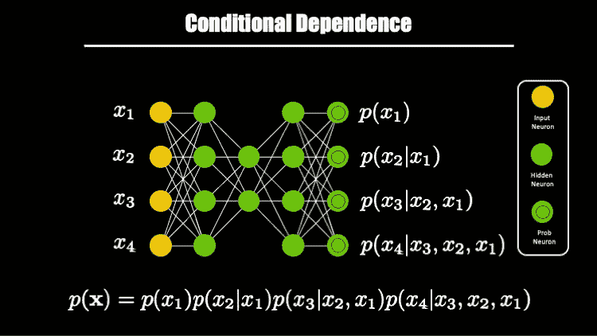

来源:作者

也就是说，我们不知道这是不是我们的输入向量的条件依赖！这里，分量 x1、x2、x3 和 x4 是任意选取的。本质上，这是你的特征向量，x1，x2 等只是列名。你可以选择任何顺序！

这意味着条件依赖可能是这样的:

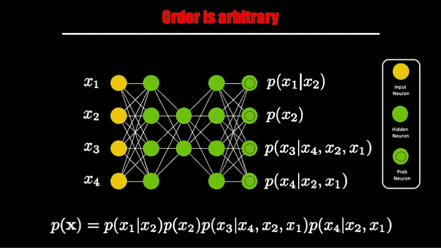

来源:作者

因此，我们在设置中发现的第一个问题是，我们不知道组件是如何条件依赖的，第二个问题是，所有神经元都是相互连接的(这是一个完全连接的前馈神经网络！).

***为什么全连接设置会有问题？*** 如果有一分钟我们假设条件依赖是上图所示，那么从神经元 x4 到 x2 的激活流&输出是不正确的，其他神经元也是如此。简而言之，连通性应该尊重条件依赖。另一种说法是——过去不应该看到未来！

以下是我们使用 Autoencoder 的解决方案的细化目标:

来源:作者

## 屏蔽自动编码器

一种约束方法是确保“自回归”特性得到尊重。这里的自回归意味着给定一个条件依赖假设，过去不应该看到未来。这篇论文是这样描述的:

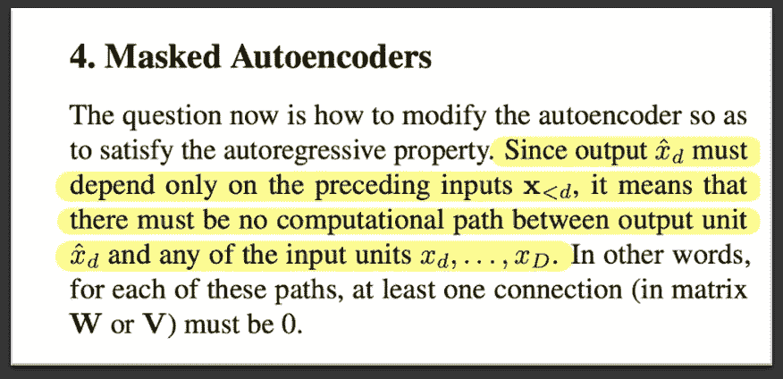

来源:从报纸上剪下

这意味着我们必须根据条件依赖假设丢弃一些连接。也就是说，连接的断开或丢弃应该以逻辑的方式进行，即如果条件依赖性改变，我们应该能够恢复连接。这种连接的逻辑丢弃是在掩码的帮助下完成的，因此得名**掩码自动编码器**。

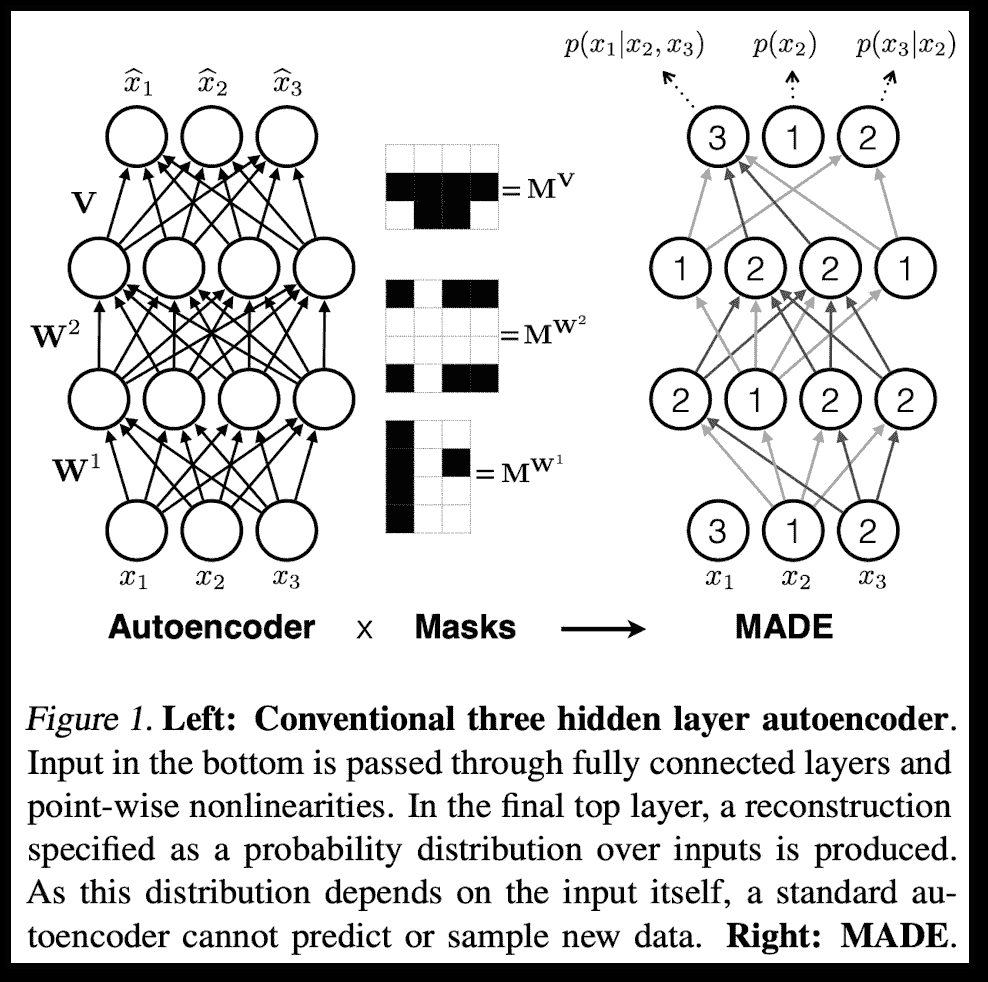

来源:从报纸上剪下

# 它是如何工作的？

现在我将描述训练过程背后的机制。请记住，我们需要让我们的设置不知道维度的顺序，因为我们根本不知道输入向量的组件之间的条件依赖的顺序。

此外，我们必须找到一种动态创建掩码的方法，以便在给定的条件依赖设置中丢弃神经元之间的连接。

## 如何处理「未知」的条件依赖？

这个问题的答案来自于 [Uria 等人](https://arxiv.org/abs/1306.0186)的一篇论文，他们在论文中也对自回归模型进行了实验。他们的发现表明，尝试输入向量的所有可能的排序是有益的。

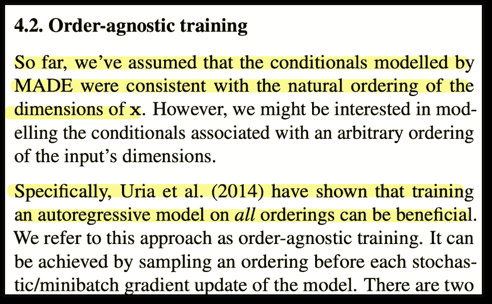

来源:从报纸上剪下

你要注意的是，这里没有多个网络。对于输入向量的每一种可能的排序，你都有一个专用的网络。那么这是如何实现的呢？🤔

对于所有可能的排序，自动编码器网络(以及其学习的参数)保持不变。这个概念有一个名字，叫做**摊余推断。**请注意，这篇文章没有使用这个术语，因为它是在这篇文章发表一年后才流行起来的！本质上，神经网络的参数是以处理不同阶输入向量的方式学习的。

也就是说，处理太多的排列不是小事，尤其是当输入向量是高维的时候。此外，这种类型的约束(“扭臂”)即改变网络的每个迷你批次的顺序，这种约束太大，以至于很难学习！。手臂会扭曲到折断。在机器学习中，我们会说我们正在做过度正则化&因此会欠拟合！

作为补救措施，本文建议我们应该选择某些排序，然后在整个培训中循环使用。这将是超参数，即哪些排序和多少？

上面的图片/剪辑显示了[x1，x2，x3]分别标记为[3，1，2]的顺序，其他层也是类似的情况。

## 如何创建这些面具？

这些掩码有 2 组规则，用 2 个等式表示。第一个等式决定了除倒数第二层和最后一层之间的连接之外的所有层之间的连接。

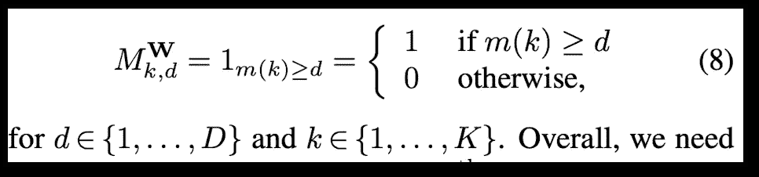

来源:从报纸上剪下

它仅仅说明一层中的神经元应该接收来自前一层中标记为相同或更低的神经元的连接。在这种情况下，掩码将为 1，否则为零。

对于倒数第二层和最后一层之间的连接，情况稍有不同，并且由以下等式控制:

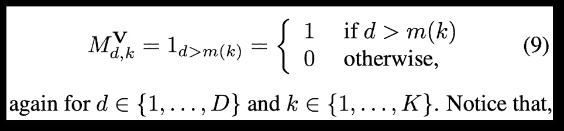

来源:从报纸上剪下

唯一的区别是，最后一层中的神经元只接受来自标记低于它的神经元的连接。

使用我创建的图像查看神经元之间的连接(注意标签)(我更喜欢我的神经网络从左到右😛)

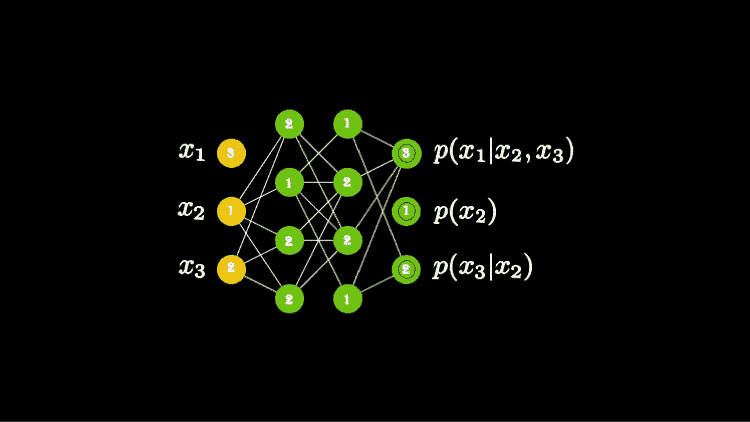

来源:作者

还要注意，输入层中标记为 3 的神经元没有连接到下一层中的任何神经元，因为它是 3 维输入向量的最高可能标签/编号。同样，请注意，输出层中标记为 1 的神经元没有连接，因为它是分配给向量中某个分量的最低可能标签。

事情就是这样解决的。这是一个连接的小动画。

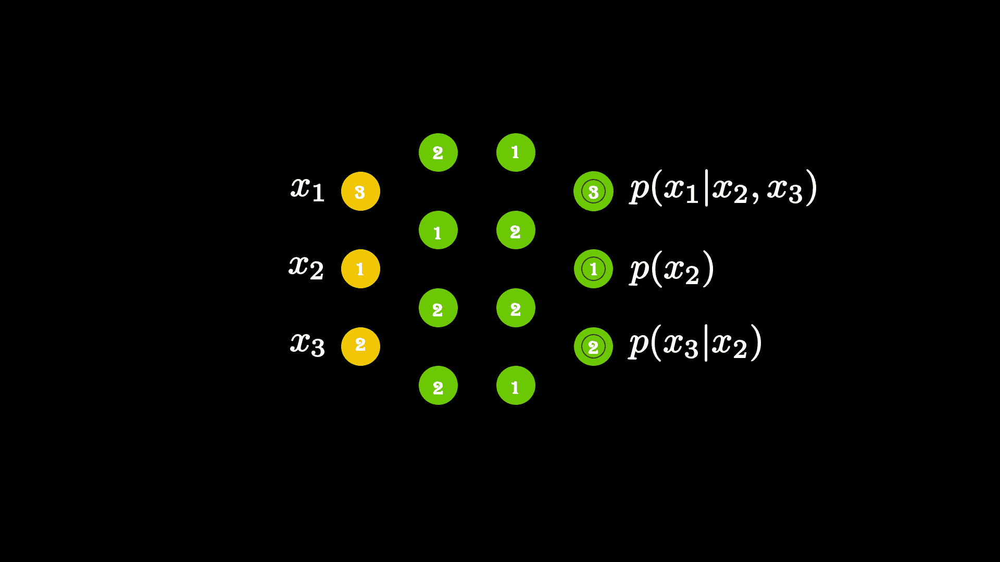

来源:作者

# 关键见解摘要

*   使用 Autoencoder 输出输入向量分量的“条件”概率分布。
*   屏蔽自动编码器中的连接以实现条件依赖。
*   对每个迷你批次的输入组件的排序进行采样，以便相对于条件依赖是不可知的。
*   在测试期间对订单进行抽样。这导致模型的集合。平均所有模型的预测值。
*   每个迷你批次的采样顺序可能会导致过度正则化和欠拟合，因此可以有一个固定的掩码列表。这可能是一个超参数！

# 结论和后续步骤

这是一篇写得很好的论文。我非常喜欢读它，真的很佩服作者的创新思维。

更重要的是，正如我在介绍中提到的，MADE 现在被用作现代基于规范化流的算法的一个组件，因此理解它现在比以前更加重要。

本文提供了多种实现方式。请参见下面参考资料中的链接。

如果你有问题或疑问，请写在评论中，我会提供必要的澄清和/或根据需要更新文章。

祝你学习顺利！

# 参考

[1]制造:用于分布估计的屏蔽自动编码器[https://arxiv.org/abs/1502.03509](https://arxiv.org/abs/1502.03509)

[2] RNADE:实值神经自回归密度估计器【https://arxiv.org/abs/1306.0186 

[3]用于密度估计的掩蔽自回归流[https://arxiv.org/abs/1705.07057](https://arxiv.org/abs/1705.07057)

[4]用逆自回归流改进变分推断【https://arxiv.org/abs/1606.04934 

[5][https://papers with code . com/paper/made-masked-auto encoder-for-distribution](https://paperswithcode.com/paper/made-masked-autoencoder-for-distribution)