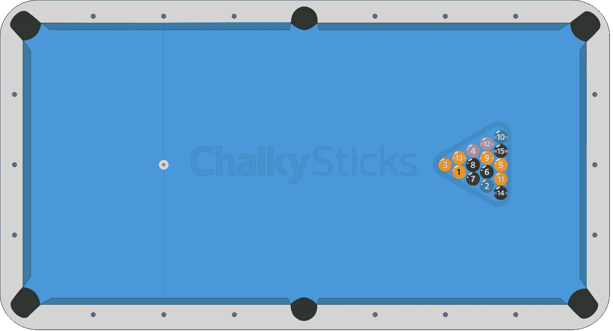
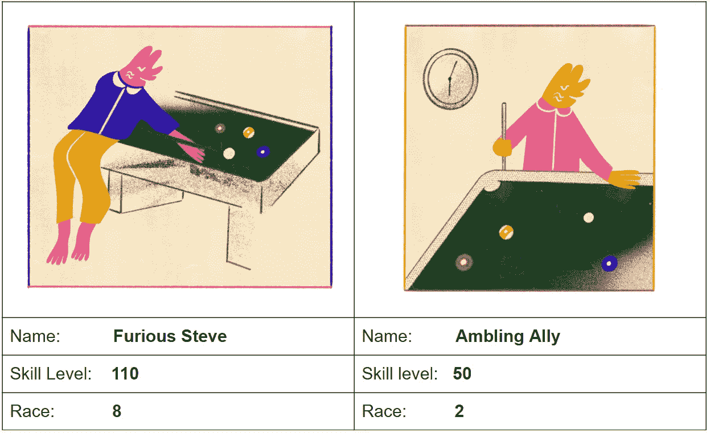
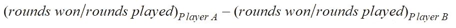
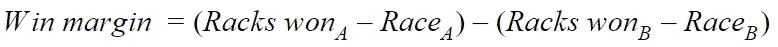
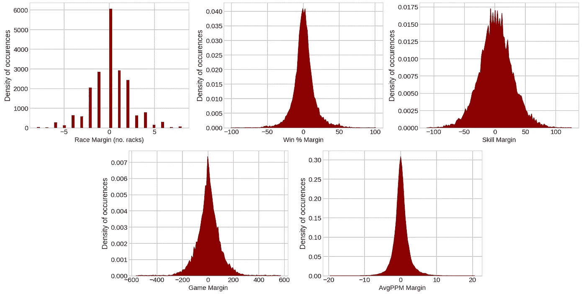
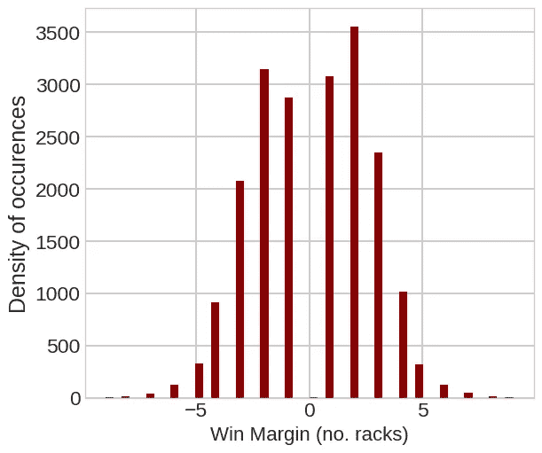
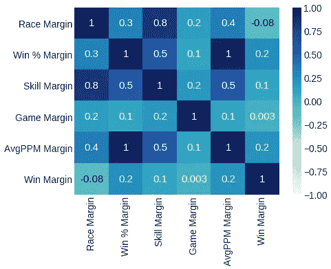
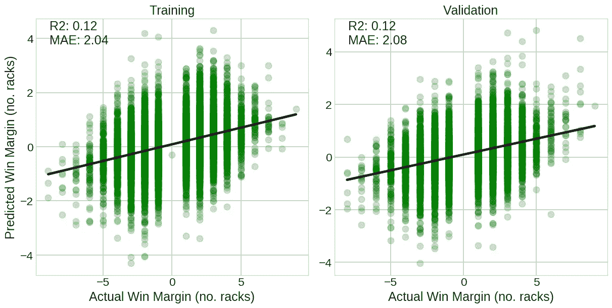
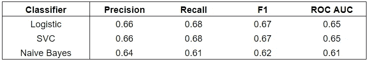
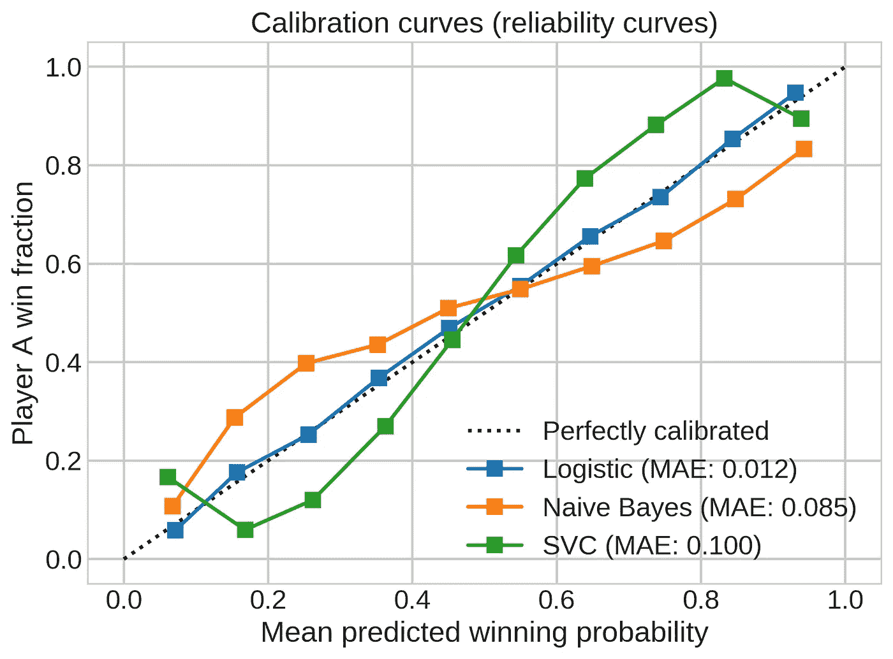

# 魔术 8 球:一个应用程序，以最大限度地赢得竞争池比赛(第一部分)

> 原文：<https://towardsdatascience.com/magic-8-ball-an-app-to-maximize-wins-in-competitive-pool-matches-part-1-e1d302b5507c?source=collection_archive---------28----------------------->

## **机器学习和 SQL 如何帮助你在连续团队游戏中智胜对手**

图片经由 instagram.com/stevenfritters[授权给卡勒姆·安东内尔](https://www.instagram.com/stevenfritters/)。

作为一个具有光学物理背景的台球爱好者，我经常想知道我模拟激光束路径的经验是否提高了我对准台球击球的能力，或者相反！

新冠肺炎的封锁恰逢我的职业生涯从光学物理转向数据科学，也是联赛的中断。虽然我不能去台球厅玩我喜欢的游戏，但我花了很多时间思考数据如何指导台球厅游戏的策略。

许多国家台球联盟保存有详细记录的球员统计数据和过去比赛的记录，为建立预测模型提供了理想的资源。在 [Insight 数据科学奖学金](https://insightfellows.com/data-science)期间，我学会了如何使用 Python 中的 Flask 将机器学习模型集成到用户友好的 web 应用程序中。所以，我想知道:Flask 和机器学习的强大组合能否用于创建一个个人台球教练？

在这个由三部分组成的系列中，我将描述我是如何开发 **Magic8Ball 台球**的，这是一个帮助你的台球队最大化其获胜机会的应用程序。

*   在你现在正在阅读的**第一部分**中，我将更详细地介绍这个问题，并展示机器学习如何应用于预测台球游戏的结果。
*   在第 2 部分 中，我将展示 SQL 查询如何帮助改进玩家选择策略。
*   在 [**第 3 部分**](/magic-8-ball-an-app-to-maximize-wins-in-competitive-pool-matches-part-3-d724fdd65d9) 中，对应用的性能进行统计评估，并与现实策略进行比较。

# **泳池问题**

台球，或称口袋台球，是一系列游戏的名称，这些游戏都有一个共同的目标，就是用球杆将球打入洞中。游戏在台球桌上进行，这是一个布覆盖的矩形表面，有 6 个洞或口袋。在业余水平上，最常玩的台球版本是八球，以至于短语“一场台球游戏”是八球游戏的同义词。

在八球游戏中，桌子上有 16 个球:

*   编号为 1-7 的 7 种纯色。
*   编号为 9-15 的 7 种条纹颜色。
*   实心白色母球。
*   实心黑色 8 号球。

纯色和条纹是两种不同的套装；每个玩家被分配到一套衣服(取决于第一个装入口袋的球)，并试图在装入 8 个球之前将所有 7 个球装入他们的衣服，以赢得胜利。

8 球池设置。使用[https://pad.chalkysticks.com/.](https://pad.chalkysticks.com/.)生成的图像

个人池是一个技术技能和战略在平等措施的游戏。可能出现的不同击球情况的数量基本上是无限的，并且有丰富的学术文献描述了为台球游戏建模的[人工智能方法](https://www.sciencedirect.com/science/article/pii/S000437020700077X)。

在*的团队组合*中，一种全新的策略出现了:选择玩家阵容。台球队由一群玩家/朋友组成，他们定期聚集在一起，在一个嬉戏的竞争环境中释放一些蒸汽。各队为赢得最多的分数而战，以在当地联赛中名列前茅。任何队长都会急切地告诉你，台面下的决定*和台面上的决定*一样重要。比赛的胜负完全取决于队长们明智(或愚蠢)的阵容选择。

表现最好的团队将获得现金奖励和参加在拉斯维加斯/新奥尔良举行的全国业余锦标赛——这是一个主要的激励因素！此外，新的和临时的玩家可以与经验丰富的特级大师在同一个联盟中竞争(有公平的获胜机会),这要归功于有效促进包容性的平等差点系统(稍后将详细介绍)。考虑到这些因素，这些游戏的比赛结果可能出人意料地不可预测。

## **开始之前的一些池术语和定义:**

**-团队:**一组 5-8 名联营池玩家。

**-队长:**负责选择每轮游戏中哪些玩家上场的玩家。

**-技能等级:**由联盟运营商分配给玩家的数字，用来描述他们的游戏能力。在每次匹配结果后由 [Elo 算法](https://en.wikipedia.org/wiki/Elo_rating_system)重新计算。

**-回合:**两个对立队的球员之间的单挑。

**-比赛:**一个台球队对另一个台球队的比赛。最常见的情况是，一个队的五名选定选手与对方队的五名选定选手比赛，每个选定选手只打一次。每一轮的分数被计算出来，产生总的比赛分数。即使总的比赛结果已经用数学方法决定，也要打完所有五个回合。

**- Rack:** 一场台球比赛，从开球开始，到 8 号球沉入水中结束。每个玩家必须赢得一定数量的机架才能赢得这轮游戏。

**-比赛:**赢得一轮比赛所需的架子数。这个数字或比赛对每个玩家来说是不一样的，并且是通过使用差点算法使用玩家的技能水平来计算的。

**-阵容:**详细列出每轮入选球员的最终名单。注意配对的顺序不影响结果。

## **比赛规则**

在两个队开始比赛之前，掷硬币，获胜的队长决定哪一队在第一轮中先选择一名队员。在第一轮比赛后，队长轮流首先选择一名球员，即比赛选择事件可以按如下方式展开:

*   A 队选择一名球员进行第一轮比赛。
*   B 队选择一名球员进行第一轮比赛。
*   B 队选出一名球员进行第二轮比赛。
*   A 队选出一名选手参加第二轮比赛。
*   …等等。直到所有回合结束。

## **均衡差点**

尽管队长非常了解他们球员的能力，但决策过程却被均衡差点严重影响。让我们通过一个示例玩家配对来解释这是如何工作的，这将有助于将您刚刚读到的一些术语和定义放入上下文中:

图片经由 instagram.com/stevenfritters[授权给卡勒姆·安东内尔](https://www.instagram.com/stevenfritters/)。

愤怒的史蒂夫技能等级为 110，这意味着他是一个顶级的业余选手。与此同时 Ambling Ally 只是在这里度过了一段美好的时光，他们 50 的技能水平反映了他们并没有把游戏看得太重的事实。均等差点使比赛场地变得平坦，因此如果这两个人在一个回合中彼此面对，每个人将有大约 50%的机会获胜。它本质上是一个转换公式，以玩家的技能水平作为输入，并产生每个玩家的比赛长度。在我参加的联盟中，Steve 需要 8 个架子才能赢得这一轮，而 Ally 只需要赢 2 个。然而，这并不是一个完美的系统，因为影响比赛结果的因素不仅仅是玩家的技能水平(例如[破旧的装备](https://i.redd.it/eif4d54wzsj41.jpg))。

大多数联盟都会记录每一场比赛，包括球员的技术水平、比赛长度和最终得分——这对战略家来说是个福音。

## 解决方案

在这篇文章中，我将描述如何将一个简单的机器学习模型应用于这些数据，以创建一个可以指导玩家选择的应用程序，并最大化我们团队在利润丰厚的拉斯维加斯之旅中的机会。

对于有数学倾向的读者来说，这是一个*竞争性子集选择*的例子，这个话题已经在[严谨的](https://www.sciencedirect.com/science/article/pii/0166218X9290250E) [细节](https://www.sciencedirect.com/science/article/pii/S0166218X1000394X)中探讨过了。

**图 1:**magic 8 ball 台球 app 示意图。球队的详细信息被加载到一个预测模型中，该模型为所有可能的阵容生成一个获胜概率列表。这些都存储在一个数据库中，在每一轮结束后查询该数据库，以返回该轮的最佳玩家选择。

**magic 8 ball 应用程序会通知用户每一轮的最佳选择。**

它由以下组件组成:

*   **预测模型**生成*一个玩家战胜另一个玩家的概率*。
*   **数据库**，包含*每个可能的玩家阵容* *排列*的预测比赛结果。
*   **玩家选择算法**引导用户*选择获胜概率最高的阵容排列*。
*   一个烧瓶应用程序，它在一个用户友好的界面中实现了上述所有功能。

图 1 显示了 Magic8Ball 应用程序的概况。在这个系列中，我将集中讨论最常见的 5 人球队的联赛形式。这意味着有 5 个！= 120 种可能的比赛阵容，其中一些*更有可能*导致一个队获胜。每个队列的结果由机器学习算法预测，并存储在 SQL 数据库中。在每一轮开始时，使用这些预测来计算最佳玩家选择。随着队长在随后的四轮比赛中选择球员进行对抗，剩下的评估阵容越来越少，比赛获胜的概率稳步增加。

## **为预测模型选择特征**

为了给给定回合提供有意义的玩家建议，我们需要一种定量比较不同玩家配对的方法。我们将使用来自[北美台球协会(NAPA)](https://www.napaleagues.com/) 的 20，000 个历史玩家配对的结果来构建一个预测模型。

要查看本节中使用的任何代码，请查看我的 GitHub 存储库中的[对应文件](https://github.com/cfodonnell/NAPA-Amateur-Pool/blob/master/models/model_selection.ipynb)。

NAPA 以易读的[表格格式](https://www.napaleagues.com/stats.php?playerSelected=Y&playerID=10061781&xTab=2)发布最新的比赛结果。比赛统计数据可以用**裕量**的形式表示，即从玩家 a 的统计数据值中减去玩家 B 的统计数据值。以下是每个完整回合可用的一些功能:

*   **比赛差额:**每个玩家赢得一轮比赛所需的架子数之差。
*   **获胜百分比差额:**每位玩家的历史回合获胜百分比之间的差异(来自之前的比赛):

*   **技能余量:**每个玩家技能等级的差异。
*   **游戏保证金:**每位玩家在 NAPA 会员资格期间所玩回合总数之差。
*   **平均每场比赛点数差额(AvgPPM 差额):**每位玩家每轮平均点数之间的差额。

最后，也是最重要的…

*   **赢面:**玩家 A 在当前回合中的赢面(以格子数计)。负值表示玩家 B 赢了这一轮。在等式中，玩家 A 的赢率由下式给出:

我们的目标是使用前五个特征来预测该玩家配对的**胜率**。

**图 2:**20000 场比赛数据集中球员统计数据的分布。比赛差额、获胜百分比差额、技能差额、游戏差额和 AvgPPM 差额变量可用于预测玩家配对的获胜差额(见下文)。

**图 3:** 数据集中 20，000 个匹配的 Win Margin 变量(以机架为单位)的直方图。

我们能从这些历史结果中得到什么启示？一个很好的起点是检查图 2 和图 3 中绘制的数据分布，并对数据集进行基本的相关性分析，以找出是否有任何变量表现出很强的关系。

**图 4:** 数据集中特征的皮尔逊相关系数矩阵。

图 4 显示了 20，000 轮历史数据集中每个特征的皮尔逊相关系数矩阵。一些观察结果立即凸显出来:

*   **Win %毛利**和 **AvgPPM 毛利**呈现完美的多重共线性！这很明显，因为赢了比输了会得到更多的分数。然而，这对于线性回归等模型来说不是好消息，因此我们需要在拟合模型之前删除其中一个特性。
*   在**技能差距**和**种族差距之间也有很高的相关系数。这是有意义的，因为比赛的差距是用玩家的技能等级来计算的。然而，[比赛计算器](https://www.napaleagues.com/naparaces/)不是一个连续的数学函数，所以这种相关性并不完美。**
*   我们只看到与目标特征**赢率**的弱相关性，对于**赢率百分比**，最高系数为 **0.2** 。虽然这对平衡障碍的设计者来说是个好消息，但对我们开发高度信息化模型的前景来说却是个不祥之兆。如果没有这个障碍，我们预计**技能水平**和**胜率之间会有更强的相关性。**

# **选择预测模型**

**我们希望训练一个模型，该模型使用比赛利润、游戏利润、获胜百分比利润、技能利润和 AvgPPM 利润变量来预测获胜利润变量的值。**

## 1.线性回归

由于每个特征近似正态分布，线性回归是一个合适的起始模型。利用线性回归模型和我们的特征，我们可以潜在地预测玩家在给定回合中可能获胜的幅度。

我们已经看到 **AvgPPM Margin** 变量是多余的，因为它与 **Win % Margin** 完全相关，我们还将删除**游戏 Margin** 变量，因为它的影响幅度很小。使用剩余的特征，数据被分成训练集和验证集。

我对训练数据进行了缩放，然后拟合了一个普通的最小二乘回归模型。使用验证数据集中预测值和实际值之间的**平均绝对误差(MAE)** 和**相关系数(R 的平方)**来量化性能。回归模型根据架子的数量来预测玩家 A 的获胜差额。

**图 5:** 散点图，显示 Win 余量(机架单位)的线性回归预测与实际值的比较。左窗格显示训练数据集的结果，右窗格显示验证数据集的结果。

训练和测试数据集的模型预测如图 5 所示。从这些散点图中，我们可以看到模型明显有很大的方差！每个预测的平均绝对误差约为 **2 个机架**，这是非常不明智的，因为在数据集中的所有结果中， **63%** 以 2 个机架或更少的差距胜出(见图 3)。所以，有了这个模型，我们就很有可能预测出不正确的赢家。不完全是那种你信任的自信的模型。

## 2.分类

考虑到我们到目前为止看到的嘈杂的数据，也许预测单个回合的胜率不是最有用或最实际的。取而代之的是，对个别回合将如何结束做出*概率预测*会更有用。通过衡量可能的玩家配对的获胜概率，我们可以对我们的玩家选择做出明智的战略决策。

我们可以通过创建一个**新的二元赢/输变量**并将我们的**回归问题**转化为**分类问题**来实现这一点。分类模型生成样本属于某个类别的概率，在我们的例子中，玩家 a 赢了或输了。如果预测的概率超过 0.5，我们可以期待赢，如果概率小于 0.5，我们可以期待输。大于零的赢率(玩家 A 赢了)被赋值为 1，而小于零的赢率(玩家 B 赢了)被赋值为 0。

在添加了二进制输赢功能后，我比较了三种预测玩家获胜的分类模型:逻辑回归、线性支持向量分类器(SVC)和朴素贝叶斯分类器。每个分类器的一些性能指标如下所示。

**表 1:** 预测玩家 a 输赢时每个分类器的精度、召回率、F1 和 ROC AUC 值

乍一看，逻辑和 SVC 分类器在区分玩家 a 的预测赢和预测输的能力方面似乎没有什么不同

然而，我们更感兴趣的是知道预测概率的**可靠性，而不是简单地测量预测概率导致正确输赢预测的次数。例如，在模型预测玩家 A 有 60%机会获胜的所有回合中，玩家 A 实际上有 60%的机会获胜吗？**

我们可以通过绘制[校准曲线](https://scikit-learn.org/stable/auto_examples/calibration/plot_calibration_curve.html)(也称为可靠性曲线)来测量。这使我们能够比较玩家 A 获胜的预测概率和玩家 A 的**实际获胜分数。**

图 6 中的数据点是通过将[0，1]概率区间离散成 10 个区间并测量该区间中包含的实际玩家 A 获胜的分数而产生的。

**图 6:** 针对三个分类器模型中的每一个，预测的获胜概率相对于实际获胜的分数绘制:逻辑回归(蓝色)、朴素贝叶斯(橙色)和线性 SVC(绿色)。由虚线表示的完全校准的模型将遵循 y=x 线。

我们可以看到，来自逻辑回归模型的概率预测几乎完美地校准到玩家 A 获胜的真实分数。虚线的平均绝对偏差为 **0.01** ，在概率范围内变化很小。这意味着我们可以确信，来自逻辑回归模型的概率预测是玩家将赢得给定回合的可能性的现实表示。然而，需要考虑的是[保序回归](https://en.wikipedia.org/wiki/Isotonic_regression)可以改善 SVC 和朴素贝叶斯模型的校准。

现在我们已经有了一个模型，它可以很好地用逻辑回归预测玩家获胜，在**第 2 部分**中，我们将看到这个逻辑回归模型如何实际应用于玩家选择决策！

[该项目的 Github 库。](https://github.com/cfodonnell/NAPA-Amateur-Pool/)

插图由才华横溢的[@ Steven writers](https://www.instagram.com/stevenfritters/)提供。