# 魔术 8 球:一个应用程序，以最大限度地赢得竞争池比赛(第二部分)

> 原文：<https://towardsdatascience.com/magic-8-ball-an-app-to-maximize-wins-in-competitive-pool-matches-part-2-eb9d4793f98f?source=collection_archive---------49----------------------->

## 机器学习和 SQL 如何帮助你在连续团队游戏中智胜对手

欢迎回到这个关于数据驱动池策略的三部分系列！

在[第 1 部分](/magic-8-ball-an-app-to-maximize-wins-in-competitive-pool-matches-part-1-e1d302b5507c)中，我们探索了竞技团队台球的古怪之处，并确定台球游戏的玩家阵容选择可以通过数据科学来改进。我们开发了一个分类模型，根据过去的结果预测一个玩家击败另一个玩家的概率。在这里，在这一部分，我们将更进一步， ***使用*** 这些预测来实际上 ***通知*** 策略来进行玩家选择。

[**第 1 部分:简介和预测建模。**](/magic-8-ball-an-app-to-maximize-wins-in-competitive-pool-matches-part-1-e1d302b5507c)

**第 2 部分:使用 SQL 制定战略。**

[**第三部分:“封装”测试！**](/magic-8-ball-an-app-to-maximize-wins-in-competitive-pool-matches-part-3-d724fdd65d9)

## **比赛获胜概率**

在上一篇文章中，我们开发了一个逻辑回归模型，它使用历史表现统计来预测一个玩家击败另一个玩家的概率。

虽然我们可以使用我们的模型来预测每个可能的玩家配对的获胜概率，但我们真正感兴趣的是**整体比赛获胜概率。**

回想一下，在一场比赛中有 5 个！= 120 种不同的可能排列组合；因此，*这些不同排列中的每一个将具有不同的相关匹配获胜概率*。

为了从最好到最差排列，我们需要计算每个配对排列的个体概率。

在这里，我们假设赢得整体比赛需要赢得五回合中的三回合**；所以，对于每一个阵容排列，我们需要计算出 ***至少三轮*的获胜概率。**最少三次获胜的所有概率之和可通过以下等式获得:**

**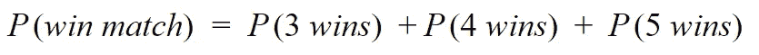**

**假设每轮获胜的*概率是独立的*，我们可以通过计算下面的表达式来计算上面等式右边的每一项:**

**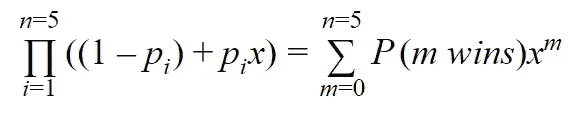**

**其中 *p_i* 是赢得回合 *i* 的概率。恰好赢 m 轮的概率由 *P(m 胜)*给出，即 *x^m* 的系数，其中 *x* 是虚拟变量。**

***例如*为了计算 *P(4 胜)*我们展开表达式的左侧，使用 *x^4* 的系数:**

**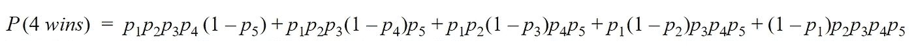**

****Python 实现****

**我们的逻辑回归模型将玩家配对的比赛保证金、技能保证金和获胜百分比保证金值作为输入，并返回玩家 A 将赢得这一轮的预测概率。我们可以在一个五行 Python 数据帧中存储一个比赛阵容，其中每行对应一个玩家配对。**

**如果我们将我们的模型应用于队列数据帧，我们生成一个概率向量——每个配对一个概率。下面的函数采用这个概率向量，并使用上面的等式计算 *P(赢匹配)*。**

**假设我们已经将所有阵容数据帧存储在一个名为*阵容*的列表中。我们现在可以将预测模型应用于每个阵容，并计算每个阵容排列的匹配获胜概率。**

## ****组织比赛预测****

**队长轮流扮演首先选择球员的角色。在每轮比赛开始时，队长都要确保他们选择了最好的球员为他们的球队效力。因为我们的目标是部署一个用户友好的 web 应用程序，所以将每个排列的预测存储在一个**关系数据库中是有意义的。有了这个数据库，我们只需要为每场比赛生成一次预测概率。在每一轮开始时，我们可以检索推荐的球员，作为可重用 SQL 查询的结果。我们使用 postgreSQL 是因为它与 Heroku 等 app 部署平台无缝集成。****

**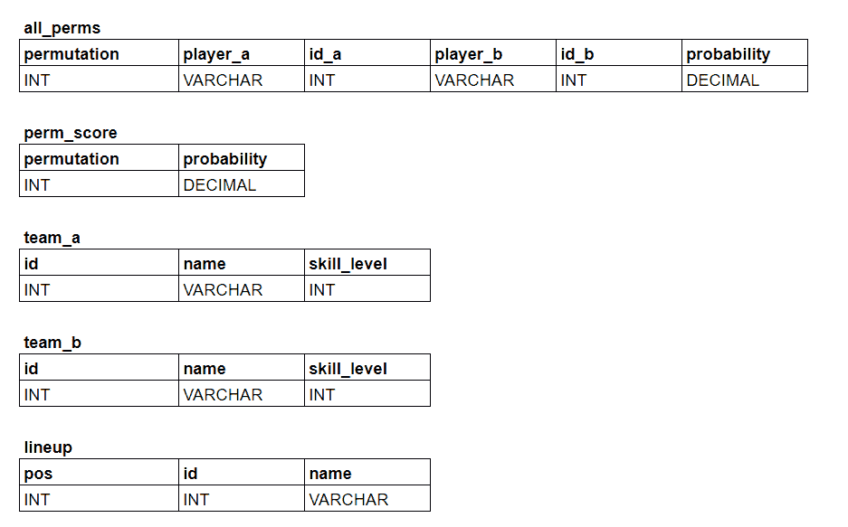**

**图 1:数据库模式。**

**图 1 显示了数据库中包含的每个表的模式:**

*   ****all_perms** 包含 **player_a** 对 **player_b、**的预测获胜概率**以及包含该配对的**排列**的数字 id(从 1-120)。****
*   ****perm_score** 包含每个**排列**的总匹配获胜**概率**。**
*   ****team_a** 包含 a 队玩家的玩家 id**s、 **name** s、 **skill_level** s 的列表。****
*   ****team_b** 包含 b 队玩家的 **id** s、**名字** s、**技能等级** s 的列表**
*   ****随着比赛的展开，阵容**会随着选定玩家的 **id** s 和**名称** s 不断更新。 **pos** 是 1-10 之间的整数，表示在阵容中的位置，奇数对应于 A 队选择，偶数对应于 B 队选择。**

## ****球员选择策略——比赛示例:****

**现在我们有了两个队之间每个可能阵容的预测数据库，我们可以很容易地找出哪个阵容有最高的获胜概率。然而，由于我们不能确定每一轮对方队长会选择哪些球员，所以要达到这个目标还远不能保证。然而，有没有一种选择策略能始终产生接近最优的阵容？**

****让我们站在队长的角度来打一场比赛**。**

**我们面对的是蓝队队长 Slick Jill，和我们一样，她会尽最大努力创造一个最大化她获胜机会的阵容。该模型已经被应用于预测我们的每个玩家(红队)对蓝队的每个玩家的获胜概率，如表 1 中所总结的。这些概率取自数据库中的 **all_perms** 表。**

**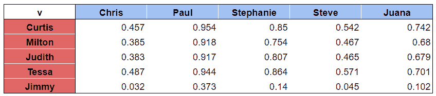**

**表 1:A 队(红色)的玩家对 B 队(蓝色)玩家的预测获胜概率。**

## ****第一轮:回应对手的选择****

**滑头吉尔赢得了掷硬币，并选择在第一轮选择第一。她把保罗叫到桌前玩。我们的应对策略是什么？**

**看着矩阵并立即选择 **Curtis** 来回应可能很有诱惑力。他赢的可能性最大，所以这很容易，对吗？使用这种逻辑的选择策略是贪婪算法的一种形式。在许多比赛中，这可能最终成为一种短视的策略。例如，**泰莎**击败**保罗**的几率几乎和**柯蒂斯**一样高，而**柯蒂斯**击败**胡安娜**的几率是迄今为止最高的。为这场可能的比赛保留他可能是谨慎的。也可能出现这样的情况，即“牺牲”一轮是有利的，如果这意味着团队有*更高的概率赢得更多的后续回合*。**

**考虑到这一点，我们如何才能确信我们选择的是最好的球员，而不会让我们的大脑被各种不同的可能性淹没？**

**我们已经做了很多繁琐的工作，通过计算每一个可能的阵容赢得比赛的概率。这些匹配概率存储在我们数据库的 **perm_score** 表中。是时候使用它们了！**

**现在，表 2 显示了一个**新的**匹配矩阵，其中这次的值表示包含该配对的所有阵容的**平均匹配获胜概率。****

**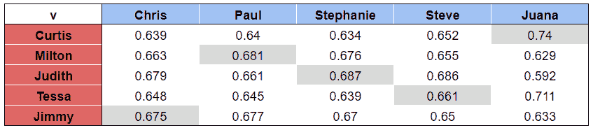**

**表 2:与表 1 相反，该匹配矩阵显示了包含该玩家配对的阵容排列的平均匹配获胜概率。**

**对应于最佳阵容的配对以灰色突出显示。该阵容的比赛获胜概率为 **0.77，**，相比之下，所有 120 种排列的平均比赛获胜概率为 **0.66** ！**

**现在我们可以看到，平均而言，米尔顿和保罗的组合会比我们选择任何其他球员更有可能赢得比赛。从第一张桌子上看这一点都不明显！**无论 Slick Jill 选择了谁，我们都可以用一名球员来应对，这将提高我们赢得比赛的可能性。****

**下面的代码展示了我们如何用 Python 编写一个函数，使用对 postgreSQL 数据库的查询来生成类似表 2 的内容。该函数有两个参数:对应于 Slick Jill 选择的玩家 ID， *player_b_id* ，以及到 postgreSQL 数据库的连接， *con* 。**

**有很多东西需要消化。第 4 行和第 5 行的两个 Python 函数检索当前的队列，这是使数据库被过滤为只包含活动排列所必需的。剩下的代码由一个检索最佳玩家选择的 **SQL 查询组成。让我们一行一行地解开它，按照执行[代码](https://sqlbolt.com/lesson/select_queries_order_of_execution)的顺序打印逐步输出。****

1.  **第 11 行:从 **all_perms** 表中选择*活动排列*的所有 id。“子句”是一个 WHERE 语句，它过滤掉由于前几轮完成而不再可能的排列。参见 [GitHub](https://github.com/cfodonnell/NAPA-Amateur-Pool/blob/master/napa_app/napa/analytics.py) 中的完整代码。因为所有的排列仍然是可能的，所以返回一个表， **f** ，由包含数字 1-120 的一列组成。**

**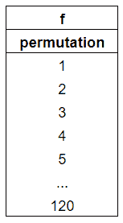**

**2.第 12 行:对 **all_perms** 表的内部连接。同样，因为我们还没有排除任何可能的结果，所以这只是返回整个 **all_perms** 表，其中有重复的置换列。**

**3.第 13 行:将结果加入到 **perm_score** 表中，以访问匹配的获胜概率。注意，a.probability 指的是给定排列中单轮的*预测获胜概率，而 s.probability 指的是给定排列的*预测匹配获胜概率*。***

**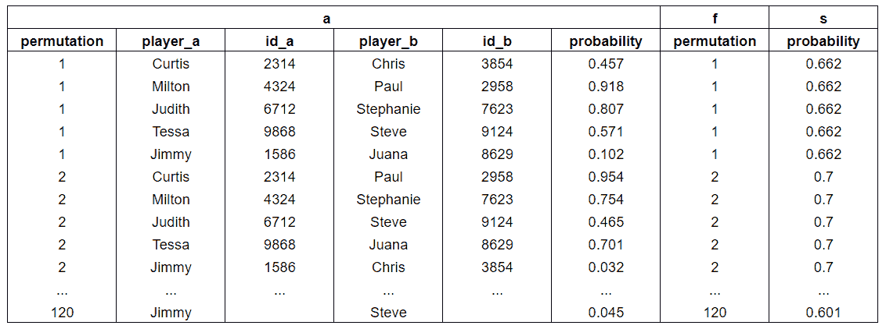**

**4.第 14 行:过滤表格，只包括可能的回合，包括 B 队(Chris)的选定玩家。**

**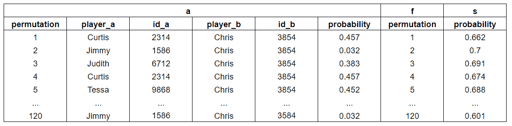**

**5.第 9、10、15 行:这是组装最终表格的地方。我们将 A 组的玩家分组，计算包含这些可能配对的所有排列的平均获胜概率(AVG( **s.probability** )为 **avg_prob** )。注意，虽然我们只需要按 **a.id_a** 列分组，但是如果我们在 SELECT 语句中也包含这些列，我们需要在 group by 语句中包含 **player_a** 和 **player_b** 。**

**6.第 14 行:最后，表格按降序排列 **avg_prob** 。**

**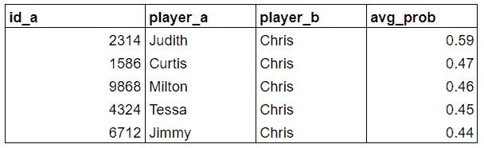**

**一旦 Judith v Chris 配对被确认，我们可以将这些球员添加到我们数据库的**阵容**表中，并进入下一轮。**

## ****第二轮:轮到我们先挑了****

**当轮到我们先选择球员时，情况就有点复杂了，因为 Slick Jill 可以用她的选择作为回应，带来惊喜。尽管如此，我们还是可以制定一个策略，将 Slick Jill 可能对我们平均获胜概率造成的损害降到最低。换句话说，**我们想要做出一个玩家选择，这将导致最高可能的平均比赛获胜概率*，而不管 Slick Jill 选择谁作为响应*。**这被称为[马希民(minimax)策略。](https://en.wikipedia.org/wiki/Minimax)**

**让我们更新图 3 中的匹配矩阵。现在已经进行了一轮比赛，剩下的唯一可能的阵容是 24 种排列，其中包括米尔顿对保罗的配对。在表 3 中，在剩余的 24 个排列中，每个配对的平均匹配获胜概率被重新计算。**

**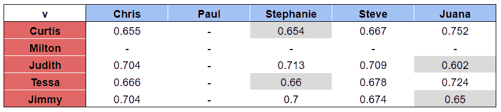**

**表 3:第一轮比赛结束后更新的比赛矩阵。我们队的最小获胜概率是通过取各行的最小值得到的。**

**对于对应红队玩家的每一行，以灰色突出显示的单元格对应该玩家最差的配对。如果 Slick Jill 的选择导致这些配对中的一个，那么我们的获胜前景将会急转直下！**

**因此，Tessa 是第二轮最安全的选择，因为她有最高的最小获胜概率(0.66)。**

**现在，对于 Python/SQL 实现:**

**请注意，第 11 到 16 行中的子查询与我们在第一轮中使用的查询非常相似，唯一的区别是缺少 WHERE 子句，当我们考虑所有可能的配对时，这是不需要的，而且我们现在是按 **player_b** *然后是* **id_a** 分组，而不是反过来。**

1.  **第 12-15 行:以与上一节相同的方式连接表格，但是这次唯一可能的排列是包含 Milton v Paul 的排列。**

**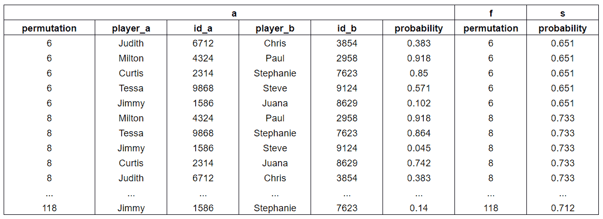**

**2.第 11、16 行:按 **player_b** 分组，然后按 **id_a** 和 **player_a** 分组，合计平均比赛获胜概率(AVG( **s.probability** 为 **avg_prob** )。这产生了前面表 3 中所示的矩阵的表格形式。**

**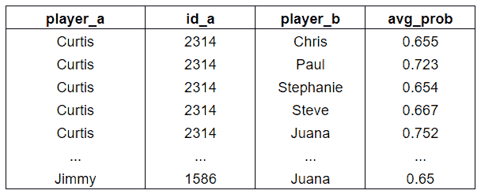**

**3.第 9、10、17 行:通过 **id_a** 和 **player_a，**对匹配矩阵表进行分组，选择每组的最小平均匹配获胜概率(MIN( **avg_prob** )作为 **min_prob** )。**

**4.第 16 行:请注意，Paul 的名字出现在图 10 的表格中，尽管事实上他已经在第一轮中玩过了！要删除不可能的玩家配对，有必要包含一个 HAVING 语句，过滤掉已经输入到**阵容**表中的玩家 id。**

**5.第 11 行:最后，聚集的行按降序排列 **min_prob** 。**

**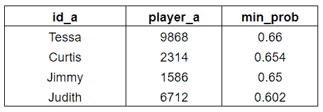**

## **将所有这些放在一起:**

**我们现在已经拥有了构建应用程序所需的所有要素！让我们来看一下我们的示例比赛，看看我们的选择策略将我们引向什么阵容。如果 Slick Jill 进行随机选择，那么我们可能会以表 4 中的阵容结束。**

**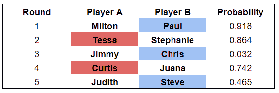**

**表 4:一个可能的最终阵容，我们使用马希民策略，而 Slick Jill 随机选择。颜色表示每一轮哪个队先拔得头筹。概率栏显示每对红队玩家的获胜概率。**

**我们非常有希望赢得五轮中的三轮，整体比赛获胜概率为 **0.76** 。在所有 120 种可能的排列中，这个阵容实际上有第五高的获胜概率，所以我们不能给自己一个更好的机会了！**

**虽然看起来我们有在这场比赛中击败 Slick Jill 的神奇公式，但从单个数据点得出结论是不明智的做法。在下一部分中，将应用统计方法来量化选择过程的有效性。**