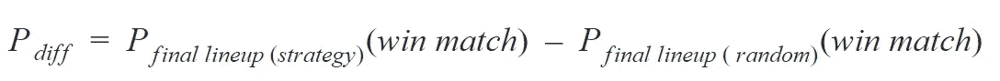
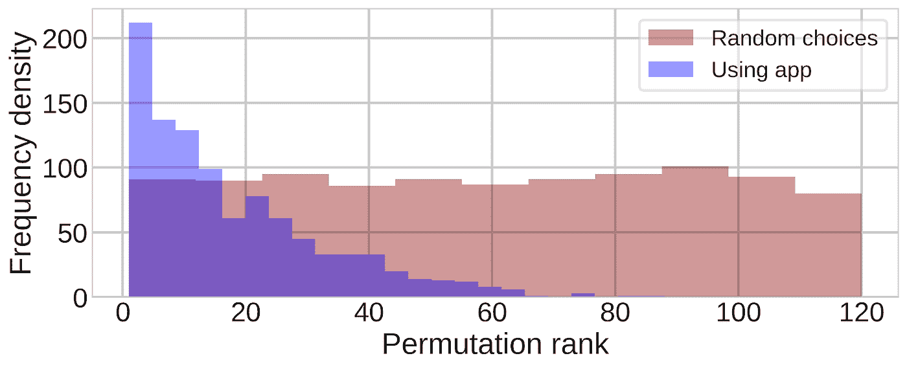
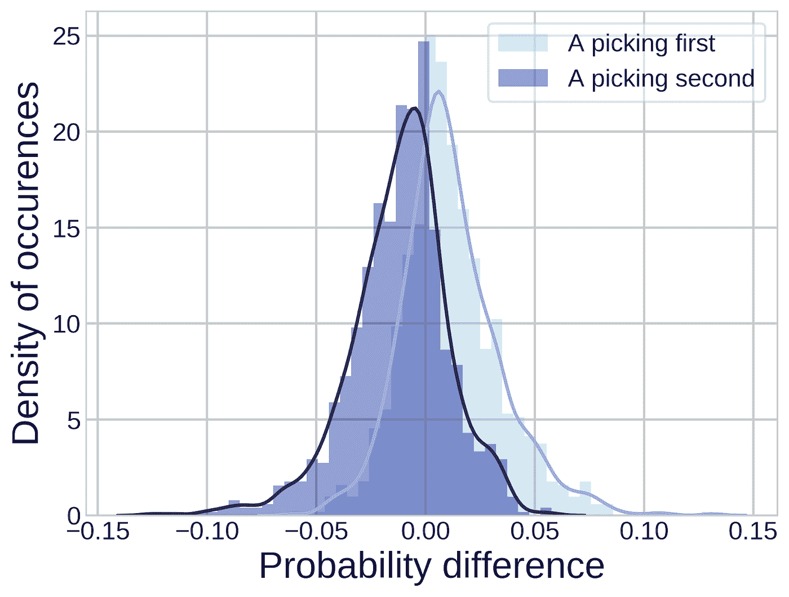
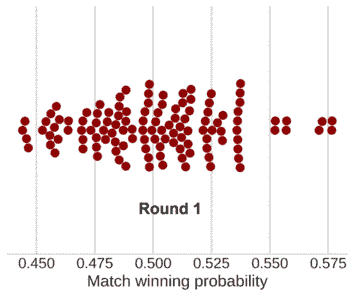

# 魔术 8 球:一个应用程序，以最大限度地赢得竞争池比赛(第三部分)

> 原文：<https://towardsdatascience.com/magic-8-ball-an-app-to-maximize-wins-in-competitive-pool-matches-part-3-d724fdd65d9?source=collection_archive---------34----------------------->

## 机器学习和 SQL 如何帮助你在连续团队游戏中智胜对手

欢迎回到这个由三部分组成的数据驱动池策略系列的最后一部分！

在[第 1 部分](/magic-8-ball-an-app-to-maximize-wins-in-competitive-pool-matches-part-1-e1d302b5507c)中，我们探索了竞技团队台球的古怪之处，并确定台球游戏的玩家阵容选择可以通过数据科学来改进。我们开发了一个分类模型，根据过去的结果预测一个玩家击败另一个玩家的概率。

在[第 2 部分](/magic-8-ball-an-app-to-maximize-wins-in-competitive-pool-matches-part-2-eb9d4793f98f)中，我们更进一步，用 SQL 实现了一个马希民玩家选择算法，它使用模型预测来计算最佳玩家选择。

在这最后一部分，我们将比较我们的机器学习驱动的玩家选择和现实世界的玩家选择策略，并确定我们是否真的能够持续获得超过对手的竞争优势。

[**第一部分:引言和预测建模。**](/magic-8-ball-an-app-to-maximize-wins-in-competitive-pool-matches-part-1-e1d302b5507c)

第 2 部分:使用 SQL 制定策略。

**第 3 部分:“封装”测试！**

## **与真实策略的比较**

你可能想知道队长是否真的花了很多心思在他们的球员阵容上，或者他们是否愿意让球员自己选择比赛顺序。答案是，*有的不*，认为对抗联盟的均衡盘口是徒劳的。然而，我们在第 1 部分中看到，尽管有障碍，我们仍然可以*使用与玩家配对相关的**技能余量**、**比赛余量**和**获胜百分比余量**来准确预测一个玩家赢得这一轮的概率。*

*一个常用的现实生活策略是**尝试让你的玩家与对手中技术相似的玩家的技术水平相匹配。这种方法背后的逻辑是，每个玩家都有信心能够击败他们同样熟练的对手。***

*因此，让我们将这种现实生活中的技能匹配策略与第 2 部分中开发的马希民选择算法(即我们的应用推荐)进行比较。我们可以在 1000 次模拟中比较这两种策略的表现，看看哪一种更有说服力。*

*对于每个模拟，使用**numpy . rand()**函数生成具有随机分布参数的两个五人小组。*

*A 队的球员选择有三种方式:*

*   ***策略一:**选择与所选 B 队玩家技能匹配度最接近的玩家。*
*   ***策略二:**使用马希民 app 推荐。*
*   *做出随机选择。*

*B 队的球员选择总是随机的。*

*这导致**每场模拟比赛有三种不同的最终阵容**。这些阵容中的每一个都记录了相关的比赛获胜概率，以及根据 [NAPA 规则](https://www.napaleagues.com/naparules/?ball=8-ball)计算的预计得分。*

*然后，我们可以使用**概率差来量化每个策略的有效性，定义为**:*

**

**即*使用策略 1 或 2 时最终阵容的比赛获胜概率减去随机选择时最终阵容的比赛获胜概率。在图 1(a)中，绘制了 1000 个模拟匹配的概率差。红色阴影对应策略 1(相似技能策略)时的 *P_diff* ，蓝色阴影对应策略 app 策略)时的 *P_diff* 。*

**

*图 1(a):使用 app 推荐时(蓝色)和使用相似技能策略时(红色)的 Pdiff。(二)。平均水平和使用替代策略之间的预测得分差异。图片作者。*

*可以看出，红色分布集中在平均值为 0 的 **P_diff 上，这意味着**是许多比赛的平均值，类似的技能策略不会导致比随机选择更好的结果。**这很有意义，因为在本系列的第一部分中，我们已经展示了技能水平只是决定玩家获胜概率的一个因素。***

***另一方面，使用 app 推荐时 P_diff 的均值为 0.054，在 98.4%的模拟匹配中 P_diff 大于 0！***

*图 1(b)中的预测得分差异遵循正态分布，因此我们可以计算应用程序推荐方法和类似技能方法的预测得分差异均值之间的 t 检验的单侧 p 值。计算值远低于所选的𝛼=0.05 显著性水平**，因此我们可以得出结论，app 推荐比使用相似技能策略产生更好的预测分数。***

## *我们能做得更好吗？*

*我们已经证明，使用应用程序推荐的匹配获胜概率平均比随机选择或使用类似技能策略高 0.054%。这是我们能做的最好的吗？我们总是能得到最好的阵容吗？或者我们能增加更多的机会吗？*

**

*图 2:随机选择(红色)和使用应用程序推荐(蓝色)时，所有排列的最终阵容。图片作者。*

*根据**排列等级**来考虑是有见地的，其中最高等级排列(等级 1)是 A 队具有最高匹配获胜概率的阵容，最低等级排列(等级 120)是 A 队具有最低匹配获胜概率的阵容*

*图 2 显示了从 1000 次模拟中获得的每个阵容的排列等级直方图，应用程序推荐的阵容为蓝色，随机选择的阵容为红色。很明显，当使用应用程序推荐时，我们很可能会得到最好的阵容，而得到更差阵容的机会会成倍下降。只有在极其罕见的情况下，B 队才会幸运地随机选择，我们最终的阵容比 60 人的平均阵容还要糟糕。另一方面，红色分布的均匀性表明，当我们也进行随机选择时，我们同样有可能得到任何排名。*

## ***如果对手是战术天才呢？***

*因此，我们已经确认了我们的应用程序策略优于一个天真的随机对手，但它将如何应对一个更具战术敏锐性的队长呢？让我们考虑一下最坏的情况——**让对手也能访问应用推荐**。为了测试这个场景，我们模拟了 1000 场新的比赛，玩家的选择由两队**的马希民策略决定。像以前一样，使用两个队的随机球员选择重复相同的比赛，以便可以为每场比赛计算 P_diff。模拟运行了两次，一次是 A 队进行第一次挑选，一次是 B 队进行第一次挑选。P_diff 分布如图 4 所示，其中团队 A 选择第一名和第二名的结果分别用浅蓝色和深蓝色绘制。***

**

*图 3:当双方队长都可以访问应用程序推荐时，1000 场模拟比赛的概率差异。浅蓝色表示 A 队先挑，深蓝色表示 A 队后挑。图片作者。*

*从分布来看很明显，在第一轮中无论哪个队长先选择都有一点优势！[请注意，当其中一名队长随机选择时，这种优势**不会**出现，在这种情况下，两种分布都类似于图 1(a)中的红色分布]。*

*当 A 队队长先选时，71.8%的模拟比赛中 P_diff 大于 0，平均值 **P_diff** 为 **0.012** 。*

*当他们选择第二名时，只有 28.6%的模拟比赛中 P_diff 大于 0，平均值 **P_diff** 为 **-0.012** 。*

*这一结果具有统计学意义，采用 p <0.0001 for a [Wilcoxon 符号秩检验](https://docs.scipy.org/doc/scipy/reference/generated/scipy.stats.wilcoxon.html)。*

*因此，我们可以得出令人惊讶的结果:在所有策略都相同的情况下，**在许多比赛中，我们可以简单地通过选择在掷硬币获胜后首先选择一个玩家来预期比赛获胜概率的小幅正增长。***

*值得注意的是，从个人经验来看，这与泳池队长的普遍看法相反，他们往往不愿意主动出击！*

## ***前端和应用部署***

*应用程序开发的最后一步是设计一个供队长使用的前端界面。有许多[奇妙的](https://realpython.com/flask-by-example-part-2-postgres-sqlalchemy-and-alembic/) [指南](https://blog.theodo.com/2017/03/developping-a-flask-web-app-with-a-postresql-database-making-all-the-possible-errors/)用于设置使用 Flask 与 postgreSQL 数据库通信的 web 应用程序，所以我在这里不会深入研究细节。在 Heroku 上部署网络应用的一步一步的指南可以在这里找到。*

*相反，你可以在 http://magic8billiards.herokuapp.com/随意摆弄最终产品。使用说明可在网站的“如何使用”标签下找到。*

**

*图 4:应用视觉助手。每个点代表单个排列组合的获胜概率，暗红色的点表示仍然可能的排列组合。随着更多回合的完成，大多数阵容变得不可能，并且变灰。最后的暗红点就是最后的阵容。图片作者。*

*该应用的一个关键元素是**视觉助手:**一个动态的[群集图](https://seaborn.pydata.org/generated/seaborn.swarmplot.html)，它将所有 120 个可能的阵容的比赛获胜概率绘制成红点。随着回合的完成，一些阵容变得不可能，这些点变灰。正如我们上面所展示的，该应用程序指导队长们选择获胜概率最高的阵容。到了第五轮，只剩下一个红点，代表最终选定的阵容。除非船长特别不走运，否则这个点应该在虫群的右边，这表示胜利的机会增加了！*

## ***收尾***

*祝贺这篇深入探究团队池策略特质的三部分文章结束！*

*在第 1 部分开发了一个概率模型之后，在第 2 部分，我们设计了 SQL 查询来识别每轮比赛中的最佳玩家选择。最后，在第 3 部分中，我们评估了这些查询在许多模拟匹配中的性能。*

***关键要点是:***

*   *逻辑回归可以可靠地预测一个玩家在 NAPA pool 联赛中战胜另一个玩家的概率，使用技能水平、以前的胜率和比赛长度作为输入特征。*
*   *maxmin 玩家选择策略导致比赛获胜概率比随机选择平均提高 5.4%。*
*   *在掷硬币中获胜的队长应该选择在第一轮中首先选择——即使在最坏的情况下，这也会将比赛获胜的概率提高 1.2%。*

*这里讨论的选择算法的应用已经超出了业余爱好者的范围。出现类似问题的一些行业场景包括:*

*   *两家公司竞相从一系列可供选择的项目中赢得最多的合同。*
*   *两家航空公司竞标赢得一个机场的着陆位置。*

*我希望这个系列已经启发你拿起一个台球杆，并检查你当地的联赛。在泳池队打球是结识新朋友的好方法，而差点系统让所有能力的球员都有愉快的经历。*

**

*图片来自 instagram.com/stevenfritters，授权给卡勒姆·安东内尔。*