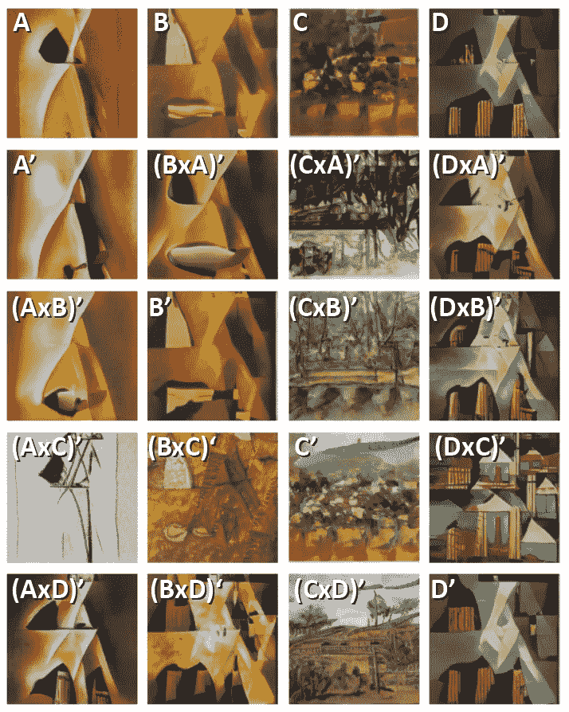

# 磁铁:使用深度神经网络的现代艺术生成器

> 原文：<https://towardsdatascience.com/magnet-modern-art-generator-using-deep-neural-networks-57537457bb7?source=collection_archive---------8----------------------->

## [实践教程](https://towardsdatascience.com/tagged/hands-on-tutorials)

## 我如何使用 CLIP、SWAGAN 和自定义遗传算法从文本描述中创建现代绘画


**磁体**输出样本，图片作者

我最新的利用人工智能进行创造性努力的项目叫做磁铁。我构建了一个定制的遗传算法(GA ),通过几代人的文本描述，使用生成性对抗网络(GAN)来驱动现代绘画的创作。MAGnet 使用 OpenAI 的 CLIP 模型[1]和 Nvidia 的 StyleGAN2 ADA [2]的变体 SWAGAN [3]，后者使用小波来创建图像。

这个项目的所有源代码都可以在[这里](https://github.com/robgon-art/MAGnet)找到。这里有一个谷歌实验室，你可以用它来创作你自己的画。

# 先前的工作

一个名为 CLIP-GLaSS 的类似系统于 2021 年早些时候发布。在他们的论文“通过剪辑引导的生成潜在空间搜索从字幕生成图像，反之亦然”[4]中，Federico Galatolo 等人建立了一个图像生成系统，该系统使用 StyleGAN2、CLIP 和一个称为 NSGA-II 的 GA[5]。作者在他们的 Google Colab [这里](https://colab.research.google.com/drive/1fWka_U56NhCegbbrQPt4PWpHPtNRdU49)提供了这个系统。

以下是经过 50 代之后，来自查询“有白色尖塔的教堂”的 CLIP-GLaSS 的顶级结果。


由 CLIP-GLaSS 使用提示“有白色尖塔的教堂”生成的图像，由作者提供

该系统似乎工作得相当好，但图像有点小，为 256 x 256 像素。许多源图像似乎来自库存视频网站 Shutterstock。请注意 GAN 是如何在每个图像中重新创建 Shutterstock 水印的。

# 磁铁概述

以下是 MAGnet 中使用的组件的简要概述。我将在本文的后面详细介绍每个组件。请注意，使用 WikiArt 中的图像收集、过滤和训练 GAN 的步骤类似于我的 GANscapes 项目，该项目生成印象派风景画。

[](/ganscapes-using-ai-to-create-new-impressionist-paintings-d6af1cf94c56) [## 甘斯卡皮斯:用人工智能创造新的印象派绘画

### 我如何在公共领域用 5000 幅印象派风景画训练 StyleGAN2 ADA

towardsdatascience.com](/ganscapes-using-ai-to-create-new-impressionist-paintings-d6af1cf94c56) 

下图显示了 MAGnet 的主要系统组件。


**磁铁组件**，作者提供的图表

我从 WikiArt.org[6]那里收集了一些现代绘画的图像，并对这些图像进行处理，从中提取出一幅或多幅方形图像。然后，我使用剪辑模型来过滤图像，以保留 1 万张与“现代绘画”最匹配的图像

我用这些图像来训练 SWAGAN，它有一个生成器和鉴别器网络。生成器从形式和风格的随机“潜在”向量开始创建新图像，并试图欺骗鉴别器，使其认为输出的图像是真实的。在将真实图像和生成的图像输入鉴别器之前，会使用自适应鉴别器增强(ADA)模块对其进行轻微修改，从而在图片中创建视觉多样性。

我再次使用 CLIP 作为我的 GA 的一部分，来引导 SWAGAN 在指定数量的代上创建一个与用户提供的文本描述最匹配的图像。作为最后一步，我对最终图像进行了后期处理，进行了温和的对比度调整，并以全尺寸显示了结果。

查看文章末尾附录中的图片集，了解更多来自 MAGnet 的结果。

# 磁体系统详情

这一节将更详细地讨论我用来构建 MAGnet 的过程和系统。

## 收集图像

我开始用自定义的 python 脚本从 WikiArt.org 搜集现代绘画。该脚本按字母顺序遍历网站上的每个艺术家。它检查艺术家是否被标记为“现代”艺术运动的一部分，以及他们是否生于 1800 年之后，死于 1950 年之前。然后，脚本遍历所有艺术家的画作，寻找公共领域中可用的作品。然后，脚本使用艺术家和绘画名称作为文件名下载每个符合条件的图像，即 Henri-Matisse _ still-life-with-fruit-1896 . jpg。系统找到了大约 4，000 幅符合这些标准的绘画。请注意，我使用 Python 中的 ThreadPoolExecutor 通过 8 个并行线程来收集图像，以加快处理速度。

这是一个符合标准的图片样本。


**来自 Wikart.org 的现代绘画样本**，由维尔莫斯·阿巴和文森佐·阿巴蒂拍摄

注意“现代”这个词相当宽泛，所以剧本既收集了抽象绘画也收集了具象绘画。

## 拉动正方形图像进行训练

gan 可以有效地处理像素大小为 2 的幂的正方形图像，例如 256 x 256、512 x 512、1024 x 1024 等。对于磁铁，我决定使用大小为 512 x 512 的图像。因为源绘画有各种纵横比，所以我选择从每个图像中提取三个剪切部分。

例如，亨利·马蒂斯的画《水果静物》就有一个横向方向。这是三个剪影，分别展示了这幅画的左、中和右部分。


**亨利·马蒂斯用三种方式修剪水果的静物**，图片来源于 Wikiart.org

第二个例子是毕加索的丑角。肖像被裁剪为顶部、中间和底部。


**巴勃罗·毕卡索的《丑角剪成三样》**，图片来源于 Wikiart.org

剪短的丑角似乎是最好的，因为脸是完整的。然而，在训练 GAN 时使用所有三种剪裁是可以的，因为我稍后将使用 CLIP 来过滤和指导“好”绘画的生成。

处理训练图像的源代码在这里的[实验室](https://colab.research.google.com/github/robgon-art/MAGnet/blob/main/2_MAGnet_Process_Modern_Paintings.ipynb)。

## 使用 CLIP 对训练图像进行过滤

裁剪完图像后，我最终拥有了 12，000 多幅作品。这足以训练一个甘，但并不是所有的画都是好的。仅仅因为一个画家在 WikiArt 上被标记为“现代”，并不意味着他们所有的作品都是现代绘画的好例子。我使用 CLIP 来过滤图像，就像我在 GANscapes 项目中筛选数据集一样。

OpenAI 为 CLIP 设计了两个模型，一个图像和文本编码器，来执行语义搜索。他们在带有相应短语的图像数据集上训练这两个模型。模型的目标是使编码图像与编码短语相匹配。

一旦经过训练，图像编码器系统将图像转换为嵌入，即捕获图像一般特征的 512 个浮点数的列表。文本编码器将文本短语转换为相似的嵌入，该嵌入可以与图像嵌入进行比较以进行语义搜索。

对于 MAGnet，我将短语“现代绘画”中的嵌入内容与绘画中的嵌入内容进行比较，以找到与该短语最匹配的前 10，000 幅图像。源代码在这里的 Colab [里。](https://colab.research.google.com/github/robgon-art/MAGnet/blob/main/3_Filter_Modern_Paintings.ipynb)

这里有一些不符合现代绘画的例子。前两个大概得分比较低，因为没有太多对比。第三张看起来更像一张素描，而不是一幅油画。


Wikiart.org 来源:克里斯托夫·伍德的《海港中的船》,阿尔弗雷德·威廉·芬奇的《静物》,洛克威尔·肯特的《给凯瑟琳·布拉什的插图》

## 斯瓦甘

对于这个项目，我使用的是 StyleGAN2 的一个变种，叫做 SWAGAN。它是由特拉维夫大学的 Rinon Gal 等人发明的。这个新模型在他们的 SWAGAN 中有描述:一个基于风格的小波驱动的生成模型[3]。以下是对他们方法的描述。

> …我们提出了一种新颖的通用样式和基于小波的 GAN (SWAGAN ),它在频域中实现渐进生成。SWAGAN 在其生成器和鉴频器架构中融入了小波，在每一步都加强了频率感知的潜在表示。这种方法提高了生成图像的视觉质量，并显著提高了计算性能。-里农·加尔等人。

小波是一种类似波浪的振荡，其振幅从零开始，增加，然后减小回到零。小波的研究是基于匈牙利数学家阿尔夫雷德·哈尔的工作。该论文的作者表明，通过采用 GAN 架构直接在基于小波的空间中工作，他们在高频范围内实现了更高的视觉质量和更真实的内容[3]。

下面是论文中 StyleGAN2 和 SWAGAN 的输出比较。


**style gan 2 和 SWAGAN** 的比较，摘自 Rinon Gal 等人的 [SWAGAN 论文](https://arxiv.org/pdf/2102.06108.pdf)。

作者指出，插值的 StyleGAN2 图像在高频区域(如头发)周围显示出相当大的模糊，而 SWAGAN 图像则没有。

## 训练营地

我用这个 [Google colab](https://colab.research.google.com/github/robgon-art/MAGnet/blob/main/4_MAGnet_Modern_Paintings_Train.ipynb) 训练了这个系统两周。下面是运行培训的命令。

```
**python /content/stylegan2-pytorch/train.py --data_dir /content/drive/MyDrive/modern_results/ --augment --arch swagan 
--size 512 /content/drive/MyDrive/modern_art_processed_512/**
```

注意，架构设置为 SWAGAN(另一个选择是 StyleGAN2)。你可以在这里看到一些未经过滤的结果。


**SWAGAN 接受现代绘画训练的样本结果**，图片由作者提供

你可以看到抽象和具象图像的有趣结合。这些代表性的图像似乎从印象派到立体派都有。而且有很好的调色板组合。

**甘实施注意事项**

我正在使用的 SWAGAN 版本是由独立开发者 Seonghyeon Kim 编写的，在 GitHub 上被称为 [rosinality](https://github.com/rosinality) 。他实现了 StyleGAN2 和 SWAGAN [在这里](https://github.com/rosinality/stylegan2-pytorch)。

rosinality 的大部分源代码都是在 MIT 开源许可下发布的，这是非常宽松的。但是，他的代码包括两个操作，fixed_act()和 upfirdn2d()，写成低级 CUDA 函数。这些功能由 Nvidia 编写，并在他们的[非商业开源许可](https://nvlabs.github.io/stylegan2/license.html)下发布。Nvidia 许可证声明源代码可以非商业使用，这意味着它只能用于研究或评估目的。

在 GitHub 上搜索后，我找到了 fixed_act()和 upfirdn2d()函数的副本，它们是由或 Patashnik 等人在 MIT 开源许可下为他们的 StyleCLIP 项目重新实现和发布的[7]。它们的函数与 rosinality 的 SWAGAN 实现配合得很好。你可以在我的 GitHub 项目[这里](https://github.com/robgon-art/MAGnet)找到合并后的代码。我在许可的 CC-BY-SA-4.0 许可下发布源代码。是的，你可以将我的源代码用于商业目的💲💲💲。但是如果你用的话，请告诉我一声。📣

## 遗传算法

在计算机科学中，遗传算法(GA)是一种受自然选择过程启发的元启发式算法，它依赖于生物启发的操作符，如突变、交叉和选择。遗传算法通常用于生成高质量优化和搜索问题的解决方案[8]。你可以在 Vijini Mallawaarachchi 关于介质[的文章](/introduction-to-genetic-algorithms-including-example-code-e396e98d8bf3)中读到更多关于气体的内容。

我创建了一个定制的 GA，它使用 CLIP 来引导 SWAGAN 生成与用户给出的文本描述相匹配的图像。以下是该算法的概述。

> ***为每一代生成初始种群
> :
> 选择-选择前 4 个匹配图像
> 交叉-将每个图像与其他图像交叉
> 变异-给潜在向量添加一点噪声***

这是遗传算法的 Pythonish 伪代码:

```
**# get the features from the text query using CLIP** text_query = 'an abstract painting with orange triangles'
query_features = clip.encode_text(text_query)**# get an initial population of images, i.e. 200** latents = random(num_initial_samples)**# run the genetic algorithm for some number of steps, i.e. 5 times** for g in range(num_generations): **# generate the images**  images = swagan.generate_images(latents) **# get the image features using CLIP and rank them to get the top 4**  image_features = clip.encode_image(images)
  ranked_indices = get_top_N_(query_features, image_features, 4) **# start with a blank slate**  new_latents = empty_set **# copy the best four latents (A, B, C, D)**  for i in range(4):
    offspring = latents[ranked_indices[i]]
    new_latents.append(offspring) **# loop through all 16 combinations**  for j in range(4):
    for i in range(4): **# combine i with j**      offspring = (1-recombination_amount) * new_latents[i] +  
         recombination_amount * new_latents[j] **# add a little mutation**      offspring += random() * mutation_amount

      **# add it to the batch**
      new_latents.append(offspring) **# use the new latents**  latents = new_latents
```

好，让我们用一个真实的例子来看看这是如何工作的。

参数是这样设置的:
text_query = '一幅带有橙色三角形的抽象画'
num _ initial _ samples = 200
recombination _ amount = 0.333
mutation _ amount = 0.25
num _ generations = 5

生成 200 张图片后，这里是匹配查询的前四张图片。


**与“一幅带有橙色三角形的抽象画”相匹配的前 4 张图片**作者提供的图片

这些图像明确显示了许多橙色，并且可以看到一些三角形。这是第一代产品。字母“x”表示交叉，符号‘表示突变。



**来自磁铁的第一代图片**，图片作者

原来的四个图像在最上面，有突变的组合在下面。该系统将查看所有 20 个图像(原始的 4 个加上 16 个组合)，并使用 CLIP 来确定下一代的前 4 个。

我运行了五代遗传算法。如果你好奇，你可以在这里看到所有的中间结果。下面是最终结果。


**作者提供的“带有橙色三角形的抽象画”的磁铁结果**

还不错！您可以看到，最终结果主要基于最初的前两张图像，但系统在运行遗传算法的过程中设法找到了一些额外的橙色三角形。

接下来，我将分享我开发的一项技术，该技术可以在使用天然气和天然气水合物时改善结果。

## GANs 的交叉技术

在遗传算法的文献[8]中，用于交叉操作的技术描述如下:
1。从 0 到向量长度
2 之间选择一个随机的“交叉点”。将值从第一个父节点复制到交叉点
3。从交叉点开始，复制第二个父节点的值

例如，如果向量中有 10 个数字，重组量为 40%，如果 A 向量设置为全 1，B 向量设置为全 0，则后代看起来会是这样。交叉点用粗线表示。


**传统交叉方法**，图片由作者提供

您可以看到，A 中的前六个值被复制到 AxB 后代中，接下来的四个值被复制到 b 中。BxA 后代具有来自父代的反向贡献。

下面是传统交叉方法的 Python 代码:

```
**offspring = empty(vector_length)
crossover_point = int(vector_length * recombination_amount)
offspring_axb[crossover_point:] = a[crossover_point:] 
offspring_bxa[:crossover_point] = b[:crossover_point]**
```

尽管这种方法大致是基于它在生物学中的工作方式，但我发现它并不是处理 GANs 的最佳技术。例如，下面是两个最佳图像的混合，这两个图像符合使用传统交叉技术的“带有红色方块的抽象画”的描述。


**传统交叉方法**，图片由作者提供

第一个图像是父图像 A，最后一个图像是父图像 B，中间的三个图像是使用传统的交叉方法在两个父图像之间逐渐混合的。请注意，父母之间会有一些奇怪的变化。

对于磁铁，我在混合的两个父向量之间使用线性插值。这是向量之间的简单加权平均。下面是使用线性交叉方法得到的相同父图像的样子。


**线性交叉方法**，图片作者

这似乎是一种更好的交叉方法，因为所有的后代似乎都是带有红色方块的抽象画的变体，而传统的交叉方法似乎遍历了一些不是抽象画的图像。

回到 A 向量被设置为全 1 且 B 向量被设置为全 0 的示例，线性交叉方法通过重组量及其倒数来混合后代中的每个数字。


**传统交叉方法**，图片由作者提供

可以看到，AxB 后代中的每个值分别是 A 和 B 父代的 60/40 混合，BxA 后代是 40/60 混合。

这是线性交叉方法的代码。

```
**offspring = (1-recombination_amount) * a + recombination_amount * b**
```

## 对最终图像进行后处理

类似于我的 GANscapes 项目中的图像后处理，我提高了最终图像的对比度，就像 Photoshop 中的自动色阶功能一样。这是对比度调整前后的示例图像。


**对比调整前后**，图片作者

您可以看到对比度调整是如何“放大”颜色的。Python 中调整图像对比度的源代码是[这里是](https://gist.github.com/robgon-art/7a5f6fd7bc14bfc5e359257c9f086d58)。

# 结果

以下是用各种文本查询运行 MAGnet 的一些结果。请务必查看附录，了解更多结果。


**磁铁渲染的“一幅画着圆圈的抽象画”，作者的**图片


**磁铁效果图“一幅风景画”，作者**图片


**磁铁渲染的“一幅立体派油画”，**作者图片

# 讨论和未来工作

磁铁系统工作得相当好。它似乎在生成抽象画方面比具象画做得更好。它收敛于一个解决方案相当快，在五代之内。

虽然 MAGnet 的效果相当不错，但是如果你玩它，你可能会偶尔看到相同的视觉主题。这可能是由于训练期间使用的源图像数量有限(大约 4，000 个初始图像，通过裁剪增加到 12，000 个以上，并过滤到 10，000 个)。用更多的图像进行训练可能会减少重复视觉主题的频率。

另一个可以改进的地方是图像中的纹理。在平坦区域似乎有一些“计算机化”的人工制品。这可能是因为重新实施了 CUDA 业务。

我注意到 rosinality 目前正在 GitHub 上开发一个新的开源项目，名为 [alias-free-gan-pytorch](https://github.com/rosinality/alias-free-gan-pytorch) 。听起来很有希望！

# 源代码

这个项目的所有源代码都可以在 GitHub 上获得。源代码在 [CC BY-SA 许可](https://creativecommons.org/licenses/by-sa/4.0/)下发布。


归属共享相似

# 感谢

我要感谢詹尼弗·林和奥利弗·斯特瑞普对本文的帮助。

# 参考

[1] A .拉德福德，J. W .金，c .哈勒西，a .拉梅什，g .高，s .阿加瓦尔，g .萨斯特里，a .阿斯克尔，p .米什金，j .克拉克等人，[从自然语言监督中学习可转移视觉模型](https://cdn.openai.com/papers/Learning_Transferable_Visual_Models_From_Natural_Language_Supervision.pdf) (2021)

[2] T. Karras，M. Aittala，J. Hellsten，S. Laine，J. Lehtinen，T. Aila，“用有限的数据训练生成性对抗网络”，【https://arxiv.org/pdf/2006.06676.pdf】T4(2020)

[3] R. Gal、D. Cohen、A. Bermano 和 D. Cohen-Or，“SWAGAN:一种基于风格的小波驱动的生成模型”，[https://arxiv.org/pdf/2102.06108.pdf](https://arxiv.org/pdf/2102.06108.pdf)(2021)

[4] F.A .加拉托洛、M.G.C.A .西米诺和 G .瓦格利尼，“通过剪辑引导的生成潜在空间搜索从字幕生成图像，反之亦然”，[https://arxiv.org/pdf/2102.01645.pdf](https://arxiv.org/pdf/2102.01645.pdf)，(2021)

[5] K. Deb，k .，A. Pratap，S. Agarwal 和 T. Meyarivan，“一种快速的精英多目标遗传算法:Nsga-ii。”，*《IEEE 进化计算汇刊》*，(2002)

[6]维基百科，https://www.wikiart.org(2008 年至 2021 年)

[7] O. Patashnik，Z.Wu，E. Shechtman，D.Cohen-Or，Dani Lischinski《风格剪辑:文本驱动的风格意象操纵》，(2021)

[8] M.Mitchell，*遗传算法简介*。麻省剑桥:麻省理工学院出版社。(1996)

# 附录—磁铁图片集

这是一个由 MAGnet 创建的图像样本。你可以点击每张图片查看大图。


**磁体的样本结果**，图片由作者提供

这里是我的一位评论者 Oliver Strimpel 建议的更多文本查询的例子。


**磁铁渲染的“工业荒地”，**图片作者


**磁铁渲染的“起伏的农田”，**图片作者


**磁铁渲染的“传统欧洲景观”，**作者图片


**磁铁渲染的《惊涛骇浪》，**作者图片


**磁铁效果图《宁静的海边之画》，**作者图片


**磁铁渲染的“点彩风格的湖”，**作者图片

为了无限制地访问 Medium 上的所有文章，[成为了](https://robgon.medium.com/membership)的会员，每月 5 美元。非会员每月只能看三个锁定的故事。