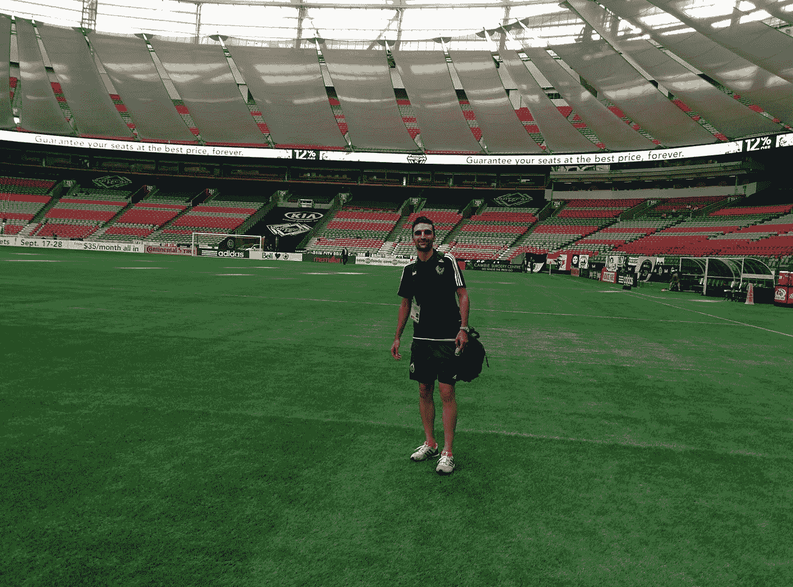
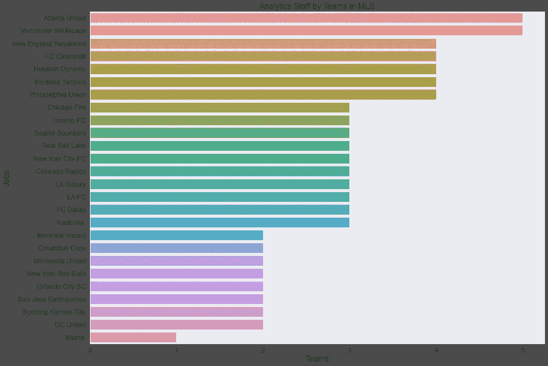
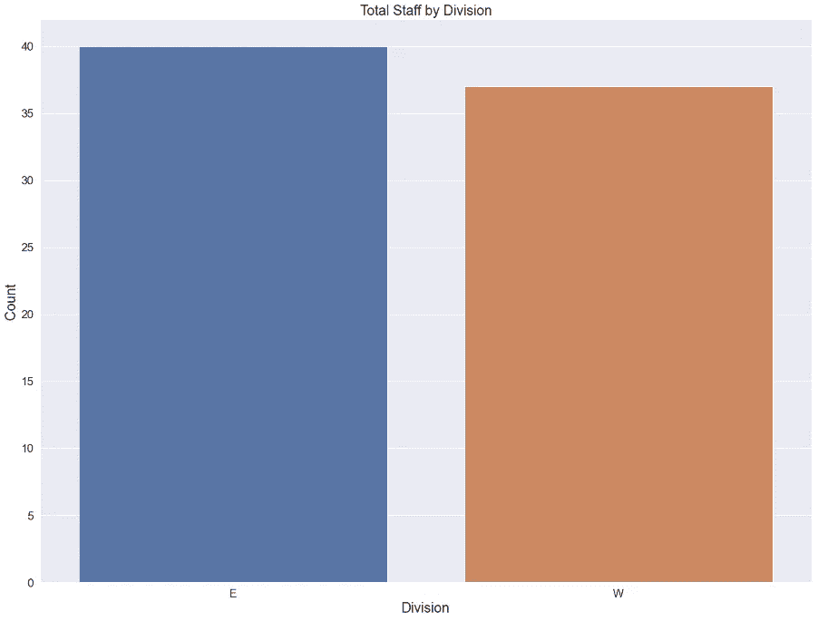
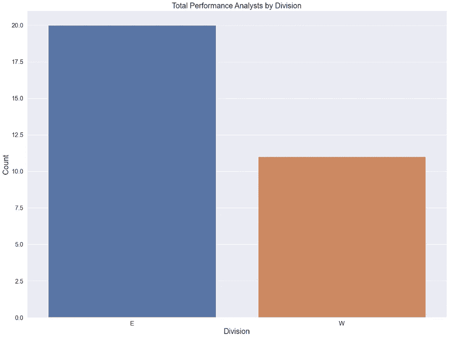
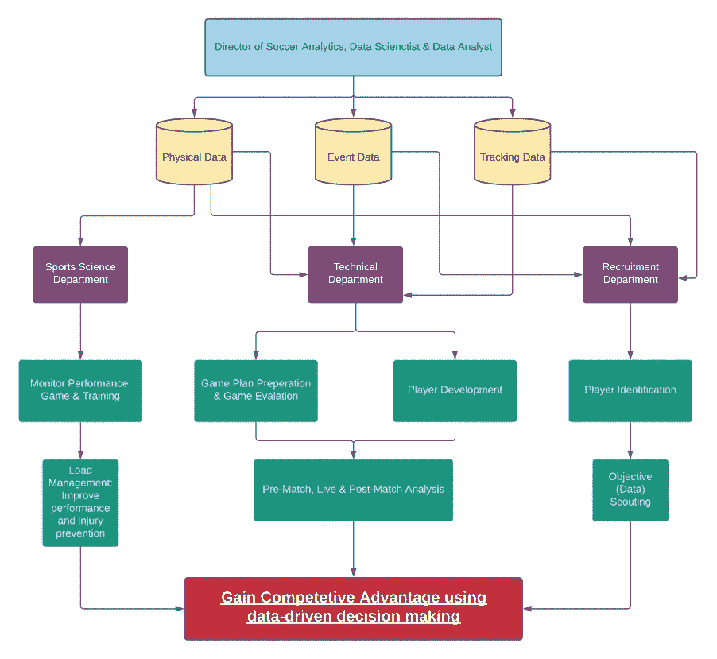

# 美国职业足球大联盟分析的现状

> 原文：<https://towardsdatascience.com/major-league-soccer-analytics-9fc76891c440?source=collection_archive---------31----------------------->

作者图片

# **目标:**

在此分析中，目标是检查美国职业足球大联盟(MLS)的当前分析状态。俱乐部如何构建他们的分析部门，什么样的职位需要数据相关的任务。大部分美国职业棒球大联盟的特许经营权遵循的文化是在俱乐部的业务方面成为数据驱动的决策者。然而，越来越多的俱乐部在体育方面的决策中使用数据。这份报告的重点是从足球运营的角度。凭借在 MLS 超过四年的分析经验，我想分析联盟内的分析现状。我试图回答的问题如下:

*   每个团队目前的人员配备情况如何？具体来说，我们只关注与数据相关的职位。
*   东部联盟和西部联盟在人员配备上有区别吗？
*   足球运营中不同部门的数据是如何流动的？

作者图片

# 方法:

**数据收集:**第一步是收集数据以进行分析。我自己从每个俱乐部的网站和通过我在 MLS 分析社区的联系人收集数据。**注意:**迈阿密 FC 过去没有发布任何关于他们分析人员的信息。我不得不使用 LinkedIn 和其他平台自己做一些研究。

**变量:**下面是数据集中所有变量的列表。我还解释了所有的变量，以及一个人要成为那个特定角色的成功候选人需要什么样的技能。

**球队:**分析包括所有参加过 2020 MLS 赛季的球队。

*   亚特兰大联队
*   芝加哥大火
*   科罗拉多急流
*   哥伦布船员
*   华盛顿联合航空公司
*   辛辛那提足球俱乐部
*   达拉斯足球俱乐部
*   休斯顿迪纳摩
*   洛杉矶足球俱乐部
*   洛杉矶银河
*   迈阿密 CF
*   明尼苏达联合队
*   蒙特利尔影响
*   南卡罗来纳州纳什维尔
*   新英格兰革命
*   纽约市足球俱乐部
*   纽约红牛队
*   奥兰多市 SC
*   费城联盟
*   波特兰木材公司
*   真正的盐湖
*   圣何塞地震
*   西雅图海湾者
*   堪萨斯城体育
*   多伦多足球俱乐部
*   温哥华白浪

**体育表演科学负责人:**需要有很强的分析能力。评估受伤运动员的状况时，绩效科学家需要观察受伤情况，并正确分析和解释数据，以确定其程度。

**运动科学家/表现专员:**需要有很强的分析能力，收集和提取数据。体育科学家负责监控运动员的表现，跟踪身体数据，以评估疲劳程度，防止受伤。除了技术和分析技能，他们还需要领导和发展健身训练计划。

**足球分析/数据科学总监:**需要收集和处理数据进行分析。足球分析总监负责将分析和数据科学整合到俱乐部的每个足球方面，包括对手分析、国内和国际球员招募以及表现预测。通常管理绩效分析师和数据分析师。

**绩效分析师:**需要有很强的分析能力。性能分析师负责赛前和赛后分析。性能分析师还负责现场比赛日编码和编辑比赛和训练镜头以供分析。创建各方面性能的报告。向工作人员和运动员解释成绩数据。此外，负责保持统计和视频数据库的更新。

**数据分析师:**需要成为从数据库和其他技术中收集和提取数据的技术专家。职责包括设计和维护数据库，从各种来源挖掘数据，使用统计工具解释数据集，并为员工、球员和行政领导准备报告。

**视频/数据分析师:**参见上文对性能分析师和数据分析师的描述。预算较低的俱乐部雇佣一个人负责视频和数据分析。

**总经理/总经理助理:**随着技术的发展和职业体育特许经营使用更多的数据，总经理需要具备良好的分析技能。他们不处理原始数据，但需要理解和解释在数据帮助下开发的解决方案。数据分析师或绩效分析师被提升为总经理助理甚至总经理的趋势越来越明显。

球探总监/技术总监/助理蔻驰:对教练、球探和技术总监的需求也增加了。他们需要更加适应 Wyscout、Instat、Opta 等技术和平台。越来越多的趋势是助理教练进行视频分析，而不是全职的视频分析师。

**赛区:**球队分为东部(E)赛区和西部(W)赛区。

# 结果:

截至 2021 年 1 月 14 日，亚特兰大联队和温哥华白浪队在日常任务中在一定程度上使用数据的员工最多。

作者图片

Atlanta United 有一名头衔为“运动性能科学总监”的员工、三名性能分析师和一名足球分析总监。Whitecaps 还有一名头衔为“运动性能科学总监”的员工、两名性能分析师和两名数据科学家。平均而言，每个俱乐部的足球运营部门都有三名全职员工处理数据。

作者图片

当我们按会议(东部和西部)查看员工总数时，我们可以看到两个会议非常接近。东部联盟有 40 名工作人员，西部联盟共有 37 名。一个让我印象深刻的数字是，东部联盟团队中拥有“绩效分析师”头衔的员工几乎是其他团队的两倍。东部联盟球队有 20 名性能分析师，西部联盟球队总共有 11 名。

作者图片

一般来说，关于足球运营中不同部门之间的数据流动，MLS 内的团队之间有一个标准的组织结构。至少有一名在足球操作方面技术熟练的雇员处理原始数据。此人可以是数据科学家、数据分析师或足球分析总监。这很难想象，但你会不时发现没有内部分析部门的俱乐部。然而，他们找到了不同的方法来运行他们的分析。例如，圣何塞地震与当地大学合作，支持他们的分析，或者俱乐部聘请第三方提供商进行分析，就像芝加哥火灾过去所做的那样。

作者图片

当我们看上面的数据流程图时，我们看到三种不同类型的数据。在足球比赛中，数据分为物理数据、事件数据和跟踪数据。为了更好地理解数据如何在不同部门流动，我们首先需要理解每个部门的含义。

**身体数据:**可以想象，身体数据为我们提供了球员身体表现的信息。比如速度、走过的距离、心率等。

**事件数据:**这种类型的数据描述了球上发生的事情。事件数据可以是射门、传球、传中、铲球等。

**追踪数据:**在这里，我们描述所有球员在球上和球下的位置坐标。

如今，事件数据随处可见。大联盟的大多数球队都和 Opta，Instat，Wyscout 合作。另一方面，物理信息通过可穿戴设备变得可用，例如安装在体育场内的弹射器或摄像头。MLS 在 2020 年初与 Second Spectrum 合作，后者使用机器学习和人工智能来收集跟踪、身体和事件数据。结果，光学跟踪系统不得不安装在每个大联盟体育场。点击[此处](https://www.secondspectrum.com/index.html)查看第二光谱能提供什么。

如数据流程图所示，数据流经足球运营部门的三个不同部门。一个是体育科学部，两个技术部，三个招聘部。

流经体育科学部的数据主要是身体数据。目的是管理运动员在训练和比赛中的负荷，最终目的是提高成绩和防止受伤。技术和招聘部门在其分析中包括所有三种不同类型的数据。教练将事件数据和关于对手分析、比赛评估或运动员发展的跟踪数据结合起来。除此之外，技术人员还通过他们的现场比赛分析来使用数据。体育数据主要用于根据运动科学团队的建议制定训练计划。招聘部门在日常工作中也包括所有三种数据类型。事件数据主要用于识别玩家的开始阶段。例如，如果一个俱乐部正在寻找一名前锋，一名特定前锋的进球记录是人们首先要看的统计数据。举例来说，如果一个前锋在过去的两个赛季里没有进球，你会认为他不能胜任他的工作。一旦确定了一个玩家，就可以更详细地使用所有三种数据类型。回到我们的前锋例子，身体数据可以方便地看到前锋平均走了多远。如果前锋努力无球跑动，这可能会帮助球探回答这个问题。当涉及到球员比较时，跟踪数据也变得很方便。你可以和其他前锋比较坐标，看看他们的动作是否相似。最终，每个部门的最终目标都是让俱乐部获得相对于其他团队的竞争优势。

# 结论:

基于我们在数据和研究中的发现，我们可以得出以下结论:

*   平均而言，MLS 中的俱乐部在足球运营部门有三名员工以某种身份处理数据。
*   这两个会议中与数据相关的员工数量几乎相等(东部 40 人，西部 37 人)。
*   东部联盟的性能分析师几乎是西部联盟的两倍。(东部 20 人，西部 11 人)。亚特兰大联队和纽约市足球俱乐部在一线队级别的每个俱乐部的绩效分析师总数方面领先。两者一共三个。
*   即使大多数 MLS 俱乐部在如何将数据和分析纳入运营程序方面有相似的结构，一些球队仍然以不同的方式做事。例如，如上所述，圣何塞地震队是联盟中唯一一个在分析方面完全依赖当地大学合作的团队。身在硅谷很有帮助，因为周围当地大学里精通技术的学生数量和人才储备都很高。尽管许多大联盟俱乐部与当地大学有合作关系，但地震俱乐部是唯一没有内部分析部门的俱乐部。
*   即使大多数俱乐部都有全职的表现分析师，但也有一些俱乐部的助理教练完全负责视频分析。再次，一个例子是圣何塞和他们现任主教练马迪亚斯·阿尔梅达或国际米兰，他们的视频分析师上赛季是他们教练组的一部分。
*   有一种趋势是，以前的绩效分析师或其他数据相关职位晋升为助理总经理或总经理。仅举几个例子，蒙特利尔影响，LAFC，科罗拉多急流，都有来自分析背景的总经理或助理总经理。

我希望这篇分析很有见地，能让你更好地理解 MLS 内部的分析现状。如果你对这个话题有任何问题或者有任何反馈，请随时联系我。如果你能在任何社交媒体平台上分享它，我将不胜感激。谢谢你，下次再见 time️！✌️

*   关联 GitHub:[https://github.com/navido89/MLS-Current-State-Analytics](https://github.com/navido89/MLS-Current-State-Analytics)

<https://www.navidma.com/> 