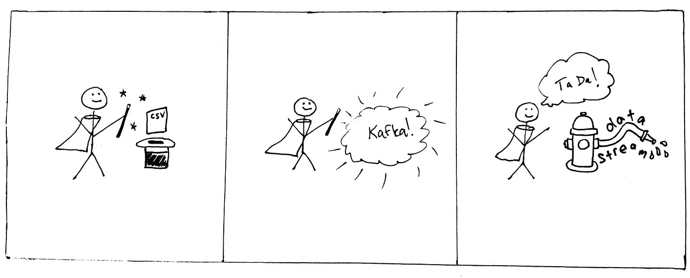

# 用 Python 和 Kafka 制作一个模拟的“实时”数据流

> 原文：<https://towardsdatascience.com/make-a-mock-real-time-stream-of-data-with-python-and-kafka-7e5e23123582?source=collection_archive---------5----------------------->

## 这是一个 Dockerized 教程，提供了将带有时间戳的. csv 文件转换成 Kafka 流所需的一切



阿布拉卡-卡夫卡！(作者画的漫画很差。)

随着越来越多的数据科学工作转向实时管道，数据科学家需要学习编写流分析。虽然有一些伟大的、用户友好的流数据管道工具存在(我最喜欢的显然是 Apache Kafka。)如果没有一个友好的开发环境来实际生成可以测试您的分析的数据流，就很难开发流分析的代码。

# 实时数据流的简单方法

本文将介绍如何部署一个简单的基于 Python 的 Kafka producer，它从带有时间戳的. csv 文件中读取数据，将数据转换成实时(或者说，实际上是“实时”)Kafka 流，并允许您编写自己的消费者，以便对数据流应用函数/转换/机器学习模型/任何您想要的东西。

# 佐料

所有资料均可在我的 GitHub [时间系列-卡夫卡-demo](https://github.com/mtpatter/time-series-kafka-demo) repo 中获得。接下来，将 repo 克隆到您的本地环境中。您可以在系统上仅运行 Docker 和 Docker Compose 来运行该示例。

回购有几个不同的组成部分:

*   一个[Docker 文件](https://github.com/mtpatter/time-series-kafka-demo/blob/main/Dockerfile)，可用于构建本教程的 Docker 映像(如果您不想在本地安装[需求](https://github.com/mtpatter/time-series-kafka-demo/blob/main/requirements.txt)，这也是可选的)
*   一个 [Docker 编写](https://github.com/mtpatter/time-series-kafka-demo/blob/main/docker-compose.yml)文件来运行 Kafka 和 Zookeeper (Kafka 的朋友)
*   一个[示例 csv 数据文件](https://github.com/mtpatter/time-series-kafka-demo/blob/main/data/data.csv)显示了输入时间戳数据的格式
*   用于生成数据文件的 [Python 脚本](https://github.com/mtpatter/time-series-kafka-demo/blob/main/data/makeData.py)
*   读取数据并向 Kafka 发送消息的 [Python 脚本](https://github.com/mtpatter/time-series-kafka-demo/blob/main/bin/sendStream.py)
*   Python 中的一个例子 [Kafka 消费者](https://github.com/mtpatter/time-series-kafka-demo/blob/main/bin/processStream.py)将数据打印到屏幕上

# 方向

将 repo 和 cd 克隆到目录中。

```
git clone https://github.com/mtpatter/time-series-kafka-demo.git
cd time-series-kafka-demo
```

## 启动卡夫卡经纪人和动物园管理员

合成文件从 Confluent 的 Docker Hub 存储库中提取 Kafka 和 Zookeeper 版本 6.2.0 的 Docker 映像。(必须固定您的版本！)

```
docker compose up
```

这使得 Kafka 和 Zookeeper 在同一个 Docker 网络上开始相互对话。Kafka 代理可以在端口 9092 上本地访问，因为合成文件将本地端口绑定到内部镜像端口。

## 构建 Docker 映像(可选地，为生产者和消费者)

如果您不想在 requirements.txt 文件中安装 Python 模块，您可以为生产者和消费者脚本使用 Docker 映像。

从主根目录:

```
docker build -t "kafkacsv" .
```

这个命令现在应该可以工作了:

```
docker run -it --rm kafkacsv python bin/sendStream.py -h
```

## 启动消费者

我们将首先启动一个消费者来模拟“实时”打印来自流“my-stream”的所有消息。我们在生产者之前启动消费者的原因是，生产者将在每个有时间戳的数据点之间及时再现所有的“暂停”。如果在生产者之后启动消费者，消费者将立即处理队列中已经存在的所有消息。但是如果你喜欢，就去做吧。\_(ツ)_/

```
python bin/processStream.py my-stream
```

或使用 Docker:

```
docker run -it --rm \
      -v $PWD:/home \
      --network=host \
      kafkacsv python bin/processStream.py my-stream
```

消费者主要功能的相关代码如下。请注意，我捕获了未知主题错误消息，并让使用者创建新主题。还要注意，在这个例子中，键盘中断将帮助您关闭消费者。

## 产生数据流的时间序列

如果您检查数据文件，它有两列:时间戳和(随机产生的)数据值。

```
timestamp,value
2021-01-01 00:00:00,51
2021-01-01 00:00:04,60
2021-01-01 00:00:06,82
2021-01-01 00:00:07,86
2021-01-01 00:00:11,99
2021-01-01 00:00:12,23
2021-01-01 00:00:21,63
2021-01-01 00:00:23,20
2021-01-01 00:00:24,32
```

现在(在另一个终端 shell 窗口中)，我们将把时间序列从 data/data.csv 发送到主题“my-stream”默认情况下，第二条消息将在第一条消息 4 秒后发送，第三条消息将在 2 秒后发送，依此类推。就像我们回到了过去！(提示休易·路易斯和新闻。)

```
python bin/sendStream.py data/data.csv my-stream
```

或使用 Docker:

```
docker run -it --rm \
      -v $PWD:/home \
      --network=host \
      kafkacsv python bin/sendStream.py data/data.csv my-stream
```

你也可以加快速度，因为为什么不呢？下面是将速度提高 10 倍的命令:

```
python bin/sendStream.py data/data.csv my-stream --speed 10
```

下面是 main 函数的相关代码，展示了时间序列数据到 json 的转换。我们这样做是因为它将保留类型，在这种情况下，数据值中的浮点将保持浮点状态。

如果您观察消费者的输出，它看起来会像这样:

```
python bin/processStream.py my-stream
2021-08-27 15:54:44 {'2021-01-01 00:00:00': 51.0}
2021-08-27 15:54:48 {'2021-01-01 00:00:04': 60.0}
2021-08-27 15:54:50 {'2021-01-01 00:00:06': 82.0}
2021-08-27 15:54:51 {'2021-01-01 00:00:07': 86.0}
2021-08-27 15:54:55 {'2021-01-01 00:00:11': 99.0}
2021-08-27 15:54:56 {'2021-01-01 00:00:12': 23.0}
2021-08-27 15:55:05 {'2021-01-01 00:00:21': 63.0}
2021-08-27 15:55:07 {'2021-01-01 00:00:23': 20.0}
2021-08-27 15:55:08 {'2021-01-01 00:00:24': 32.0}
```

看看吧！这个输出是 msg_process()函数的结果，它只打印当前时间和带有时间戳和数值的 json 数据。请注意，接收到的消息保留了这些暂停。msg_process()函数如下所示:

实际的数据输入(带有时间戳的键和值的值的 json，可能应该以不同的方式命名)可以在每个 Kafka 消息中通过调用。值()。

我在这里提供的消费者显然非常简单，因为它所做的只是打印到屏幕上，但是您可以很容易地将 msg_process()函数替换为您想要应用于每个数据点的函数。我推荐使用 json(或者 Apache Avro，如果你想了解模式等等。)因为，就像我说的，它将保留类型。

## 关闭并清理

用 Return 和 Ctrl+C 停止消费者/生产者。

关闭 Kafka 经纪人系统:

```
docker compose down
```

就是这样！希望这就是开始用 Python 编写自己的流数据分析所需的全部内容。