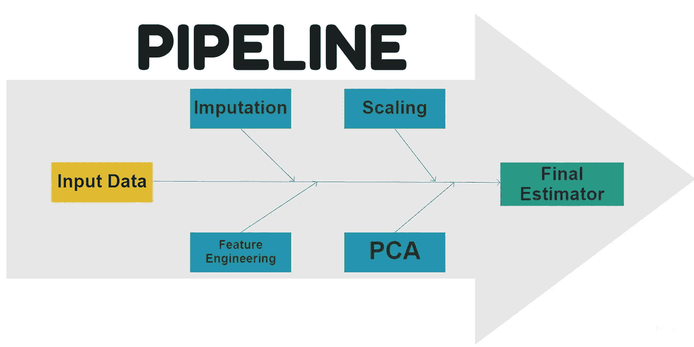
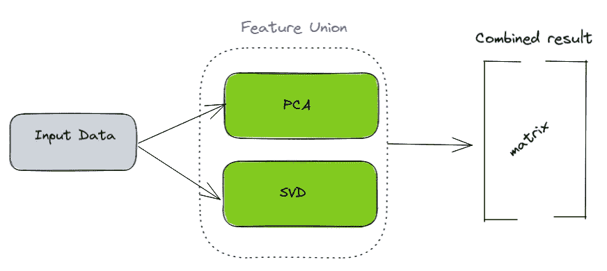
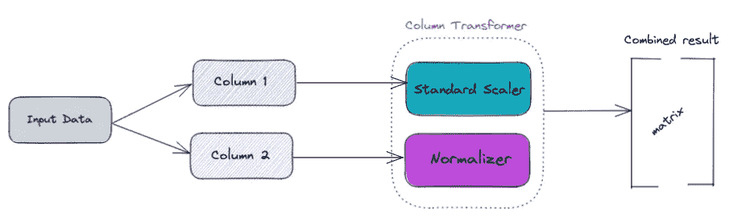
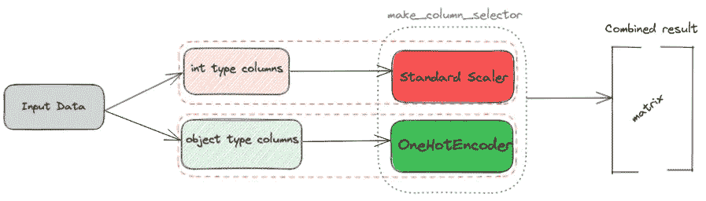

# 用 Sklearn 管道做一个坚如磐石的 ML 模型！

> 原文：<https://towardsdatascience.com/make-a-rock-solid-ml-model-using-sklearn-pipeline-926f2ccf4706?source=collection_archive---------15----------------------->

## 为什么、如何以及何时使用 Sklearn 的管道！

照片由[西格蒙德](https://unsplash.com/@sigmund?utm_source=medium&utm_medium=referral)在 [Unsplash](https://unsplash.com?utm_source=medium&utm_medium=referral) 拍摄

如果你正在建立一个预测模型，并在没有任何预处理步骤(如清理数据、输入缺失值)的情况下达到预期的精度，那么你恰好是世界上最幸运的人！但是，除非您执行大量的转换和预处理，否则今天的大多数数据都不会说话。涉及到几个步骤，从预处理、转换到建模。当将这些模型投入生产时，我们必须构建一个可以无中断运行的健壮流程，这一点很重要。这就是 Sklearn Pipeline 和其他支持组件发挥作用的地方。

## 为什么要用 Sklearn 管道？

我会旋转 Jupiter 笔记本，开始探索我的数据，创新新功能，执行预处理，如清理、缩放等。在输入模型之前。然而，我知道在 Jupyter 或类似的 ide 中这样做可能会变得一团糟。在 Jupyter 笔记本中创建一个自动化路径比按 Shift+Enter 更有意义。使用 Sklearn Pipeline 是一种方便的方法，可以通过预处理步骤来执行这些步骤，并确保代码的可再现性。

如果企业每天都依赖机器学习模型来做出决策，生产模型的不稳定和不一致的结果会对企业产生重大影响。

> 我不是“Jupyter haters 粉丝俱乐部”的成员；我自己构建了 Jupyter Notebook 中的所有内容，然后将其转换为集成 Sklearn 管道的 Python 脚本！

## 一般 Sklearn 管道工作流程:

如果我们看一个端到端机器学习管道的一般化图表，它看起来会像下面这样:

一旦提供了数据，

*   我们做插补——用平均值、中间值等填充缺失值。
*   接下来是一些特性工程，比如为缺失值创建一个标志，为所提供的分类特性创建 groupby 均值，等等。可以做到。
*   可以使用缩放/归一化来帮助算法更快地收敛，并且可以使用 PCA 来去除一些噪声。
*   最后，对数据进行估计。你可以使用*管道*来生成对未知数据的预测。

Sklearn 的*管道* 集成了上面提到的所有组件，并编排了交付模型的流程。如果我们想一想，不同的乐高积木如何有助于实现你的最终产品，不同的积木在*管道*中和谐地组合在一起，使其发挥作用！让我们一起来简单了解一下几种常用的变压器:

*   **Pipeline:** 它是一系列步骤的集合，包括帮助机器学习工作流程自动化的最终估计器。上图是*管道*的一个例子。
*   **特征联合:**数据流不是线性的，需要多个东西一起预处理。它并行执行所有函数，并将最终结果粘贴在一起。当您想要对一列应用不同的转换时，请使用它。

作者创造的形象

*   **Column Transformer:** 帮助组合应用于不同列的不同类型的转换，并将它们连接起来。

作者创造的形象

*   **make_column_selector:** 这个 Lego 块有助于根据数据类型选择多个列。Regex 也可以用于选择列。

作者创造的形象

*   **简单估算器:**该转换器可用于用平均值、中值、最频繁值或常数来填充缺失值。
*   **BaseEstimator，TransformerMixin:** 您可以使用这些基类来创建您的转换器。TransformerMixin 主要用于实现一个转换方法。
*   **FunctionalTransformer:** 这有助于将用户定义的函数转换成易于使用并与*管道*集成的函数。

## 简短示例:

让我们在乳腺癌数据集上做一个小的实现，看看使用*管道*时会有什么不同。

**正常 ML 代码:**

**实施管道:**

正如我们从上面的代码中看到的，有几件事很突出:

*   清洁和质量代码
*   易于复制
*   裁员实践中的失业

## 一些优势:

## 可读性和再现性

*   可读性是机器学习领域经常被忽视的一个方面。比起关注代码的质量，我们更重视取得成果。代码必须是任何用户/同事在他们的实践中容易想到的，并与你分享。
*   此外，重要的是，编写的代码在以相同的步骤反复运行时能够产生相同的结果。当在代码中进行小的调整以获得更好的 ML 模型而不干扰所有组件时，这非常有帮助。

## 标准化的工作流程—减少数据泄露的机会

*   当使用*管道*拟合数据时，工作流程变得非常规范，发生数据泄露的机会也更少。数据泄漏是 ML 从业者在将模型投入生产时面临的最大障碍之一。

## 出错时易于调试

*   您的管道可能会抛出错误或导致失败。在这种情况下，如果你的代码是干净有效的，那么找出问题的根源就变得更加容易了！

## **可重用性**

*   您可以根据新项目的要求，稍加调整，将已经建成的*管道*移植到一个项目中。这提高了我的效率，帮助我专注于整个 ML 管道的不同部分。

## **更多应用**

*   我们可以结合管道使用网格搜索
*   使用像 Dask 这样的库将它们并行化。
*   您可以使用多个估算器运行一个循环，并对每个估算器使用*管道*。

最后但同样重要的是，Sklearn Pipeline 应该真正集成，并成为工作流的重要组成部分。我已经构建了几个项目，并广泛使用了它们。它们的扩展或应用是无限的，如果使用，它们可以成为一个很好的工具！感谢您的宝贵时间！

在 [Twitter](https://twitter.com/pratikkgandhi) 或 [LinkedIn](https://www.linkedin.com/in/pratikkgandhi/) 上关注我。你也可以通过 pratikkgandhi@gmail.com 联系我