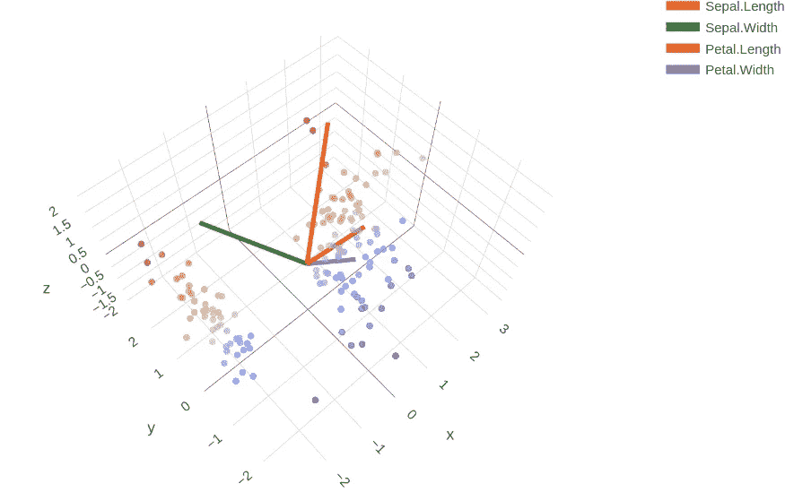

# 在 R 中制作漂亮的 3D 情节——对讲故事的增强

> 原文：<https://towardsdatascience.com/make-beautiful-3d-plots-in-r-an-enhancement-on-the-story-telling-613ddd11e98?source=collection_archive---------1----------------------->

## 示例和数据解释


3D 可视化通常比平面可视化更好用。两张图片[来自](https://unsplash.com/photos/b5S4FrJb7yQ) [Unsplash](https://unsplash.com/photos/uXzYu8Pxcqc)

为什么要数据可视化？当我们处理统计数据时，无论我们正在处理什么数据，使用什么模型，数据可视化总是工作中不可避免的一部分。有时我们可能只是机械地制作图表，低估了可视化的重要性。事实上，数据的可视化不仅使数据更容易消化，而且比文本形式和描述性统计数据告诉我们更多。安斯科姆的四重奏就证明了这一点。

为什么是 3D？有时一个 2D 图(或多个图)可以包含我们需要的足够信息，但是 3D 图通常更直观，因为 3D 空间是我们居住的地方。这就像我们通常在地理教科书中看到的地图或地图集的 2D 投影，但地球仪总是更容易使用——更有趣，更直观。此外，在统计学中，我们经常会遇到更高维度的空间(大于 3 维)，3D 可视化可以帮助我们在更高维度的空间中进行概括。

本文将介绍一些有用的 3D 绘图类型，即 *3D 表面图*、 *3D 线条图*和 *3D 散点图*，它们将使用库`plotly`或`rgl`来实现。此外，我们将看一下图表的**解释**——我们应该知道图表的含义，因为我们不仅仅是在制作精美的图片。

# 3D 表面图


图 1.1 使用来自[plotly.com](https://plotly.com/r/3d-surface-plots/)的代码制作的图像

使用`plotly`库中的`plot_ly`函数制作的 3D 表面图非常适合可视化地理数据。使用文档中的代码片段，我们可以从内置的数据集`volcano`中绘制出一个非常真实的火山。这个数据很容易解释。数据集包含奥克兰 Maunga Whau 火山的地形信息，以 61×87 矩阵的形式显示。矩阵中的每个元素都是火山在 10 乘 10 的网格中的高度。所以，剧情的结果就是火山的形状。不仅是地理数据(高度)，我们还可以用它来表示密度，例如概率密度。首先，我们生成一个概率分布矩阵。

```
# simulate joint probability distribution (normal)
num.rows <- 60
num.cols <- 60simulate <- function(n.row, n.col) {
  # initiate the matrix
  prob.n <- matrix(0, nrow=num.rows, ncol=num.cols)

  x.seq <- seq(1, n.row)
  y.seq <- seq(1, n.col)

  xx <- dnorm(x.seq, mean=n.row/2, sd=12)

  for (i in 1:n.row) {

    y <- dnorm(i, mean=n.row/2, sd=12)
    prob.n[i,] <- y * xx
  }
  prob.n;
}res <- simulate(num.rows, num.cols)
```

在这个例子中，我们模拟了两个正态分布的独立变量的联合概率。我们可以使用下面的代码来绘制图形，它将输出图 1.2 (a)

```
# 3D plot of joint probability distribution without projection
fig.n <- plot_ly(z = ~res)
fig.n <- fig.n %>% add_surface()
fig.n
```

或者我们可以在 x-z 和 y-z 平面上添加投影，这是通过属性`contour`设置的。

```
# add projection
fig.nc <- plot_ly(z = ~res,
     contours = list(
       z = list(
         show=TRUE,
         usecolormap=TRUE,
         highlightcolor="#ff0000",
         project=list(z=TRUE)
       ),
       y = list(
         show=TRUE,
         usecolormap=TRUE, 
         highlightcolor="#ff0000",
         project=list(y=TRUE)
       ),

       x = list(
         show=TRUE,
         usecolormap=TRUE,
         highlightcolor="#ff0000",
         project=list(x=TRUE)
       )
     )
  )
fig.nc <- fig.nc %>% add_surface()
fig.nc
```

`highlightcolor`参数决定当光标悬停在图形上时，图形轮廓的高亮颜色。在这种情况下，它被设置为红色。图表告诉我们什么？X 和 Y 轴表示随机变量 X 和 Y，它们具有正态分布。z 轴显示 X 和 Y 的联合概率——X 和 Y 取特定值的概率(P(X=x，Y=y))，这决定了图 2.2 中“山丘”的高度。在我们的例子中，由于 X 和 Y 是独立的，根据*独立性*的定义，P(X=x，Y=y) = P(X=x)P(Y=y)。如果 X 和 Y 具有不同的标准偏差，则其中一个投影会较宽，另一个会较窄，山丘的横截面将是椭圆形，而不是圆形。

但是我们需要小心 x-z 和 y-z 平面上投影的含义。看起来它们是 X 和 Y 的边际概率，但事实上，它们不是。投影只告诉我们 P(X=x 和 Y=y)相对于 X 和 Y 的相应值。但是，X 或 Y 的边际概率应该是行或列的总和(想想边际概率表)。


图 1.2 (a)联合分布(b)轮廓(c)悬停在图像上的联合分布将导致高亮颜色显示。图片由作者提供。

此外，我们可以使用一个颜色代码向量，通过`colors`属性来定义定制颜色。在图 1.3 中，颜色模板由[coolers](https://coolors.co/)生成。

```
color.vec2 <- rev(c("#F2DC5D", "#F2A359", "#DB9065", "#A4031F", "#240B36"))
# color.vec2 <- rev(c("#F7AEF8", "#B388EB", "#8093F1", "#72DDF7", "#F4F4ED"))
fig.n2 <- plot_ly(z = ~res, colors=color.vec2)
fig.n2 <- fig.n2 %>% add_surface()
fig.n2
```


图 1.3 自定义颜色。图片由作者提供。

# 3d 线图和瀑布图

当我们想要很好地显示多条线时，3D 线图会非常有用。它使我们能够在一个图形中展示多种趋势，省去了设计更多图形的麻烦，也增加了美感(这是一点个人看法)。我们以美国的电力消耗数据为例，3d 折线图有助于在同一个图表中展示不同年份和月份的电力使用趋势。

```
# plot of the electricity usage in the US
data.us <- usmelec
dmn <- list(month.abb, unique(floor(time(data.us))))
# convert to data frame by month, to make data retrieval easier
res.us <- as.data.frame(t(matrix(data.us, 12, dimnames = dmn)))# set the values of the 3d vectors
n <- nrow(res.us)
x.us <- rep(month.abb, times=n)
y.us <- rep(rownames(res.us), each=12)z.us <- as.numeric(data.us)
# we need to append two values to the vector
# converted from the time series and we let them
# equal to the last value in the time series so the
# shape of the graph will not be influenced
n.z <- length(z.us)
z.us[n.z+1] = z.us[n.z]
z.us[n.z+2] = z.us[n.z]data.us <- data.frame(x.us, y.us, z.us)
colnames(data.us) <- data.frame("x", "y", "z")fig.us <- plot_ly(data.us, x = ~y, y = ~x, z = ~z, 
                 type = 'scatter3d', mode = 'lines', color=~y.us)
# to turn off the warning caused by the RColorBrewer
suppressWarnings(print(fig.us))
```

在本例中，数据存储为时间序列，这需要花费一些精力来设置 x、y 和 z 轴的值。幸运的是，这可以简单地使用`rep`函数来完成。


图 2.1 美国用电量的 3D 线图。图片作者/

从 y-z 平面我们可以看到，从 1973 年到 2010 年，人们普遍使用越来越多的电力，从 x-z 平面我们可以看到全年的用电量是如何分布的(这实际上就是所谓的[季节性](/deep-understanding-of-the-arima-model-d3f0751fc709?sk=320185a650cea254eb9920d48869aaec)，一些时间序列所具备的一个非常重要的属性)。

**瀑布图**(它不同于 3D 线图，因为在 3D 线图中不必有多条线——可以简单地有一条线穿过 3D 空间)是一个 3D 图，其中同时显示多条曲线。通常，它用于显示光谱，例如，显示离散傅立叶变换的结果。在 R 中，这可以通过使用`lines3d`来实现。下面的代码生成了一个 10 元素数组经过复数傅里叶变换后的频率分量图。

```
# For displaying the result
options(rgl.printRglwidget = TRUE)x.f <- c(5, 4.2, 9, 3, 5.5, 8.2, 4.8, 6.4, 11, 10.2, 8.9, 10.9)
res.f <- fft(x.f)nx <- length(x.f)
ny <- 70xx <- seq(0, nx, by = 1)
yy <- seq(0, 1, length = ny)aspect3d(4, 2.5, 1)
axes3d()cols <- c("#CBE896", "#AAC0AA", "#FCDFA6", "#A18276", "#F4B886", "#DD99BB", "#7F5A83", "#A1D2CE", "#78CAD2"
          , "#62A8AC", "#5497A7", "#50858B")
for (i in 1:nx) {
  c <- x.f[i]
  a <- Im(res.f[i])[1]
  b <- Re(res.f[i])[1]
  lines3d(yy, xx[i], c*(sin(a*xx) + cos(b*xx)), col=cols[i], lwd=2)
}
```

上述代码的输出如图 2.2 所示。为了运行代码，库`rgl`是必要的。与之前的示例(图 2.1)不同，这些线是在一个循环中一条一条添加的，而不是立即在 3D 空间中设置点的位置。


图 3.2 频率成分。图片由作者提供。

我们也可以使用瀑布图来显示密度。这可以通过函数`slicedens`来实现，该函数可以从 GitHub 库 [BivariateSlicer](https://github.com/EconometricsBySimulation/BivariateSlicer/blob/master/slicedens.R) 中获得。我们可以使用`source`函数立即导入整个源文件，但是其中的一些例子可能无法正常运行。所以，还是直接运行函数比较好。`slicedens`使我们能够在数据中制作切片，并在一个 3D 绘图中呈现它们。

我们使用艾姆斯住宅数据集作为例子，它可以从 [Kaggle](https://www.kaggle.com/prevek18/ames-housing-dataset) 获得。

```
housing <- read.csv2(file='data/AmesHousing.csv', header=TRUE, sep=',')
housing
summary(housing$Gr.Liv.Area)
ground <- housing$Gr.Liv.Area
price <- housing$SalePriceplot(ground, price, cex=.2, col="deepskyblue3", xlab="Above grade living area", ylab="Price")fcol <- c(.3, .8, .8,.12)
lcol <- c(0.1, 0.5, 0.4,.1)
slicedens(ground,price,
          fcol=fcol, bcol='white', lcol=lcol,
          gboost=0.015)
```

数据用散点图表示，如图 2.4 所示


图 2.4 房价散点图。图片由作者提供。

想象一下，把散乱的数据切割成几个水平的块，其中一些包含的点多一些，一些少一些。将切片排列成单个图后，结果如图 2.5 所示。

图 2.5 中的图看起来很漂亮，但这可能不是呈现散点数据的最佳方式。当然，我们可以从该图中看到密度分布，但与图 2.4 相比，图 2.5 似乎不那么清晰——我们无法确定哪个区域和价格范围最常见。在这种情况下，如图 2.4 所示的 2D 散点图可能更好。但是因为好看的视觉效果和`slicedens`有趣的想法，这篇文章里也介绍了这个 3D 剧情。


图 2.5 房价瀑布图。图片由作者提供。

# **3d 散点图**

散点图是表示离散观察值的好方法。我们以埃德加·安德森的鸢尾数据为例，给出了三种鸢尾的萼片和花瓣的长度和宽度。这通常也用于演示 PCA(主成分分析)。我们将使用下面的代码来绘制花的特征和组件向量的散点图。代码是[这个](https://stackoverflow.com/questions/44393823/3d-biplot-in-plotly-r)的修改版。如果你不太了解 PCA，也不用担心，它背后的数学需要一些时间来解释，但这个想法很简单——这是一种有助于以最小的信息损失减少数据集维数的技术。

```
# iris data
summary(iris)
iris$Species <- factor(iris$Species,
                       levels = c("versicolor","virginica","setosa"))
pca <- princomp(iris[,1:4], cor=TRUE, scores=TRUE)# Scores
scores <- pca$scores
x <- scores[,1]
y <- scores[,2]
z <- scores[,3]# Loadings
loads <- pca$loadingsscale.loads <- 3p <- plot_ly() %>%
  # the scatter plot of the data points 
  add_trace(x=x, y=y, z=z,
            type="scatter3d", mode="markers",
            marker = list(color=y, 
                          colorscale = c("#FFE1A1", "#683531"), 
                          opacity = 0.7, size=2))ns <- rownames(loads)
# add the vectors of the components
for (k in 1:nrow(loads)) {
  x <- c(0, loads[k,1])*scale.loads
  y <- c(0, loads[k,2])*scale.loads
  z <- c(0, loads[k,3])*scale.loads
  p <- p %>% add_trace(x=x, y=y, z=z,
                       type="scatter3d", mode="lines",
                       line = list(width=8),
                       opacity = 1, name=ns[k]) 
}
# display the graph
print(p)
```

3D 散点图可以很好地帮助我们了解数据的分布以及“组件”所扮演的角色。



图 3.1 虹膜数据集的 3D 图以及组件的方向。图片由作者提供。

在图 3.1 中，数据没有聚类(按物种着色)，颜色只是沿着 y 轴变化。为了绘制聚类数据，我们可以很容易地使用函数`plot_ly`来完成。

```
p <- plot_ly(iris, x=~Sepal.Length, y=~Sepal.Width, 
             z=~Petal.Length, color=~Species) %>%
  add_markers(size=1) 
print(p)
```


图 3.2 聚类虹膜数据。图片由作者提供。

# 其他有用的 3D 绘图

在这一节中，我们介绍一些其他的有代码的图。

(1)*奇特的 3D 直方图*来自:[http://www . sth da . com/English/wiki/impressive-package-for-3D-and-4d-graph-r-software-and-data-visualization](http://www.sthda.com/english/wiki/impressive-package-for-3d-and-4d-graph-r-software-and-data-visualization)，这是一个显示离散数据频率的好工具，例如关于经度和纬度的地震事件数量(图 3.3)。在图 3.3 中，柱表示每个经度和纬度范围内的地震事件计数(x-y 平面上的小方块)。在网格下面的 x-y 平面上，投影是给定范围内地震事件深度的散点图。


图 3.3 斐济附近地震的位置，使用的是奇特的 3D 直方图。(图片来自 [STHDA](http://www.sthda.com/english/wiki/impressive-package-for-3d-and-4d-graph-r-software-and-data-visualization) )图 3.4 gapminderDataFiveYear 数据集的气泡图。(图片来自[plotly](https://plotly.com/r/3d-scatter-plots/))

(2)*3D 泡泡图*出自:[https://plotly.com/r/3d-scatter-plots/](https://plotly.com/r/3d-scatter-plots/)。它可用于在单个 3D 绘图中显示多个变量的关系。图 3.4 中给出的示例显示了人口、预期寿命、GDP 和国家(每个标记的标签，悬停时可见)以及国家大小(标记的大小)之间的关系。


图 3.4 螺旋面的 3D 图。来自 [R 视图的图像](https://rviews.rstudio.com/2020/12/14/plotting-surfaces-with-r/)

(3) *发展几何直觉的 3D 曲面图*来自:[https://rviews . r studio . com/2020/12/14/plotting-surfaces-with-r/](https://rviews.rstudio.com/2020/12/14/plotting-surfaces-with-r/)。本文中的例子对于可视化拓扑形状非常实用。

**资源:**

[1] Matejka，j .，& Fitzmaurice，G. (2017 年 5 月)。[相同的统计，不同的图形:通过模拟退火产生不同外观和相同统计的数据集。](https://damassets.autodesk.net/content/dam/autodesk/www/autodesk-reasearch/Publications/pdf/same-stats-different-graphs.pdf)载于*2017 年中国计算机学会计算系统中人的因素会议论文集*(第 1290-1294 页)。

[2] [R 数据集:火山](https://renenyffenegger.ch/notes/development/languages/R/packages/datasets/volcano/index)，2021 年 8 月 31 日获取