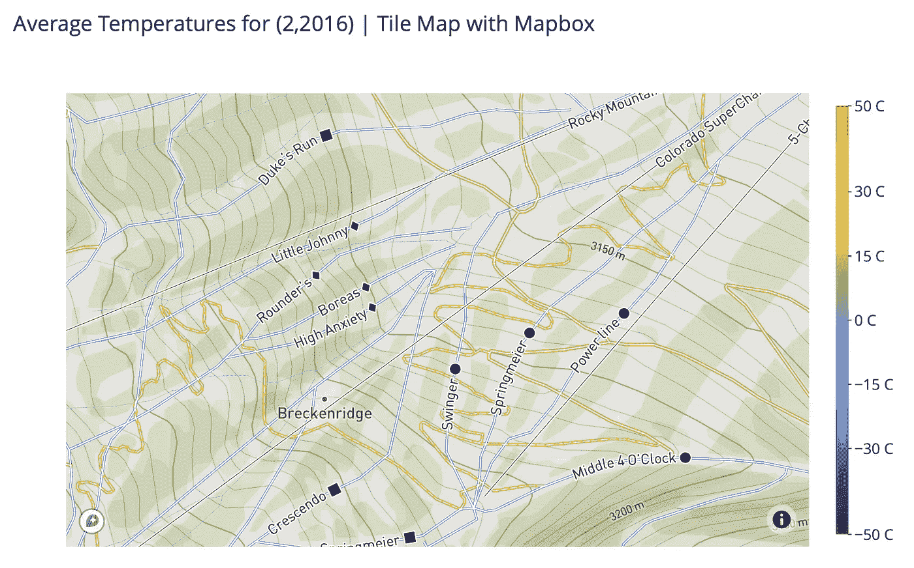

# 使用 Plotly 和 Mapbox 制作漂亮的空间可视化效果

> 原文：<https://towardsdatascience.com/make-beautiful-spatial-visualizations-with-plotly-and-mapbox-fd5a638d6b3c?source=collection_archive---------11----------------------->

## 使用 Python 探索基于切片的 Web 地图的优势


谢栋豪在 [Unsplash](https://unsplash.com/s/photos/maps?utm_source=unsplash&utm_medium=referral&utm_content=creditCopyText) 上的照片

我最近给[写了一篇关于可视化 NOAA 天气数据的文章](/interactive-weather-data-visualizations-with-plotly-d304fe87b57f)。我们用 Plotly 处理了数据并制作了一些基本的交互式地图。在本文中，我想使用相同的数据，但重点是我们可用的选项，以改善我们的 Plotly 和 Mapbox 的网络地图。Web 地图有多种用途，拥有一个有助于强调数据点或为数据点提供上下文的高质量底图可以极大地提高可视化的质量。

Mapbox 是一家初创公司，为 Foursquare 和天气频道等网站提供地图，同时开发一些最强大的开源工具来创建网络地图。多年来，Mapbox JavaScript 库一直是最好的网络地图工具，现在我们可以使用 Plotly 利用 Python 中的 Mapbox。

# Plotly 中的地图类型

## 轮廓与平铺地图

Plotly 有两种主要类型的地图，Geo 地图和 Mapbox 地图。地理地图是基于轮廓的，地图框地图是基于切片的。两者的主要区别在于，基于轮廓的地图可以一次绘制所有内容，而基于切片的地图具有以不同缩放级别呈现的信息层次。

如果我有一个以全球比例开始的地图，并且我希望用户能够放大以查看精细的粒度级别，那么基于切片的地图可能比轮廓地图更适合我的需要。由于基于切片的地图不必立即加载所有信息，因此它们的内存消耗较少，但是缩放时必须处理粒度变化会增加切片地图的处理能力开销。这意味着基于切片的地图非常适合提供大量信息而不会使地图变得杂乱，但它们需要更多的数据和处理能力。

这是作为轮廓图和基于图块的地图渲染的同一张地图。试着放大，看看你是否能发现两者之间的一些显著差异。

由作者使用 Plotly 创建

由作者使用 Plotly 和 Mapbox 创建

乍一看，除了使用不同的投影之外，这些地图可能看起来非常相似。但是当你开始放大的时候，你开始看到基于地图的好处。国家边界变得可见，因为它们变得相关，对数据点不那么突出；当您放大到越来越精细的比例时，甚至城市、道路和河流也会加载到底图中。

能够接触到这种细节真的可以让可视化感觉更专业，并且在多尺度下工作时，不同的粒度是有帮助的。如果我们想使用 Plotly 的散点地理函数显示国家边界，我们需要以各种比例绘制它们，如下所示:

由作者使用 Plotly 创建

在这种规模下，这个地块比两个没有国界的地块要繁忙得多。我们仍然缺少平铺地图提供的细节，如国家名称和城市。这些类型的要素可以在轮廓地图上进行配置，但对于可能很快变得混乱的轮廓地图来说，它们并不十分实用。

尽管有这些缺点，轮廓图仍然占有一席之地。当创建较小区域的地图时，我们通常不需要以多种比例渲染数据，这意味着没有理由增加基于图块的地图的数据和处理开销。此外，当制作用于演示的地图时，定制基于轮廓的地图以从远处最大化快速可读性可能是有利的。更不用说会议室并不总是有最好的 wifi，我已经看到我的网络地图加载速度非常慢，让说话的人感到沮丧。

# 地图框和 Plotly 平铺地图基础

Mapbox GL JS 是一个 JavaScript 库，用于交互式切片地图的 web 制图。当我们调用 Python 中的一个 Plotly Mapbox 函数时，Plotly 指的是 Mapbox JavaScript 库。由于 Mapbox GL JS 库的某些版本是开源的，因此使用这些函数和开源底图不需要 Mapbox API 密钥。然而，作为一家公司，Mapbox 拥有非常高质量的矢量切片底图，需要使用 Mapbox API 密钥。Mapbox 有一个很好的免费层，允许每月多达 50，000 次地图加载，这对大多数用户来说已经足够了。

## 栅格切片与矢量切片

大多数 web 地图传统上使用栅格切片来构建地图，但是 Mapbox 也允许我们利用矢量切片。如果您熟悉 GIS 数据，则栅格是值(影像)的格网，而矢量数据是几何数据，通常是点、线和面。

栅格切片是一组图像，它们彼此相邻排列以形成完整的地图。放大时，可以加载不同级别的栅格切片，以不同的比例显示新要素。矢量切片的工作方式与此非常相似，但是切片包含适合您正在查看的缩放和位置的预生成矢量数据。

矢量图块有很多优点。它们不需要像栅格切片一样大小完全相同，而是由客户端的计算机渲染，这可以使它们对于主机来说重量轻得多。矢量数据通常也比使用 map snappier 制作的栅格数据小得多，因为您对快速互联网连接的依赖更少。如果需要的话，矢量数据甚至可以渲染栅格，这使得它非常灵活。

# 平铺底图

使用 Plotly，我们可以访问光栅和矢量平铺基础地图。我们访问的栅格切片底图是开源的，就像 Open Street Map 的底图一样。Mapbox 提供对矢量切片底图的访问，但它们需要 Mapbox API 令牌才能访问。下面我将浏览一些可用的底图，并向你展示实际的区别。

## 来自公共服务器的栅格切片底图

我们可以访问的所有栅格切片底图都是开源的，不需要 API 令牌就可以使用。以下是一些可用的示例:

**打开街道地图**

尽管我们使用的是开放街道地图中的底图，但我们仍然调用了“散点图框()”函数。这是因为 Plotly 利用开源的 Mapbox JavaScript 库来绘制切片地图，而不管它们是栅格切片还是矢量切片。

使用开放街道地图中的栅格切片绘制地图(由作者创建)

**USGS 影像栅格切片**

美国地质调查局有大量的在线图像，包括一些很棒的底图！像这样使用栅格切片图像图层的最简单方法是渲染一个空白的白色画布，然后手动渲染数据或“轨迹”下面的底图。

使用 USGS 中的光栅切片绘制地图(由作者创建)

使用 Plotly 可以如此轻松地创建和共享各种地图，这真是太酷了！像这样的图像可以为气候数据提供真正有用的背景，尽管你可能会注意到我的色标可以使用一些调整来适应这张底图中的深色。由于基于切片的 web 地图是一种流行的标准，因此有许多可轻松访问的底图。

> **注意**:如果你运行的网络连接速度较慢，这些地图可能需要更长时间才能加载。栅格切片可能非常大，这意味着需要将大量数据传输到浏览器中。

**USGS 水文栅格切片**

如果我们使用此链接作为我们的来源，我们也可以从 USGS 获得水文底图:

```
source = ["[https://basemap.nationalmap.gov/arcgis/rest/services/USGSHydroCached/MapServer/tile/{z}/{y}/{x](https://basemap.nationalmap.gov/arcgis/rest/services/USGSHydroCached/MapServer/tile/{z}/{y}/{x)}"]
```

由作者使用 Plotly 创建

你会注意到美国地质勘探局的一些数据产品，北美的数据要完整得多，所以在世界的某些地方可能没有有用的水文信息。总的来说，从美国地质勘探局、美国国家海洋和大气管理局等机构获得的免费和有用的数据令人印象深刻。

**USGS 地貌晕渲底图**

这里是一个阴影地形底图，作为美国地质勘探局免费提供的最后一个例子。请记住，网上还有其他栅格地图数据集，我将在最后的参考资料部分链接这些数据集。

```
"source": [          "[https://basemap.nationalmap.gov/arcgis/rest/services/USGSShadedReliefOnly/MapServer/tile/{z}/{y}/{x](https://basemap.nationalmap.gov/arcgis/rest/services/USGSShadedReliefOnly/MapServer/tile/{z}/{y}/{x)}"]
```

由作者使用 Plotly 和 Mapbox 创建

## 来自 Mapbox 服务器的矢量切片底图

矢量切片底图是从 Mapbox 的服务器上获取的，这意味着我们需要一个 Mapbox 帐户和 API 令牌来使用它们。如果您的计算机相当现代，您可能会注意到这些矢量平铺地图在响应速度和细节方面有了相当大的改进。由于矢量数据是由您的计算机渲染的，因此从服务器传输到您的计算机的数据较少，这通常意味着更快的加载时间。

**地图框深色样式**

使用 Mapbox 底图进行绘图的语法与开源替代方法非常相似。我们简单地传递一个带有 API 键和其他参数的“mapbox”字典，而不是指定层。“样式”决定了您的地图使用哪个地图框底图。

由作者使用 Plotly 和 Mapbox 创建

**街道风格**

如果你正在寻找街道和城市的更多细节，那么“街道”风格将非常适合你的用例。它从以前的地图中去掉了许多户外娱乐的细节，换来了街道、小路和公园的极端细节。这张底图可以让我们放大看到甚至非常小的街道的名称。这张底图甚至包括了我的家乡科罗拉多州博尔德市所有的校园建筑名称和步行路径。

由作者使用 Plotly 和 Mapbox 创建

**户外风格**

Mapbox 甚至有类似“户外”风格的底图，其中有重要的地标和徒步旅行、骑自行车和其他户外活动的细节。您甚至可以放大到像科罗拉多州布雷肯里奇这样的地区，当您足够接近时，可以看到呈现的滑雪道:



Mapbox 户外风格截图(作者创作)

# 包扎

我们可以看到，Plotly 和 Mapbox 为我们提供了范围广泛的底图，以满足许多不同用户的需求。即使从 USGS 等第三方加载栅格切片也相当简单。能够使用 Python 中如此强大的 web 制图工具真是太棒了，因为能够在不使用 JavaScript 的情况下制作高质量的地图可以减少工作流程中的许多摩擦。

# 资源

*   [美国地质勘探局底图](https://www.usgs.gov/faqs/what-are-base-map-services-or-urls-used-national-map?qt-news_science_products=0#qt-news_science_products)
*   [地图框样式](https://docs.mapbox.com/api/maps/styles/)
*   [Plotly 文档](https://plotly.com/python/)