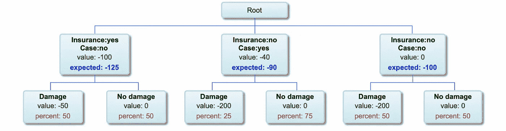
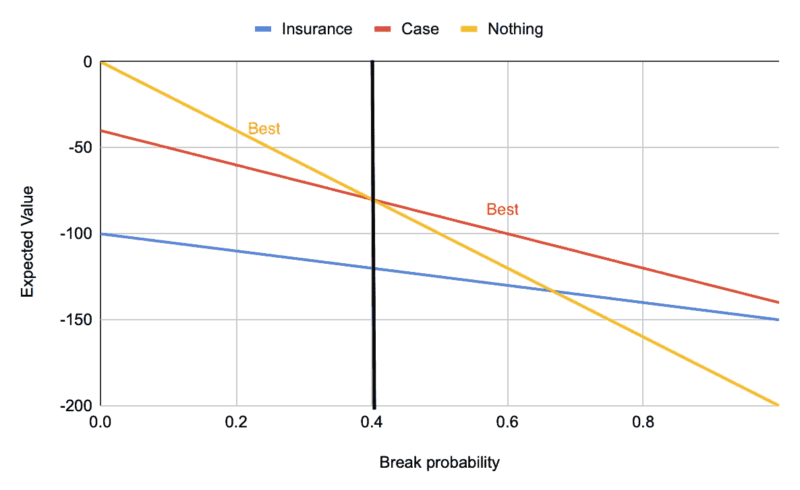
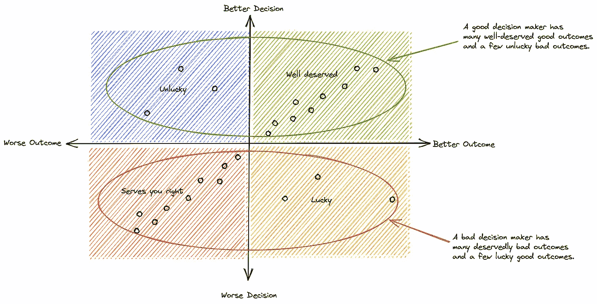
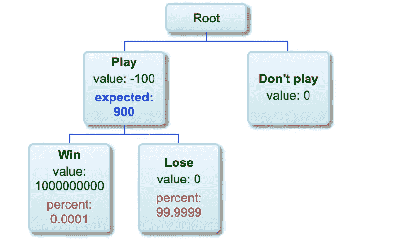
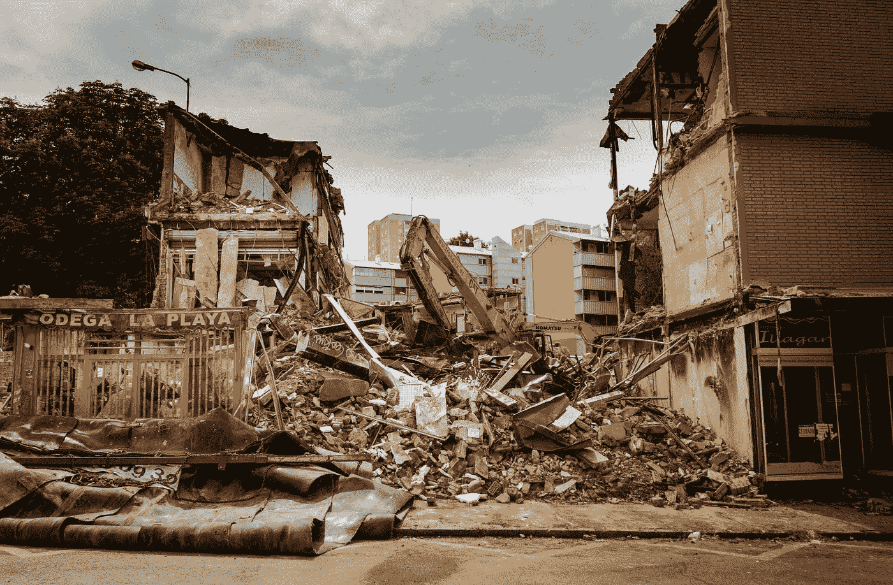
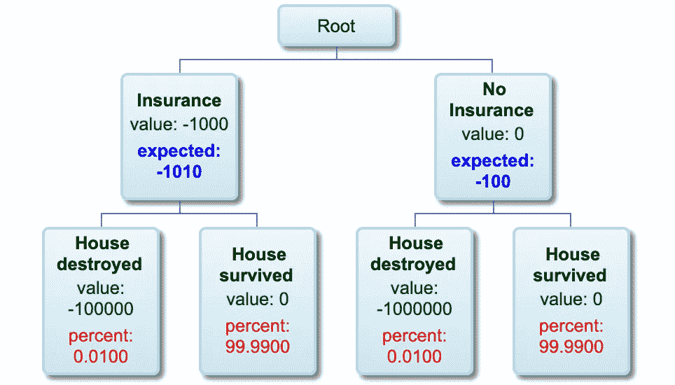
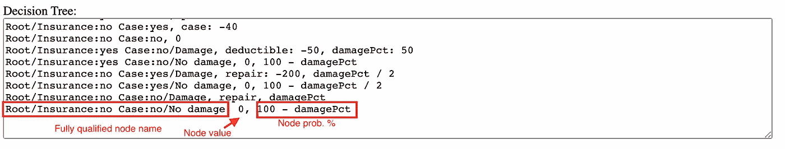
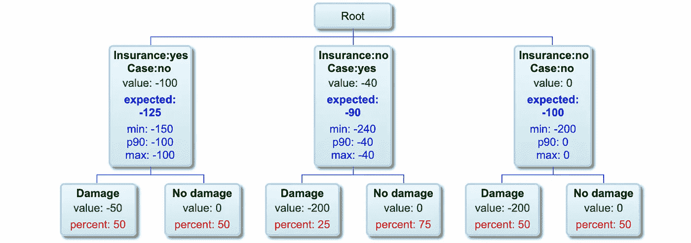
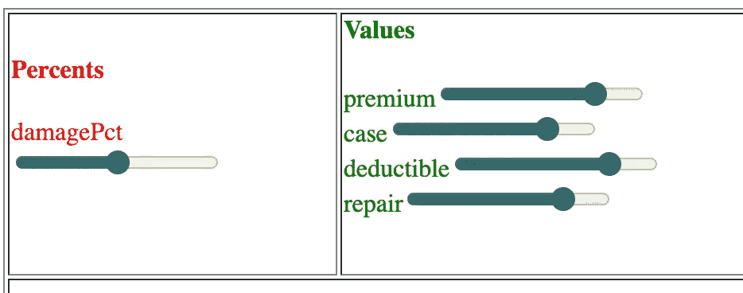
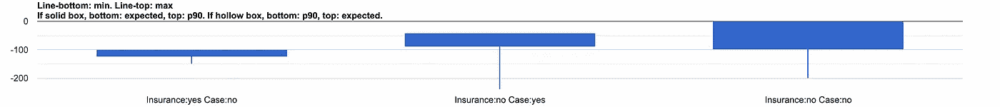

# 做出正确的决定

> 原文：<https://towardsdatascience.com/make-good-decisions-aed89eca68c8?source=collection_archive---------13----------------------->

## [实践教程](https://towardsdatascience.com/tagged/hands-on-tutorials)

我女儿在上中学，最近买了她的第一部新手机。她用自己从一个利润丰厚的暑期社区工作(遛狗、看猫、浇花、看孩子)中辛苦赚来的钱。拿起电话的那天，她要做一个决定。她应该购买保险以防意外损坏，还是通过购买手机壳来降低损坏的可能性，还是什么都不做，听天由命？


由[阿里·阿卜杜勒·拉赫曼](https://unsplash.com/@_actually_?utm_source=medium&utm_medium=referral)在 [Unsplash](https://unsplash.com?utm_source=medium&utm_medium=referral) 上拍摄的照片

她应该如何做出决定？不是恐惧地，也不是愉快地，而是理性地。

# 理性决定

有 3 种可能的 ***决策*** :

1.  买保险(没有手机壳)。假设一年的保险费为 100 美元，如果她需要维修/更换，她必须支付 50 美元的免赔额。

2.买个手机壳(不买保险)。假设对她有吸引力的最简单的案例花费 40 美元。

3.没有任何保险或手机壳的风险。

每个决策有两种可能的 ***结果*** :

1.  这款手机在一年内没有任何重大损坏。
2.  电话在一年内坏了，需要修理/更换。有了保险，这将花费她免赔额。如果没有保险，她大概要花 200 美元才能拿回一部能用的手机。手机壳会降低手机摔坏的风险。

列举的决策和结果可以被可视化为逻辑树。从根到叶子的每一条路径都代表了几种可能性中的一种。


决策树(图片由作者提供)

她有足够的信息做出理性的决定吗？不完全是。一个关键的缺失部分是每种可能性的 ***概率*** :

1.  一年内手机坏掉的概率，无案例。
2.  一年内手机坏掉的概率，有案例。

如果这是一场掷骰子、纸牌或掷硬币的游戏，她会客观准确地知道概率。但是现实生活很乱。潜在概率中存在不确定性。这是否注定了一个理性的决定？号码

她先从一些 ***概率的合理主观估计*** 开始。鉴于她自称笨手笨脚，她认为她有很大的可能会摔坏手机，比如说 50%。而一个手机套可以减少一半(25%)。然后，她计算出每个决策的 ***期望值*** :

```
expected value = V + *v_1 x p_1 + v_2 x p_2 + ... + v_n x p_n*where V is the value of the decision, and *v_i, p_i* are the expected value and probability respectively of the *ith* possible outcome.So,
╔═══════════════════════════╦══════════════════════════════════════╗
║       Decision            ║            Expected value            ║
╠═══════════════════════════╬══════════════════════════════════════╣
║ Insurance: yes, Case: no  ║ -100 +  -50 x 0.50 + 0 x 0.50 = -125 ║
║ Insurance: no,  Case: yes ║  -40 + -200 x 0.25 + 0 x 0.75 =  -90 ║
║ Insurance: no,  Case: no  ║    0 + -200 x 0.50 + 0 x 0.50 = -100 ║
╚═══════════════════════════╩══════════════════════════════════════╝
```



具有期望值和概率的决策树(图片由作者提供)

期望值是什么意思？从一个决策反复出现的场景来考虑这个问题。所以，一次又一次，她买了一部手机，带着它生活了一年，并看到了她的决定的结果。然后，在一些重复中，手机会坏掉(例如，当她决定不买一个盒子时，大约一半的重复)，而在其他重复中，手机不会坏掉。她在所有重复中的平均收益/损失就是决策的期望值。因此，她做出了理性的决定，通过拒绝保险和购买保护箱(因为-90 > -125 和-90 > -100)来最小化她的预期成本(或者，等价地， ***最大化预期价值*** )。

你反对在现实生活中她没有机会重复上演这个场景。你说得对。但是她确实演了很多很多不同的场景，而且统计数据显示了所有这些场景。所以，如果她坚持做出最大化她期望价值的决定，她会比非理性地做出决定做得更好。参见[运气与此有什么关系](https://vishesh-khemani.medium.com/whats-luck-got-to-do-with-it-a7e4e554567d)了解重复事件与大量不同事件的更详细讨论。

还有别的事困扰着你。你怀疑她的决定是基于对概率的错误估计，而不同的估计会导致不同的理性决定。再说一次，你是对的。处理潜在概率不确定性的方法是找到最优决策发生变化的*阈值，然后决定你最有可能在阈值的哪一边。有了保费、免赔额、case、维修的具体数值，结果发现，只要手机坏了没有 case 的概率是< 40%，她还是不买保险和 case 的好。如果可能性高于 40%，那么一个案例最有意义。购买保险从来都不是最好的选择。*

**

*作为手机损坏概率函数的每个决策的期望值(图片由作者提供)*

*女儿靠在一旁小心翼翼，估计自己摔坏手机的几率大于 40%，决定给手机买个保护套。到目前为止，她对自己的决定很满意。*

# *好的决定可能会有坏的结果*

*如果我女儿在拒绝保险后没几天就摔坏了手机怎么办？然后，她不是简单地支付 150 美元的保险费和免赔额，而是为这个箱子和替换手机支付 240 美元。她一定会后悔自己的决定，不是吗？不要！或者至少她不应该。一个好的决定可能会有一个坏的结果(由于运气不好)。相反，一个糟糕的决定会有一个好的结果(因为运气好)。尽管有这样做的强烈倾向，但永远不要根据结果的质量来评估决策的质量。如果你持续做出好的决定，你会在更多的时候有更好的结果(相比之下，如果你持续做出坏的决定或者持续做出好的决定)。*

**

*决策质量与结果质量(图片由作者提供)*

# *为特殊的赌注破例*

*期望值最大化的决策规则适用于大多数情况。但是，当赌注异常高时，情况就不同了。有时你不得不放弃预期的收益，因为很难实现它。而且，有时你必须承受预期的损失来保护自己免受灾难。*

## *有时放弃预期的收益*

*假设你有机会以有利的赔率玩彩票。你有百万分之一的机会赢得十亿美元。玩的费用是 100 美元。你想玩几次都可以。*

**

*迪伦·诺尔特在 [Unsplash](https://unsplash.com?utm_source=medium&utm_medium=referral) 上的照片*

*游戏的预期价值是 900 美元:*

```
*expected value = -$100 + $1,000,000,000 x 1/1,000,000 = $900*
```

**

*彩票决策树(图片由作者提供)*

*所以你应该玩，对吗？如果你输了，你应该继续玩，直到你赢了，对不对？不，除非你愿意先损失数亿美元。赢的几率，从而实现预期的收益，是如此之低，以至于大多数时候你会输。平均来说，你必须玩一百万次才能赢，花费你 1 亿美元。当然，你会在获胜后弥补，但你有那么多的资本和时间来投资吗？*

*因此，为了修正我们的决策启发法，*决定最大化期望值的路径，除非最有可能的情况是亏损*。在这种情况下，如果可能的话，最好选择另一个损失可能性不大的决定。*不玩彩票*。*

## *有时会招致预期的损失*

*我和我的家人住在一个地震多发地区，那里在未来几十年内会发生一场大地震。我们一直在努力决定是否为我们的房子购买地震保险。假设保险费是每年 1000 美元，在要求保险覆盖我们家的全部损失的情况下，免赔额是 100000 美元。如果没有保险，假设更换/维修费用为 1，000，000 美元。*

**

*何塞·安东尼奥·加列戈·巴斯克斯在 [Unsplash](https://unsplash.com?utm_source=medium&utm_medium=referral) 上拍摄的照片*

*如果下一年发生灾难性地震的可能性很低(低于千分之一)，那么如果我们不买保险，我们的预期成本是最低的。*

**

*地震保险决策树(图片由作者提供)*

*所以我们应该拒绝为我们的房子投保地震完全损失险，对吗？不，除非我们愿意变得无家可归，虽然可能性很小，但却不容忽视。最坏的情况是灾难性的，足以保证相对较小的成本来防范它。*

*再次调整我们的决策启发式，*决定最大化期望值的路径，除非最有可能的情况是亏损，或者最糟糕的情况是灾难性的*。在灾难性的最坏情况下，如果可能的话，更倾向于另一个更容易接受最坏情况的决定。不要拿重要的事情冒险。*

# *使用工具*

*有了关于如何做出理性决策的启发，你应该如何真正去做，而不是每次面对决策时都陷入计算中？当然，使用适当的工具。如果你是一个电子表格忍者或程序员，你可能会对分析你面临的每个决策的期望值、可能情况、最坏情况和概率阈值感到舒服。对于你们其余的人，我很高兴分享我一直在使用的东西的粗略原型:[https://vishesh-khemani.github.io/decisions/decision.html](https://vishesh-khemani.github.io/decisions/decision.html)。下面的截图会让你知道它是干什么的。*

**

*决策树输入规范的屏幕截图(图片由作者提供)*

**

*渲染决策树的屏幕截图(图片由作者提供)*

**

*可以调整以找到阈值的自动生成参数的屏幕截图(图片由作者提供)*

**

*每个决策的“烛台”值(最小值、预期值、第 90 个百分位数、最大值)的屏幕截图，可快速查看相关指标(图片由作者提供)*

# *摘要*

1.  *理性地做决定，通常选择最大化你的预期价值的选项。*
2.  *如果每个场景的概率有太多的不确定性，确定最佳决策发生变化的阈值概率，并判断阈值的哪一侧最有可能发生变化。*
3.  *如果你坚持做出好的决定，你会有许多应得的好结果和一些不幸的坏结果。永远不要仅仅根据结果的质量来判断一个决定的质量。*
4.  *不要玩彩票:如果最有可能的结果是失败，拒绝期望值最大的决定(除非没有更好的选择)。*
5.  *不要拿最重要的东西冒险:如果最糟糕的结果是灾难性的，拒绝期望值最大的决定(除非没有更好的选择)。*
6.  *使用工具来帮助评估决策。其中一个工具就是我在 https://vishesh-khemani.github.io/decisions/decision.html 的粗略原型。*

# *参考*

1.  *[分析思维的格言](https://www.hks.harvard.edu/publications/maxims-thinking-analytically-wisdom-legendary-harvard-professor-richard-zeckhauser) —丹·莱维*