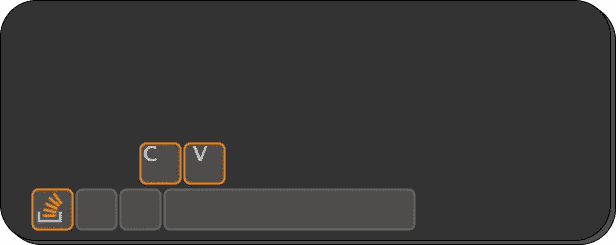
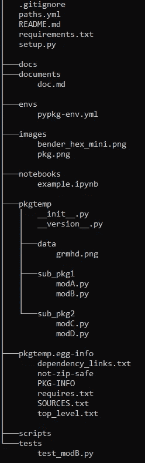
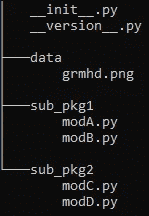

# 让代码发挥最大价值

> 原文：<https://towardsdatascience.com/make-most-value-of-your-code-8db8073fc43b?source=collection_archive---------20----------------------->

## 包装，把它们都包装起来，做自己的巨人

钥匙——作者根据[钥匙](https://stackoverflow.blog/2021/03/31/the-key-copy-paste/)

一个最聪明的人曾经说过:“如果我看得更远，那是因为我站在巨人的肩膀上”。作为一名数据科学家、数据工程师、机器学习专家、数据分析师或任何每天与数据、python 和朋友打交道的人，我们都知道自己是幸运的。我们站在 StackOverflow 的肩膀上，意思是一个巨大的社区。

做自己的巨人呢？利用你自己的见解，你的研究，以及你从成千上万的 StackOverflow 中提取的信息。我们都想做一些新奇的东西，研究最新的创新、技术和模型，但老实说，我们也经常做同样的模型、图表等。

那么，为什么不利用我们的代码，我们在这么多不同的笔记本中复制粘贴并稍微修改了这么多次？我们可以把它打包，把它们打包，所有这些我们多年来自豪地编写的函数和类打包。

# 📦构建您的私有包

利用你的工作的一个极好的方法是构建你的私人包。私人的，因为目的是不公开发表在 PyPi.org 或任何其他服务器上。

包装有许多优点:

*   模块化:为了使代码最模块化，你需要大量的函数、类等
*   轻松访问您的代码和更干净的 NB/脚本
*   更多自动化
*   可再现性(“隐藏状态”与可再现性相反，结果可能取决于您运行单元格的顺序，您定义的函数可能由范围外的变量提供)
*   易于共享/协作
*   您可以将模块设置为使用%load_ext autoreload、%autoreload 1 和%aimport module_name 自动重新加载
*   测试(单元、集成)
*   版本控制(众所周知，NB 很难版本控制)

# 🤔什么是包，它的基本组件是什么？

首先，它说明了构成 python 包的基本组件。我将使用一个[基本模板](https://github.com/ThomasBury/py-pkg-temp)给出结构并解释它们各自的作用。

一个基本的私有 python 包的结构，可以在 [GitHub](https://github.com/ThomasBury/py-pkg-temp) 上找到

*   `pkgtemp`:一个基本 python 包的[模板，带有子包和模块](https://github.com/ThomasBury/py-pkg-temp)
*   在`pkgtemp/sub_pkg1/modA.py`中:类和继承的例子，用于说明
*   在`pkgtemp/sub_pkg2/modC.py`中:用特殊方法比较对象的类的例子，用于说明
*   在`pkgtemp/sub_pkg2/modD.py`中:使用特殊方法使对象实例可调用的类的例子
*   在`pkgtemp/__version__.py`中:关于版本、作者等的所有细节。
*   在`pkgtemp/__init__.py`中:默认为空，可以用来绑定上层包的子包和模块(更容易导入)
*   `setup.py`构建包的主文件
*   `requirements.txt`安装`pkgtemp`时被安装的依赖项
*   在`envs`中，yaml 文件用于创建 conda python 环境，见下图
*   `README.md`登陆解释文件(包是做什么的，如何安装等等。)

可选文件和文件夹:

*   在`tests`中:单元测试——这是可选的
*   在`docs`中:包文档(通常带有 sphinx)
*   在`data`中:您希望*与您的包一起分发*的数据，您应该提到在 setup.py 中
*   在`documentation`附加文档中，(不随代码一起分发)
*   在`notebooks`中，作为文档的替代，突出显示您的代码
*   在`scripts`中，作为文档的替代，突出显示您的代码
*   在`egg-info`中，包构建过程的所有输出——不要关心这个，它们将通过运行 setup.py 生成

## 模块

模块是一个*。包含 Python 代码的 py 文件。为了模块化，将代码分解成模块。python 模块只是一个包含代码的文件。模块化代码更容易使用。编码时(人类)记忆中保存的东西更少，滚动更少，当你必须找到一个特定的东西时知道确切的位置，把大问题分解成小问题，等等。

## 包裹

包是包含其他文件夹(子包)或模块(的集合)的文件夹。py 文件)，以及特定的文件。如果满足某些要求，可以安装它。

假设您开发了一个包含几个模块的应用程序。随着模块数量的增长，如果将它们放在一个位置，就很难跟踪所有的模块。如果它们具有相似的名称或功能，尤其如此。您可能希望有一种方法来对它们进行分组和组织。包允许使用点符号对模块名称空间进行分层结构。模块有助于避免全局变量名之间的冲突，同样，包也有助于避免模块名之间的冲突。

包可以包含任意深度的嵌套子包。Python 中的每个包都是一个目录，其中必须包含一个名为`__init__.py`的特殊文件。这个文件可以是空的，它表明它包含的目录是一个 Python 包，因此可以像导入模块一样导入它

## 应用程序接口

API:Application Programming Interface(应用编程接口)的缩写，指的是通过抽象底层实现和只暴露开发者需要的对象或动作来简化编程的函数和类的集合。API 是多用途的，并不打算产生一个单一的输出(不是特别的)，而是一个可以在不同的项目和任务中重用的工具。

例如，lightGBM 是用 C++编写的，但提供了几个 API:python、R 等。

# 💡你必须做什么来写你的私人包裹？

## 💻写一些代码

为了扩大您的工具堆栈，您可以收集并重构您发现对几个(至少两个)项目有用的代码，因为如果它对一个以上的项目有用，它很可能对未来的项目也有用(例如，在您需要执行回归的任何时候，不要从头重写您的 sklearn 管道)

最好是在收集和重构你的代码时，尽量让它不那么具体，更模块化。很可能您为特定的项目编写了代码，带有一些硬编码的名称、参数和变量值。尝试移除任何硬编码的部分，取而代之的是将它们作为函数/类的参数。

另外，尽量将函数和类整理到包含模块(*)的子包(子文件夹)中。py 文件)。例如

包、子包和模块的基本结构，如[模板](https://github.com/ThomasBury/py-pkg-temp)所示

用于收集您喜欢的绘图函数、模型比较类、lightGBM 包装器等。

## 📃记录您的代码

最好的方法是在重构代码的同时，也记录你的代码。使用您最喜欢的约定(NumPy、Pandas、Google 等)编写适当的文档字符串。).这将有助于你记住目的是什么，并使与同事的合作更加顺利。

## 🗃️创建了一个专用的 python 环境

创建专用的 python 环境。这将隔离您的项目；您不会破坏您的基础，如果您需要通过 conda 而不是 pip 安装一些包，这将允许您这样做(例如，conda-forge 的一些预建包)

*   `conda create -n proj-env python dependency1 dependency2`
*   `conda activate proj-env`
*   当你安装了所有的 conda 依赖项，并且在转移到 pip 之前:`conda env export > proj-env.yml`如果你计划跨平台共享(Win-linux 或其他),你可以使用“no-builds”标志
*   继续安装您的 pip 依赖项，并在`requirements.txt`中收集所需的包或使用`pip list --format=freeze > requirements.txt`

## 🖊️编辑 _ 版本 __。巴拉圭

编辑`__version__.py`以满足你的需求(作者、标题、版本号等)。)

*   __title__ = 'pkgtemp '
*   _ _ description _ _ = ' python-pkg-temp-包模板项目生成器'
*   __version__ = '0.0.1 '
*   __ 作者 __ = '威尔·史密斯'
*   _ _ author _ email _ _ = ' will . Smith @ Google . mars '
*   __ 许可证 __ = '麻省理工学院'
*   _ _ URL _ _ = ' https://github/will Smith/bad boys 4 '

## 🖊️编辑 setup.py

原则上，你可以让它保持原样。您可以编辑 EXTRAS_REQUIRE 和/或 classifiers=…以适应您的包。其他输入可在 __version__ 中编辑。py 文件。

## ⛭安装你的软件包并使用它

非常简单，两步:

*   `conda activate [ENV_NAME]`
*   `cd C:/[USER_NAME]/[pkg_name]`的意思，setup.py 在哪里
*   `pip install .`如果您还在*编辑*您的包，请不要忘记时间段或`pip install -e .`

完成了！您可以导入您的包，并在不同的项目中重用您的函数和类。你可以在本笔记本中找到一个例子。

# 结论

打包是利用您的艰苦工作并构建一个令人惊叹的函数库和类库的一种极好的方式。这样你就可以重复使用你的代码，与你的同事分享，建立一个文件夹如果你是自由职业者，你可以对它进行版本控制和部署更新。

我们看到了如何构建一个不在公开渠道上发布的包来实现这一点。利用 GitHub，你也可以让它像`pip install git+https://github.com/[GH_USER]/[REPO_NAME].git`一样容易安装

我用它来包装我经常使用的库。比如，包装 lightGBM、CatBoost 和 Optuna，使它们具有一致的语法。而且还标准化了我的制图风格、基本 EDA 和我必须执行的所有重复任务。此外，我可以在工作中使用我在个人项目中所做的，反之亦然。我也可以很快地和其他人分享我找到的一些解决方法。

最后，当您对自己的软件包感到满意，并且认为社区可以从您的工作中受益时，您可以考虑以开源方式发布您的软件包。不知何故，偿还社区的债务💸