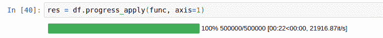
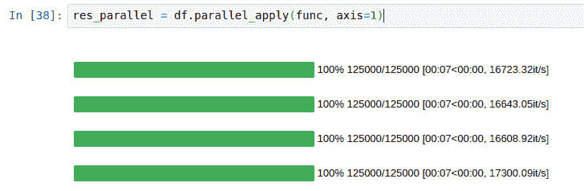
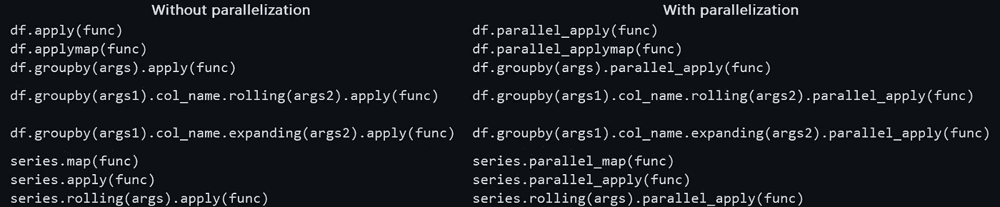
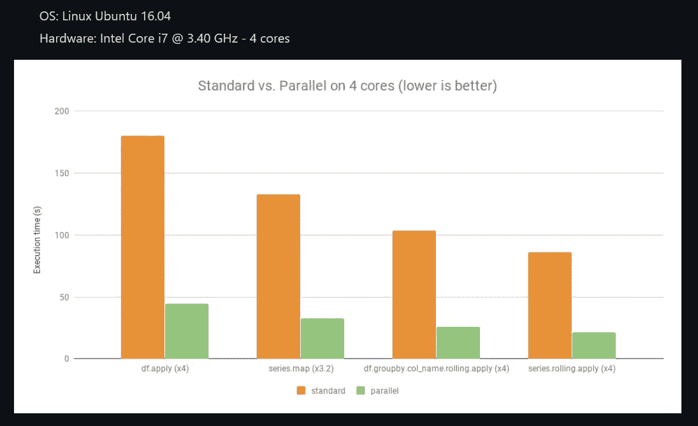

# 让熊猫跑得飞快

> 原文：<https://towardsdatascience.com/make-pandas-run-blazingly-fast-3dbcd621f75b?source=collection_archive---------29----------------------->

## 你不需要再等了


由 [Unsplash](https://unsplash.com?utm_source=medium&utm_medium=referral) 上的 [CHUTTERSNAP](https://unsplash.com/@chuttersnap?utm_source=medium&utm_medium=referral) 拍照

我们都喜欢并使用熊猫。当我们作为数据探索者深入探索数据奥秘时，它是我们的日常伴侣。通常，我们处理大量的数据，如果我们的`apply`函数能够快速运行，我们会很高兴。

好了，不要再等了，我向你介绍。

我们将看到我们如何从这里开始:



资料来源:https://github.com/nalepae/pandarallel

对此:



来源:[https://github.com/nalepae/pandarallel](https://github.com/nalepae/pandarallel)

# 泛平行函数



来源:[https://github.com/nalepae/pandarallel](https://github.com/nalepae/pandarallel)

上面我们看到了可供我们使用的功能。

# 如何安装？

这个库在 pip 上是可用的，所以，只需要这样做:

`pip install pandarallel`

# 怎么用？

我们首先需要导入库。

`from pandarallel import pandarallel`

在这之后，我们需要调用`.initialize()`让`pandarallel`发挥它的魔力。

`pandarallel.initialize()`

你会从 Pandarallel 收到一些关于你的设置的信息。

```
INFO: Pandarallel will run on 2 workers. 
INFO: Pandarallel will use Memory file system to transfer data between the main process and workers.
```

由于我使用的是 Google Colab，它不提供很多 CPU，所以我们只有 2 个工作人员。当你在你的机器上运行这个的时候，工人的数量将会更多，速度也会加快。所以，我们在这里看到的是加速的下限 T21。

现在，让我们看看魔法。

我们将首先创建一个大型数据框来测试 Pandarallel 的能力。

```
df = pd.DataFrame(dict(a=np.random.randint(1, 8, df_size), b=np.random.rand(df_size)))
```

我们创建了一个有五百万行的数据帧。

让我们创建一个应用于此数据框的函数。

```
**def** func(x):
    **return** math.sin(x.a**2) + math.sin(x.b**2)
```

使用 **Pandas 的 apply()** 函数:

```
%%time
res = df.apply(func, axis=1)
```

我们得到输出:

```
CPU times: user 2min 12s, sys: 1.64 s, total: 2min 14s 
Wall time: 2min 14s
```

上面我们得到的是**未并行化的**代码，需要 2 分 14 秒。

让我们看看由 Pandarallel 库并行化的代码**。**

使用 **Pandarallel 的 parallel_apply()** 函数:

```
%%time 
res_parallel = df.parallel_apply(func, axis=1)
```

我们得到输出:

```
CPU times: user 780 ms, sys: 271 ms, total: 1.05 s 
Wall time: 2min 2s
```

所用的时间是 **2 分 2 秒**，比上面未并行化的代码所用的时间少，即 **2 分 14 秒**。节省了时间(12 秒)，即使我们只使用 2 个工作线程(1 个工作线程= CPU 中的 1 个实际内核)。

如果你不满意，这里有一个库的作者做的基准测试。



来源:https://github.com/nalepae/pandarallel

在 4 个内核(即 4 个工作线程)上，我们看到时间减少得更多。

# 结论

只需在函数调用中做一个简单的改变，我们就能让我们的熊猫代码获得巨大的加速。这绝对是一件好事，因为数据处理需要花费大量时间，让我们远离数据分析。

# 阿布舍克·维尔马

*   *如果你喜欢这个，请关注我的*[*Medium*](https://medium.com/@deeptechtalker)*了解更多*
*   *我们来连线一下*[*LinkedIn*](https://www.linkedin.com/in/abhishek-verma-3b63479a/)
*   看我在 [Kaggle](https://www.kaggle.com/abhishekvermasg1) 上的作品。