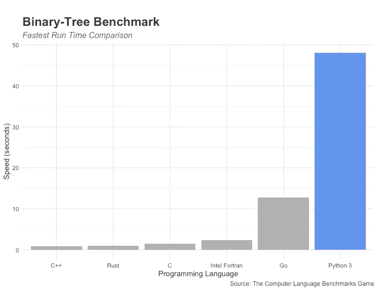
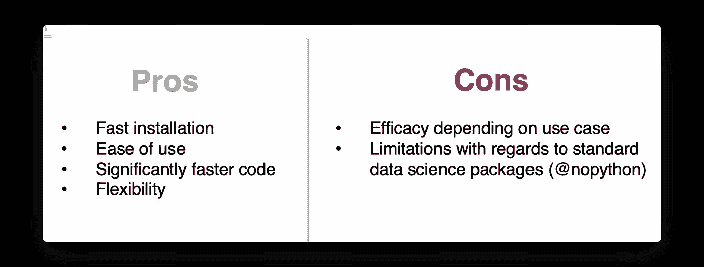

# 让 Python 和 C 一样快

> 原文：<https://towardsdatascience.com/make-python-run-as-fast-as-c-9fdccdb501d4?source=collection_archive---------10----------------------->

## [理解大数据](https://towardsdatascience.com/tagged/making-sense-of-big-data)

## 用 Numba 实现更快的 Python 代码

照片由[夏洛特·科内比尔](https://unsplash.com/@she_sees?utm_source=unsplash&utm_medium=referral&utm_content=creditCopyText)在 [Unsplash](https://unsplash.com/s/photos/fast?utm_source=unsplash&utm_medium=referral&utm_content=creditCopyText) 上拍摄

# 速度问题

虽然 Python 被广泛接受，主要是因为其精简的语法，可以作为一种很好的原型语言，但它也有一个缺点，在“编程语言战争”式的辩论中经常提到:速度。与其他编程语言相比，Python 对于标准基准算法的运行时间要慢得多。

我自己创造的

从计算机语言基准测试游戏上的二叉树基准测试来看，Python 的 48.03 秒比不上 C++的 0.94 秒或 C 的 1.54 秒。由于是一种解释型和动态类型语言，Python 允许极快的原型速度，但无法与 C++、C、Fortran 以及其他几种编译语言的运行时间竞争。

# 快速原型制作+快速运行时间= Numba

Numba 通过一个针对 Python 的实时(JIT)编译器，结合了快速原型和快速运行时的优点。真正的意思是你的代码只能在运行时编译，而不能在运行前编译。这样做，Numba 使您能够将 Python 代码的速度提高“一到两个数量级”。[2]然而，使用 Numba 的实际速度增益在很大程度上取决于每个特定的用例，因为该项目侧重于科学计算应用。

## 安装 Numba

Numba 最大的优势之一是易于使用。与加速 Python 的其他方法所需的或多或少复杂的安装过程相反，Numba 可以使用`pip`或`conda`完全安装。

这两种方法都非常简单，应该可以在大多数数据科学环境中开箱即用。使用 Anaconda，`conda install numba`将安装所有需要的东西。`pip install numba`也是如此。

## 何时使用 Numba

一旦安装，Numba 可以帮助 Python 代码运行得更快。然而，有三个主要的标准作为指导方针来确定 Numba 对于特定任务的适合程度，以及它加速 Python 的潜力。

1.  如上所述，Numba 专注于加速科学应用。因此，代码包含的数学运算越多，Numba 就能提供越多的帮助。
2.  与第一个标准相关，Numba 与 NumPy 配合得特别好。有可能，专注于数学运算的 Python 代码将包含大量的 NumPy。然而，需要注意的是 [Numba 并不支持所有的 NumPy 函数](https://numba.readthedocs.io/en/stable/reference/numpysupported.html)，有些函数可能需要在原始 Python 和受支持的 NumPy 函数中实现才能使用。
3.  循环越多越好。通常，当代码包含几个非常长的循环时，Numba 可以节省大量时间。

## 打开涡轮增压器

使用 Numba 的另一个原因是它与其他 Python 代码集成的方式。使用 Numba 的唯一要求是为需要加速的函数添加一个装饰器。

来自 [Numba 文档](http://numba.pydata.org/)的代码

在上面的例子中，decorator `@jit(nopython=True)`向 Numba 发出信号，让它以 nopython 模式运行，而不是 Numba 的替代对象模式*。默认情况下，nopython 参数设置为 false，即使它生成的代码要快得多，这是因为它限制了所支持的 NumPy 函数的数量。除了`@jit(nopython=True)`，你也可以使用简写`@njit`。*

*由于 for 循环和对数学计算的关注，`monte_carlo_pi`函数的代码至少满足了 Numba 的三个有前途的用例中的两个，添加`@njit`装饰器应该会提供一个不错的性能提升。*

**

*我自己创造的*

*虽然该函数的纯 pythonic 版本在向其传递大约 1 亿个样本时开始大幅减慢，但等效的 Numba 版本保持了更高的性能水平，两个选项之间的相对差距只会随着计算负载的增加而扩大。*

## *更多装饰*

**懒编译*是指让 Numba 决定如何优化代码。一般来说，这种方法实现起来很快，并且最大限度地减少了可能出现的错误。装饰器向 Numba 发出懒惰编译的信号。*

*我自己创造的*

*此外，惰性编译还将允许您保留更高程度的灵活性。本质上，它可以给 Python 函数一个不错的速度提升，同时仍然允许高原型速度。*

**急切编译*允许对函数的签名进行更多的控制，这可以提高代码的可读性(以及潜在的性能)。同时，指定签名也会降低代码的灵活性，并可能导致容易被忽略的错误。签名被添加到要优化的函数之上的装饰器中。例如，`@jit(int64(int64))`描述了一个将整数作为输入并返回整数的函数。Numba 还允许通过以下语法在签名中指定数组:`@jit(int64(int64[:]))`。前面提到的签名将指定一个整数数组作为函数的输入，一个整数作为函数的输出。*

*我自己创造的*

*正如在急切编译的介绍中所暗示的，快速原型化会导致未被发现的错误。函数`f()`的签名需要一个整数数组，并将返回一个整数。当传递数组`[1,2,3,4]`时，正确的结果应该是`10 + 2.5 = 12.5`。然而，由于函数的签名，上面的函数调用将返回`12`而不抛出异常。例如，产生预期结果的签名应该是`@jit(float64(int64[:])`。因此，当使用 Numba 进行急切编译时，正确地制定每个函数的签名是非常必要的。*

*然而，Numba 的 jit 装饰器的最强大的变体是`@jit(nopython=True)`或等价的`@njit`。通过激活 *nopython 模式*，正在讨论的函数将不会使用 python 的 C API，并产生更快的代码。与`@jit`相反，强制 Numba 使用 nopython 模式将防止退回到较慢的对象模式，但也需要更多时间密集的开发准备，同时也不太宽容。在对象模式下运行将允许使用其他标准的数据科学包，如 Pandas，而 nopython 模式则不能。*

# *摘要*

*虽然 Numba 的能力比本文中描述的方法更深入，但是很好地掌握和理解如何使用`@jit` decorator 是从看似永无止境的循环向更好地执行科学代码迈出的一大步。*

*当谈到快速原型和实验时，Numba 通过其快速的安装过程和易用性完美地集成了 Python。不需要安装全新的编译器或者用不同的语言混合 Python 代码，使用 Numba 可以让 Python 编码人员立即投入工作，像没有 Numba 一样专注于他们的代码。*

**

*我自己创造的*

*然而，Numba 并不是一个适合所有人的方法。每个潜在的用例都应该单独检查，因为通过使用 nopython 模式节省更多的时间是以不能使用像 Pandas 这样的标准数据科学包为代价的。因此，根据一般经验，大多数应用程序可能从让 Numba 通过`@jit`装饰器完成所有优化工作中受益匪浅。另一方面，需要尽可能少的运行时间的高级用例需要更多的时间投入，以使它们与 Numba 兼容，这是因为该项目具有丰富的生态系统和广泛的功能。*

**来源:**

*[1]“二叉树。”计算机语言基准游戏。2021 年 8 月 2 日接入。[https://benchmarks game-team . pages . debian . net/benchmarks game/performance/binary trees . html](https://benchmarksgame-team.pages.debian.net/benchmarksgame/performance/binarytrees.html.)*

*[2]“农巴。”Numba 文档—Numba 0 . 53 . 1-py 3.7-Linux-x86 _ 64 . egg 文档。2021 年 8 月 2 日接入。[https://numba.readthedocs.io/en/stable/index.html.](https://numba.readthedocs.io/en/stable/index.html.)*