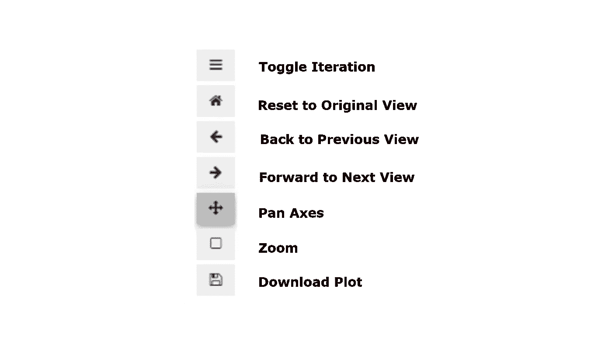

# 在一行 Python 代码中实现现有 Matplotlib 绘图的交互

> 原文：<https://towardsdatascience.com/make-your-existing-matplotlib-plots-interactive-in-a-single-line-of-python-code-8a6d1673ba2d?source=collection_archive---------24----------------------->

## 使用 matplotlib 库的交互式小部件，而不是内联绘图


图片由 [Michal Jarmoluk](https://pixabay.com/users/jarmoluk-143740/?utm_source=link-attribution&amp;utm_medium=referral&amp;utm_campaign=image&amp;utm_content=561388) 来自 [Pixabay](https://pixabay.com/?utm_source=link-attribution&amp;utm_medium=referral&amp;utm_campaign=image&amp;utm_content=561388)

探索性数据分析是数据科学模型开发流程中的一个重要元素。EDA 帮助数据科学家更好地理解数据变量和它们之间的关系，并揭示超越正式建模或假设检验的任务。Matplotlib 是一个流行的 Python 绘图库，它提供了一个面向对象的 API 来将绘图嵌入到应用程序中。

有很多开源库可以生成交互式的情节，包括 Bokeh，Altair，Plotly。在本文中，您可以通过添加几行 Python 代码，了解如何在 Jupyter 笔记本或 Jupyter Lab IDE 中使现有的 matplotlib 内联绘图具有交互性。这可以通过使用两个开源库`ipywidgets` 和`ipympl`来实现。

# 入门指南

首先安装`**ipywidgets**` (也称为 jupyter-widgets)库，该库将在内部用于创建小部件。该软件包为 Jupyter 笔记本和 IPython 内核提供了交互式 HTML 小部件。

`**ipymlp**` 是另一个将 IPython 笔记本转换成易于编辑的 YAML 文件的 Python 包。使用`**ipymlp**`的好处是你可以完全兼容 IPython 笔记本，并且能够在任何文本编辑器中编辑文件。

## 安装:

这两个包都可以从 PyPl 安装，使用:

```
**pip install ipywidgets --user
pip install ipympl --user**
```

安装必要的软件包后，使用以下方式启用`widgets` 和`ipympl` 扩展:

```
**jupyter nbextension enable --py --sys-prefix widgetsnbextension
jupyter nbextension install --py --symlink --sys-prefix ipympl**
```

现在，由于您希望所有的 matplotlib 图都作为小部件，您可以使用`%matplotlib` magic 命令更改外观。

*   使用`%matplotlib inline` magic command，绘图命令的输出在 Jupyter notebook 之类的前端内联*显示，就在产生它的代码单元的正下方。*
*   使用`%matplotlib widget`将您的所有绘图作为一个小部件

## 用法:

使用`**%matplotlib widget**` **，**更改后端后，使用 matplolib 包生成的图出现在一个小部件框内。figure `canvas`元素是一个适当的 Jupyter 交互式小部件，可以以交互式小部件布局格式定位。现在不是静态的内嵌 matplotlib 图，而是具有一些给定功能的交互式图。将出现小组件框:



(图片由作者提供)

使用上面的交互式绘图，您可以更改绘图的大小，平移和缩放绘图。人们也可以选择缩放和呈现给定的 x 和 y 坐标矩形的绘图。

下面的 GIF 描述了一个人如何在时间序列图中盘旋并从中获得洞察力。


(作者 GIF)

# 结论:

Matplotlib 小部件是一个方便的工具，它的主要优点是不需要在 Python 代码中做任何这样的修改。还有各种其他的 Python 包，包括 Plotly、Altair、Boker，它们可以生成交互式图形，但是需要首先适应新库的 API 功能。

阅读下面提到的[的文章](/interactive-data-visualization-167ae26016e8)作者 [Pier Paolo Ippolito](https://medium.com/u/b8391a6a5f1a?source=post_page-----8a6d1673ba2d--------------------------------) 可以更好地了解其他绘图库，包括 Plotly、Bokeh 等。

</interactive-data-visualization-167ae26016e8>  

# 参考资料:

[1] Ipympl GitHub 库:[https://github.com/matplotlib/ipympl](https://github.com/matplotlib/ipympl)

> 感谢您的阅读