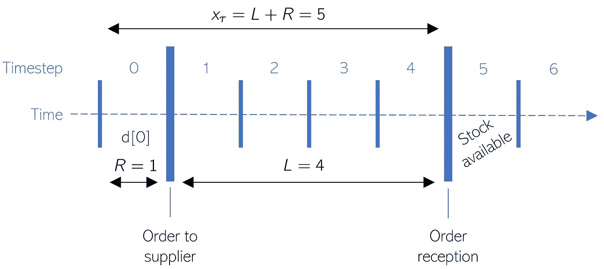
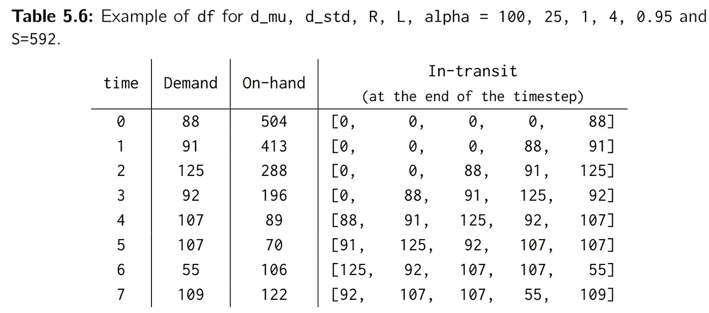

# 在 Python 中进行库存模拟

> 原文：<https://towardsdatascience.com/make-your-inventory-simulation-in-python-9cb950da8cf3?source=collection_archive---------3----------------------->

## 在本文中，您将在 Python 中创建一个定期补货策略的模拟。不到 30 行。

*本文摘自我的著作* [*库存优化:模型与模拟*](https://www.degruyter.com/document/doi/10.1515/9783110673944/html) *。你可以在这里* *阅读我的其他文章* [*，在这里*](https://nicolas-vandeput.medium.com/) *订阅我的博客* [。我也活跃在](https://nicolas-vandeput.medium.com/subscribe)[*LinkedIn*](https://www.linkedin.com/in/vandeputnicolas/)*上。*


西奥多·加勒(1571-1633)大约在 1600 年(后来着色)雕刻的“新发现”的卷首。[来源](https://www.wikigallery.org/wiki/painting_234811/%28after%29-Straet%2C-Jan-van-der-%28Giovanni-Stradano%29/Frontispiece-to-Nova-Reperta-New-Discoveries-engraved-by-Theodor-Galle-1571-1633-c.1600)

在使用 Python 编写库存模拟代码之前，让我们花点时间来定义我们将要模拟的库存策略:一个定期补货的库存策略。

# 库存政策:定期补货

遵循定期补货政策的产品会根据固定的时间表和最高水平定期订购。


定期补充。[来源:我的库存培训](https://supchains.com/)

在任何评估期的开始，我们需要订购足够的产品，以使我们的净库存达到水平 *S* 。从上图中可以看出，订单数量取决于我们下单时的库存数量，因此是可变的。另一方面，订单是按照固定的时间表生成的:两个连续订单之间经过的时间总是相同的。

这种定期补货策略实际上是供应链中最常见的，因为它经常被 MRP/DRP 的广泛使用强加到供应链上。这些工具遵循预定义的时间表—通常是每天或每周—这导致了定期审查策略的隐含使用。

> 固定评审期政策通常被称为(R，S)，其中 *R* 是固定评审期， *S* 是 up-to-level。

## 优势

定期补充允许企业将他们的订单分组给他们的每个供应商。这有助于客户和供应商简化他们的操作，因为他们可以提前计划订单和工作量。

## 限制

*   🛡️ **风险**。这种定期策略比连续策略(您可以在任何时间点下订单)风险更大，因为它会产生盲点:您不能在两个审核期之间下订单。如果你每周五向供应商下订单，但在周一晚上缺货，你将不得不再等四天才能下新订单。同时，你可能会因为缺货而损失销售额。这比固定再订购点政策风险更大，在固定再订购点政策下，你会在周一晚上直接下新订单。
*   ️📦**可变订货量** y .另一个问题是，每份订单的订货量会有所不同。这可能会破坏平稳的操作流程。例如，如果您有一个货盘化的产品，您可能不想移除整个货盘周围的包装来运输一个单元。

## 连续保单呢？

在持续策略中，我们根据固定的阈值订购产品。一旦净库存达到阈值(或低于阈值)，我们就向供应商要求预定数量的单位(或启动生产批次)。这个阈值称为再订购点或 ROP。

连续保单假设客户可以随时向其供应商订购。实际上，情况可能并非如此。例如，供应商可能一个月只接受一次订单(或者一个月只发一次货——这是一样的)。在这种情况下，认为您会遵循固定的再订购点政策是不合理的，因为供应商实际上是在遵循自己的日历。因此，在实践中，真正的连续策略是例外的(一些完全自动化的生产流程或内部流程可能遵循这些假设)。


定期审查与持续政策。来源:我的库存培训:【https://supchains.com/live-training/ 

在开始你的第一个库存模拟之前，你可能想阅读我以前的文章，*库存优化，它为优化策略奠定了基础。*

[](/a-framework-for-inventory-optimization-71d4496aec75) [## 库存优化框架

### 库存优化之旅:利润最大化，库存政策优化，需求和供应…

towardsdatascience.com](/a-framework-for-inventory-optimization-71d4496aec75) 

# 模拟设置

## 需求和供应链

让我们从定义变量 *time —* 开始，它将设置我们模拟的持续时间。然后，我们可以填充遵循正态分布的需求数组。

```
import numpy as np
time = 200
d_mu = 100
d_std = 25
d = np.maximum(np.random.normal(d_mu, d_std, time).round(0).astype(int),0)
```

> 在这个模拟中，我们假设我们的需求是正态分布且严格为正。通过改变你设置它的方式，你可以随意改变这个假设。

然后，我们可以定义策略的其余输入，并计算各种参数。

```
from scipy.stats import norm
L, R, alpha = 4, 1, 0.95 
z = norm.ppf(alpha) 
x_std = np.sqrt(L+R)*d_std
```

请注意，我们将 *x_std* 计算为超过*风险范围的需求偏差，*风险范围是我在书中虚构的。

> *接收订单需要等待的最长时间。在此期间，您的库存有被耗尽的风险。*

*[](https://nicolas-vandeput.medium.com/inventory-optimization-5-ways-to-set-service-level-and-safety-stock-targets-cc3a9a5f44b) [## 库存优化:设定服务水平和安全库存目标的 5 种方法

### 在供应链中设置安全库存目标的最佳实践是什么？

nicolas-vandeput.medium.com](https://nicolas-vandeput.medium.com/inventory-optimization-5-ways-to-set-service-level-and-safety-stock-targets-cc3a9a5f44b) 

您可以在下图中看到我们的策略(和模拟)在第一个时间步中的表现。在时间步长 0 结束时做出的订单将在时间步长 5 期间可用。



模拟和库存策略的工作原理。来源:[库存优化:模型和模拟](https://www.amazon.com/gp/product/3110673916)

## 库存水平

让我们使用常用的安全库存公式来设置不同的库存水平。

*   📦**周期股 *Cs* 。**在一个补货周期内满足预期需求(或预测)所需的库存。
*   🛡️ **安全库存*不锈钢*。**保护供应链免受需求变化(或预测错误)和供应缺乏可靠性影响的库存。
*   🚚**在途库存*为*。**不同地点之间的在途库存。通常，这些是从供应商处订购的货物，但还没有在我们的仓库中提供给我们的客户购买。

```
Ss = np.round(x_std*z).astype(int) 
Cs = 1/2 * d_mu * R 
Is = d_mu * L 
S = Ss + 2*Cs + Is
```

[](https://nicolas-vandeput.medium.com/the-4-biggest-mistakes-when-using-the-safety-stock-formula-1f3cc93bcb1) [## 使用安全库存公式时的 4 个最大错误

### 通常的安全库存公式 Ss = z sigma sqrt(L)基于多种假设和捷径，而这些假设和捷径往往不受重视…

nicolas-vandeput.medium.com](https://nicolas-vandeput.medium.com/the-4-biggest-mistakes-when-using-the-safety-stock-formula-1f3cc93bcb1) 

由于我们的传入订单可以在运输途中停留多个周期(在我们的示例中，有 4 个周期)，我们将把 *transit* 定义为一个二维数组。

```
hand = np.zeros(time, dtype=int) 
transit = np.zeros((time,L+1), dtype=int)
```

正如您在下表中看到的，新订单将从第二维结束时开始( *transit[time，-1]* )，然后通过第二维久而久之(每周期一层)，直到到达最后一个槽( *transit[time，0]* )。最后一个时段意味着此在途库存将在本期期末收到(换句话说，从下一期开始可用)。



来源:[库存优化:模型和模拟](https://www.amazon.com/gp/product/3110673916)

## 服务水平

我们还必须创建两个对象来跟踪策略的服务级别:

*   *stock-out_period* 将包含一个 Boolean 值，用于标记某一期间是否缺货。
*   *stock-out_cycle* 将为每个订单周期(即审核周期)包含一个布尔值，用于标记我们在上一个周期的任何时候是否缺货。

```
stock−out_period = np.full(time, False, dtype=bool)
stock−out_cycle = []
```

## 模拟初始化

我们现在必须为第一个时间步长初始化这些数组。初始现有库存和净库存是 S 减去第一个期间的需求。第二个期间的在途库存初始化为第一个期间的需求。

```
hand[0] = S − d[0]
transit[1,−1] = d[0]
```

# 如何模拟库存策略

我们现在可以开始模拟了。以下是在每个时间步 *t* 执行的主要步骤:

1.  检查我们在期初是否收到订单( *transit[ t-1，0] > 0* )。如果是这样，我们需要通过检查上一期间是否有缺货来计算周期服务水平。
2.  通过减去需求 *d[t]* 并加上接收库存*运输[t-1，0]* 来更新现有库存
3.  在 *stockout_period[t]* 中指出我们是否缺货。
4.  更新净库存头寸 *net[t]* 。
    记住是总在途库存 *transit[t]。sum()* 加上现有库存*手【t】*
5.  通过将先前时间步长的值偏移 1 来更新在途数组: *transit[t，:-1] = transit[t-1，1:]* 。这代表了订单在供应链中移动的事实。
6.  如果我们处于评审期( *t%R==0* )，我们根据当前净库存头寸*net【t】*和合格水平 *S* 进行订购。然后，订单被存储在在途数组 *transit[t，L]* 的末端。

```
for t in range(1,time): 
  if transit[t−1,0]>0: 
    stockout_cycle.append(stockout_period[t−1]) 
  hand[t] = hand[t−1] − d[t] + transit[t−1,0] 
  stockout_period[t] = hand[t] < 0
  transit[t,:−1] = transit[t−1,1:]
  if 0==t%R: 
    net = hand[t] + transit[t].sum() 
    transit[t,L] = S − net
```


你可以在这里下载我的书的摘录(共 100 页):[https://supchains.com/books/](https://supchains.com/books/)

# 报告

最后，我们可以创建一个数据框架 df 来保存我们的模拟结果，并将它们绘制在类似下图的图表上。

```
df = pd.DataFrame(data= {'Demand':d, 'On−hand':hand, 'In−transit':list(transit)}) 
df = df.iloc[R+L:,:] #Remove initialization periods 
print(df)
df['On−hand'].plot(title='Inventory Policy (%d,%d)' %(R,S), ylim=(0,S), legend=True)
```


我们还可以打印周期和期间服务水平。

```
print('Alpha:',alpha∗100)
SL_alpha = 1−sum(stockout_cycle)/len(stockout_cycle)
print('Cycle Service Level:', round(SL_alpha∗100,1))
SL_period = 1−sum(stockout_period)/time
print('Period Service Level:', round(SL_period∗100,1))
```

# 下一步是什么？

模拟对于优化不符合通常假设(常态、固定交付周期、无销售损失等)的策略是有说服力的。).上面的代码只是模拟驱动库存优化的第一步。

如果你想玩这个新工具，

*   查看不同的安全库存水平和提前期可以带来多大的库存变化和服务水平。
*   尝试不同的需求概率函数(如泊松或伽玛),看看它们与正常假设有何不同。您也可以使用自定义发行版。*