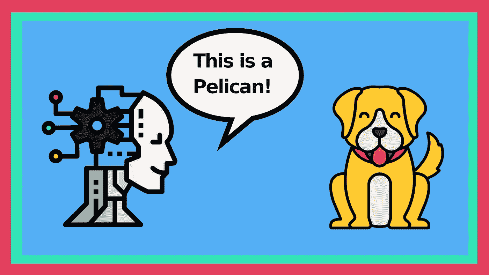
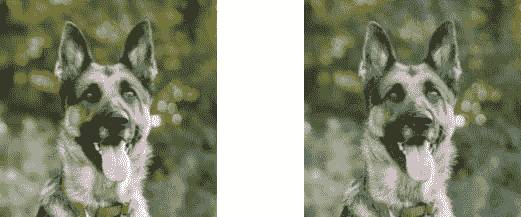
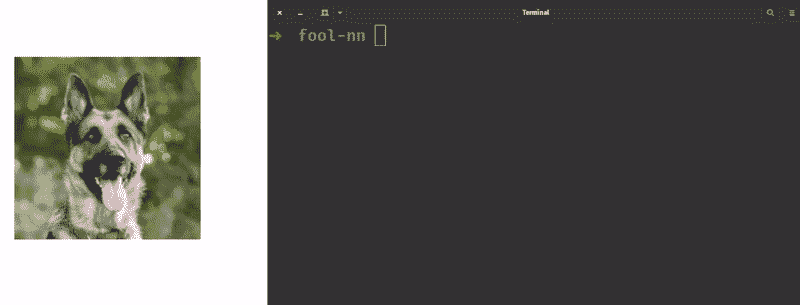
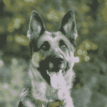
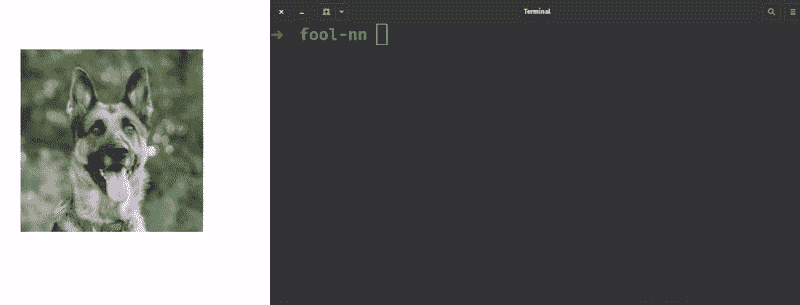
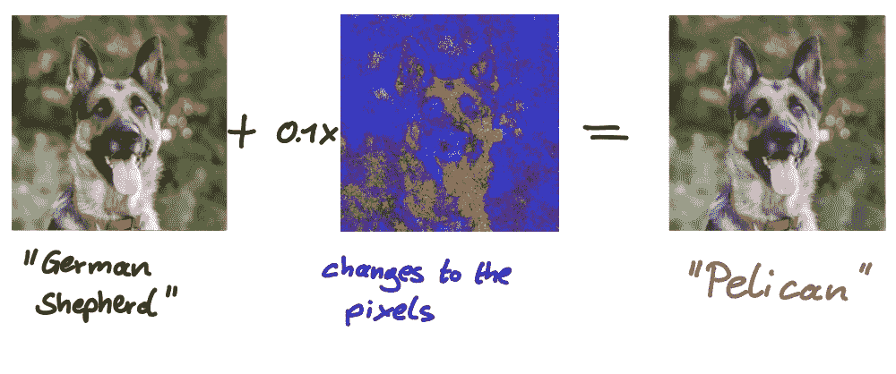
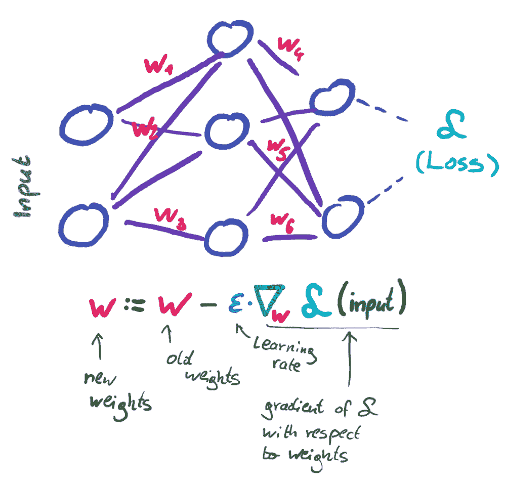
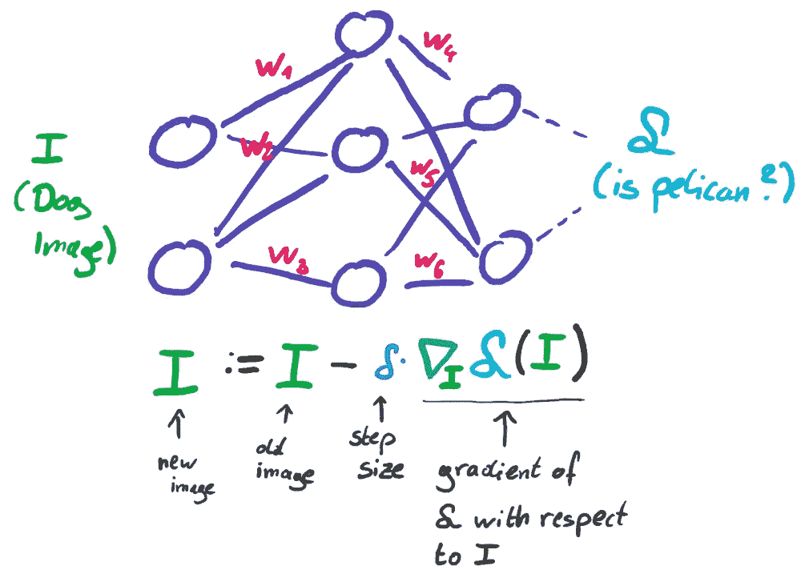

# 攻击神经网络

> 原文：<https://towardsdatascience.com/make-your-neural-net-confuse-dogs-with-pelicans-af7ad6ec95a5?source=collection_archive---------24----------------------->

## 使用 PGD 攻击为神经网络制造视错觉。



图标由[平面图标](https://www.flaticon.com/free-icon/dog_1998627?term=dog&page=1&position=6&page=1&position=6&related_id=1998627&origin=search)和 [photo3idea-studio](https://www.flaticon.com/free-icon/ai_1693857?term=ai&page=1&position=13&page=1&position=13&related_id=1693857&origin=search) 组合而成，作者(【marcelmoos.com】T4

我们来看看下面两张图:



图片来自安娜·杜德科娃的[Unsplash](https://unsplash.com/photos/asW9idv3HMM)

**左图是一只德国牧羊犬，右图是一只美丽的鹈鹕……**至少根据最先进的神经网络来看是这样的。我们将探索如何从左边的图片为右边的神经网络创建**视错觉。您甚至可以创建我们的狗图像的版本，顶级图像分类器可以将它与您喜欢的任何东西相混淆，从花椰菜到敞篷车。如果你更喜欢代码而不是文字，这里有一个交互式 Jupyter 笔记本。通过它，你可以关注和调整这个故事的一切:[colab . research . Google . com/drive/1 fl 0 px 0g 4 ppdlycmrerp-PS blf 4 ftzug？usp =共享](https://colab.research.google.com/drive/1fL0pX0g4ppdLlYCmrERP-PSbLF4fTZug?usp=sharing)**

答几年前，我在学习神经网络时做的第一件事就是训练一个简单的图像分类器。神经网络可以很好地分辨图像中的内容。然而，有一件事我当时没有问过自己:**“这些网络到底在学什么？”**

让我用一个例子来解释我的意思:我们人类是如何识别狗是狗的？我认为我们应该寻找一些与众不同的特征，比如尖耳朵、鼻子、尾巴、四条腿以及类似的东西。然而，对于神经网络来说，其他东西可能是必不可少的。他们在寻找什么，比如一只狗，这可能是一个相当神秘的事情。这种现象在我称之为**神经网络的视错觉**中变得非常明显。令人着迷的是，它们是 ***而不是*** 对人类的幻觉。

下图包含一只漂亮的德国牧羊犬。神经网络不仅正确地将它归类为狗，甚至将其归类为正确的品种。而且它对自己的决定有 93 %以上的把握，所以这里一切都好。



现在问题来了。我们来看看下面这张图:



该图像几乎是前一个图像的完美副本。**剧透:不是！**你必须非常仔细地观察才能看出不同。背景不是绿色的，画面似乎有点嘈杂。但对人类来说几乎是察觉不到的。我想我们都同意，每一个接受第一张图片显示的是一只德国牧羊犬的人都会对这张图片说同样的话。所以我们的神经网络也应该仍然声明它看到一只德国牧羊犬有大约 93 %的把握，对吗？**错了。我们的神经网络现在 100%确定它看到了一只鹈鹕:**



好吧，这里发生了什么？我们使用的分类器是一个 50 层的 [**残差神经网络**](https://en.wikipedia.org/wiki/Residual_neural_network) **(resnet)。**它在 [ImageNet 数据集](https://image-net.org/index.php)上进行了预训练，这是一个包含 1000 个不同对象类的庞大图像集合。接下来，我们使用了一张我们的 resnet 正确分类的德国牧羊犬的图片。

> 为了给我们的 resnet 创建视错觉，我们取原始图像并稍微改变原始图像的像素。我们只改变正确的像素，resnet 对我们可爱的狗最敏感的像素。

下图显示了我们需要改变多少像素来欺骗我们的分类器。**因为像素变化非常小，我把它们放大了 10 倍，所以我们可以看得更清楚:**



因此，我们改变了原始图像稍微偏蓝和偏红。还有，一些像素点变亮了一点。在我们看来，这些变化几乎不存在。但是对我们的 resnet 来说…哦，天哪…它改变了一切。现在看到鹈鹕就彻底服气了。最棒的是，它不一定是鹈鹕。这一招基本上适用于任何职业。我们可以欺骗神经网络，让它认为我们的狗是花椰菜、打印机或其他任何东西。此外，**每一个像样的图像分类器都容易受到这些视错觉**或者——它们在文献中如何被称为——***对抗性图像的影响。***

**现在的问题是，我们如何找到这些混淆我们的分类器的像素变化？我们如何自动创造这些视错觉？**

# **自动愚弄神经网络**

**我们对狗的形象所做的改变非常微小，但也非常具体。手动寻找这些扰动是不可行的。幸运的是，有各种不同的技术，也称为**攻击，可以自动创建这些视错觉。**其中一种攻击叫做**投影梯度下降(PGD)** 。为了理解 PGD，我们首先需要快速提醒自己神经网络是如何使用梯度下降进行学习的。**

## **梯度下降**

**神经网络包含权重。改变权重会影响神经网络的输出。为了训练一个神经网络，我们需要**量化它的答案与正确答案的偏差程度。这是通过损失函数来完成的。**一旦定义了损失函数，我们就可以计算损失函数相对于网络权重的梯度。直观地说，**(负)梯度告诉我们如何改变网络的权重，以使损耗尽可能快地减少**，这意味着它的答案尽可能快地变得更正确。**

****

**基于梯度下降的学习图解。(图片由作者提供)**

**对训练集中的所有图像反复进行这种操作会得到一个训练好的网络。在高层次上，这概括了基于梯度体面的学习。**

## **PGD 攻击**

**恭喜，如果你理解梯度下降，你就已经理解了 PGD 攻击。对于 PGD 攻击，**我们采用网络并定义一个新的损失函数**。对于我们的德国牧羊犬形象，我们希望它被归类为鹈鹕(或任何你喜欢的)。现在，类似于基于梯度下降的训练，我们计算梯度。**

> **然而，我们不是根据网络的权重(那些是固定的)来计算梯度，而是根据图像的像素来计算梯度。直观上，这种梯度告诉我们如何改变图像的像素，以便网络尽快认为这是一只鹈鹕。**

****

**PGD 攻击的插图(没有最终投影)。(图片由作者提供)**

**差不多就这样了。我们应用这些变化并继续，直到神经网络实际上将我们的图像分类为一只鹈鹕。**

**你可能会问，PGD 的 *P* 、投影*在哪里发挥作用。PGD 攻击允许我们为每个像素定义一个变化极限。每个像素的所有颜色通道都采用 0 到 255 之间的值。**对于 PGD 攻击，我们可以指定任何像素都不应该改变超过 10 个点。**每当一个像素受到超过 10 个点的干扰时，该像素被投影到其允许的一组值。***

## ***Python 包***

***幸运的是，我们不需要了解所有的细节并从头开始重新实施 PGD 袭击。有一个令人惊叹的 python 包叫做*fool box*(【github.com/bethgelab/foolbox】T2)，它支持 PGD 攻击(以及更多)并兼容 TensorFlow 和 PyTorch。使用 Foolbox，从德国牧羊犬图片生成我们的鹈鹕敌对图像既简单又快捷:***

```
*criterion = TargetedMisclassification(pelican_label)
attack = PGD()
adv_input = attack.run(net, german_shepherd, criterion, epsilon=10)*
```

***如果你想自己生成对抗性的图像并运行和调整代码，我强烈建议查看 Jupyter 笔记本:[colab . research . Google . com/drive/1 fl 0 px 0g 4 ppdlycmrerp-PS blf 4 ftzug？usp =分享](https://colab.research.google.com/drive/1fL0pX0g4ppdLlYCmrERP-PSbLF4fTZug?usp=sharing)***

# ***结论***

***从一张我们的分类器正确标记为德国牧羊犬的照片中，我们创建了一张敌对的图像——神经网络的一种视错觉——显示了同一只狗，但被我们的网络误分类为鹈鹕。创造这些视错觉可能是一项有趣的练习。然而，在现实生活中，敌对的图像可能会产生严重的后果。试想一下，一辆自动驾驶汽车将停车标志误标为限速标志。有一些技术可以抵御敌对的图像，但那是另外一个故事了。***

***觉得这个故事有趣？你可以在这里成为一个中等会员来支持我的写作:[medium.com/@mmsbrggr/membership](https://medium.com/@mmsbrggr/membership)。你将获得所有媒体的访问权，你的部分会员费将直接支持我的写作。***

***欢迎在 LinkedIn[上向我提出私人问题和评论。如果你喜欢这篇文章，让我告诉你我的时事通讯:](https://www.linkedin.com/in/marcel-moosbrugger/)[marcelmoos.com/newsletter](https://marcelmoos.com/newsletter)。***

***以下是另外三个你可能感兴趣的故事:***

***</why-your-neural-net-is-uncertain-in-different-ways-a125ce1fa4e5>  </what-really-is-a-matrix-determinant-89c09884164c> ***