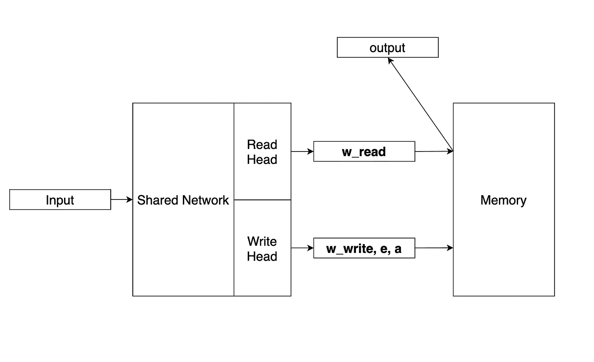
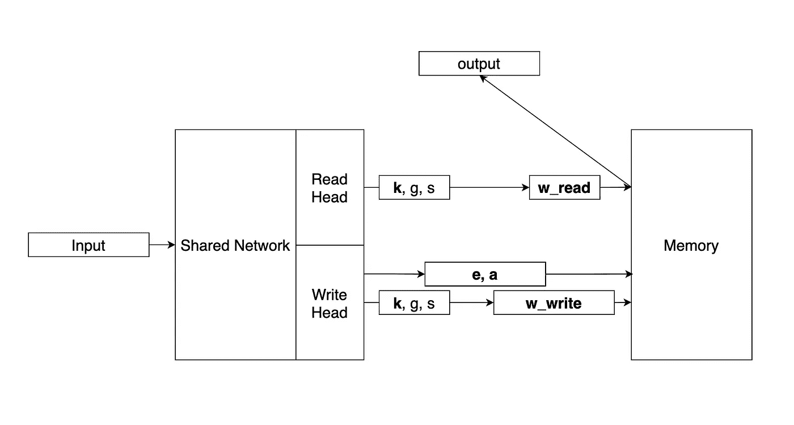
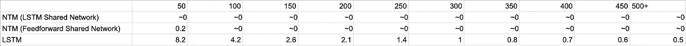

# 用记忆让你的神经网络更聪明:神经图灵机

> 原文：<https://towardsdatascience.com/make-your-neural-network-smarter-with-memory-neural-turing-machines-e5601b3123b6?source=collection_archive---------27----------------------->

## 将神经网络与记忆系统结合起来，可以像人类一样学习通用算法。请继续阅读，了解更多信息。

Lyman Hansel Gerona 在 [Unsplash](https://unsplash.com?utm_source=medium&utm_medium=referral) 上拍摄的照片

计算机很神奇，因为它们执行任意算法的速度比人快几个数量级。神经网络很神奇，因为它们可以学习特定的东西(开车、下棋等。)远胜人类。然而，还没有一个神经网络将这两者结合起来——在任意算法上的卓越性能。直到 2014 年，一篇关于“神经图灵机”的[论文](https://arxiv.org/pdf/1410.5401.pdf)发表。本文作者将标准神经网络与类似计算机的记忆系统相结合，发现这种新型网络能够学习一些简单的算法，例如复制粘贴。我认为这是一个惊人的成就，所以让我们仔细看看它是如何工作的。

首先，我们先明确一下“学习简单算法”是什么意思。复制粘贴算法就是这样一种算法。基本上，给定一系列任意大小的输入向量，我们希望输出与输入相同。现在你可能会问——这不就是身份函数吗？当然，即使是最简单的神经网络也能学会！这是真的——神经网络可以学习给定输入大小的**的身份函数。神经网络**无法学习适用于任何输入大小的任意身份函数**。您可以自己尝试:训练一个神经网络来学习长度为 10 的向量的恒等函数，然后测试长度为 20 的向量的准确性。性能会很差。总而言之——我们的目标是用单个神经网络学习算法的**一般形式**，而不仅仅是算法的一个具体情况。**

计算机擅长算法的一般形式。例如，当您在文本编辑器中进行复制(Ctrl-C)和粘贴(Ctrl-V)时，所选文本有多长并不重要。计算机将完美地执行任意长度的复制-粘贴。计算机如此擅长这类算法的部分原因是因为它们的记忆系统。基本上，这个记忆系统让计算机存储输入，对这些输入进行处理，并在以后需要时检索它们。相比之下，神经网络拥有的唯一“存储”是网络权重的值。砝码的容量远小于计算机上千兆字节的内存。这就是为什么我们要给神经网络添加一个记忆系统——提供许多算法成功执行所需的存储空间。

那么研究人员是如何实现记忆系统的呢？这个想法很简单。“内存”是一个 N x M 维的大型二维矩阵，N 行中的每一行代表一个内存单元。n 和 M 是网络运行前设置的超参数。下一步是定义如何读写这个内存。这更棘手。根据所学的算法，我们可能只需要读取矩阵中的一行，或者矩阵中的所有行。也有可能一些行比其他行更重要。为了适应所有这些情况，我们引入了长度为 n 的权重向量 **w_read** 。从存储器的“读取”则是所有矩阵行的加权和:σ(w _ read _ I)*(**row _ I**)。(在本文的其余部分，向量将被**加粗**，标量将是常规字体)

写入存储器更复杂。首先，我们需要决定如何处理内存中的现有行。因此，我们需要另一个参数 **e** 。这个参数是一个长度为 M(与行相同)的向量，具有 0 到 1 之间的各个分量。 **e** 和 **row_i** 之间的元素乘积决定了 **row_i** 剩余多少。例如，如果 **e** 的所有组件都是 0，这意味着我们不想保留任何 **row_i** 。如果 **e** 拥有所有 1 个组件，这意味着我们想要保留所有的 **row_i** 。而如果 **e** 在中间某处，我们更想保留 **row_i** 的某些组件。注意 **e** 对于所有行都是相同的。

一旦我们决定保留什么，我们接下来必须添加任何新的信息。因此，我们有另一个参数 **a** 添加到每一行。最后，我们有一个权重向量 **w_write** ，它决定了对数组中每一行的写操作的大小(或“重要性”)。因此每行的总更新量为**row _ I _ new**=**e*****row _ I _ old**+w _ write _ I*****a**。**

**我们现在已经描述了如何从内存矩阵中读取和向内存矩阵中写入单独的行。我们这样做是根据一些参数: **w_read，w_write，e，**和 **a** 。自然的问题是——这些参数从何而来？回想一下，总体目标是将神经网络与记忆系统结合起来。因此，我们将这些参数作为我们系统的神经网络部分的输出。更准确地说，我们将建立一个神经网络，它有两个输出区域:读头**和写头**。网络的读头区负责输出读取所需的参数: **w_read** 。同样，网络的写头区会输出写参数: **w_write，e，**和 **a** 。最后，读取头的输出作为整个系统的输出返回。******

****

**图片作者。**

**这种架构的一个主要优点是整个事情都是可微分的。请注意，所有读/写操作对于每个组件来说都是线性的，因此是可区分的。这使得网络在概念上易于训练:只需找到每个分量相对于输出的梯度，然后进行梯度下降。**

# **丰富**

**在这一点上，我们有一个原型网络，其中包含了一个记忆系统。然而，仍然有可以改进的地方。这些改进大多围绕着 **w_read** 和 **w_write** 向量，如果您还记得的话，它们决定了每个内存行在读或写中的相对重要性。正因为如此， **w** 向量通常被称为**寻址**向量，参考了计算机中内存寻址的思想。就像现在的网络一样，寻址向量由读写头直接输出。**

**我们可以对寻址向量的产生方式进行各种修改。首先，不是让读写头输出 **w** ，而是让它们输出一个键向量 **k** 。那么我们可以做几件事:**

*   **算法中一个常见的用例是根据 **k** 获取内存中的特定行。实现这一点的直观方法是对所有行使用余弦相似性，并基于这些余弦相似性对 **w** 的分量进行加权。我们称之为**内容聚焦**。**
*   **如果我们不想要一个基于内容的特定行( **k** )，而是想要一个特定的常量行呢？例如，我们可能正在学习一个在第 5 行存储重要内容的算法。我们如何总是访问第 5 行？这被称为**位置聚焦**。首先，我们可以让读写头输出一个**门加权值** g。门加权值是一个介于 0 和 1 之间的标量，它决定了保留多少先前地址 **w_(t-1)** 与保留多少当前地址 **w_(t)** 。换句话说，更新方程是**w _(t)_ new =**g*** w _(t-1)**+(1—g)***w _(t)**。在我们强调的用例中(在每个时间步访问第 5 行)，神经网络最终会找到一个聚焦于第 5 行的 **w** ，然后将 g 设置为 1，以在未来的时间步中保持该 **w** 。**
*   **另一个常见的用例是循环，我们希望内存地址在每个时间步长增加一个常数。我们可以通过使读写头输出一个代表地址的每个部分增加多少的移位加权来实现这一点。例如，如果 s=2，那么 **w** 的所有分量都移动 2。因此，如果先前的 **w** = [0.1，0.7，0.2，0](集中在第 2 行)，随着移位的应用 **w** = [0.2，0，0.1，0.7](集中在第 4 行)。**

**寻址机制的这些改进为神经网络提供了更多的工具来访问它在内存中想要的行。相应地，我们应该看到准确性的提高。整个网络的更新示意图如下所示:**

****

**图片作者。**

**这是一个简单的版本，论文作者称之为“神经图灵机”(NTM)。在论文中，我们描述的各种组件更加复杂，但思想是相同的。如前所述，尽管 ntm 比常规神经网络要复杂得多，但它们很容易训练，因为所有组件都是可微分的。因此，训练上述 NTM 的方式是将网络/存储器初始化为一些值，决定成本函数，并简单地运行梯度下降。**

# **有用吗？**

**是的。实验表明，ntm 比常规神经网络更好地学习一些算法。让我们考虑一下我们在开始介绍的复制粘贴问题:取一个输入向量序列，输出相同的序列。论文作者在这项任务中训练了两个不同版本的 NTM，以及一个 LSTM。下表显示了结果:**

****

**图片作者。**

**各行代表每种网络类型的误差(单位为每序列位数)。这些列表示(以千计)到达该点需要多少训练序列。例如，第一列意味着通过 50000 个训练序列，NTM/LSTM 具有接近每个序列 0 比特的误差，NTM/前馈网络具有 0.2 的误差，而 LSTM 具有 8.2 的误差。**

**正如你所看到的，这两个 NTM 变种学习复制粘贴问题比常规神经网络(LSTM)快得多。一旦学习完成，它们也具有较低的误差(注意，LSTM 的渐近成本约为每个序列 0.5 比特，但是两个 ntm 的渐近成本接近于 0)。研究人员还检查了两个经过训练的 NTM 网络中网络和记忆之间的交互模式，并意识到该模式可以用下面的伪代码来概括:**

****初始化**矩阵，写/读磁头到开始位置**

****而**(输入不是分隔符):**

*   **将输入写入写入磁头位置**
*   **将写磁头增加 1**

****而**(真实):**

*   **从读取头位置读取输出**
*   **将读取头增加 1**

**这太神奇了。虽然并不完美，但这段伪代码显示了 NTM 学会了像人类一样复制粘贴**。这是我第一次看到神经网络以如此可理解、直观的方式学习东西。通常神经网络有一个“黑箱”问题——它们学习东西，但我们无法理解它们。这里不是这样的。****

**另一件重要的事情是，研究人员采用了在大小为 20 的序列上训练的 NTM，并应用 NTM 来复制粘贴更长的序列。至关重要的是，尽管 NTM 犯了一些错误，但它总体上仍然工作正常。相比之下，常规的神经网络(在 LSTM 的论文中)不能推广到长度超过 20 的序列。前面我们提到过，我们想学习算法的一般形式，而不是特定的版本——看起来 NTM 成功地实现了这个目标。**

**研究人员还对 ntm 进行了其他任务的训练，如联想回忆和数据分类。我们不会在这里进入细节，但一般来说，NTMs 优于常规神经网络，并能够学习任务的通用算法。更多详情，请阅读原文[论文](https://arxiv.org/pdf/1410.5401.pdf)。**

**ntm 是神经网络架构中一个真正令人兴奋的发展。他们能够学习一般形式的算法，这是以前的网络无法做到的。正因为如此，我认为 ntm 是通往真正智能的关键一步。我很高兴看到这种基于记忆的想法的进一步发展。如果您有任何问题/意见，请告诉我，感谢您的阅读！**