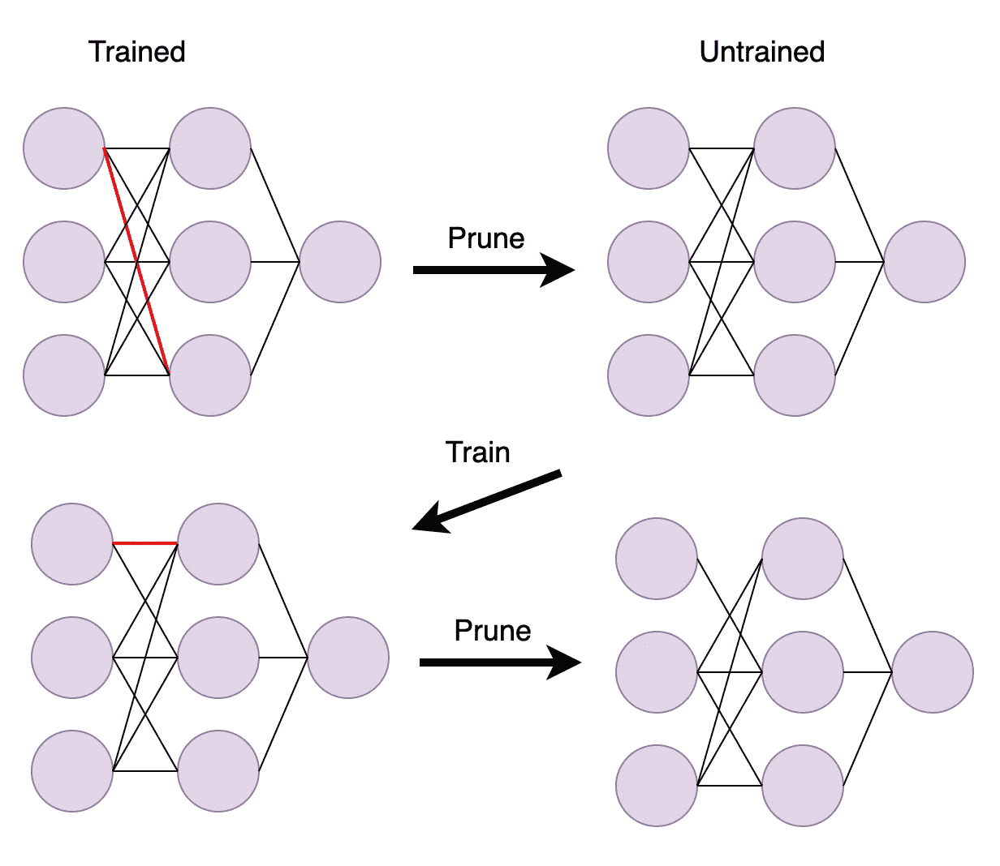

# 让你的神经网络更小:修剪

> 原文：<https://towardsdatascience.com/make-your-neural-networks-smaller-pruning-da1fcdb6f206?source=collection_archive---------31----------------------->

## 剪枝是使神经网络更经济的重要工具。请继续阅读，了解它是如何工作的。

由 [Unsplash](https://unsplash.com?utm_source=medium&utm_medium=referral) 上的 [C D-X](https://unsplash.com/@cdx2?utm_source=medium&utm_medium=referral) 拍摄的照片

神经网络的一个问题是它们的大小。你在在线教程中看到的神经网络足够小，可以在你的计算机上有效运行，但工业中的许多神经网络都很庞大，难以操作。它们通常需要几天来训练，运行它们会消耗大量的计算能力。这就提出了一个问题:在保持测试集准确性的同时，有没有可能减小神经网络的规模？事实证明，是的。有一种叫做“修剪”的技术可以做到这一点。还有一个被称为“彩票假说(LTH)”的想法，它让我们深入了解为什么修剪会有效。在本文中，我们将首先查看剪枝算法，然后讨论 LTH。

修剪是一种简单、直观的算法。有许多变体，但基本思想适用于任何神经网络。想法是这样的。在一个大型的、经过训练的神经网络中，会有一些具有较大幅度的权重和一些具有较小幅度的权重。自然，具有大幅度的权重对网络输出的贡献更大。因此，为了减小网络的大小，我们去除(修剪)小幅度的权重。要修剪的小幅度权重的确切数量由用户设置——大约 10%是合理的。问题是，一旦发生这种情况，网络就不再被正确训练。因此，在修剪小幅度的权重之后，我们需要再次训练网络。我们可以根据我们想要使网络有多小来任意次数地进行这个循环(修剪->训练)。

样本剪枝算法的两次迭代。红线代表修剪后的权重。图片作者。

修剪的一个好处是它确实有效。有大量的经验证据支持它。更具体地说，修剪已经被[证实](https://arxiv.org/pdf/2003.03033.pdf)可以在降低网络规模(内存)的同时保持准确性。有什么不好的地方吗？是—完成清理过程可能需要很长时间。prune- >训练循环的每一次迭代都要花费大量时间，尤其是在网络很大的情况下。我们可以通过增加每次迭代期间修剪的权重的数量(例如，从 10%到 20%)来减少循环的数量，但是这样循环的每次迭代需要更长的时间。总而言之，修剪是有效的，但是需要一段时间才能完成。

还有一个问题是，最终修剪后的子网可能会有一个奇怪的体系结构，权重会出现在看似随机的地方。因为现代代码/硬件仅针对少数神经网络架构进行了优化，所以有可能修剪后的网络虽然更小，但实际上可能需要更多的时间来运行。这些权衡是否值得取决于具体的用例。

现在我们转到一个更有趣的问题:为什么修剪会起作用？如前所述，我们知道修剪适用于许多流行的神经网络架构。这导致了一个假设，即**许多神经网络被过度参数化**。换句话说，存在一个更小但仍然有效的网络(通过剪枝找到)的事实意味着在原始网络中有太多的参数。

另一个问题是为什么剪枝算法选择最终的权重。回答这个问题的一个有趣尝试是[彩票假说](https://arxiv.org/pdf/1803.03635.pdf)。这篇论文中的研究人员声称，通过修剪选择的最终子网**是因为该子网的初始初始化**而被选择的。

他们通过以两种不同的方式执行 prune->train 循环得出了这个结论。第一种方法，在每次训练循环之前，他们随机初始化所有剩余的(未修剪的)权重。第二种方法是，在每次训练循环之前，他们对所有剩余的权重使用初始初始化。他们发现，使用原始初始化显著提高了剪枝算法的最终精度和训练速度。因此，研究人员假设最初的初始化是剪枝算法选择什么子网背后的驱动因素。然而，不清楚为什么会这样。起初，研究人员认为剪枝算法喜欢在训练期间不变的权重(即剪枝算法更喜欢接近最终值的原始权重初始化)。然后他们测试了这个理论，实际上发现正好相反。修剪算法选择在训练期间变化最大的权重。为什么会这样，这意味着什么，这仍然是一个悬而未决的问题。

总之，有实验证据表明，修剪产生的子网络与权重的初始初始化有关。建筑怎么样？所选子网的架构可能很特别，这似乎是很自然的。已经有一些[研究](http://proceedings.mlr.press/v49/cohen16.pdf)表明深度网络比浅层网络更有效地表示某些假设类别(多项式对指数)。对于修剪后的子网来说，可能存在类似的情况。但是，我没有找到任何实证或理论论文来支持这个理论。

总体来说，有两个关键点。首先，修剪起作用(需要一些时间权衡)。第二，修剪肯定与原始网络的初始化有关，也可能与体系结构有关。感谢阅读，并请留下任何问题/评论！