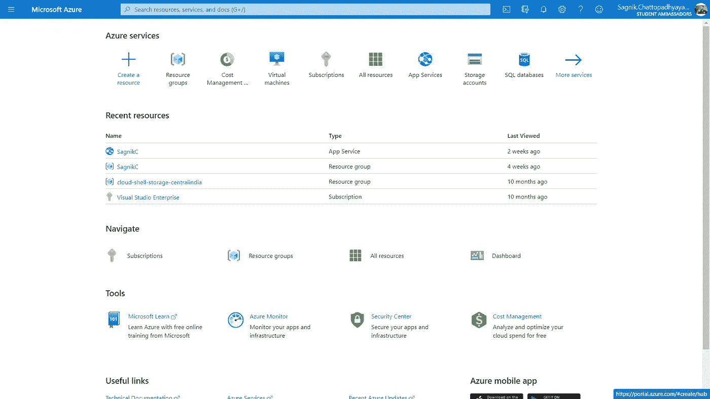
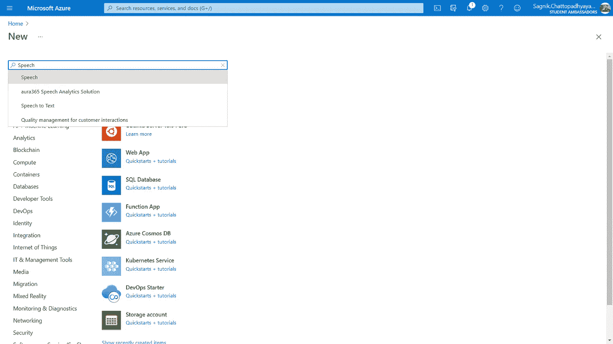
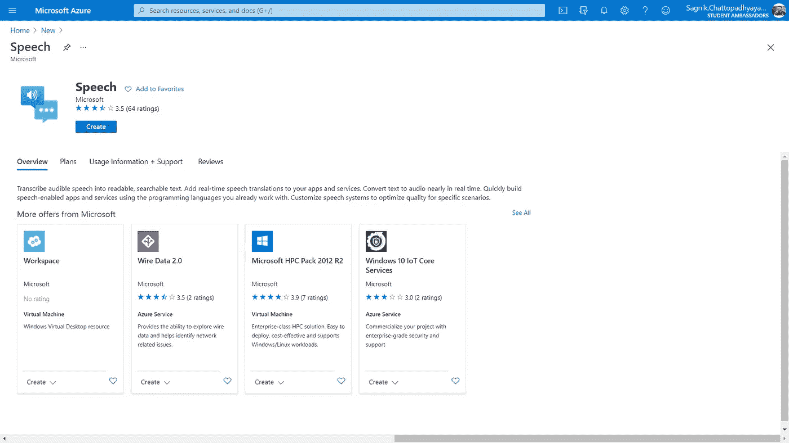
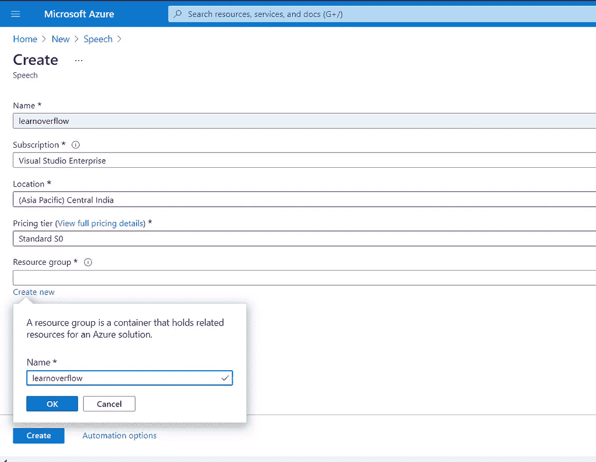
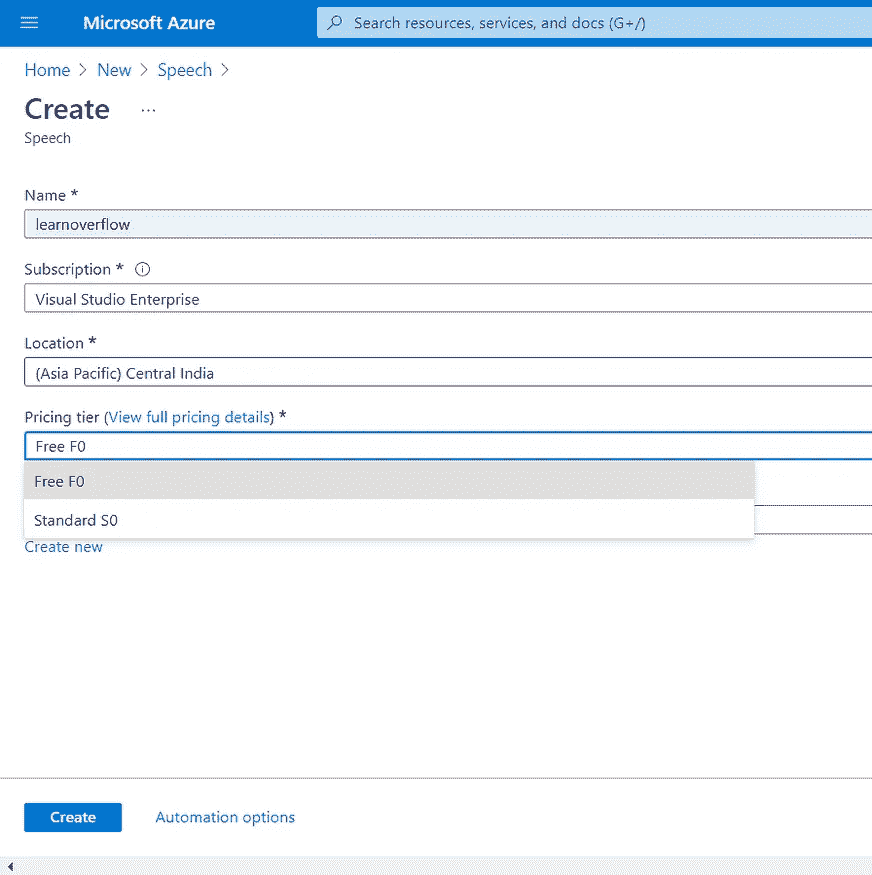
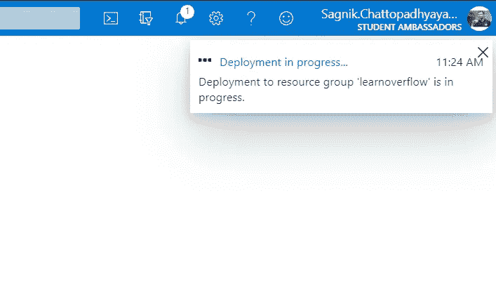
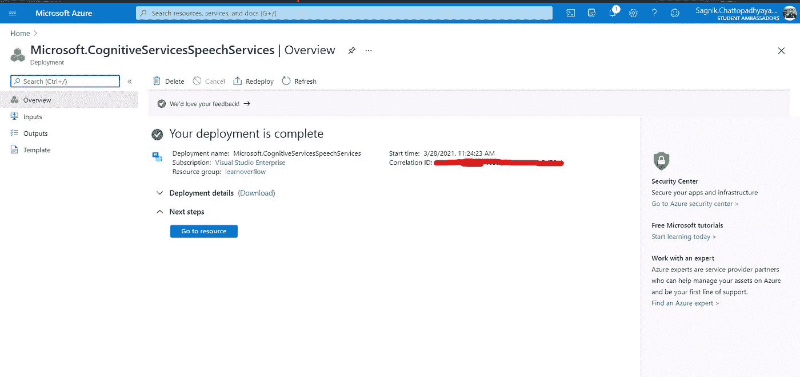
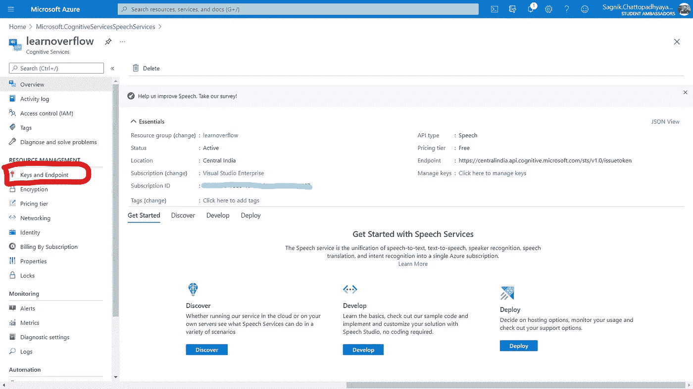
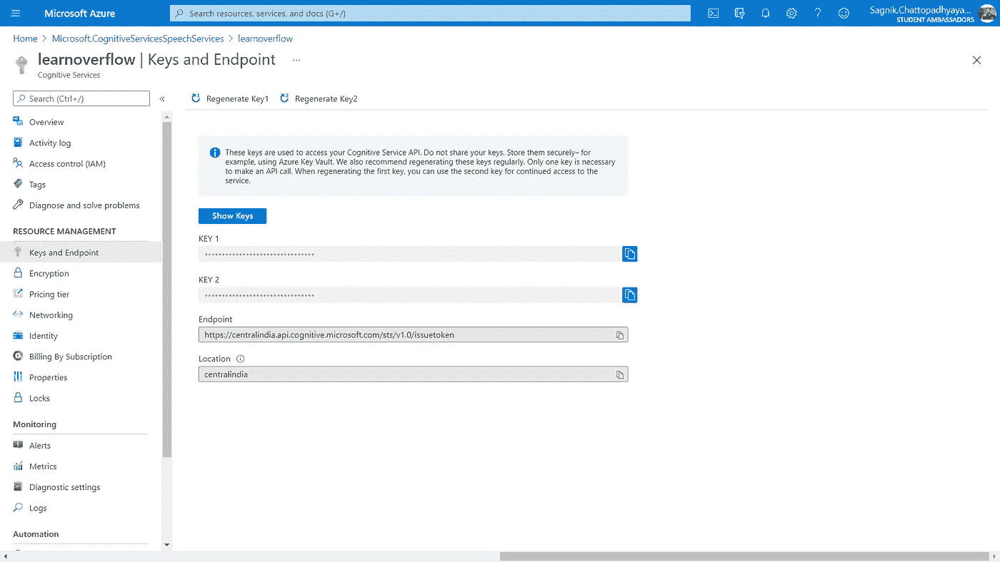

# 使用 Azure 认知服务制作您自己的有声读物

> 原文：<https://towardsdatascience.com/make-your-own-audiobook-using-azure-cognitive-service-fbc0cbc7a224?source=collection_archive---------28----------------------->

## 我们过去购买有声读物的日子已经一去不复返了，现在是时候使用 Python 和 Azure 认知服务了


一张由[亚伦·伯登](https://unsplash.com/@aaronburden)在 [Unsplash](https://unsplash.com/photos/v0HbU2CNJFs) 上拍摄的图片

L ets 说你已经有了一本书的 PDF 版本，这本书是你从某些来源(可能是免费的)获得的，你没有时间一行一行地阅读它。也可能发生的情况是，你不想花钱买它的音频版本，或者可能它的音频版本不可用。那么这篇文章就送给你了。在本文中，您将看到如何使用简单的 python 脚本和 Azure Cognitive service 的文本到语音功能制作自己的有声读物。但是首先让我告诉你一些关于有声读物的事情。

# **什么是有声读物？**

> **有声读物**(或**有声读物**)是大声朗读的一本书或其他作品的录音。完整文本的阅读被描述为“未删节的”，而较短版本的阅读则是删节的。”— [维基百科](https://en.wikipedia.org/wiki/Audiobook#:~:text=An%20audiobook%20(or%20a%20talking,shorter%20version%20are%20an%20abridgement.)。

市场上有许多服务可以为你提供有声读物。一些受欢迎的有[有声](https://www.audible.com/)、[手写](https://www.scribd.com/audiobooks)、[有声读物](https://www.audiobooks.com/browse)等等。但是所有这些都要收取订阅费。

所以，让我们开始建立自己的有声读物。为此，请确保您具备以下先决条件。

## 先决条件:

1.  确保你已经在你的电脑上安装了 Python 3.5 或更高版本。万一你没有，那么你可以从[官网](https://www.python.org/downloads/)安装。在我的电脑上，我安装了 Python 3.6，所有这些演示都将基于它。不要担心，如果你使用的是最新的 Python 3.9，不会有任何不同。
2.  接下来，我们需要一些能帮助我们处理 PDF 的东西。因为 Python 有一个很棒的库，可以充当 PDF 工具包，名为 **PyPDF2** 。你也可以看看它的完整文档。
3.  我们还需要一个 Azure 账户来使用 Azure 认知服务。但是等等，我们在寻找制作免费有声读物的方法，对吗？是啊！别担心，我会告诉你免费的东西。

## 安装— 1:

首先，我们将安装 PyPDF2。对于，请打开终端或命令提示符，并键入:

```
pip install PyPDF2
```

现在，如果你第一次使用 Python(或者 pip ),你很可能会得到一个错误，比如“PIP 不被识别为内部或外部命令……”。这基本上意味着你没有为 pip 设置路径。下面我会给出一篇文章的链接，详细解释如何解决这个问题。

[](https://medium.com/swlh/solved-windows-pip-command-not-found-or-pip-is-not-recognized-as-an-internal-or-external-command-dd34f8b2938f) [## [已解决]Windows:找不到 Pip 命令，或者 Pip 未被识别为内部或外部命令

### 注意:如果教程对你没有帮助，请随意评论，并说明原因。此外，我确实在周末检查我的电子邮件…

medium.com](https://medium.com/swlh/solved-windows-pip-command-not-found-or-pip-is-not-recognized-as-an-internal-or-external-command-dd34f8b2938f) 

虽然我们需要一些其他的库，但是让我们先看看如何使用 pdf。

## 阅读 PDF 文件:

我们的 PyPDF2 库可以对一个 PDF 文件进行各种各样的操作。其中我们会用到它的阅读能力。为此，我们首先需要创建一个 python 文件(一个带有。py 作为扩展名)并导入库。

```
import PyPDF2
```

然后我们将创建一个名为 *book* 的对象，我们将用它在阅读模式下打开我们的 pdf。

```
book = open(**"yourPdfName.pdf"**,**"rb"**)
```

这里需要注意的重要一点是 pdf 的位置。上面的代码假设所需的 pdf 与 python 文件位于同一文件夹中。如果它在不同的文件夹中，那么你有两个选择。1:将文件(pdf 或 python)移动到与其他文件相同的文件夹中。2:给出 pdf 文件的确切位置。假设我的 pdf 在桌面中，那么我会写“C:\ \ Users \ \ sag Nik \ \ Desktop \ \ yourpdfname . pdf”。这将解决问题。

现在可能会有一个问题，什么是“rb”写到最后。“rb”基本上是文件处理中使用的一种存取方式。要了解 Python 中其他访问模式或文件处理的更多信息，请参考 Python 文件处理。

[](https://stackabuse.com/file-handling-in-python/) [## Python 中的文件处理

### 引言 Python 是最好的入门编程语言之一，这是一个不成文的共识…

stackabuse.com](https://stackabuse.com/file-handling-in-python/) 

到目前为止，我们只是打开了我们的 PDF 文件。现在我们需要指定一个读者，他可以阅读我们的 pdf 并从 pdf 文件中逐页提取文本。为此，我们将使用下面几行代码。

```
reader = PyPDF2.PdfFileReader(book)

**for** num **in** range(0,reader.numPages):
    text = reader.getPage(num).extractText()
    # print(text)
```

这里对象*读者*利用 PyPDF2 库来阅读我们的书。之后，它遍历书的每一页，并通过使用基于页码的 for 循环从中提取文本。如果你想知道它会显示什么样的文本，你可以去掉“#”，看看它会显示什么。甚至你可以将它与你的 pdf 中的文本进行匹配。

现在我们得到了我们的文本，我们唯一剩下的事情就是把它转换成语音并听它。为此，我们将使用 Azure 认知服务。要了解更多关于认知服务的信息，您可以访问下面的链接。

[](https://azure.microsoft.com/en-in/services/cognitive-services/#overview) [## 认知服务-面向人工智能开发者的 APIs 微软 Azure

### 我们正在将必应搜索 API 从认知服务平台转移到 Microsoft.com 旗下的新领域。现有的…

azure.microsoft.com](https://azure.microsoft.com/en-in/services/cognitive-services/#overview) [](https://docs.microsoft.com/en-us/azure/cognitive-services/what-are-cognitive-services) [## 什么是 Azure 认知服务？- Azure 认知服务

### 认知服务让每个开发人员都可以使用人工智能，而不需要机器学习和数据科学…

docs.microsoft.com](https://docs.microsoft.com/en-us/azure/cognitive-services/what-are-cognitive-services) 

## 文本到音频:

为了使用 Azure 认知服务，你需要一个 Azure 账户。但是我们需要免费得到它，对吗？为此，请访问 [Azure 注册页面](https://azure.microsoft.com/free/ai/)并选择**开始免费**来创建您的新 Azure 帐户。你也可以观看这个 [YouTube 视频](https://www.youtube.com/watch?v=GWT2R1C_uUU)来获得设置免费账户的帮助。

如果你是一名学生(像我一样)，那么你有三种不同的选择来获得 Azure 帐户并免费使用。

*   *为学生使用 Azure。但是这需要你使用你的大学电子邮件 id (an *)登录。edu* 邮箱)。如果你的学校没有提供这样的课程，那么你有下面两个选择。*

[](https://azure.microsoft.com/en-in/free/students/) [## 面向学生的 Azure-免费帐户点数| Microsoft Azure

### 开始构建应用程序使用您喜爱的语言进行开发，并在 Visual Studio 中创建自定义应用程序。让您的应用程序…

azure.microsoft.com](https://azure.microsoft.com/en-in/free/students/) 

*   *使用 GitHub 学生开发者包。*这个包还有大量其他高级设施。这给了你 100 美元的 Azure 信用。

[](https://education.github.com/pack) [## GitHub 学生开发者包

### GitHub 学生开发者包是你学习如何编码所需要的。去拿你的包。

education.github.com](https://education.github.com/pack) 

*   *成为微软学生学习大使。*该计划每月为您提供 150 美元的 Azure 信用点数和许多其他好处，包括 MTC 代金券和免费域名。我个人非常热爱这个社区。

[](https://studentambassadors.microsoft.com/) [## 微软学习学生大使

### 成为学生大使。找到你的社区比以往任何时候都重要，因为课程和社会活动需要…

studentambassadors.microsoft.com](https://studentambassadors.microsoft.com/) 

在我们获得 Azure 账户后，是时候创建一些 Azure 资源了。但是为什么呢？为此，我们需要了解 Azure 认知服务的定义。

> 认知服务让每个开发人员都可以接触到人工智能，而不需要机器学习专业知识。**只需一个 API 调用，即可将看、听、说、搜索、理解和加速决策的能力嵌入到您的应用中。**使所有技能水平的开发人员能够轻松地将人工智能功能添加到他们的应用程序中。

现在我们可以清楚地看到，为了嵌入认知服务的工具，我们需要进行 API 调用。要进行 API 调用，我们需要一些键和端点。这将由我们的 Azure 资源提供。

## 获取我们的语音 API 密钥:

第一次登录 Azure 门户网站。它看起来会像下面这样。



使用我的帐户登录时 Azure portal 的屏幕截图

然后我们将前往*创建一个资源*并点击它*。寻找左上角的大加号(+)，你会在那里找到选项。*



创造言语资源的过程。我的账户截图。

在这里你可以找到 Azure 提供的所有可用服务的列表。现在在搜索栏中搜索*语音*，如上图所示，并点击回车。然后，您可以看到如下所示的页面。



来自我的帐户的屏幕截图

现在点击*创建*来创建你的 Azure 语音资源。它现在会问你一个*名字*。给你的资源起一个有意义的名字。这个名字可以帮助你以后找到你的资源。对我来说，我选择“learnoverflow”作为它的名字，因为我们从这篇文章中的学习应该是溢出的。

在*订阅*区域选择一个订阅或[创建一个您想要使用的新订阅](https://docs.microsoft.com/en-gb/azure/cost-management-billing/manage/create-subscription#create-a-subscription-in-the-azure-portal)。这基本上决定了 Azure 费用将如何向您收取。但是不要担心，这次你不会收到任何账单。我将在接下来的几个步骤中解释如何操作。

它还要求一个*位置*。这意味着你想在哪个领域使用资源。Azure 是一个全球平台，它为你提供了大量可以创建资源的位置。但是，为了从您的资源中获得最佳性能，请选择离您最近的位置。



创建语音资源时来自我的 Azure 帐户的图像

接下来是重要的部分，这是*定价层*。对于语音资源，您将获得两种类型选项:1 .*自由 F0* ，2。*标准 S0。*两者各有不同的优势和好处。如果您使用免费的低容量语音服务层，即使在免费试用或服务点数过期后，您也可以保留此免费套餐。显然**我们这次将使用免费的 F0** 作为我们的资源。这是免费使用这一资源的关键。如果你对所有的定价等级都感兴趣，你可以看看[语音服务定价](https://azure.microsoft.com/en-gb/pricing/details/cognitive-services/speech-services/)。

在*资源组*部分，为该语音订阅创建一个新的资源组，或者将该订阅分配给一个现有的资源组。资源组是一个容器，通过在一个地方保存相关资源，帮助您组织各种 Azure 订阅。

现在，您已经填写了所有详细信息，只需单击“Create”并等待几秒钟进行资源分配。



您会看到这样的通知，说明您的部署正在进行中。图片来自部署资源后我自己的帐户。



在这里，您可以看到您的资源得到了部署。来自我自己的 Azure 帐户的图片

现在，单击“转到资源”访问您的资源。



您的资源页面。创建资源后，来自我自己帐户的图像

在上图中，您可以看到资源的所有详细信息。但是我们正在寻找 API 密钥，对吧。在总览页面(每次打开资源时你都会进入的主页面)上，我们没有那么多工作要做。

现在看左边的面板(上图)，我用红色标记了一些东西，这是*键和端点*。我们所有的 API 密钥和其他必需的信息都在这个选项卡中。点击后，你会发现类似下图的东西。



来自我自己的 Azure 帐户的图片

在这里，您可以看到有两个 API 键。任何一个密钥都足以访问你的认知服务 API。我们需要 Python 代码中的一个键和位置。你可以把它们记在记事本上以备将来参考，也可以根据需要直接进入本页查找。

## 使用我们的 API 密钥:

现在打开您的 Python 代码编辑器，开始实现您刚刚获得的 API。但是在此之前，我们需要准备本地机器来处理这样的 API 调用。为此，我们需要安装一些 Python 包。

## 安装— 2:

我们需要认知服务语音 SDK Python 包。为此，我们将再次使用 pip 命令。

```
pip install azure-cognitiveservices-speech
```

这个包裹对我们会很有帮助。

## 实现 API 密钥:

我们将从导入刚刚安装的语音库开始。将此内容添加到我们之前编写的上一条 import 语句之后的第二行。

```
import azure.cognitiveservices.speech as sdk
```

之后，我们将把 API 键和区域分配给 Python 代码中的一个变量。这是我们订阅信息的基本设置。在我们之前写的 for 循环开始之前保留这些语句。

```
key = "YourSubscriptionKey"
region = "YourServiceRegion"
```

用创建 Azure 资源后获得的密钥和区域替换 *YourSubscriptionKey* 和 *YourServiceRegion* 。之后，我们将使用下面的代码创建一个带有订阅密钥和服务区域的语音配置实例。

```
config = sdk.SpeechConfig(subscription=key, region=region)
```

我们将继续使用默认的扬声器作为音频输出来创建我们的语音合成器。这将作为人工产生的人类声音。

```
synthesizer = sdk.SpeechSynthesizer(speech_config=config)
```

现在，我们将进入我们之前创建的 for 循环来阅读我们的书的每一页。我们的方法是将我们阅读的每一页的文本制作成音频。但是如果你愿意，你也可以修改代码来获得整本书的文本，然后通过下面的代码传递它。

```
result = synthesizer.speak_text_async(text).get()
```

还记得我们之前创建的变量*文本*吗？现在是将收到的文本合成语音的时候了。一旦您的 Python 解释器执行了上面的行，那么您就可以期望您的扬声器播放写在特定页面上的文本。

一旦你听到一个声音从你的电脑扬声器或从你的耳机连接到你的电脑，你肯定你终于做了自己的有声读物。万岁！！！

## 完整实施:

如果你希望看到这个程序的运行，那么在最后我会链接一个 YouTube 视频，你可以通过视频格式浏览整篇文章。但在此之前，让我讨论一些重要的事情。

## 运行此程序时可能出现的问题:

如果你是第一次使用这个 Azure 语音库，你可能会遇到一些问题。它可能会提示“azure 不被识别为内部或外部命令”，即使你已经用上面写的命令安装了正确的库。为了避免这些，请确保在实际安装 Speech SDK 之前更新您的 pip。让我们假设你已经安装了语音 SDK，现在你得到这些错误，然后如何解决？

在这种情况下，您首先需要卸载您的语音 SDK。

```
pip uninstall azure-cognitiveservices-speech
```

然后使用下面的命令升级 pip。总是建议在安装任何库之前确保您的 pip 已更新。

```
python -m pip install --upgrade pip
```

然后使用之前使用的相同命令安装 Azure speech SDK。

这将解决你的问题。无论如何，你仍然面临同样的问题，那么你可能需要使用下面的命令安装 azure。

```
pip install azure
```

但是不要担心，升级您的 pip 肯定会解决您的问题。

你可以对此做很多改进。要一遍又一遍地听某本书，你不需要再次运行这个程序。实际上，您可以将生成的音频保存为您想要的音频格式。你也可以创造自己的声音。以及更多其他的东西。但是请记住，并不是所有的特性都属于自由层 API。如果你感兴趣的话，你一定可以查看[使用这种文本到语音转换功能的完整文档](https://docs.microsoft.com/en-gb/azure/cognitive-services/speech-service/get-started-text-to-speech?tabs=script%2Cwindowsinstall&pivots=programming-language-python)。

## 查看有声读物的运行情况:

最后，当你成功地制作了有声读物，是时候听它了。但是这篇文章是书面文件，它不可能在这里显示最终输出。因此，下面是一个视频实现的整个过程中，它的建设，如本文所示。跳到 *23:00* 仅查看其实施情况。希望这能帮助你。

## 结论:

在本文中，我们介绍了基本有声读物的实现，它可以使用几行 python 代码和 Azure 认知服务阅读整本书。有声读物的最终音频结果并不是最好的，因为文本在馈送到扬声器引擎之前需要一些预处理。

感谢您的阅读！

我是微软学生大使 Sagnik Chattopadhyaya。你可以访问我的[网站](https://sagnik.engineer/)来了解我。

推特: [@sagnik_20](https://twitter.com/sagnik_20?s=08) 。YouTube: [学习溢出](https://youtube.com/c/learnoverflow)

希望你能从这个故事中学到一些东西。❤

快乐学习！🐱‍💻