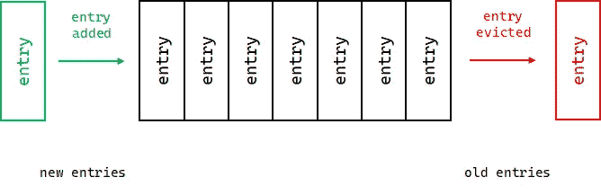
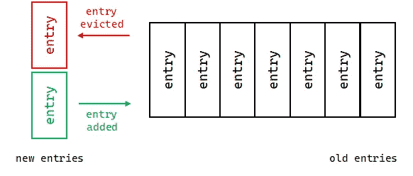
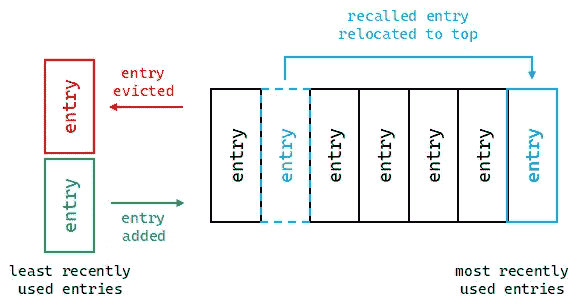

# 通过缓存让您的 Python 代码运行得更快

> 原文：<https://towardsdatascience.com/make-your-python-code-run-faster-with-caching-87bee85e9002?source=collection_archive---------6----------------------->

## 使用“functools”中的“cache”和“lru_cache”

照片由[克莱德·杜克](https://www.pexels.com/@cleyder-duque-1585619?utm_content=attributionCopyText&utm_medium=referral&utm_source=pexels)从[派克斯](https://www.pexels.com/photo/photo-of-warehouse-3821384/?utm_content=attributionCopyText&utm_medium=referral&utm_source=pexels)拍摄

提高 Python 代码的速度非常重要。它不仅能节省时间，还能减轻机器的负荷。提高程序性能的一种方法是缓存。

在这篇文章中，我将讨论什么是缓存，什么时候使用缓存，以及如何在 Python 中使用缓存。

查看我以前的一篇文章，关于使用爱因斯坦符号编写更好更快的 Python。

# 何时使用缓存

您可以通过实现缓存策略来加快 Python 代码(或任何代码)的速度。这个想法是存储一个函数的结果，这样在将来的调用中你就不必重新计算或再次检索结果。这在使用重复参数多次调用资源密集型或时间密集型函数时非常有用。

*   你不应该缓存一个依赖于外部变量的函数。(例如`time()`或`random()`)。
*   你不应该缓存有副作用的函数。

从服务器检索数据时，缓存也很有用。我们可以在本地存储(缓存)数据，而不是每次需要数据时都请求服务器。但是，如果我们的缓存空间有限，或者缓存的数据会随时间而变化，我们可能需要一个缓存策略。

缓存也可以在服务器本身上实现。我们可以缓存内容并从缓存中提供给用户，而不是每次用户加载页面时都查询数据库。然后，每隔一段时间更新我们的缓存。

# 缓存策略

高速缓存可能出现的一个问题是高速缓存太大。虽然您可以创建无限的缓存，但最好不要这样做。为了克服这一点，我们可以在缓存时使用许多策略。这些策略描述了何时从缓存中清除值。

## 先进先出(FIFO)

FIFO 缓存流程图。图片作者。

第一个添加到缓存中的值是第一个被逐出的值，依此类推。当较新的条目最有可能在我们的程序中被重用时，最好使用这种策略。

## 后进先出法

后进先出缓存流程图。图片作者。

就像先进先出但相反。最后一个*加到缓存中的*值是第一个被逐出的值。当旧条目最有可能在我们的程序中重用时，最好使用这种策略。

## 最近最少使用(LRU)

LRU 缓存流程图。图片作者。

这可能是最著名的策略。名字说明了一切。它会清除最近最少使用的值。但这意味着什么呢？

当您调用缓存函数时，结果被添加到缓存中(这就是缓存的工作方式)。但是当您使用已经缓存的值调用缓存函数时，它会返回缓存的值并将其放在缓存的顶部。
当缓存满时，最底部的值被删除。

在这种策略中，最近使用的条目最有可能被重用。

## 基于时间的缓存

这更适合缓存函数随时间变化的情况。添加到缓存中的每个条目都有一个过期时间，过期后就会被清除。到期时间通常被称为生存时间(TTL)。

# Python 中的缓存

## 简单缓存实现

让我们考虑一个我们想要缓存的函数`func`。一个简单的方法是将我们的函数包装在另一个函数中:`cached_func`并使用一个全局字典来保存值。每当叫`cached_func`的时候，我们就查字典。如果对于传递的参数存在一个值，我们返回它，否则我们从`func`中获取该值，并将它添加到字典中并返回它。

为了简化函数的缓存，我们可以创建一个通用的缓存包装器。

要使用我们的包装器，我们有两个选择。

*   使用简单的函数调用。

*   使用装修工。

## 使用 functools 中的装饰器

Python 在`functools` : `cache`和`lru_cache`中配备了缓存装饰器。`cache`是无界缓存，而`lru_cache`是 LRU 缓存。

使用这些装饰器很简单。

`lru_cache`接受两个可选参数:

*   ***maxsize=128* :** 缓存的最大大小。
*   ***typed = False:****函数参数是否被类型化。比如`6`和`6.0`是不是一回事。*

*如果您正在使用方法和类，您可以像使用`cache`和`lru_cache`一样使用`functools`中的`cached_property`。*

*除了我们讨论的以外，还有更多关于缓存的内容。从服务器和 cdn 到 CPU 和 GPU，缓存无处不在。*

*当处理纯函数时，缓存应该是显而易见的。在 Python 中需要两行代码。然而，还有其他重要的方法可以让你的代码更高效。*