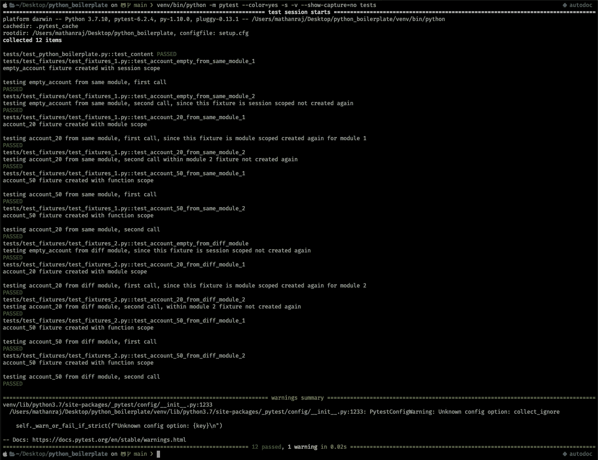

# 使用 pytest fixtures 提高 python 测试的效率

> 原文：<https://towardsdatascience.com/make-your-python-tests-efficient-with-pytest-fixtures-3d7a1892265f?source=collection_archive---------7----------------------->

## 了解 pytest 夹具的基础知识


[PC:蓝钻画廊](https://www.thebluediamondgallery.com/notepad01/t/testing.html) ( [CC BY-SA 3.0](https://creativecommons.org/licenses/by-sa/3.0/) )

如果你是一个测试新手，或者如果你被分配去修复一些测试失败，或者如果你最近实现的一个很棒的新特性崩溃了💥任何现有的测试用例，你都不得不走进软件测试的厄运☠️。

尤其是在使用 pytest 的情况下，您可以看到(👀)许多奇怪的包装器/装饰器位于测试文件中的函数之上。这些包装器中最常见的是`@pytest.fixture()`。什么是❓测试夹具

维基说，

> 一个**测试夹具**是一个用来持续测试一些项目、设备或软件的环境。在测试电子、软件和物理设备时，可以找到测试夹具。

让我们微调一下我们的问题，什么是计算中的测试夹具？？？

> 软件测试夹具通过初始化来建立软件测试过程的系统，从而满足系统可能具有的任何前提条件。

在继续之前，让我先弄清楚我们将在这篇文章中看到什么

1.  pytest 中的 fixture 是什么？
2.  使用固定物有什么好处？
3.  pytest 夹具的范围有哪些？

奖金🎁,

4.理解夹具范围的示例工作代码。

## pytest 中的 fixture 是什么？

为了理解测试夹具，首先，我们必须理解测试实际上是什么。为了简单起见，让我带你看一个简单的例子。

让我们假设你是一个厨艺大师👨🏻‍🍳你在为一个严肃的美食评论家做饭🚨，你要确保你已经把盐加到了点子上。所以这里唯一要检验的因素就是“盐后味”。为了做这个测试，我们需要四个步骤，

*   **安排/设置:**这包括我们在测试阶段之前需要做的所有步骤，在我们的例子中是加盐之前的所有步骤(清洗蔬菜和肉类，切割和切碎它们，准备平底锅，以及加盐之前的所有烹饪步骤)。
*   **动作:**这是触发我们想要测试的行为/状态的单一状态改变动作。在我们的例子中,“加盐”是单一动作。
*   **断言:**这是我们检查特定行为的结果状态是否与我们预期的相同或不同的阶段，如果与预期的相同，则我们的测试通过，否则失败，在我们的情况下，断言是，加盐后食品测试是否“良好”。
*   **清理:**一旦我们做了烹饪和测试味道，我们就需要清理厨房来烹饪另一顿饭，对吗？？？这正是在这个阶段中所发生的，为这个特定测试创建/设置的测试对象需要被清理，以确保它们不会影响其他测试。

现在回到夹具，是的，我们在安排阶段和数据中所做的任何步骤都被称为夹具。这些是需要测试某个动作的东西。

在 pytest 中，fixture 是我们定义的服务于这些目的的函数，我们可以将这些 fixture 传递给我们的测试函数(测试用例),这样它们就可以运行并设置您执行测试所需的状态。

```
@pytest.fixture
def db_conn(creds):
    # steps to connect to db def test_add_user(db_conn):
    user = User(....)
    desired_response = "......." response = db_conn.add_user(user)
    assert response == desired_response
```

当 pytest 试图运行测试`test_add_user` 时，fixture `db_conn`将被执行，以建立将用户添加到数据库所需的数据库连接。

我们可以看到更多确凿的例子👨🏻‍💻在结束之前，让我再回答几个问题。

## 使用固定物有什么好处？

当然，这可能是你看到上面的例子后想到的问题，让我列出那些是什么，

*   夹具是可重用的，夹具是以模块化的方式实现的，因此每个夹具名称都会触发一个夹具功能。
*   夹具可以使用其他夹具。
*   测试或夹具可以一次请求多个夹具。
*   夹具可以自动使用，有时所有的测试用例都需要夹具，在这种情况下，我们可以使用“自动使用”夹具。`@pytest.fixture(autouse=True)`举个例子。
*   夹具管理从简单的单元测试扩展到复杂的功能测试。我们甚至可以根据配置和组件选项来参数化夹具和测试。
*   无论使用多少夹具，拆卸逻辑都很容易管理。
*   可以为每个 Fixture 设置 Fixture scopes，这将极大地帮助在运行昂贵的测试用例时节省大量时间和计算资源。

在这里，我想讨论更多关于`**Fixture Scope**` **，**的问题，让我们跳到下一个问题。

## pytest 夹具的范围有哪些？

一些测试可能需要网络活动，如登录到远程服务器或数据库，或者如果您正在为机器学习模型编写测试，您可能必须训练可能由几个测试用例使用的模型，在这种情况下，每次用户请求时运行这些 fixture 函数可能会非常耗时且计算量很大。

在这种情况下，我们可以定义固定物的范围，例如:`@pytest.fixture(scope='...')`。作用域仅仅是通过运行 fixture 函数来删除返回的对象。有 5 个不同的范围。

*   **功能:**当范围设置为功能时，在请求测试功能终止后，对象将立即被拆除。当另一个测试函数调用该 fixture 时，它将重新运行并创建一个新对象。默认情况下，fixtures 将有一个函数范围。
*   **module:** 当一个函数第一次调用 fixture 时，它将创建对象并保存它以供同一个模块中的测试函数使用。因此，如果同一个模块中的任何测试函数调用 fixture，将返回缓存的对象。该模块中的所有测试完成后，该对象将被拆除。
*   **类:**fixture 将被每个类执行一次，它将被同一个测试类的所有测试函数重用。它将在该类的所有测试函数完成后被拆除。
*   **package:** fixture 将在第一次请求时被执行并被缓存，直到该类中的所有测试函数都被执行，之后将被拆除。
*   **session:** 这是 pytest fixture 中的广泛范围，每当我们调用`pytest`时，它就被称为会话。因此，具有会话范围的 fixtures 将在第一次请求时被执行和缓存，它们将被重用，直到所有测试完成。

## 奖金

哎呀，很多理论📚，让我们深入一些 pytest fixtures 及其范围的例子。

`test_dir/conftest.py`

`conftest.py`是 pytest 的一个特殊文件，您可以在其中添加所有的测试夹具。这些夹具对于同一个测试目录中的所有模块都是可见的。

注意:如果您有多个测试包，您可以为每个包添加一个`conftest.py`。这些文件有目录范围。

这里我们声明了三个具有三种不同作用域的 fixtures。

*   **empty_account:** 对于会话范围，每个会话只应执行一次。
*   **account_20:** 对于模块范围，应该每个模块执行一次。
*   **account_50:** 有函数作用域，每次请求时都要执行。

将下面的测试模块和`conftest.py`一起添加到你的测试目录中。

测试目录/测试装置 1.py

测试目录/测试装置 2.py

您可以从以下网址获得完整的代码:

<https://github.com/Mathanraj-Sharma/python_boilerplate/tree/main/tests/test_fixtures>  

这些是一些简单的测试用例，用来看看当我们调用具有不同作用域的 fixtures 时会发生什么。运行以下命令来运行测试

```
python -m pytest --color=yes -s -v --show-capture=no tests/test_dir
```



PC:作者

如果仔细观察，您会得到类似于下面的输出

*   **对空账户**夹具整个会话只执行了一次。
*   对于每个模块，account_20 fixture 已经执行了两次。
*   **account_50 fixture** 因为是函数作用域，所以已经按要求执行了多次。

希望这是理解会话、模块和函数范围的好例子。我把类和包的范围留给你的作业，试着为这两个范围实现一个好的例子。

总之，pytest fixtures 是为测试功能安排/设置测试环境所需的功能。测试人员可以定义他们需要的任意多的夹具，并且从不同的测试功能中请求它们任意多的次数。此外，fixture scope 有助于在昂贵的测试中节省时间和资源。

希望这篇文章能给你一个关于测试夹具的好主意。快乐测试🤗！！！