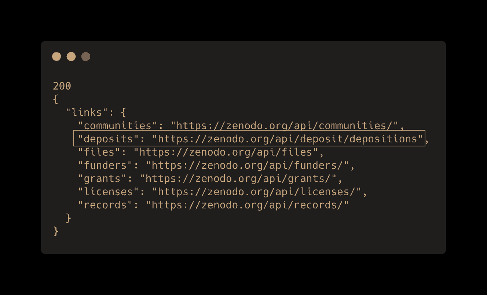
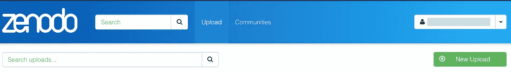
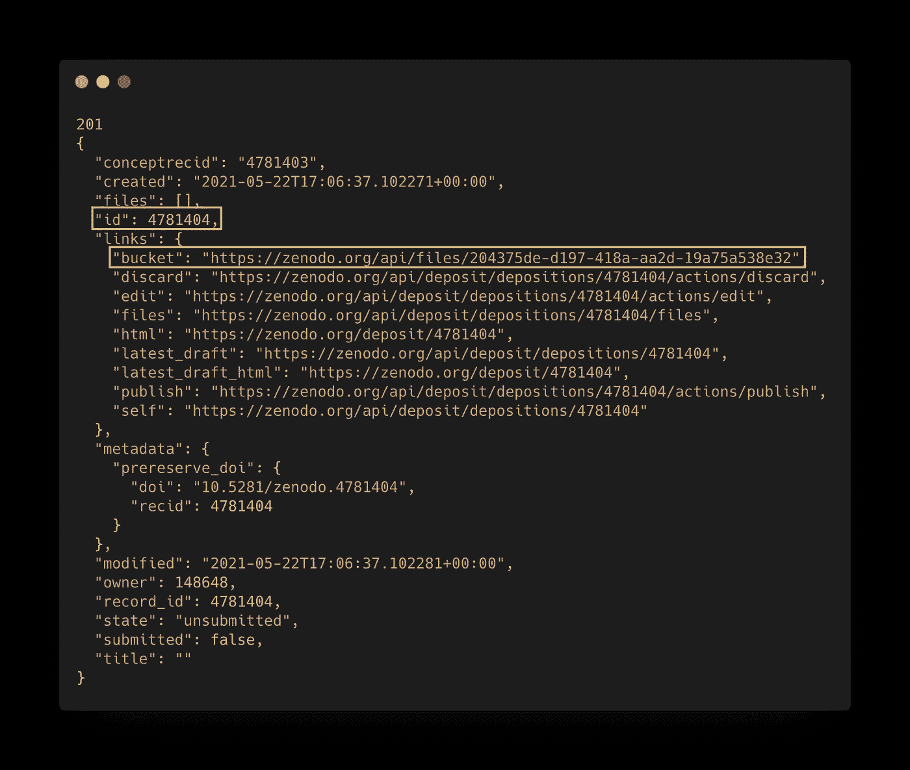
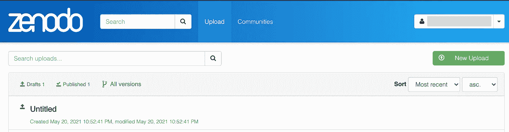
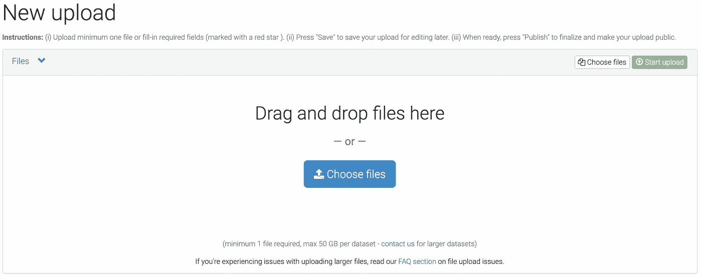
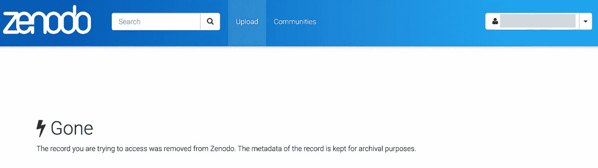

# 让你的科学与芝诺多公平

> 原文：<https://towardsdatascience.com/make-your-science-fair-with-zenodo-b209fc74400c?source=collection_archive---------26----------------------->

## 如何使用 Zenodo REST API 用 Python 上传数据


达斯汀·休姆斯在 [Unsplash](https://unsplash.com?utm_source=medium&utm_medium=referral) 拍摄的照片

发布的数据应该[公平](https://www.go-fair.org/fair-principles/):可查找、可访问、可互操作和可重用。数据仓库，比如 Zenodo，有助于确保研究项目的公平性。

Zenodo 是一个免费平台，允许任何人上传和存储数据，使其可以搜索并提供数字对象标识符(DOI)。通过网页上的拖放功能，从本地计算机上传小文件很容易。但是如果文件很大并且在远程计算机上，那么你需要使用 [Zenodo REST API](https://developers.zenodo.org/#rest-api) 。

这篇文章描述了如何通过 Python 使用 API 与你的 Zenodo 帐户交互，这样你就可以以编程的方式创建项目和上传数据。

## 目录

*   [RESTful API 基础知识](#b506)
*   [在我们开始之前…](#b7f8)
*   [获取关于 API 的信息](#37c5)
*   [发布创建项目的请求](#37ad)
*   [上传更改元数据的请求](#d854)
*   [上传数据的上传请求](#053d)
*   [删除一个文件和项目](#fb24)
*   [最终想法](#65f9)
*   [笔记本教程](#c1b6)

# RESTful API 基础

应用程序编程接口(API)是两台计算机相互通信的一种方式。它的工作原理就像一个网络浏览器，但是你写代码从服务器请求数据，而不是点击按钮。大多数 API 都是 RESTful 的，这意味着它们遵循一组称为表述性状态转移的规则。深入探究 REST APIs 超出了本教程的范围。然而，理解什么是 API 以及它如何在基础层面上工作是很重要的。

RESTful API 将数据组织成一串唯一的链接，类似于网页统一资源定位器(URL)，只是它们被称为统一资源标识符(URIs)。例如，基本的 Zenodo API 是 https://api.zenodo.org/api 的[和 https://zenodo.org/api/deposit/depositions 的](https://zenodo.org/api)的一个 URIs。

如果你点击这些链接，你实际做的是发送一个*请求*到一个服务器，在你的屏幕上显示的是*响应。*基本的 Zenodo API 链接将显示所有的 URIs，而`/deposit/depositions`链接可能会显示这样的错误消息

```
{"message":"The server could not verify that you are authorized to access the URL requested. You either supplied the wrong credentials (e.g. a bad password), or your browser doesn't understand how to supply the credentials required.","status":401}
```

写着`“status”:401`的部分是一个[状态码](https://developers.zenodo.org/#http-status-codes)，表示我们未经授权，需要提供一个访问令牌。

RESTful APIs 的一个很好的简单解释可以在这个视频的前两分钟中找到。

## 芝诺多 API

假设我们有一个 Zenondo 帐户，我们想从本地计算机与之交互。我所说的交互是指创建项目、上传数据、更新元数据以及删除文件或整个项目。我们可以用 API 向 Zenodo 发出四个基本请求:`GET`、`POST`、`PUT`和`DELETE`。

*   **获取**是读取数据
*   **POST** 是创建项目并将数据移动到芝诺多
*   **放**是改变与项目相关的元数据
*   **删除**将删除数据或项目

这些是我们将用来与 Zenodo 交互的 HTTP [REST API](/introduction-to-rest-apis-90b5d9676004) 方法。一般来说，这是如何工作的，我们(*客户机*)将向 Zenodo(*服务器*)发出*请求*，作为回报，我们将得到*响应*。该响应可以是返回给我们的数据和/或表明我们的请求成功或失败的响应[状态码](https://developers.zenodo.org/#http-status-codes)。上的响应代码:

*   2** =一切顺利
*   4** =客户端错误(你做错了什么)
*   5** =服务器错误(服务器出现问题)

这一切现在听起来可能有点抽象，但当我们应用它时，它将是有意义的。

总而言之，API 是一种代码，它让我们通过发送*请求* ( `GET`、`POST`、`PUT`、`DELETE`)和作为回报的*响应*，在互联网上与服务器(在本例中是 Zenodo)进行通信。

更深入的解释，请看佩里·艾辛的帖子。

<https://medium.com/@perrysetgo/what-exactly-is-an-api-69f36968a41f>  

# 在我们开始之前…

您需要创建一个帐户和一个访问令牌。使用 API 时，这个令牌是您帐户的密钥。我们向它提供我们的请求，告诉 Zenodo 我们有适当的**权限**来访问这个帐户。

1.  你首先需要[用芝诺多创建一个账户](https://zenodo.org/signup/)。
2.  之后，您将需要[创建一个访问令牌](https://zenodo.org/login/?next=%2Faccount%2Fsettings%2Fapplications%2Ftokens%2Fnew%2F)来使用 [API](https://developers.zenodo.org/) 。该令牌将是一个长的字母数字字符串，并且只显示一次。
    **将此令牌保密**
3.  复制令牌并将其作为环境变量保存在您的环境文件中(例如`~/.bash_profile` ):
    `export ZENODO_TOKEN=YOUR_ACCES_TOKEN_GOES_HERE`
4.  确保您可以从终端访问令牌:
    `echo $ZENODO_TOKEN`如果一切正常，这将在您的提示中显示您的令牌值。
5.  安装 python [请求](https://2.python-requests.org/en/latest/user/install/)包:
    `conda install -c conda-forge requests` 你也可以通过 pip 安装
6.  确保可以导入包:`import requests`

如果您正在使用 JupyterLab，`python-dotenv`包是在笔记本中使用环境变量的一个好方法。该软件包有助于从环境文件中读取键值对，并确保您的令牌在与同事共享笔记本时保持私有。

现在一切都准备好了，您创建了一个帐户，存储了您的访问令牌，并安装了必要的包。

现在我们准备开始使用 Zenodo API 了！

# 获取关于 API 的信息

让我们从向 Zenodo 基础 API 发出一个`GET`请求开始。

我们在访问令牌中附加了一些头信息，现在应该返回内容了。对于这种类型的请求，这不是必需的。我们得到的是一个包含两条重要信息的响应对象，即状态代码和响应数据:

*   `print(r.status_code)`:显示状态码
    2** =一切成功
    4** =客户端错误(您做错了)
    5** =服务器错误(服务器出错)
*   `print(json.dumps(r.json(), indend=2))`:以可读的方式显示响应 JSON 输出。输出如下所示



我们得到的响应是与 API 相关的所有 URIs。URI 的存款是我们唯一会用的。

*   **存款:**用于上传和发布到 Zenodo
    (这与 web 界面中可用的功能相同)。

[其他 URIs](https://developers.zenodo.org/#rest-api) 主要用于搜索芝诺多。

# 发布创建项目的请求

您可以使用 web 界面或通过 API 以编程方式创建项目。为了完整起见，我将展示这两种方式。如果你正在填充大量的可选元数据，web 界面会更容易使用，并且 API 可以快速创建你想要上传的项目。

## 使用网络界面

进入你的账户，点击顶部的“上传”,然后点击右边绿色的“新上传”按钮，创建一个新项目



**新建一个项目**:点击顶部的“上传”，然后点击右边的“新建上传”。(图片由作者提供)

最起码，要在旁边标有红色*的字段中进行填写。完成后，点击顶部的“保存”。顶部的 URL 会改变，并给你的项目一个唯一的 ID。这里有一个例子:

```
https://zenodo.org/deposit/4781404
```

`/deposit`表示这是一个私人项目。

这是一个公共项目 URL

```
https://zenodo.org/record/4760205
```

`/record`表示这是一个公共项目。

## 使用 API

为了用 API 创建一个项目，我们将发出一个`POST`请求。

这将创建一个没有标题或信息的空项目。

`r`是响应对象，包含两条有用的信息

*   `r.status_code`:表示作业是否成功
    (记住 2**处的响应表示成功)
*   `r.json()`:哪个是服务器以 JSON 格式返回给我们的数据



响应代码`201`表示“已创建”

注意响应输出中的`links`中的`id`和`bucket`。这些以后会有用的。

## **存储 id 和存储桶**

从这个响应中，我们想要保存两条信息`id`和`links`中的`bucket`。

*   `id`是与项目相关的唯一编号
*   `bucket`是你上传数据文件的地方

下面是保存从输出中提取这些内容的代码。

## 这个在网页上看起来怎么样？

当你登录到 Zenodo 并导航到上传时，你会看到这个。



一个没有标题的项目，当你看里面的时候，你会看到没有字段被填写，也没有上传。这是意料之中的，因为我们创建了一个空白项目。在 API 中，我们没有将空数据附加到我们的`POST`请求中。

# 提交更改元数据的请求

现在让我们更改一些与我们的项目相关的信息。为此，我们将发出一个`PUT`请求。

这些更改将立即生效，并将在网页上显示。

# 上传数据的上传请求

就像填写元数据一样，上传数据有两种方式:通过 web 界面和通过 API。同样，我将展示两者。

## 从 web 上传

如果您的数据集很小，并且位于本地计算机上，那么通过网页上的拖放功能上传文件可能是最好的方法。导航到您的项目，然后单击“选择文件”。



拖放对于笔记本电脑上的小数据集是很好的(图片由作者提供)

## 使用 API 上传

如果数据集很大或者位于远程计算机上，则需要使用 API。为此，我们向`bucket_link`发起一个`PUT`请求。

## 如果我忘记保存存款 id 和存储桶链接怎么办

这种情况时有发生，尤其是当我不断重写`r`的时候。如果您忘记了“id ”,找到它的最简单方法是访问项目网页并查看 URL。


一旦知道了 id，就将它保存到一个名为`deposition_id`的变量中。

您也可以发出`GET`存款请求来抓取`id`和`bucket`。

```
r = requests.get(f"{baseurl}/deposit/depositions", 
                 headers=headers)
```

# 删除文件和项目

在这一节中，我将向您展示如何使用 API 删除文件和项目。

从你的项目中删除东西太容易了。发出`DELETE`请求时要小心，如果要执行此操作，没有弹出窗口需要仔细检查。

## 删除文件

要删除一个文件，我们需要获得惟一的`file_id`，然后发出一个`DELETE`请求。

注意使用`filter()`首先找到正确的文件名，然后获取文件的`id`。如果项目中有多个文件，这是必要的。

在这种情况下，响应状态代码是`204`，表示“无内容”，这通常是对`DELETE` 请求的响应。

如果您遵循此示例，您将会看到该文件在网页上不再可见。

## 删除项目

要删除一个项目，向沉积发出一个`DELETE`请求`id`。

一旦你这样做了，你的项目就…



# 最后的想法

Zenondo API 让您能够从命令行与您的帐户进行交互。你能在网页上做的任何事情都可以用 API 来做。然而，仅仅因为你可以用 API 做这些事情，并不意味着你应该这样做，或者它很容易和直观。例如，我个人觉得用 web 界面创建项目和添加元数据更容易。

API 的主要优势是能够将远程数据上传到您的帐户。

我对 Zenodo 唯一的不满是它不允许你上传目录树，这是 GitHub 上的一个未解决的问题。解决方法是上传目录结构的压缩版本。从整体来看，这只是一个小小的不便。然而，如果你上传时绝对需要这种结构，我建议看看[开放科学框架](https://osf.io)。

## 发布您的项目

完成上传数据和填写所有元数据后，您可以将项目公开以确保其可访问性。我建议从网页上做这件事。单击蓝色的“发布”按钮，让任何人都可以访问您的项目。可及性是公平原则之一，公平的科学更好。

# 教程笔记本

# 额外资源

  <https://fairplus.github.io/the-fair-cookbook/content/recipes/findability/zenodo-deposition.html#programmatic-deposition-to-zenodo-via-the-rest-api>  

*特别感谢* [*Rachana Maniyar 博士*](https://medium.com/u/2073923b733b?source=post_page-----b209fc74400c--------------------------------) *编辑本帖的草稿版本*

*感谢阅读和支持媒体作者*

<https://lukegloege.medium.com/membership> 