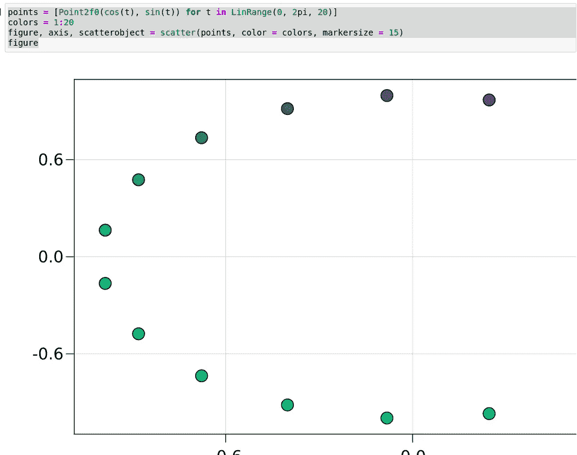
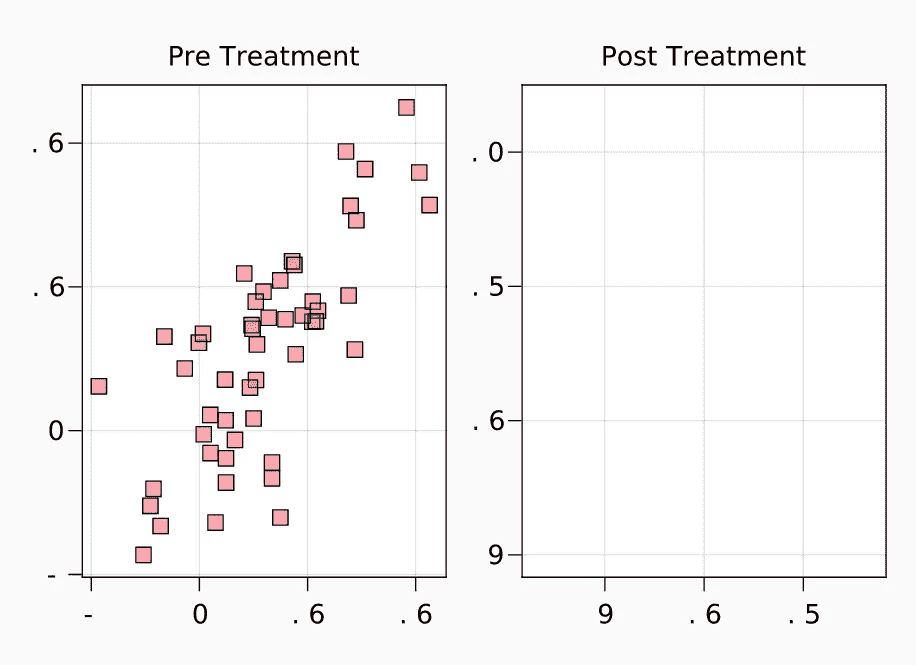

# Makie:高水平，美丽的情节

> 原文：<https://towardsdatascience.com/makie-high-level-beautiful-plots-3ae670de2fa1?source=collection_archive---------16----------------------->

## 熟悉 Makie.jl，这是一个用于 Julia 编程语言的高级绘图和统计图形库。


作者图片

# 介绍

在 Julia 的生态系统中，已经出现了许多可视化数据的奇妙解决方案。尽管如此，许多用户经常最终使用 Plots.jl。虽然 Plots.jl 肯定是一个很酷的包，但重要的是要记住，该包必须提供的是来自其他编程语言的不同软件的三个独立端口。这些端口是 Plot.ly、Matplotlib.pyplot 和 GR。默认情况下，Plots.jl 使用 GR 可视化库，这是一个很好的库，但在许多方面非常缺乏特色。此外，像这样使用端口真的会减少预编译时间，而且使用 PyCall 这样的包会影响 Julia 的性能。有趣的是，如果你感兴趣，我确实有一个关于 Plots.jl 的 GR 后端的完整教程:

</spruce-up-your-gr-visualizations-in-julia-88a964450a7>  

还有一些其他纯粹的朱利安解决方案已经出现。在我看来，最大的例子是牛虻包。牛虻包的交互性比不上 Plot.ly，但对大多数情况来说已经足够了。最重要的是，牛虻可视化很容易操作，而且看起来很好！我还写了一篇关于使用该包的教程和概述，如果您感兴趣，可以在这里查看:

</gadfly-jl-the-pure-julia-plotting-library-from-your-dreams-3ee6ca107a5c>  

在 Julia 中还有另一个很棒的可视化库，名为 Vegalite.jl。我见过许多其他科学家，他们发誓说这是 Julia 中最好的一个，但我仍然偏爱牛虻. jl。这是因为我发现牛虻更容易使用。Vegalite 有一个奇怪的方法，它涉及到在你的绘图中为各种不同的设置使用大量的数组，而不是参数。也就是说，我要说的是，与列表中的其他选项相比，Vegalite 确实有一些严肃的统计可视化。实际上，我比较了另一篇文章中提到的所有三个选项，如果您愿意，可以在这里查看:

</gadfly-jl-the-pure-julia-plotting-library-from-your-dreams-3ee6ca107a5c>  

> 所有这些文章都有更多的信息可以链接，这真是太棒了。

Julia 语言及其绘图功能的另一个新增功能是 Plot.ly 打包了该语言的官方端口。我必须承认，我还没有机会尝试这一点，但我很高兴尝试一下，我甚至可能会写一篇关于它的文章，并将其与 Python 实现进行比较！

有了生态系统中的所有这些图形库，我真的很想接触所有这些库，以便公开比较所有可用的选项，并找出我想要使用的那个。很高兴知道他们中的许多人，因为我认为他们都有自己的功能。在 Julian 图形库之旅中，我的下一站是 Makie.jl. Makie.jl 有点独特，因为有多个使用不同图形库的库实现。例如，我决定使用 OpenGL，所以我将通过 Pkg 添加 MakieGL.jl。还有一个 webgl 版本和一个 Cairo 版本，分别是 WGLMakie.jl 和 CairoMakie.jl。让我们继续添加软件包并开始吧！

> [笔记本](https://github.com/emmettgb/Emmetts-DS-NoteBooks/blob/master/Julia/Starting%20with%20Makie.ipynb)

```
julia > ]
pkg > add GLMakie
```

# 基本绘图

由于我从未实际使用过 Makie.jl 包，所以我决定稍微熟悉一些基本情节。Makie.jl 遵循图形库的典型高级约定，所以幸运的是这里不会有任何 Vegalite-esc 曲线球。

```
using GLMakie
```

像 Plots.jl 一样，我注意到 Makie 也需要很长时间来预编译。这可能是因为我决定使用 OpenGL，但我怀疑事实是否如此。我说真的**真的**花了很长时间。这不太重要，但肯定是您在应用程序中使用该包时需要记住的事情。我绘制的第一个例子直接来自 Makie 文档:

```
points = [Point2f0(cos(t), sin(t)) **for** t **in** LinRange(0, 2pi, 20)] colors = 1:20 
figure, axis, scatterobject = scatter(points, color = colors, markersize = 15) 
figure
```


作者图片

看起来像是 OpenGL 驱动程序加载失败！好消息是我碰巧知道一个事实，Cairo 在我的电脑上可以很好地运行我的 Julia 安装，所以我们将切换到 CairoMakie，而**必须再次预编译它**。

```
julia > ]
pkg > add CairoMakie
using CairoMakiepoints = [Point2f0(cos(t), sin(t)) for t in LinRange(0, 2pi, 20)]
colors = 1:20
figure, axis, scatterobject = scatter(points, color = colors, markersize = 15)
figure
```



作者图片

> 耶！

实际上，我很喜欢这个库的功能，虽然它是极简的可视化，类似于没有交互性的 GR，这是我在大多数情况下所需要的。类型是可变的，所以我们现在可以改变这个结构内部的数据来产生不同的结果。更牛逼的是，我们可以在这个数字上加数字！这实际上让我想起了很多很久以前制作的图形库。这真的很酷，因为它是元编程和面向对象的，但该项目已经停止。实际上，我在《走向数据科学》上写过相关文章，所以如果你碰巧对那个项目感兴趣，里面有很多非常非常有趣的 Julia，你可以在这里查看:

</metaprogramming-grids-and-labels-for-hone-jl-f434c8dc24ad>  

该系列有许多不同的部分，所以如果您真的对这个包及其背后的代码感兴趣，这可能是一个不错的读物。无论如何，从我的开发历史来看，很明显我是图形模块化的狂热爱好者，Makie.jl 正是提供了这一点！这很快成为我最喜欢的图形库。我们可以添加基本上任何新的数字到我们的数字，通过使用！版本散点！方法。

```
circlefunc = ts -> 1.5 .* Point2f0.(cos.(ts), sin.(ts))
scatter!(circlefunc, LinRange(0, 2pi, 30), color = :red)
figure
```


作者图片

# 布局

Makie.jl 也有一个相当健壮的布局实现。它们比 GR 更容易理解和制作，看看吧！我们可以制作一个完全空的图形，并在其上添加我们可视化的所有模块部分！

```
fig = Figure(resolution = (700, 500), backgroundcolor = RGBf0(0.98, 0.98, 0.98))
ax1 = fig[1, 1] = Axis(fig, title = "Pre Treatment")
data1 = randn(50, 2) * [1 2.5; 2.5 1] .+ [10 10]line1 = lines!(ax1, 5..15, x -> x, color = :red, linewidth = 2)
scat1 = scatter!(ax1, data1,
    color = (:red, 0.3), markersize = 15px, marker = '■')
fig.layout
ax2, line2 = lines(fig[1, 2], 7..17, x -> -x + 26,
    color = :blue, linewidth = 4,
    axis = (title = "Post Treatment",))fig
```



作者图片

# 动画片

Makie.jl 除了之前牛逼且实现良好的特性外，还有对动画的支持！我真的很兴奋，我已经知道我会一直使用这个图书馆了！我已经很高兴我尝试了这一点，动画只是一个蛋糕上的糖衣，它已经非常湿润，可以在你的嘴里融化。为了创建一个动画情节，我们还需要添加“AbstractPlots”包。

```
julia > ]
pkg > add AbstractPlots
```

我将继续尝试它。为了实际创建动画，我们将使用 record()方法。这实际上会将其输出到一个视频文件。这有点奇怪，因为我当然更喜欢 GIF 之类的东西——但不管怎样，它会起作用的。

```
**using** GLMakie 
**using** AbstractPlotting.Colors
figure, ax, lineplot = lines(0..10, sin; linewidth=10)
n_frames = 30 
framerate = 30 
hue_iterator = LinRange(0, 360, n_frames)  
record(figure, "color_animation.mp4", hue_iterator; framerate = framerate)
 **do** hue     lineplot.color = HSV(hue, 1, 0.75) **end**
```


作者图片

> 也可能行不通。

# 结论

我相信随着时间和努力，一定会有办法加载适当的驱动程序，并实际上让我的系统与 Makie.jl 的全部功能一起工作。不管动画斗争，我非常兴奋地开始使用这个图形库！它的模块化性质和原始能力正是我在这样的东西寻找。我真的很高兴我试用了它，我现在实际上对这个包感到非常兴奋。我强烈推荐它。我认为这个包最糟糕的部分可能是包的分段性，你需要用 Pkg 添加很多包。当然，这没什么大不了的，我认为这个图形库的能力绝对值得。感谢您的阅读！我当然推荐试试这个库！