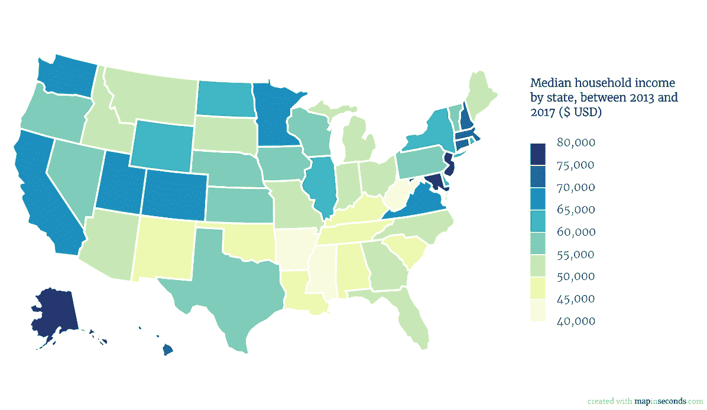
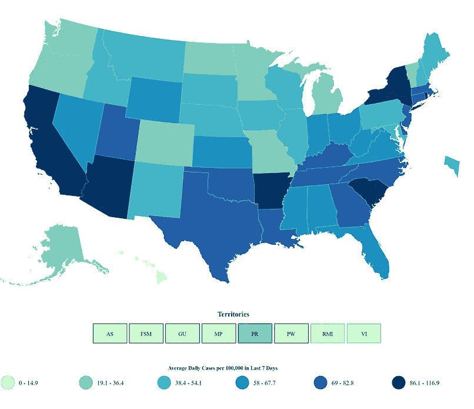
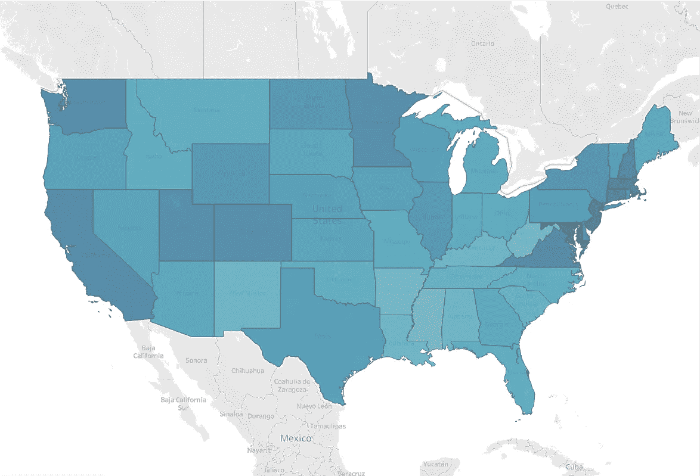
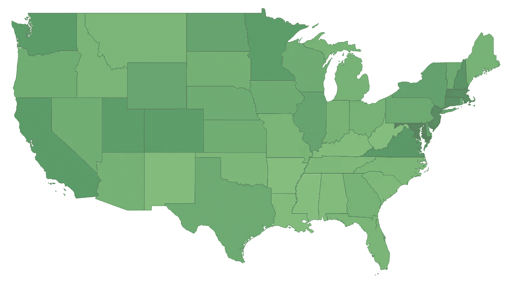
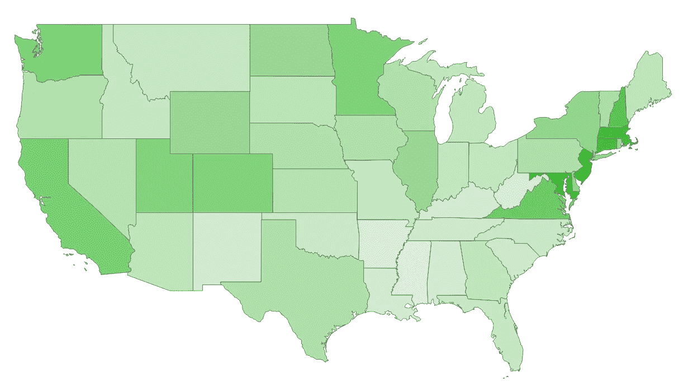
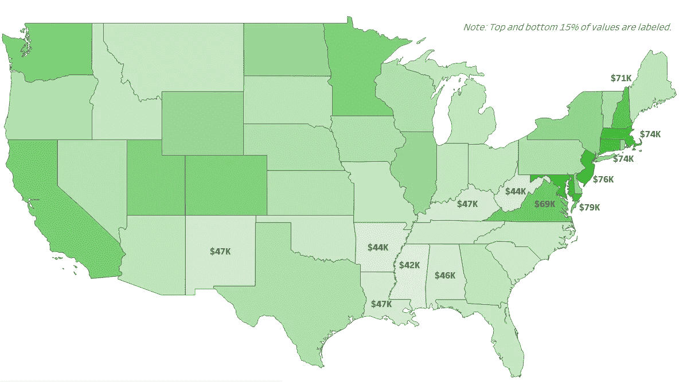
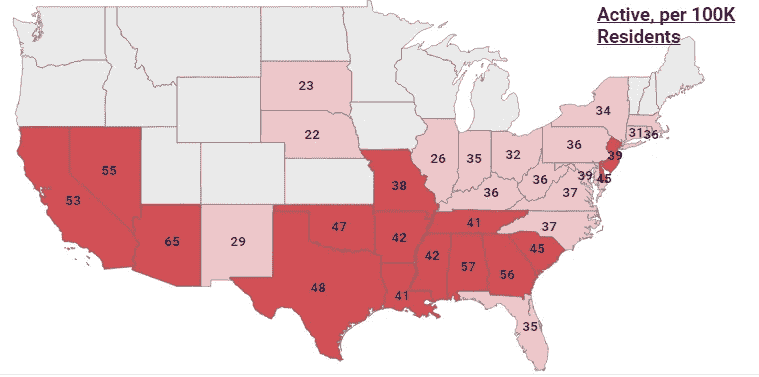
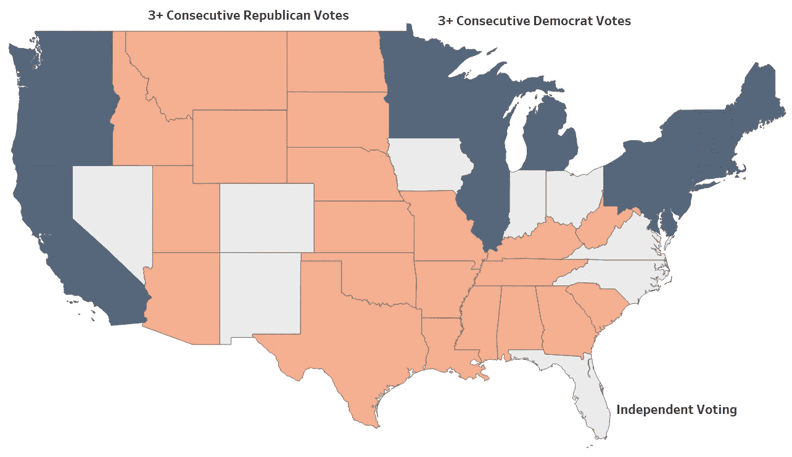

# 制作更好的填充地图

> 原文：<https://towardsdatascience.com/making-a-better-filled-map-8818f333bcf1?source=collection_archive---------36----------------------->

## 改善您的地理数据交流

在我看来，在地图上可视化地理数据是向受众传达数据的最有效方式之一。与包含相同数据的简单表格或条形图相比，我们对州、地区和领地的了解有助于我们更快、更好地发现趋势。

然而，并不是所有的地图都是平等的。有一些简单的方法可以改善我们可视化地理数据的方式，使我们的信息更流行，更好地向我们的受众传达信息。

作为一个例子，看看下面两张地图。左边的[来自美国消费者新闻与商业频道](https://www.cnbc.com/2018/12/07/median-household-income-in-every-us-state-from-the-census-bureau.html)可视化各州家庭收入中值，右边的[来自 CDC](https://covid.cdc.gov/covid-data-tracker/#cases_casesper100klast7days) 可视化 COVID 数据。你怎么想呢?

左图:各州收入中位数的美国消费者新闻与商业频道视觉图。右图:美国疾病控制中心各州 COVID 感染地图。

这里有几个想法引起了我的注意:

*   如果您在左侧地图上选择 5 个州，并找到相应的家庭收入桶，您需要多长时间？10 个州？一个 5000 美元的分色是否有意义(例如，与一个 10000 美元的桶相比，类别数量增加一倍是否对信息有影响)？
*   在右边，找到正确的蓝色阴影然后将其映射到底部的桶需要多长时间？你能不能**立即**确定哪些州的 COVID 病例最高和最低？

当我们不得不付出额外的努力来理解信息时，地图并不能更好地传达信息。我们可以使用更好的颜色、文本的策略性使用和变换来改善上面的视觉效果。

下面，我们将在上述地图的基础上介绍改进连续和分类地理变量可视化方式的策略，并引入新的示例。

# 连续变量

让我们来看看中等收入的地图。我喜欢使用 Tableau，但认为他们的默认设置甚至可以产生一个足够的地图是一种误导。只需将数据放入 Tableau 地图中，就会生成以下内容:

来自 2017 美国 ACS 的 HH 收入中值的默认表格图

重叠的地理区域，即使是灰色的，也会让人分心。如果你仔细观察，颜色表明新泽西州、马萨诸塞州、康涅狄格州和新罕布什尔州是中等收入最高的州，但我不能肯定地说。

在表示精确的连续变量很重要的情况下，首先考虑变量是否有方向，以及这是否会影响颜色选择以改善感知——一种结果是否比另一种更好(绿色与红色)？与变量的关联是否有助于读者更好地理解变量(例如，蓝色代表平均值。各州降雨量)？

对于中等收入，我们可以选择绿色，因为绿色通常与金钱联系在一起，通常绿色与“更好”的结果(更高的中等收入)联系在一起。从风格上来说，当可视化美国各州时，我也发现底层地图没有什么价值，所以我通常会删除它。

做出这两个改变(颜色改为绿色和去除背景)是一个开始，但并没有真正达到预期的效果。我仍然没有更好地快速识别哪些州具有最高和最低的值。

美国 HH 收入中值地图，绿色，无背景地图

有三种后续技术来改善视觉效果:

*   **扩大色阶:**在你的色阶上扩大两种颜色之间的差异，以提供更大范围的颜色选择。
*   **变换变量:**通过取平方根、自然对数或提高值的幂(即平方或立方)来增加(或减少)变量之间的差异，以达到着色的目的。
*   **标记选择值:**通过只标记前 x%的值、后 x%的值或两者来吸引人们对某些州/地区的注意。

你对下面的有什么看法？

它并不完美，但更容易看出哪些州是深绿色的(东北部)，哪些州是浅色的(东南部)。要实现这一点，您可以将色标更改为更亮的连续绿色，将不透明度从默认的 80%增加到 100%，并通过将其提升到 4 次方来转换变量，这将放大状态之间的差异。

为了更进一步，我们可以选择标记一些状态，以便查看者可以快速识别更暗和更亮的值意味着什么。看下面，我们仍然可以使用视觉颜色线索来知道哪个更高或更低，并且还可以看到“更低”意味着 $70K。

用戏剧化的色标、变换和数据标记进行连续制图。

上面的并不完美，但这是对标准画面视觉效果的改进。在尺度上没有显著差异的连续变量很难绘制，但是可以使用上面的简单视觉技巧改进基线。

# 等级映射

有时知道*单个最高值*并不重要，重要的是那些更高或更低的值。当显示层次是一个选项，而不是精确的连续值时，我喜欢使用我所谓的层次映射来平衡颜色、文本和注意力。分层映射是一种既能实现连续变量的特异性，又能实现分块的直观简单性的方法。

让我们来看看另一种看待 COVID 数据的方式(与上面的视觉略有不同，但数据和用例相似)。下面是一张 30 天 COVID 增长率的地图，按实施了等级映射的州划分。

各州的 30 天 COVID 病例增长率。分层映射的一个例子。

在地图中有一些视觉提示需要考虑(另一个例子在这一部分的下面)。首先，我根据从最高到最低的度量将状态分成三个桶(Tableau 中使用`WINDOW_PERCENTILE`的简单`IF > ELSEIF`语句)。

其次，因为越高越糟糕，我选择了红色作为主要颜色，这种颜色通常与糟糕的结果联系在一起。我选择了深红色>浅红色>灰色三色组合，而不是我有时难以理解的纯红色。对我来说，这将注意力集中在黑暗的状态，并使主题更容易拉出。它还明确区分了类别。

最后，我选择只包含中值或高值的文本(同样，在文本标记卡上有一个带有`WINDOW_PERCENTILE`的`IF > ELSEIF`声明)。低值有多低真的重要吗？也许吧，但在这种情况下，我不认为它保证了地图上的空间。在 Tableau 中，如果值对查看者很重要，也可以很容易地将它放在悬停文本中。

每 100，000 名居民的积极 COVID 住院率；分层映射的另一个例子。

我最喜欢这些地图的一点是，通过观察哪些地方有颜色，哪些地方没有颜色，可以相当直观地发现图案。试着快速解读大图主题的每张地图，看看你是否有同样的感觉。

# 分类变量

没有层次关系的分类变量更容易映射，但我们仍然有办法确保我们的数据能够被用户轻松快速地解释。对于分类变量，一些改进映射的技巧是:

*   **使用互补色**，读者可以很容易地识别出不同之处(尽可能避免连续的颜色)。
*   **如果可能，将类别限制在 5 个或更少**。如果有 5 个以上的变量，最好考虑替代视觉效果或更广泛的卷式分类。
*   尝试在地图中标注，而不是让读者经常查阅图例。

考虑下面的地图，它测量(截至 2013 年)一个州是连续 3 次或更多次投票支持共和党，连续 3 次或更多次投票支持民主党，还是“独立”(任何一方的连续投票都少于 3 次)。

注意使用互补的、不同的颜色，以便在类别之间提供视觉线索(我喜欢[使用这个网站](https://colorsupplyyy.com/app)来帮助我挑选颜色，当我不受公司品牌颜色的限制时)。此外，[的原始图像](http://www.randalolson.com/wp-content/uploads/us-map-shrinking-battleground-annotated.png)有 7 个类别，我将其合并为 3 个(我将 3–5、6–10 和 11+更改为 3+)。最后，请注意在一组相似颜色的状态附近标记类别的方式，这是一种替代通常远离视觉效果的图例的方式。

分类映射的例子

绘制地图是一种非常有效的信息交流方式，通过一些简便的技巧，我们可以制作更好的可视化效果，改善我们的受众对数据的理解，并带来更有影响力的演示和数据故事。

*有反馈吗？有兴趣联系吗？随时联系我*[*LinkedIn*](https://www.linkedin.com/in/jordanbean/)*。*