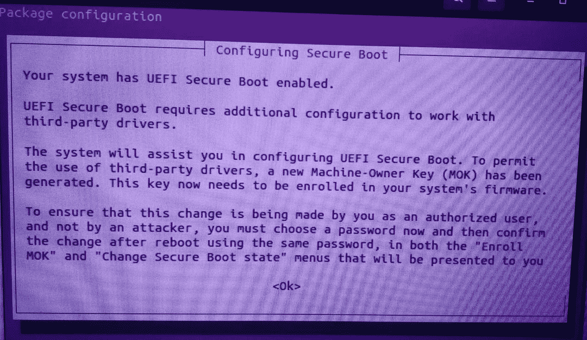

# 制作完美的 ML env。在 Ubuntu 20.04 上使用 Tensorflow 2 和 CUDA 10.1，双启动 2021

> 原文：<https://towardsdatascience.com/making-a-flawless-ml-env-with-tensorflow-2-and-cuda-10-1-on-ubuntu-20-04-with-dual-boot-2021-3731c92692fb?source=collection_archive---------16----------------------->

## 在 Ubuntu 20.04 上使用 Tensorflow 2 和 Nvidia CUDA 支持的简单、快速和可靠的 Python3 环境，满足您的所有 ML 需求！

正如我所希望的那样简单，在搜索了互联网上的各种文章之后…事实证明并非如此。尤其是如果你的电脑是 Windows 10 双启动的话。

所以经过几夜的挣扎，看到红色的错误，听到安装失败的哔哔声…我成功了！这是我成功之路的总结！

*   步骤 1:“双重启动”安装和 BIOS 调整。
*   第二步:检查 Python3 和 GCC。
*   第三步:整理！(可选—如果是全新安装，则跳过)
*   第四步:安装！(最期待的)


来源:下载自[谷歌图片](https://www.spotlightnepal.com/media/images/7-steps-to-success.2e16d0ba.fill-650x500.jpg)

# 第一步:**【双引导】**安装和 BIOS 调整。

相信我，这是确保操作系统和 BIOS 设置正常的关键一步，这样你就不必一次又一次地经历卸载和重新安装的麻烦。

**‘双开机’安装:**

对于 Ubuntu 20.04 双引导安装，我按照[这个](https://youtu.be/Z-Hv9hOaKso)视频稍加改动。我预装了 Windows 10。我的电脑[和视频中的](https://pcpartpicker.com/list/BYLvy4)有不同的硬件设置，所以我根据自己的需要为安装配置了磁盘分区。在那段视频的 [9 分钟](https://youtu.be/Z-Hv9hOaKso?t=540)时，我在安装时勾选了“为图形和 Wi-Fi 硬件以及其他媒体格式安装第三方软件”复选框(可选)。一旦完成，你应该会看到 GRUB 引导加载器，带有 Ubuntu 和 Windows 引导管理器选项，如视频中所示的[和](https://youtu.be/Z-Hv9hOaKso?t=810)。

**BIOS 调整:**

在您的“双重引导”安装之后，在 BIOS 设置中，确保“安全引导”选项必须是“启用的”(上面的视频要求禁用它)，“快速引导”选项必须仍然是“禁用的”，并且您应该仍然看到 GRUB 引导加载程序和可用的选项。一旦完成，我们就可以进入下一步了！(注:不同的 BIOS 有不同的引导选项，如果您找不到选项，请参考您的版本的手册。)

# 第二步:检查 Python3 和 GCC。

Ubuntu 20.04 预装了 Python3 和 GCC。要验证这一点，您可以运行以下命令。

```
sudo apt update
sudo apt -y upgrade
python3 -V
gcc --version
```

此外，验证`pip`是否已安装并使用该命令正常工作(如果您这样设置，它可能是`pip3`，但不是我)。

```
pip --version
```

我的版本是:

*   Python 3.8.5
*   gcc(Ubuntu 9 . 3 . 0–17 Ubuntu 1 ~ 20.04)
*   pip 21.1.2

# 第三步:整理！(可选—如果是全新安装，则跳过)

即使你已经完成了前两个步骤，我仍然建议你完成上面的步骤来修复你在之前的尝试中可能错过的任何东西。

卸载/移除/恢复您迄今为止对系统所做的所有 CUDA 相关更改！以下命令应该可以帮您做到这一点:

```
sudo rm /etc/apt/sources.list.d/cuda*
sudo apt remove --autoremove nvidia-*
sudo apt-get purge nvidia*
sudo apt-get autoclean
sudo apt-get autoremove
sudo rm -rf /usr/lib/cuda*
sudo rm -rf /usr/local/cuda*
```

从`.profile`和`.bashrc`文件中删除 CUDA 路径(通常附加在`if`和`fi`之间的末尾)并保存。

```
sudo gedit ~/.profile
sudo source ~/.profile
sudo gedit ~/.bashrc
sudo source ~/.bashrc
```

一旦移除，`echo $PATH | grep cuda`和`echo $LD_LIBRARY_PATH | grep cuda`应该不会有‘cuda’在里面！

现在我们将整理 python 包。如果您设置了任何 python 虚拟环境(在这里阅读[和](https://docs.python.org/3/tutorial/venv.html)，您应该切换到它们。但是对于我的设置，我运行了这个命令:

```
pip uninstall tb-nightly tensorboardX tensorboard tensorflow tensorflow-gpu
```

这可能会抛出一些错误，这取决于您是否安装了该软件包，所以不必担心！

# 第四步:安装！(最期待的)

在我们开始之前，确保到目前为止的步骤都已经完成。如果按照正确的顺序进行，安装并不可怕！所以让我们开始吧…

## **安装 CUDA 10.1 和 cuDNN 7:**

这些都是稳定的版本，命令都经过了反复测试，所以只要一个一个地运行它们，就能看到神奇的事情发生了！(查看[此](https://itsfoss.com/ppa-guide/)了解更多信息。)

```
sudo add-apt-repository ppa:graphics-driverssudo apt-key adv --fetch-keys [http://developer.download.nvidia.com/compute/cuda/repos/ubuntu1804/x86_64/7fa2af80.pub](http://developer.download.nvidia.com/compute/cuda/repos/ubuntu1804/x86_64/7fa2af80.pub)sudo bash -c 'echo "deb http://developer.download.nvidia.com/compute/cuda/repos/ubuntu1804/x86_64 /" > /etc/apt/sources.list.d/cuda.list'sudo bash -c 'echo "deb http://developer.download.nvidia.com/compute/machine-learning/repos/ubuntu1804/x86_64 /" > /etc/apt/sources.list.d/cuda_learn.list'sudo apt install cuda-10-1
```

执行完最后一个命令后，安装会暂停，并在此显示以下屏幕:



在安装过程中，屏幕上弹出“配置安全引导”屏幕。来源:作者图片

按下向下箭头键并阅读全文。按 tab 键，然后按 enter 键进入<ok>。屏幕上有很好的书面说明，它们会带你完成步骤。您将被要求设置一个密码(8 到 16 个字符)，该密码将在重新启动时再次被要求验证它是真实的用户。不要忘记密码！如果有的话，记下它(我把我的`mycuda1234`)。如果您仍然对“登记 MOK”屏幕感到不舒服，请参考本文中的[。](https://documentation.commvault.com/commvault/v11/article?p=118661.htm)</ok>

完成后，系统启动，运行命令:

```
sudo apt install libcudnn7
```

这应该会在您的系统上安装 CUDA 和 cuDNN。最后一部分是运行`sudo gedit ~/.profile`并追加下面的块并保存。

```
# set PATH for cuda 10.1 installation
if [ -d "/usr/local/cuda-10.1/bin/" ]; then
    export PATH=/usr/local/cuda-10.1/bin${PATH:+:${PATH}}
    export LD_LIBRARY_PATH=/usr/local/cuda-10.1/lib64${LD_LIBRARY_PATH:+:${LD_LIBRARY_PATH}}
    export LD_LIBRARY_PATH=/usr/local/cuda-10.2/lib64${LD_LIBRARY_PATH:+:${LD_LIBRARY_PATH}}
fi
```

重新启动计算机，并尝试以下命令:

```
/sbin/ldconfig -N -v $(sed 's/:/ /' <<< $LD_LIBRARY_PATH) 2>/dev/null | grep libcudnncat /proc/driver/nvidia/versionnvidia-settings -q NvidiaDriverVersionnvidia-sminvcc --version
```

这些现在应该运行没有任何错误！如果是，恭喜你！您已经成功地在您的机器上设置了 CUDA 10.1。

## **用 Python 3 安装 tensor flow 2.0:**

如果您正在使用 python 虚拟环境，请切换到适合您需求的环境。要用 Python 3 设置 Tensorflow 2.0，首先，我们运行一个命令来获取依赖关系:

```
sudo apt install python3-testresources
```

这将在 Tensorflow 安装时防止此错误:

```
ERROR: launchpadlib 1.10.13 requires testresources, which is not installed.
```

现在运行以下命令完成(这确保您拥有 Tensorflow 版及其所有依赖项):

```
pip install tensorflow
pip install --upgrade tensorflow==2.2
pip install --force-reinstall tensorflow==2.2
```

通过运行`pip freeze | grep tensorflow`检查安装，它在我的系统上给出以下输出:

```
tensorflow==2.2.0
tensorflow-estimator==2.2.0
```

作为最后一步运行命令:

```
python3 -c "import tensorflow as tf;print(tf.reduce_sum(tf.random.normal([1000, 1000])))"
```

这可能会打印几行，但是倒数第二行应该包含`Created TensorFlow device`，最后一行应该返回一个类似的张量:`tf.Tensor(368.0642, shape=(), dtype=float32)`

我希望这篇文章很容易理解，并让您的完美 ML 环境准备就绪！

对我提到的使这个设置工作的资源的一个巨大的呼喊！

<https://medium.com/@exesse/cuda-10-1-installation-on-ubuntu-18-04-lts-d04f89287130>  <https://documentation.commvault.com/commvault/v11/article?p=118661.htm>  <https://itsfoss.com/ppa-guide/> 