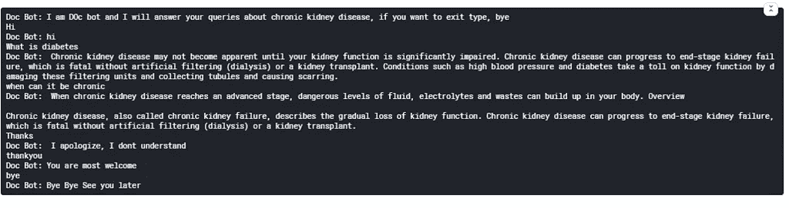

# 在 10 分钟内制作一个简单快速的聊天机器人

> 原文：<https://towardsdatascience.com/making-a-simple-and-fast-chatbot-in-10-minutes-2d84a4ba35e?source=collection_archive---------38----------------------->


图像[来源](https://unsplash.com/photos/uLnmmE8Y0E4?utm_source=unsplash&utm_medium=referral&utm_content=creditShareLink)

在现实世界中，聊天机器人的响应时间非常重要。无论是旅游业、银行还是医生，如果你想真正帮助你的客户，响应时间应该更短，类似于与客户服务代表交谈时的响应时间。

除了时间，理解聊天机器人的主要动机也很重要，每个行业都不能使用类似的聊天机器人，因为他们有不同的目的，并有不同的语料库来回复。

虽然变形金刚很容易得到合适的回复，但回复可能需要时间。另一方面，就时间而言，可以应用各种其他方法，甚至可以找到一些基于规则的系统来获得适合所提问题的适当答复。

你可能已经联系了多少次旅行社，要求退还你去年在封锁期间预订的机票，我敢肯定，得到一个恰当的答复是远远不现实的。

现在让我们制作一个简单的聊天机器人并安装这些包:

```
pip install nltk 
pip install newspaper3k
```

包装报纸 3k 有如下几个优点:

1.  多线程文章下载框架
2.  新闻网址可以识别
3.  可以从 HTML 中提取文本
4.  从 HTML 中提取顶部图像
5.  所有的图像提取都可以从 HTML 中完成
6.  可以从文本中提取关键词
7.  可以从文本中提取摘要
8.  可以从文本中提取作者
9.  Google 趋势术语提取
10.  用 10 多种语言工作(英语、德语、阿拉伯语、中文……)

按如下方式导入库:

```
#import libraries
from newspaper import Article
import random
import nltk
import string
from sklearn.feature_extraction.text import CountVectorizer
from sklearn.metrics.pairwise import cosine_similarity
```

我已经在我以前的[博客](/nlp-easy-explanation-of-common-terms-with-python-dc7c323a4691)中谈到了 CountVectorizer。

余弦相似性或余弦核将相似性计算为 X 和 Y 的归一化点积:

*sk learn . metrics . pairwise . cosine _ similarity(X，Y=None，dense_output=True)*

**参数**

**X*{ n array，稀疏矩阵}形状(n_samples_X，n_features)*** 输入数据。**Y*{ n array，shape 的稀疏矩阵}(n _ samples _ Y，n_features)，默认=无*** 输入数据。

如果没有，输出将是 x 中所有样本之间的成对相似性。 **dense_output *bool，default=True*** 即使在输入稀疏时是否返回密集输出。如果为 False，则如果两个输入数组都是稀疏的，则输出是稀疏的。

**回报**

**核矩阵:*n 个形状数组(n_samples_X，n_samples_Y)***

```
import numpy as np
import warnings
warnings.filterwarnings('ignore')
```

在我的[博客中已经解释了标记化。](/nlp-easy-explanation-of-common-terms-with-python-dc7c323a4691)这里我们从一个医疗保健网站获取数据

```
article=Article("https://www.mayoclinic.org/diseases-conditions/chronic-kidney-disease/symptoms-causes/syc-20354521")
article.download()
article.parse()
article.nlp()
corpus=article.text
print(corpus)

#tokenization
text=corpus
sentence_list=nltk.sent_tokenize(text) #A list of sentences

#Print the list of sentences
print(sentence_list)
```

一旦你准备好了语料库，你可能不得不考虑用户或客户可能会问或说的问题，这些问题与我们拥有的内容没有任何关系。

它可以是问候信息、感谢信息或类似再见的信息。团队需要对这样的信息和他们的反应进行头脑风暴。

我试着在这里介绍一些。

问候机器人响应

```
#Random response to greeting
def greeting_response(text):
 text=text.lower()

 #Bots greeting
 bot_greetings=["howdy","hi","hola","hey","hello"]

  #User Greetings
 user_greetings=["wassup","howdy","hi","hola","hey","hello"]
 for word in text.split():
 if word in user_greetings:
 return random.choice(bot_greetings)
#Random response to greeting
def gratitude_response(text):
 text=text.lower()
```

感恩机器人回应:

```
#Bots gratitude
 bot_gratitude=["Glad to help","You are most welcome", "Pleasure to be of help"]

 #User Gratitude
 user_gratitude=["Thankyou so much","grateful","Thankyou","thankyou","thank you"]

 for word in text.split():
 if word in user_gratitude:
 return random.choice(bot_gratitude)
```

排序列表

```
# Default title text
def index_sort(list_var):
 length=len(list_var)
 list_index=list(range(0,length))
 x=list_var
 for i in range(length):
 for j in range(length):
 if x[list_index[i]]>x[list_index[j]]:
 #swap
 temp=list_index[i]
 list_index[i]=list_index[j]
 list_index[j]=temp

 return list_index
```

聊天机器人响应功能，使用预定义文本的余弦相似度来响应。

```
#Creat Bots Response
def bot_response(user_input):
 user_input=user_input.lower()
 sentence_list.append(user_input)
 bot_response=""
 cm=CountVectorizer().fit_transform(sentence_list)
 similarity_scores=cosine_similarity(cm[-1],cm)
 similarity_scores_list=similarity_scores.flatten()
 index=index_sort(similarity_scores_list)
 index=index[1:]
 response_flag=0
 j=0
 for i in range(len(index)):
 if similarity_scores_list[index[i]]>0.0:
  bot_response=bot_response+' '+sentence_list[index[i]]
 response_flag=1
 j=j+1
 if j>2:
 break

 if response_flag==0:
 bot_response=bot_response+" "+"I apologize, I dont understand"

 sentence_list.remove(user_input) 

 return bot_response
```

对于从聊天退出列表中退出，单词被写成“退出”、“再见”、“回头见”、“退出”。

作为对这些话的回应，聊天机器人将退出。

启动聊天机器人，尽情享受吧！

```
#Start Chat
print("Doc Bot: I am DOc bot and I will answer your queries about chronic kidney disease, if you want to exit type, bye")

exit_list=['exit','bye','see you later','quit']

while(True):
 user_input=input()
 if user_input.lower() in exit_list:
 print("Doc Bot: Bye Bye See you later")
 break
 elif greeting_response(user_input)!= None:
 print("Doc Bot: "+ greeting_response(user_input))
 elif gratitude_response(user_input)!= None:
 print("Doc Bot: "+ gratitude_response(user_input)) 
 else:
 print("Doc Bot: "+ bot_response(user_input))
```

请参见以下聊天机器人的回复:



作者图片

重要的是要注意到“谢谢”并不在我们的机器人感恩功能中，因此有了这个消息。随着时间的推移，您可以扩充这样的词汇表，或者利用正则表达式对其进行微调。

**结论:**

这是一个小例子，让你开始制作快速简单的聊天机器人。你需要为不同的行业微调聊天机器人，这些行业的语料来自实时数据或云上的一些存储。

我们需要记住，实时数据有其自身的挑战，聊天必须从最新的数据中得到回应。一个例子是在旅行社订票。

感谢阅读！

*原载于 2021 年 1 月 6 日 https://www.numpyninja.com*<https://www.numpyninja.com/post/making-a-simple-and-fast-chatbot-in-10-minutes>**。**