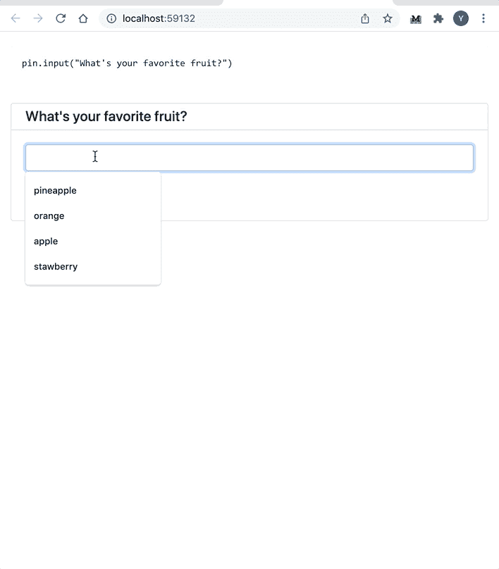
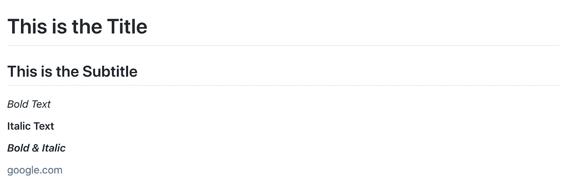
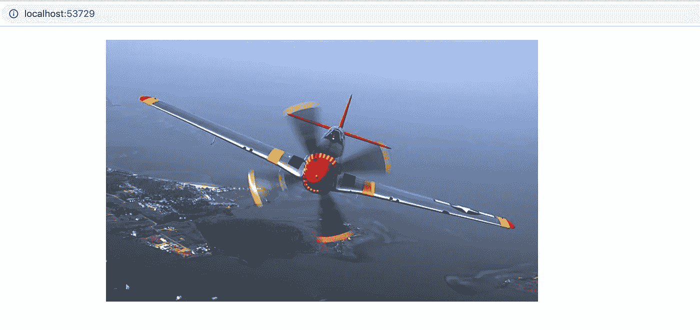
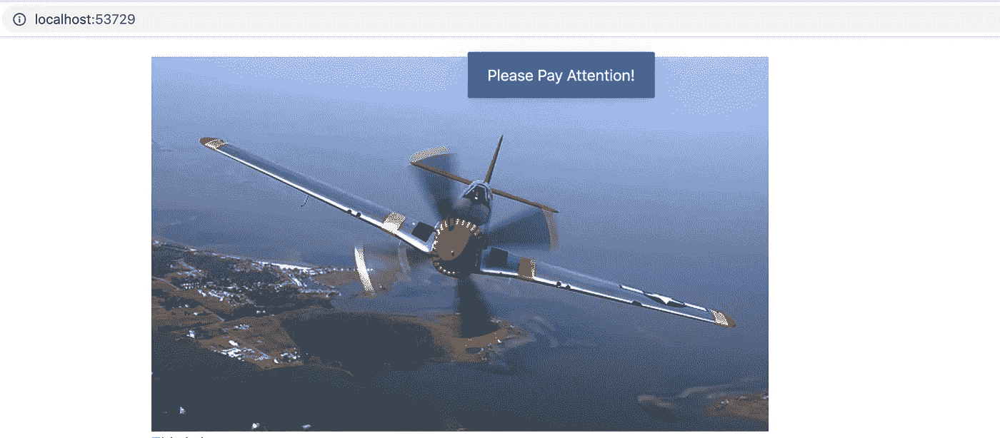
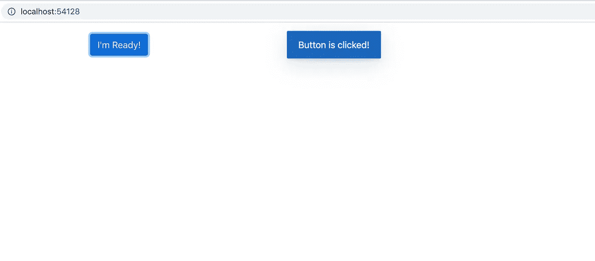

# 使用脚本制作交互式 Web 应用程序 PyWebIO 方式

> 原文：<https://towardsdatascience.com/making-an-interactive-web-app-using-a-script-the-pywebio-way-315ed65c3ae3?source=collection_archive---------16----------------------->

## 在制作数据科学 web 应用程序时，Streamlit 不是您的唯一选择


由[高桥幸一](https://unsplash.com/@koukichi_t?utm_source=medium&utm_medium=referral)在 [Unsplash](https://unsplash.com?utm_source=medium&utm_medium=referral) 上拍摄的照片

网络应用是展示你作品的最有效的方式，因为它们是独立于平台和高度互动的。如果 Python 是您选择的语言，您可以选择，包括 Django 和 Flask，这是 Python 中两个领先的 web 开发框架。然而，对于你来说，学习它们并不容易，因为你要制作功能性的 web 应用程序。

之前，我已经写了几篇关于使用 Streamlit 的文章( [1](/streamlit-1-0-just-landed-a-5-minute-tutorial-8eb00d6e5ff8) 、 [2](/deploy-a-public-streamlit-web-app-for-free-heres-how-bf56d46b2abe) 、 [3](/build-your-first-interactive-data-science-web-app-with-streamlit-d4892cbe4792) 、 [4](/8-simple-and-useful-streamlit-tricks-you-should-know-ad16c6691b84) )，Streamlit 是一个在数据科学家中很流行的趋势 web 框架。随着几个主要投资者的支持，Streamlit 预计将继续增长，如果您有兴趣了解如何使用 Streamlit 轻松制作交互式应用程序，我们鼓励感兴趣的读者探索这个框架。

在这里，我想描述一种制作交互式 web 应用程序的替代工具。GitHub 上几乎有超过 1.8k 的星星，这个趋势 Python 库 PyWebIO 允许用户仅使用 Python 脚本创建 web 应用程序，而无需任何 HTML、CSS 或 JavaScript 知识，类似于 Streamlit。然而，这是不同的—我将把讨论留到本文的结尾。在此之前，我们先来看看 PyWebIO 是如何工作的。

事不宜迟，让我们开始吧。

## 装置

在虚拟环境中(是的，为您的项目建立一个虚拟环境是一个好的实践)，您可以通过运行以下命令使用`pip`来安装该包:

```
pip install -U pywebio
```

请注意`pywebio`需要 Python 3.5.2+。

## 第一次互动——让我们收集意见

顾名思义，这个 Python 库专门处理输入和输出。让我们先用一些数据输入来尝试一下。



输入示例(图片由作者提供)

如您所见，PyWebIO 为您提供了常用的 web 小部件来收集输入。该示例包括文本输入、用于连续数值选择的滑块、复选框、用于选择的下拉框以及基于单选按钮的多项选择。除了这些显示的小部件，您还有其他选项，比如文件上传和多行文本输入。

对于这些小部件，您可以添加标签、验证、占位符和许多其他微调配置。

为了便于您复制上述操作，您可以找到下面的代码。

输入示例的代码

## 产量怎么样？

在上一节中，为了向您展示代码和输入小部件，您已经看到我使用了`put_code`函数作为输出小部件。如您所见，它创建了一个灰色小框，用不同的字体显示代码。除了显示代码，最常见的是使用`put_text`函数显示文本，你可以使用`put_table`函数显示表格。

```
pout.put_text("This is an awesome library.")pout.put_table([
    ("Col 1 Title", "Col 2 Title"),
    ("Row 1, Col 1", "Row 1, Col 2"),
    ("Row 2, Col 1", "Row 2, Col2")
])
```

您将看到一行文本和一个结构良好的表格，如下所示。


输出表(图片由作者提供)

就像 Streamlit 一样，PyWebIO 也支持 markdown，这为使用 markdown 语言显示信息创造了很多机会。下面的代码和截图向您展示了一些常见的降价用法。

```
pout.put_markdown("# This is the Title")
pout.put_markdown("## This is the Subtitle")
pout.put_markdown("_Bold Text_")
pout.put_markdown("__Italic Text__")
pout.put_markdown("*__Bold & Italic__*")
pout.put_markdown("[google.com](google.com)")
```



降价示例(图片由作者提供)

除了文本，您还可以使用`put_image`功能轻松显示图像。

```
pout.put_image(open("airplane.jpg", "rb").read())
```



显示图片(图片来源:[维基百科](https://en.wikipedia.org/wiki/Airplane#/media/File:P-51_Mustang_edit1.jpg)，授权:公共领域)

虽然我向您展示的是来自本地的图片，但是您也可以使用显示在线图片的 URL。

如果你想有一些需要特别注意的东西，你可以使用`toast`功能把它作为一个通知框。此通知将在指定的延迟后消失。

```
pout.toast("Please Pay Attention!", duration=10)
```



吐司示例(图片由作者提供)

另一个重要的输出/输入部件是按钮——许多 web 应用程序没有按钮就无法运行。PyWebIO 当然支持按钮。让我们现在试一试。

```
def show_text():
    pout.toast("Button is clicked!", duration=10)

pout.put_button("I'm Ready!", onclick=show_text)
```



按钮示例(作者图片)

您也可以探索其他输出小部件。例如，您可以显示下载文件的链接或显示供选择的弹出菜单。

## Streamlit 与 PyWebIO

如果你用过 Streamlit，你可能会想知道 Streamlit 和 PyWebIO 有什么区别。以下是我思考这个问题时想到的四个要点。如你所见，它们不是同一类东西。

*   **整体生态系统。Streamlit 得到了更大的发展，因此，它有更成熟的小部件和更好的内置 web 应用程序的外观调整。它还提供云托管服务，让您可以轻松部署应用程序。许多数据科学家和机器学习工程师已经采用了 Streamlit。相比之下，PyWebIO 相对较新，它正在等待看它如何被该领域接受。换句话说，PyWebIO 的生态系统仍在成长。**
*   **剧本执行/设计原则。** Streamlit 完全执行脚本。每当脚本中有变化时，将再次评估脚本。因此，对于某些用例来说，这可能是一个难题。相比之下，PyWebIO 线性地评估脚本。当脚本需要输入时，它不能让您继续，直到输入被提供。
*   **预期使用案例。**对我来说，你可以使用 Streamlit 来开发更精致、结构更复杂、服务大众的 web 应用。相比之下，PyWebIO 擅长解决较小的任务。因为它的“线性”设计，如果你开发一个内部使用的逐步 web 应用程序，它是有用的。
*   **开发者友好。**我发现它在开发阶段变得更加友好，因为它的“热加载”功能——当你更新你的脚本时，你的 web 应用程序会重新加载以反映变化。然而，从设计上来说，PyWebIO 本质上是 web 应用程序中 Python 控制台的图形表示，因此您只能使用会话和脚本中的位置。因此，您可能会发现很难立即修改您的脚本以查看更改。(编辑:根据 PyWebIO 开发人员的回应，您可以通过启动服务器进行“热加载”开发。可以在这里找到说明:[https://pywebio . readthedocs . io/en/latest/guide . html # overview](https://pywebio.readthedocs.io/en/latest/guide.html#overview))

## 结论

在本文中，我们回顾了新的 PyWebIO 库最常见的特性，您可以使用这些特性通过 Python 脚本创建 web 应用程序。我预计 PyWebIO 将继续增长。

然而，由于它的设计原则(例如，线性执行)和更有限的用例，我怀疑它能否吸引许多数据科学家和机器学习工程师。尽管如此，您肯定可以找到该工具的一些相关用例。

感谢阅读这篇文章。通过[注册我的简讯](https://medium.com/subscribe/@yong.cui01)保持联系。还不是中等会员？使用我的会员链接通过[支持我的写作(对你没有额外的费用，但是你的一部分会费作为奖励被 Medium 重新分配给我)。](https://medium.com/@yong.cui01/membership)