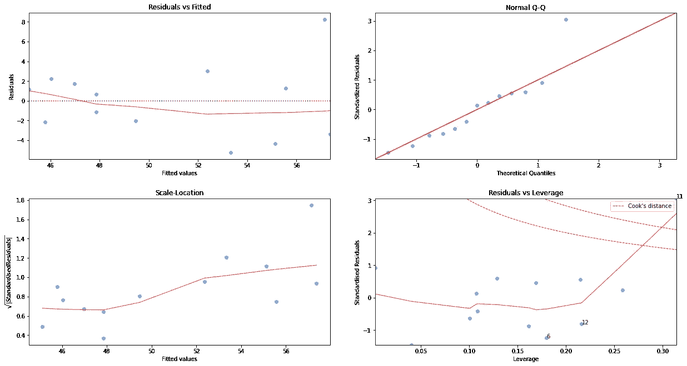

# 用 IoT 和 ML 制作更好的奶酪

> 原文：<https://towardsdatascience.com/making-better-cheese-with-iot-and-ml-5e9cccc63c3f?source=collection_archive---------19----------------------->

## *利用低成本物联网和机器学习解决方案优化奶酪制作流程。*

一家小型奶酪厂希望改进其生产流程，专注于产品质量。关键的焦点是改善冷藏室的温度监控，以保持产品新鲜并延长保质期。

以前的质量控制系统需要一个人每四个小时去一次冷藏室，手动从数字显示器上读取温度。这对于正常工作时间的监控很有效，但是对于晚上和周末就不行了。当然，假设四小时内没有任何差错。由于工厂位于农村地区，电力中断经常发生，因此安装了备用发电机。然而，发生了发电机无法启动的情况，这导致了周末的一些产品损失。

第一阶段侧重于改进监控，这将简要讨论，第二阶段侧重于实现机器学习，这将在本文中详细讨论。

# 阶段 1:改进监测

该项目的第一步是实施物联网(IoT)解决方案，以提供对冷藏室制冷系统的实时监控。虽然有一些商业物联网解决方案可用，但考虑到传感器、基础设施和云托管费用，成本往往会迅速增加，尤其是对小型工厂而言。

> 更具成本效益的解决方案是定制的物联网设备，利用 ESP32 微控制器和一些现成的传感器。一个简单的基于 web 的应用程序被创建并托管在本地 PC 上。

该系统测量冷藏室内部的温度、制冷机组的功耗和外部环境温度。现在，实时温度每 30 到 60 秒自动捕获一次，而不是手动进行现场测量，这提供了更一致的监控和对系统运行的更多洞察。

如果温度超过上限或下限达 30 分钟，就会发出警报，但是，似乎每隔几个小时就会发出警报，无需人工干预即可恢复正常。

正常高低限物联网监控系统趋势。*作者图片。*

# 阶段 2:使用数据获得更好的洞察力

物联网解决方案的实施提供了改进的监控和大量的实时数据，这是以前所没有的。该项目的下一阶段是实施更高级的分析，即使用生成的数据，以更好地了解过程和系统操作。

## 三个关键业务需求

1.怎样才能更好的实现制冷温度监控？我们需要了解常规的有害警报以及在控制范围内会发生什么。

2.制冷系统目前的能源性能如何？首先，我们能否利用现有数据建立一个良好的能源模型，我们能否确定潜在的能源节约？

3.需要做些什么来实施已确定的变更，这样做是否具有成本效益？

## 计划评估方法

*   **数据准备**:建立数据摄取管道，包括数据质量处理。这也将允许在未来添加额外的数据。
*   **探索性数据分析(EDA)** :探索*新*数据，识别特征，识别潜在的新特性。
*   **开发和测试 ML 模型:**根据业务需求，开发合适的模型并测试性能。
*   **总结成果:**讨论项目这一部分的发现和后续步骤。

> 数据和 python 笔记本可以在 [GitHub](https://github.com/cnrd-dev/cheese-factory) :-)上获得

# 数据准备

## 传感器描述和数据

各种传感器的描述位于***sensors _ sensor _ 202107282041 . CSV***中。它包括:

*   ***sensor_id*** 与日常数据文件相匹配；
*   ***sensor _ type******sensor _ uom***(计量单位)；
*   ***sensor_ucl*** 和 ***sensor_lcl*** 是用于报警的控制上限和下限；和
*   ***sensor_uucl*** 和 ***sensor_llcl*** 是用于报警的控制上限和下限。

添加了 **sensor_short_name** 的数据框细节，便于参考。*图片作者。*

感兴趣的传感器是冷藏室温度、冷藏室功耗和外部环境温度。有两个冷藏室:一个用于在制品(WIP ),一个用于配送(DP)。

物联网系统在 2021 年 3 月底实施，提供了大约五个月的高频数据。每日数据文件以压缩的 CSV 文件形式接收，由系统创建用于备份目的。该文件包含三列:

*   ***时间戳*** :获取传感器读数的日期和时间
*   ***值*** :传感器描述文件中的原始传感器读数，单位为测量单位；和
*   ***sensor_id_id*** :与传感器描述文件匹配的传感器的整数 id。

查看原始数据的统计数据，我们可以看到当前读数(32 和 36)有大约 5000 个额外的数据点，这表明一些数据点缺失。还可以看出，温度读数(29、30 和 31)的最小值为-127，这是可疑的，并且还会影响平均值和标准偏差，这取决于该值有多少数据点。

原始数据的基本统计(第一遍)。*作者图片。*

## 数据处理

开发了一个数据管道来读取单个压缩的 CSV 数据文件，将其合并到一个数据帧中，并执行一些清理。根据实时监控系统，以下标准用于过滤质量差的数据:

*   值-99 被分配给任何质量差或不可用的传感器值；
*   值-127 表示一些温度传感器的数据质量差；和
*   值-327 和 327 表示质量差的数据处于设备范围的极限。

在此应用中，温度通常略高于零摄氏度，因此-99 或-127 的值不在正常范围内。没有等于-99 的数据点，也没有处于极限的数据点，但是有 155 个数据点等于-127。移除这些之后，统计数据看起来更符合流程。

在移除质量差的数据之后，温度标准偏差和最小外观的统计数据与过程一致。*作者图片。*

温度数据在五分钟的时间段内被平均，以减少来自原始测量的噪声，因为系统是缓慢动作的，至少对于温度是如此。正常开关周期数据的变化略有减少，但除霜尖峰仍然突出。

对于能量分析，电流测量值(功率测量值)被转换为能量测量值，因为电流变化很快，可以在噪声电流趋势中观察到。我们还对能耗感兴趣，而不是瞬时值。在三相系统中，现场电压为 400 伏。假设平均功率因数为 0.85。该分析的温度数据是一个小时内的平均值。

这些步骤在[***data-ETL . ipynb***](https://github.com/cnrd-dev/cheese-factory/blob/main/notebooks/data-etl.ipynb)中有所概述。

# 探索性数据分析

外部温度呈正态分布，有道理。WIP 温度看起来像预期的那样具有特定的设定点，然而，DP 温度似乎具有两个不同的设定点。在能量上，我们可以看到设备关闭的时间段(峰值在第一个框中)。

每个传感器的数据分布。*图片作者。*

在分析时间序列趋势(温度和能量)时，似乎有一些能量峰值与工作日的每日温度相匹配，但在周末没有太大变化。包含星期几可能是一个很好的特性。周六和周日的能源消耗不同于一周中的其他日子，因为周末的工作最少。在这一周中，不断有人进出冷藏室，并添加新产品。

WIP 冷藏室每周一天的能耗与外部温度。周末观察到的明显差异。*作者图片。*

观察调度冷藏室的设定点差异，我们可以将冷藏室温度分为 3.5°C，以比较高设定点(4°C)和低设定点(2°C)的能耗差异。平均差额为 3 538 千瓦时/年，约为 18%。这意味着如果它在较高的设定点运行，可能会节省 18%,假设它不会影响产品质量。然而，随着时间的推移，我们需要考虑可能产生重大影响的相关变量。

比较低(2°C)和高(4°C)设定点之间能耗分布的箱线图。*作者图片。*

这些步骤在[***EDA . ipynb***](https://github.com/cnrd-dev/cheese-factory/blob/main/notebooks/eda.ipynb)中有所概述。

# 使用异常检测进行冷房温度监控

更一致的监控中的一个见解是每 6 小时发生的显著的自动除霜循环。这是大多数有害警报的原因。这不是常识，也很少引起对之前人工读数的关注，除非读数是在这段时间内获得的。实时监控使这一点变得可见，但有害警报无助于新系统的采用。

六小时制冷循环，显示了一个清晰的模式和除霜循环接近尾声。*图片作者。*

解决恼人警报的一个解决方案是使用[自动编码器、卷积神经网络](https://www.tensorflow.org/tutorials/generative/autoencoder)。有一个使用 Keras 库进行[时间序列异常检测的很好的例子，它使用了来自](https://keras.io/examples/timeseries/timeseries_anomaly_detection/) [pavithrasv](https://github.com/pavithrasv) 的自动编码器，该编码器被用于本分析。它基本上接受输入数据并对其进行编码(压缩)，减少特征，然后开始解码特征以重建原始数据，同时将误差降至最低。因此，确保输入数据的高质量和*正常*对于手头的流程非常重要。

我们有六小时一个周期的温度趋势，在正常情况下是可以预测的。在检查了时间序列趋势后，确定了一个好的时间段作为自动编码器的训练数据(在 2021–05–07 16:30 和 2021–05–11 4:20 之间)。这种方法的困难在于处理未标记的数据和直观地找到好的周期。研究了一个典型的循环，以确定创建训练序列所需的时间步长。典型的时间步长约为 74，即 6 小时 15 分钟。

**指标**

在定义 Keras 模型时，选择均方误差(MSE)作为损失函数，以[惩罚较大误差的益处](https://medium.com/analytics-vidhya/mae-mse-rmse-coefficient-of-determination-adjusted-r-squared-which-metric-is-better-cd0326a5697e)，这对于该应用至关重要。对于其他参数，使用默认值。

**模型评估和选择**

经过训练后，我们看到该模型与训练和验证数据集都非常吻合。通过绘制 MSE，在训练损失最大值为 0.13 时计算重建阈值。当参数调整过多时会遇到一些困难，导致模型中的大量损失。

派遣冷房温度的培训与验证损失。*图片作者。*

确定重建误差阈值的训练损失函数的分布。*图片作者。*

从模型中检查和重建单个序列，并计算误差以验证模型的拟合。使用训练序列之一，我们观察到良好的拟合和最小的误差。使用一些检测到的异常序列，可以清楚地看到大误差区域。

无异常的重建趋势示例(测试数据)。*图片作者。*

带有异常的重构趋势示例。*图片作者。*

**结果**

将此应用于所有可用的数据，有一些我们期望捕捉的明显异常，但也有一些其他可能或可能不重要的异常。重要的是，一些设定值的变化也被确定为异常，这可能意味着过程没有正常运行。使用提供的示例，这是一个很好的第一步。

突出异常的长期趋势。有些异常是意料之中的，比如更高的峰值，而有些则在正常的控制范围内，但可能会有影响产品质量或设备寿命的重大变化。*作者图片。*

调整损失函数阈值会影响模型检测异常的灵敏度。如果阈值太高，我们可能会错过设定点温度偏移两度的时间段，这可能意味着使用额外的能量或减少产品的保质期。

> 这是一个复杂的方法，用一些基础知识和世界类库就可以实现。它可以减少我们的应用程序的有害警报，并且应该与其他方法结合使用，以实现更健壮的实现。

这些步骤在 [***异常-检测-dp.ipynb***](https://github.com/cnrd-dev/cheese-factory/blob/main/notebooks/anomaly-detection-dp.ipynb) ***中有所概述。*** 对 WIP 冷室做了类似的分析( [***异常-检测-wip.ipynb***](https://github.com/cnrd-dev/cheese-factory/blob/main/notebooks/anomaly-detection-wip.ipynb) )。

# 估计制冷系统的能量性能

到目前为止，人们关注的焦点一直是冷藏室的温度监测。为了建立一个衡量能源绩效的模型，需要衡量相关的变量。物联网系统测量外部环境温度以及制冷设备消耗的电流。从能源的角度来看，冷室温是一个设定点，而不是一个相关变量。然而，这将影响能耗，因为在不同时期，调度冷室似乎有两个不同的设定点。

从质量的角度来看，要求将房间保持在 4℃左右，因此任何更冷的温度都意味着在这种特定的气候下需要更多的能量来降温。因此，我们的能量模型可以估计两个设定点之间的能量差，并估计潜在的能量节省。

**定义模型**

使用将能耗与环境温度和设定点温度相关联的回归分析，开发了一个简单的能量模型。使用每日数据是因为数据在较小的时间间隔内可能会有噪声，尤其是具有有限特征的数据。与 EDA 阶段相同的温度分割用于数据集，即 3.5°C。对于该模型，使用每日数据，将 4°C 设定点用作基线，将 2°C 设定点用作我们的报告期。基准期和报告期的可用数据点分别为 53 个和 61 个，因此非常平衡。

EDA 还显示了能量消耗和外部温度之间的相关性。我们用基线期的散点图证实了这一点，并且在右上角观察到四个明显的异常值，以及与 lowess 线的轻微非线性。异常值已从分析中剔除。

调度冷藏室能耗与外部温度的关系，添加等高线图，并用红色表示一条 lowess 线。*作者图片。*

**指标**

均方根误差(RMSE)优于平均绝对误差(MAE ),因为它对大误差不利。与预测能量的小偏差并不重要，但一个大值会影响累积能量性能。另一个指标是调整后的 R 平方，因为我们有一个以上的功能，它提供了一个比 R 平方更鲁棒的指标，R 平方通过添加功能来提高。该指标的实际应用是解释能耗的可变性，并在我们可能遗漏某些功能时给出提示。

**模型评估和选择**

特征(外部温度和设定点温度)已标准化，25%的数据集用于测试。作为基本参考，拟合了 OLS 回归模型，剔除了异常值，只有轻微的非线性。该模型在测试集上产生了 3.83 的 **RMSE 和 0.5356** 的**调整 R 平方，这解释了约 53%的可变性。这可能表明一些缺失的相关变量或过程控制问题。**

为了看看是否可以用更健壮的算法来改进模型，我选择使用增强回归树，即 XGBoost，因为它对特征的非正态性不敏感，更容易解释和准确。我包括 3 个交叉验证，因为它是一个小数据集，使用每日数据和网格搜索进行超参数调整。为了找到最佳参数，选择了相当宽的范围，但在选择时要小心，以确保模型不复杂且可能过度拟合，例如 *max_depth* 不应太深。为了减少过度拟合的可能性，我还指定了 *colsample_bytree* 和*子采样*参数，以便它在每一步使用稍微不同的数据。

该模型得出的 **RMSE 为 3.49** 和**调整后的 R 平方为 0.6147** ，比 OLS 回归模型高出约 8%。最佳参数是在*最大深度*为 5，采样参数都为 0.3，这意味着没有过度拟合的可接受模型。看看测试数据的回归图，残差看起来是随机分布的，只有一个点在 Q-Q 图中突出。

使用 XGBoost 模型的测试数据的回归图。[用 Python 模拟 R 图——数据之旅&音乐(emredjan.xyz)](https://emredjan.xyz/blog/2017/07/11/emulating-r-plots-in-python/) 。*图片作者。*

**结果**

现在，我们可以在报告期数据上使用优化的 XGBoost 模型来预测在较高设定值下消耗的能源。预测能量消耗和实际能量消耗之差的累积和将给出在此期间消耗的额外能量。在此期间，额外的能源消耗为 419 千瓦时，对其进行调整以代表年度数字，预计额外的能源消耗为 2 507 千瓦时/年，即高出约 11%。

显示使用 2°C 设定点的额外能耗的累积能源性能。平线期是使用基线数据最多的时期，即设定点为 4℃。*作者提供的图像。*

> 因此，基于更保守的能源模型，该工厂可能在一年内节省 2 507 千瓦时(约 11%)。这大约是在 EDA 阶段完成的平均盒图分析的 70%。这是一个很好的节约，特别是在电力中断时使用柴油发电机，这会增加企业成本和碳排放。

需要注意的几个关键问题是，有些数据是不可用的，如关于生产量的数据，以及门打开和关闭的次数(潜在的附加功能)。另一个原因是能源消耗受环境温度的影响，我们只查看了几个月的数据，因此不能代表所有季节。

这些步骤在[***energy-model . ipynb***](https://github.com/cnrd-dev/cheese-factory/blob/main/notebooks/energy-model.ipynb)***中有所概述。***

# 业务成果和考虑因素

一个关键的发现是突出的自动除霜循环。了解了这一点后，维护经理想知道为什么另一家工厂的一个拥有相同系统的冷藏室没有任何除霜循环。事实证明，这个系统没有正常运行，这也解释了为什么它需要更频繁的维护和消耗更多的能源。这种情况已经得到纠正，降低了他们组织中另一家工厂的成本。

根据能源分析，我们确定 2°C 和 4°C 的设定点之间存在能耗差异。降低约 11%的能耗可以在更大范围内产生巨大影响，尤其是考虑到更多自持能源系统，如太阳能和电池。它可能对这种系统的资本成本以及电池容量有影响。

相比之下，冷藏室的工作温度较低可能会有好处。可能会消耗稍微多一点的能量，但这可能会延长产品的保质期。考虑到产品中的固有能量，这可能意味着减少食物浪费和节约能源。

# 结论

该项目专注于利用新的实时数据从低成本、定制的物联网解决方案中提取价值。使用简单的机器学习技术进行异常检测，可以让人员专注于实际的警报，并避免讨厌的警报。通过持续测量能源性能，可以实现能源和成本节约。

简单机器学习模型的应用意味着，可以开发一种低成本、非计算密集型的分析解决方案，该解决方案易于理解、实施和维护，同时提供 80%的商业价值。

# 改进的机会

> 项目这一阶段的下一步是构建机器学习管道并将其集成到主要的物联网解决方案中，并提供一个接口来重新训练和部署测试模型。

后者不仅对模型维护很重要，而且因为可用数据有限，使用更大、更有代表性的数据集会有好处。

对于异常检测，自动编码器应与控制限值以及统计过程控制原则相结合，以提供更强大的报警功能。

对于能源模型，还应该收集额外的数据，以添加更多的功能和增加每日数据点。这种分析的困难在于我们可用的每日数据点有限，这可能意味着该模型在操作中不能很好地概括。

*笔记本和资料可在*[*GitHub*](https://github.com/cnrd-dev/cheese-factory)*:-)*上获得

## 参考

*   [*使用自动编码器的时间序列异常检测*](https://keras.io/examples/timeseries/timeseries_anomaly_detection/)
*   [*在 Keras 中构建自动编码器*](https://blog.keras.io/building-autoencoders-in-keras.html)
*   MAE、MSE、RMSE、决定系数、调整后的 R 平方——哪个指标更好？
*   [*XGBoost*](https://blog.cambridgespark.com/hyperparameter-tuning-in-xgboost-4ff9100a3b2f)中超参数调谐
*   [*在 Python 中模拟 R 图*](https://emredjan.xyz/blog/2017/07/11/emulating-r-plots-in-python/)