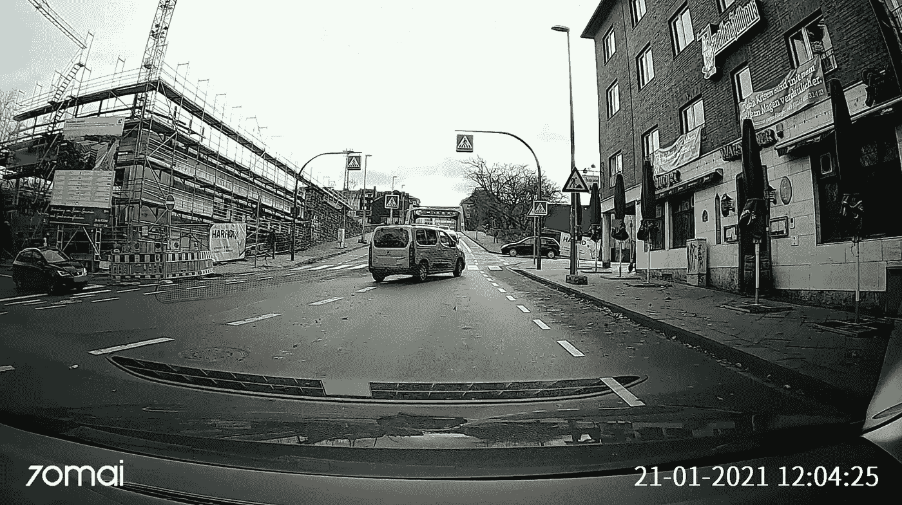
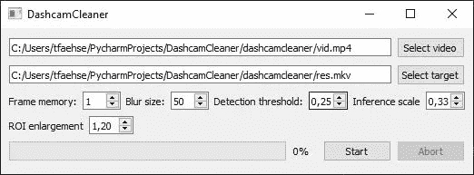
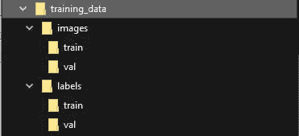

# 使用机器学习使 dashcam 视频符合 GDPR 标准

> 原文：<https://towardsdatascience.com/making-dashcam-videos-gdpr-compliant-f9832883fe94?source=collection_archive---------11----------------------->

## 我的旅程从建立一个最小可行的产品一直到从零开始训练一个检测器，不需要标记一个图像



示例性 dashcam 镜头

自从我的车有了 dashcam，数据保护法就成了我的一个话题——在许多国家，分享我自己车上的原始视频是非法的，因为它们包括可识别的特征，即车牌和人脸。

对专注于交通分析和驾驶教育的德国 Youtube 频道的快速研究显示，许多人在分享视频前手动编辑这些视频，其他人使用付费服务，根本不审查可识别数据，或者只私下分享视频。这足以引起我的兴趣:在不投入太多时间和金钱的情况下，审查可识别信息的任务能自动化到什么程度？它完全符合我最近关于机器学习的研究，我正在寻找一个小项目，以获得一些不同方法的实际经验。这篇文章并没有过多关注技术细节，关于机器学习主题的优秀博客已经存在。相反，我想谈谈我是如何完成这个看似简单的任务的，我的动机是什么，以及遇到了哪些障碍。

结构很简单，我从一个最小可行的原型开始，添加一些改进来克服 MVP 的缺点，然后为了主要组件的完整重建而废弃它。

首先，我要考虑多个重要的方面。目标是一个简单的应用程序，它将 dashcam 视频作为输入，并输出一个新的视频，其中人脸和车牌是模糊的。可用性也很重要，因为这样的工具可以让很多人受益——他们中的很多人不喜欢使用命令行界面或者自己编译任何东西。直觉上，这可以分解为

1.  将视频分割成帧
2.  检测每个框架上的板和面
3.  模糊这些区域
4.  将处理后的帧编码成结果视频。

Python 和 opencv 使第 1、3 和 4 步变得非常简单——唯一缺少的部分是检测可识别信息的可靠算法。选项是有限的:

*   自己应用机器学习技术
*   使用传统的图像处理技术
*   利用现有的机器学习项目

第一个选择是最有趣的，尤其是因为我可以运用我新学到的技能。然而，缺乏一个带标签的数据集(甚至是一个数据集)，无法获得巨大的计算能力，以及导致 GPU 价格飙升的长期芯片短缺，让这个想法很快停止，并迫使我评估其他选择。使用纯传统的图像处理技术失败了，因为需要检测的对象种类繁多，以及错过检测的严厉惩罚(最终迫使我的程序的用户手动编辑视频)。

考虑到这一点，我研究了当前车牌检测(LPD)的情况，不要与车牌识别(LPR)混淆，后者也试图读取实际的车牌字符。很快，我找到了 understand-ai 的 [Anonymizer](https://github.com/understand-ai/anonymizer) ，这是一个开源 repo，可以自动审查图像中的可识别信息。太好了！
将匿名器集成到一个简单的 Python GUI 中(大喊到 [Qt](https://wiki.qt.io/Qt_for_Python) ！)是一个相当简单的任务，并导致了我的工具 DashcamClearner 的工作原型，我在 [Github](https://github.com/tfaehse/DashcamCleaner) 上发布了它。这感觉非常令人满意，最终的视频显示了良好的准确性，并提供了一个工作原型；这很快就让我保持了很高的动力。



MVP 的 Qt-GUI

经过进一步检查，开始出现一些裂缝:

*   在一些画面中，明显没有检测到车牌
*   由于依赖 Python 3.6 和几个严重过时的库，运输/安装非常麻烦
*   *性能*。在 GTX 1060 上大约每秒 1.2 帧，一个 1 分钟的剪辑可能需要将近半个小时来处理！更糟糕的是，最终的工具应该能够在广泛的硬件上运行，可能没有 Nvidia GPUs(或 Tensorflow 1.x with CUDA 所必需的令人难以置信的复杂设置)，进一步降低了已经缺乏的性能。

尽管被托管在 Github 上开源，Anonymizer 的内部工作本质上是一个黑盒——其网络的权重在第一次运行时被下载，确切的结构是未知的。这给我带来了一个问题:我根本无法提高性能，而且提高准确性也只能在匿名器的范围之外。

起初，我试图在不放弃主要思想的情况下，利用匿名器来扩展程序的可能性。为此，我引入了几个后处理选项:

*   使用 opencv 来模糊感兴趣的区域，而不是 Anonymizer 的默认算法来提高性能
*   模糊*前*帧中的感兴趣区域，在大多数静态视频中，如果漏检只出现在几帧中，这将隐藏漏检
*   扩展模糊区域以改善仅部分检测到车牌或人脸的情况

这些小的添加已经使结果看起来更好了，代价是必须处理更多的参数。但是主要的问题，缓慢的性能，仍然存在，过时的依赖仍然是一个噩梦，缺乏对工具核心部分的控制困扰着我。

也就是说，我不得不重新评估我早期的选择——在这个项目中断了很长时间之后。我又用传统的图像处理算法碰了碰运气，但无济于事。无论我如何结合阈值、梯度、轮廓检测和一般过滤，可靠的检测似乎大大超过可用的工具。作为下一个尝试，我使用了级联分类器。但类似的问题困扰着这种方法，太多的漏检和低于标准的性能。

我仍然没有数据集，我不愿意标记从互联网上搜集的成百上千的图像，我也没有足够的计算能力从头开始训练任何合理规模的网络。早期 MVP 的主体与使用 Anonymizer 完全无关，切换到另一种检测算法就像重载实现检测的函数一样简单，*detect _ identificate _ information(image)。*

以下来自 Github 的片段显示了该工具主体的当前状态，以及它在视频中循环、检测可识别信息、模糊信息和写回视频的不同阶段。

```
def run(self):
    *"""
    Write a GDRP compliant copy of the input video
    """* # gather inputs from self.parameters
    print("Worker started")
    input_path = self.parameters["input_path"]
    output_path = self.parameters["output_path"]
    threshold = self.parameters["threshold"]

    # customize detector
    self.detector.conf = threshold

    # open video file
    cap = cv2.VideoCapture(input_path)

    # get the height and width of each frame
    width = int(cap.get(cv2.CAP_PROP_FRAME_WIDTH))
    height = int(cap.get(cv2.CAP_PROP_FRAME_HEIGHT))
    length = int(cap.get(cv2.CAP_PROP_FRAME_COUNT))
    fps = cap.get(cv2.CAP_PROP_FPS)

    # save the video to a file
    fourcc = cv2.VideoWriter_fourcc(*'H264')
    writer = cv2.VideoWriter(
        output_path,
        fourcc,
        fps,
        (width, height)
    )

    # update GUI's progress bar on its maximum frames
    self.setMaximum.emit(length)

    if cap.isOpened() == False:
        print('error file not found')
        return

    # loop through video
    current_frame = 0
    while cap.isOpened():
        ret, frame = cap.read()

        if ret == True:
            new_detections =  self.detect_identifiable_information(
                frame
            )
            frame = self.apply_blur(frame, new_detections)
            writer.write(frame)

        else:
            break

        current_frame += 1
        self.updateProgress.emit(current_frame)

    self.detections = []
    cap.release()
    writer.release()
```

在我寻求克服 MVP 状态的问题时，我通读了几篇文章，无意中发现了最初的 YOLO 论文，一个具有非常令人印象深刻的性能的单发探测器。经过多次迭代，维护人员的变更和关于名称的争议， [YOLOv5](https://github.com/ultralytics/yolov5) 为我提供了一个非常容易使用的检测器，它具有针对许多类的预训练权重，我决定用它进行一些实验。从 COCO 基准测试中检测物体的性能看起来非常惊人，所以我决定训练 YOLOv5 只检测车牌和人脸。唯一的问题是缺少我迫切需要的标记数据。这就引出了本文的主要工作——与其尝试在网上查找数据集或花几天甚至几周的时间进行标注，为什么不自动创建我自己的数据集呢？

为了得出有标签的数据，我所要做的就是开车。想出一个方法来标记我自己的数据。但是有了早期的匿名器原型，标记可以工作，尽管速度很慢。

YOLO 是一个杰出的探测器，我所要关注的是拥有大量可靠的数据。结果现在是 DashcamCleaner 的 repo 的一部分，这是一个小脚本，允许您以正确的格式为 YOLO 创建带标签的数据。它的工作原理如下:

*   遍历所有给定的输入视频文件和图像
*   将输入分成训练集和验证集
*   抓取每个视频的每第 n 帧(抓取所有帧会导致许多帧看起来几乎相同，所以这个选项非常重要——尤其是如果你像我一样有许多原始素材。我选了 n=20)
*   将抓取的帧和图像保存到各自的输出文件夹中
*   运行 Anomyzer 来检测人脸和车牌
*   将所有标签导出到一个熊猫数据框架中
*   以 YOLO 的格式保存标签，对熊猫的礼貌和它对数据帧的简单管理

这个脚本的用法很简单:

```
>> python generate_training_data.pyusage: generate_training_data.py [-h] input output labelformat skipframes trainsplitpositional arguments:
  input        input folder containing video and jpg files
  output       output folder for labeled training images
  labelformat  label format - yolo, voc or torch
  skipframes   for each analyzed image, skip n frames in videos
  trainsplit   training split of all data
```

选择 YOLO 时，输出的结构如下图所示。训练数据被分成两个顶级文件夹，即图像和标签，每个文件夹又被分成训练集和验证集。



生成的文件夹结构

总之:一旦这个公认缓慢的过程结束，近 400 分钟的记录产生了超过 35k 的 YOLO 正确格式的标记图片，具有非常好但不完美的准确性。太好了！

培训 YOLOv5 非常简单——官方报告非常好地描述了这个过程。由于对性能的关注，也由于减少到只有两类(脸，车牌)，选择了更小的 yolov5s 配置。在个人电脑上进行培训对我来说很重要，因为从 GDPR 的角度来看，将我的数据集上传到像 colab 这样的网站上是有问题的。为了验证训练数据实际上被正确标记(即检查 Anonymizer 和我对 YOLO 标记符号的转换是否工作良好)，在开始训练之前，我使用 [Yolo Mark PWA](https://yolo-mark-pwa.github.io/) 测试了一些随机样本。

之后，进行了只有 500 幅图像和 5 个时期的短验证训练，以确保训练有效。即使在非常有限的数据上进行如此短暂的训练，YOLO 也已经能够很好地进行归纳，并在非常不同的图像中检测出车牌和人脸！我的训练数据文件夹位于驱动器 F:的根目录下，训练命令如下所示:

```
python train.py --img 1920 --batch 2 --weights yolov5s.pt --workers 2 --epochs 30 --data F:/training_data/dataset.yaml
```

这里有一些事情需要解释:乍一看，这些参数似乎非常不理想，导致训练非常缓慢。这是有原因的:对我的标签的分析表明，我的许多目标，尤其是车牌，非常非常小(仪表板摄像头使用令人难以置信的广角镜头！)，因此以全分辨率进行训练可以确保最高的精度。小批量和工人数量是由于我的 GTX 1060 老化，无法可靠地将更多数据存储到其 VRAM 中。Google Colab 可以解决这个问题(根据我的测试，一个 Pro 帐户给你一个 16G VRAM 和 4 核 Haswell Xeon CPU 的 P100)，但由于 GDPR 的原因(以及 Colab 的 ToS 不鼓励像这样的非交互式、计算昂贵的任务)，我必须依赖自己的硬件。

当然，这些数据并不完美。Anonymizer 遗漏了一些检测(虽然可以很容易地用手修复)，但更重要的是，所有数据都来自单个摄像头。但是，使用本文中描述的工具，只需增加数据集生成的输入，从而引入更多样化的训练数据，就可以很容易地解决这个问题。数据集生成脚本将图像和视频作为输入，并将它们分成训练集和验证集，因此组合不同的来源也不成问题。

集成到我现有的工具中也相当简单，因为 YOLOv5 可以与 Pytorch Hub 一起使用。给定定制训练模型的权重路径，在代码中初始化检测器是一行代码:

```
model = torch.hub.load('ultralytics/yolov5', 'custom', weights_path)
```

剩下的就是通过将检测到的坐标输入到我的 Box 类中来稍微修改模型输出结果的方式。这允许该工具保持后处理的改进，如帧存储或 ROI 放大。结果令人印象深刻:速度比 Anonymizer 提高了 10 倍，同时检测更加可靠！应用于更一般的图像，结果显示了训练集的不平衡:人脸检测不像车牌检测那样健壮。这就是生成我自己的训练数据的能力派上用场的地方:喂养任何(无标签！)数据集中的人脸插入到*generate _ training _ data . py*中应该会产生更可靠的人脸检测。

就我个人而言，我对我的这个小项目的结果非常满意。创建一个易于使用的开源应用程序来审查视频中的可识别数据的目标已经完全实现，在这个过程中，我学到了许多关于不同神经网络架构的知识。主要成就是从一个工作良好但速度缓慢的黑盒检测器和没有标记的训练数据过渡到一个没有任何手动标记工作的更快的解决方案。

本文使用的所有相关代码，特别是从无标签的 dashcam 视频生成训练数据的脚本和最终的 GUI 项目，都可以在 Github 上获得。我还没有完成，但是当我已经达到了项目工作的点时，我想直接分享这个里程碑。未来的工作包括

*   一旦“真正的”训练完成，就更新权重
*   将工具打包为独立的可执行文件
*   用更平衡、更高质量的数据重新训练 YOLOv5

如果您有任何问题、更正或改进的想法，请随时评论或联系我！或者下载代码或者为您自己的项目克隆代码[这里](https://github.com/tfaehse/DashcamCleaner)。