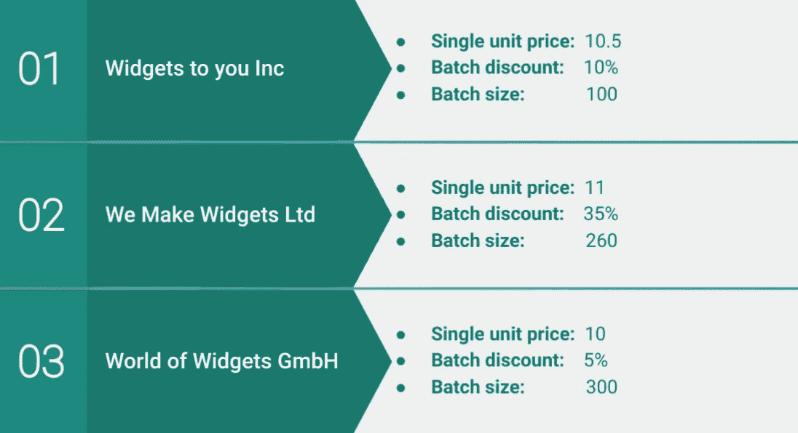
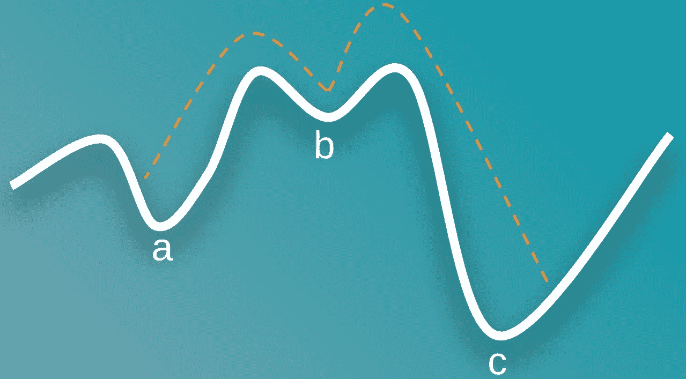
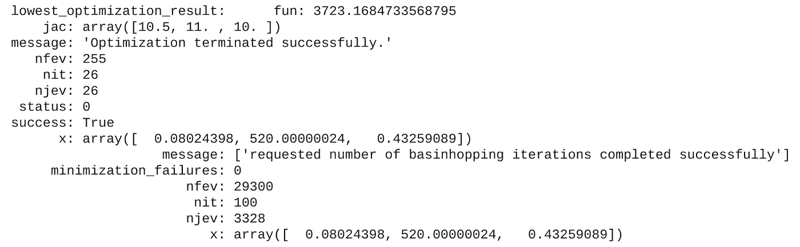

# 利用数据科学制定决策

> 原文：<https://towardsdatascience.com/making-decisions-with-data-science-36fae52ccfab?source=collection_archive---------21----------------------->

## 一个简单的例子，说明如何使用为化学物理学开发的算法来优化商业决策。

通过将现实世界中的商业决策转化为最小化的功能，我们可以将数据科学应用到它将产生最大影响的地方。只是要小心当地的最小值！来自 [Pixabay](https://pixabay.com/photos/hill-tree-drumlin-landscape-5324149/) 的 Susanne stck Li 的图片。

随着数据科学中几乎每天都有新算法和技术出现，人们很容易忽略企业投资分析的最初原因。

任何业务的潜在驱动因素都很简单；基本上，这些目标是:

1.  降低成本
2.  增加收入
3.  降低风险

然而，令人惊讶的是，数据科学项目常常远离这些业务驱动因素。通常情况下，工作的重点是哪里有数据可用，或者哪里有测试最新工具和算法的空间，而不是可以为组织提供最大价值的领域。

在本文中，我们将通过一个成功的例子来回顾基础知识，说明我们如何将数据科学应用于现实世界的业务决策，从而为底线带来切实的影响。

我们将“窃取”最初为预测原子分子结构而开发的盆地跳跃优化算法，并通过改进采购决策来降低成本。

## 优化供应链

在我们的示例中，您为 Initech 工作，这是一家专门在全球分销小部件的公司。

它从三个首选供应商那里采购这些部件。每个供应商按照相同的规格生产，并提供两种价格:

1.  每个部件的单一单价，以及
2.  如果是批量购买，可以享受折扣价；这节省了制造和物流成本。

批次大小和可用折扣因供应商而异，如下所示:

三家供应商的价格结构摘要。作者图片

例如，如果 Initech 从供应商 1 ( *widgets to you Inc.* )订购了 250 件 Widgets，这将由两批(200 件)以 10%的折扣率组成，其余 50 件以单一单价订购。

Initech 每天需要这些供应商提供各种不同的订单规模。这位首席执行官确信，这些订单的下单方式可以改进，最近他花了一大笔钱聘请顾问，这些顾问制作了一个大型幻灯片，详细介绍了他们在这个问题上与她意见一致的情况。不幸的是，无论是首席执行官还是顾问都没有能够提供一个更好的解决方案。

因此，请你来看看你能否解决以下问题:

对于给定的最小订单规模，我们如何通过向三家供应商订购来找到最低的可能成本？

## 当前流程

为了了解 Initech 目前是如何订购小部件的，您与采购经理进行了交谈。他们解释说，当收到订单时，他们将采用最适合每个供应商订单的“批量”价格。他们向您展示了一个今天最低订购量为 500 件的示例:

1.  他们购买符合订单数量的最佳价值批次(这是供应商 2 对 260 件的 35%折扣)。
2.  他们一次又一次地重复这个过程。
3.  一旦剩余数量低于所有批量，他们将向提供最佳单价的供应商(供应商 3)订购。

对于 500 的订单，这导致:

*   来自供应商 2 的一批(260 件),
*   供应商 1 的两个批次(200 件),
*   供应商 3 的 40 个单位，单位成本。

这是一辆**总造价 4149**。你向经理解释说，你将尝试使用优化技术来改进这一点，并且你认为流域跳跃算法可以提供一种有效的方法来降低每份订单的成本……他们嘲笑你。

“这种购买流程已经通过几代小部件采购经理传承下来，没有办法再改进了！”

## 建模问题

为了优化 Initech 的供应链决策，我们首先需要能够对问题进行建模。这在 Python 中非常简单，在下面的代码中，我们提供了每个供应商的详细信息，并创建了一个函数，在给定每个供应商的订单值的情况下计算总成本:

使用 Python 创建业务问题的基本模型

我们创建的函数为我们提供了我们想要最小化的东西，因为它与订单的总成本相关。下一步将应用盆地跳跃优化算法，但首先让我们了解更多关于算法如何工作。

## 跳盆？

流域跳跃算法是 1997 年开发的，用于化学物理领域[1]。它在问题空间中“跳跃”,探索不同的“盆地”,然后找到这些盆地的最小点。

如果这没有很大的意义，下面的图表可能有助于想象这在实践中是如何工作的。

流域跳跃算法如何跨越局部最小值点(a 和 b)以找到包含全局最小值(点 c)的流域的图示。作者图片

大量的问题可以有‘局部极小值’。这些解决方案与周围环境相比看起来是最佳的，但并不代表整个问题空间的最佳解决方案。

上图中的 a 点和 b 点代表局部最小值，c 点是可能的最佳解(全局最小值)。

盆地跳跃算法能够通过在问题空间中“跳跃”来避开这种局部最小值。在它到达的每一个区域，它会局部搜索最优(最小)点。

这一特性使它成为一种适用于大量问题的健壮的通用优化算法。

## 实现盆地跳跃

为了将盆地跳跃应用到我们的问题中，我们可以利用 Python 中的 SciPy 库。这需要输入一些参数，如下所述:

*   待优化的**功能**。这需要有一个单一的数字输出，我们正试图最小化(这是我们上面创建的“func”函数)。
*   **对该函数输入值的第一次“猜测”**。这在某些情况下可能很重要，但是在这个例子中，这似乎没有什么不同。因此，我们只是为每个供应商输入了一些任意的数量:每个供应商 200 个订单[200，200，200]。
*   **niter**’代表算法的迭代次数，更多的迭代可能会找到更好的结果，代价是需要更多的时间来完成。
*   **步长**设置算法中每个“跳”的最大值。设置这个值需要一点反复试验，因为它将取决于手头的问题。在本例中，值为 500 就可以了。

然后我们有**最小化器关键字参数**，这些用于将值传递给最小化器函数，盆地跳跃算法位于该函数之上。这些描述如下:

*   **方法**:标识要实现的具体算法。在我们的例子中，这是 [SLSQP](https://docs.scipy.org/doc/scipy/reference/optimize.minimize-slsqp.html#optimize-minimize-slsqp) ，因为它允许我们输入问题的界限和约束(见下文)。
*   **界限:**这些界限定义了算法中每个项目的上限和下限(在我们的例子中，是每个供应商)。因此，我们利用这一点来确保订单高于零。
*   **约束:**这些类似于界限，但允许我们在整个*问题中设置阈值。因此，我们利用这一点来确保所有供应商的订单都不会低于最低订单金额。*

将所有这些放在一起，我们得到以下结果:

这将返回以下内容:

这里进行了很多工作，但两个最重要的输出是**lowest _ optimization _ result**，它详细说明了我们提供给算法的函数的最低输出(在这种情况下，它是最小订单数所能找到的最低成本)和输出 **x** ，它详细说明了获得最佳结果所需的输入。

舍入后，我们因此得到:

*   供应商 1 没有订单
*   供应商 2 的 520 份订单(两批)
*   没有供应商 3 的订单

## 有些不对劲

您对这个结果感到非常兴奋，并回到采购经理那里向他们介绍这个结果。

但是，他们并不以为然:“你的‘超级智能’算法已经超序了！我们只需要 500 个小部件，但它想让我们订购 520 个。”

他们是对的。你后悔在和他们交谈之前没有看到这一点。然后，您意识到算法的任务是寻找满足最小数量的最低成本订单。

你检查成本；采购经理的流程将导致订单金额为 **4，149，**，但是使用流域跳跃算法的总成本为 **3，723** ，订单成本减少了 **10%** 。

采购经理很惊讶:“啊，我一直被困在当地的最低价格！我从未考虑过订购更多的产品可能会降低整体成本，而且我们还可以利用额外的 20 个部件！”

你回去告诉首席执行官，通过几行代码，你已经将 Initech 的销售成本降低了 10%。她欣喜若狂，问你还可以利用数据科学改善哪些业务领域。“所有的，”你回答。

## 摘要

在本文中，我们看到了实施数据科学技术如何对公司的底线产生巨大而切实的影响。

工作示例提供了一个输出，作为企业可以采取行动的决策。我们基本上已经能够创建一个优化问题，将商业决策直接映射到结果。

最后，通过能够在问题空间“跳跃”,我们的算法已经能够提出一个真正新颖的解决方案，一个很容易被人类决策者忽略的解决方案。

## 进一步阅读

*   [SciPy 优化文档](https://docs.scipy.org/doc/scipy/reference/optimize.html)
*   [使用 SciPy 进行优化的有效示例](https://realpython.com/python-scipy-cluster-optimize/)

## 参考

[1]David J. Wales 和 Jonathan P. K.Doye，通过盆地跳跃的全局优化和包含多达 110 个原子的 Lennard-Jones 团簇的最低能量结构(1997)[https://pubs.acs.org/doi/10.1021/jp970984n](https://pubs.acs.org/doi/10.1021/jp970984n)