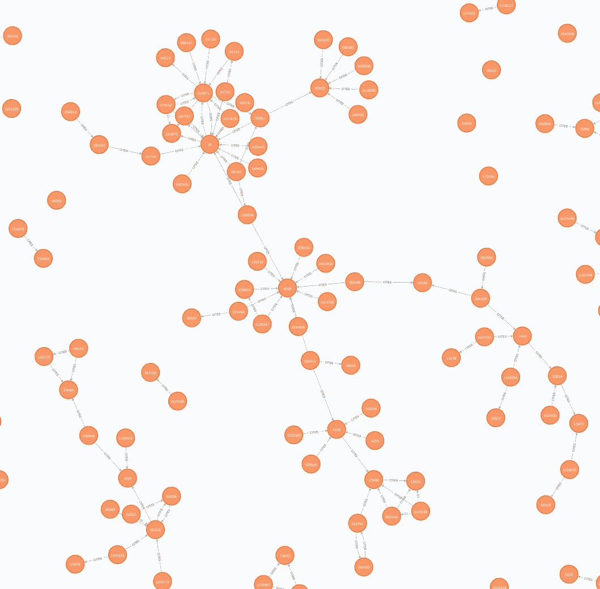

# 让 FastRP 图嵌入为您服务

> 原文：<https://towardsdatascience.com/making-fastrp-graph-embeddings-work-for-you-f7344a535dc3?source=collection_archive---------4----------------------->

## [实践教程](https://towardsdatascience.com/tagged/hands-on-tutorials)

## 如何针对您的具体问题调整 FastRP 的超参数

由[布莱恩·阿萨尔](https://unsplash.com/@_brianjr?utm_source=medium&utm_medium=referral)在 [Unsplash](https://unsplash.com?utm_source=medium&utm_medium=referral) 上拍摄的照片

# 介绍

图无处不在！单个数据点可以通过多种方式连接到其他数据点。通过使用这些连接的数据，通常以图形结构表示，我们可以制作机器学习模型，这些模型有可能比仅从柱状数据中创建模型更准确。但是为了将图形数据整合到机器学习模型中，我们必须首先找到一种将其矢量化的方法。

我已经写过关于[如何开始使用图嵌入](https://dev.neo4j.com/intro_graph_emb_tds)并展示了一种[可视化它们的方法](https://dev.neo4j.com/tds_streamlit_embeddings)。我的朋友 Tomaz Bratanic 和我写了一些关于两种最常见的图形嵌入技术的内部工作原理的博客文章(这两种技术都可以在 GDS 的 Neo4j 图形数据科学图书馆找到): [FastRP](https://dev.neo4j.com/fastrp_background) 和 [node2vec](https://dev.neo4j.com/bratanic_node2vec) 。Tomaz 也写了一些关于使用 FastRP 进行节点分类和链接预测的文章。

然而，就像在 ML 模型中可能使用的任何向量嵌入一样，为了从模型中获得最佳结果，必须对所有讨厌的超参数进行调整。在这篇文章中，我将通过一个例子演示如何使用 [Optuna](https://optuna.org/) 针对给定的节点分类问题调整 FastRP 超参数。

> 使用这些嵌入，我们将比较基于单词嵌入的多类分类的传统 ML 方法和基于图嵌入的方法。

因此，在这篇文章中，我们将做以下事情:

*   *构建图*:将 [CORA 数据集](https://stellargraph.readthedocs.io/en/stable/api.html?highlight=cora#stellargraph.datasets.Cora)(通过 Apache 2.0 许可提供)导入 Neo4j 沙盒实例
*   *设置问题*:为传统方法和基于图形的方法创建 ML 模型
*   *优化 FastRP 超参数*:探索使用 Optuna 我们可以将基于图形的模型做得多好
*   *讨论和最终想法*

最后，我希望你能看到，不仅严格地从图嵌入中创建一个 ML 模型是可能的，而且有时你实际上能得到比传统 ML 模型更好的结果，甚至使用比传统方法维数更少的向量！

***本帖附带的 Google Colab 笔记本可以在这里***<https://dev.neo4j.com/classic_vs_graph_ml>****找到。****

# *构建图表*

*为了让自己开始运行，您需要创建一个免费的 Neo4j 沙盒数据库。在这个练习中，你需要选择一个空白的沙盒。*

*<https://neo4j.com/sandbox/>  

您应该会看到如下所示的屏幕:

创建空白沙盒(作者图片)

您应该特别注意 Bolt URL 和密码，因为它们是从 Python 连接到数据库所必需的。(这个沙盒在这篇博文发表的时候就已经被销毁了，所以在这篇博文中它只是用于演示的目的。)

我们将使用 [CORA 数据集](https://stellargraph.readthedocs.io/en/stable/api.html?highlight=cora#stellargraph.datasets.Cora)，这是一个经典的图表数据集，用于查看关于机器学习主题的同行评审科学文章之间的共同引用。出于几个原因，这对于本例是一个有用的数据集。首先，数据集已经被标记。根据给定论文所属的机器学习子分支，它被分为 7 个不同的类别(稍后将详细介绍这些类别)。其次，维护人员已经创建了这些论文摘要的一系列词向量，我们将使用这些词向量来比较我们基于图的 ML 方法和基于自然语言处理(NLP)的传统 ML 模型。这些嵌入是基于 1433 个唯一单词的字典一次性编码的。最后，图形本身很简单。这是一个单部分图，意味着只有一种类型的节点(论文)和一个时间关系(引用)。许多图算法在处理单部图时效果最佳，尽管我们今天不会利用这些算法。如果不是这样，我们需要将我们的图重构为一个单部分图，这将是未来博客文章的主题。

## 将数据上传到图表中

为了便于导入，我已经将 CORA 数据集上传到 [GitHub 的 CSV 文件](https://github.com/cj2001/pydata2021/tree/main/notebooks/data)中。如果你想知道更多关于如何将数据导入 Neo4j 的信息，你可以看看这篇博文。该数据集的图形模型如下所示。

CORA 图形模型(图片由作者提供)

我们要做的第一件事是，在导入数据之前，基于节点的 id，在数据库中为节点创建一些惟一性约束。这样做的好处是既能确保没有重复，又能为节点创建索引，从而加快数据搜索的速度。为此，我们通过浏览器进入沙箱。(见[这篇博文](/create-a-graph-database-in-neo4j-using-python-4172d40f89c4)，关于中途下来，如果你想学习如何访问浏览器。)从浏览器中，我们将输入以下 Cypher 命令:

接下来，从浏览器中，我们将加载 CORA 节点列表。在这个文件中，我们有每篇论文的节点 id(一个整数)、每篇论文被分配到的类(在数据集中称为`subject`),以及由 CORA 维护者提供的词向量(在数据集中称为`features`,它是一个独热编码整数的列表)。

最后，我们将引入每篇论文的关系(又名边缘)。这个文件是节点 id 的 CSV 文件。每行都有一个`source`和一个`target`节点。这样，我们知道这两者中的每一个都将通过一种我称之为`CITES`的关系联系在一起。

所以现在我们有一个完全填充的图表来处理。我们应该看到有 2708 个论文节点，它们之间有 5429 个引用关系。该图应该如下所示:

CORA 图的一部分(图片由作者提供)

(注意，这是图形的一小部分，由 Cypher 命令`MATCH (n) RETURN n LIMIT 300`返回，它防止屏幕变得过于混乱，浏览器陷入停滞。)

太棒了。现在我们有了一个图，我们可以继续做一些 ML 了！

# 设置问题

现在我们有了这个图，我们需要创建一个 GDS 内存图，我们将使用它来计算 FastRP 嵌入。这些图形投影非常有用，因为它们将所需的节点和关系放入有效存储在存储器中的存储空间中，并且仅包含用于运行后续计算的必要信息。为此，我们将在浏览器中运行以下程序:

如前所述，我们幸运地使用了 CORA，因为图已经是单部分的了。所以我们可以使用单个节点投影`Paper`，和单个关系类型`CITES`。请注意，我们声明此图是无向的。这是因为我们假设被引用的文章可能与引用它的文章属于同一类，反之亦然。有关如何创建内存中图形的更多信息，请查看 [GDS 文档](https://neo4j.com/docs/graph-data-science/current/graph-create/)或查看我的快速视频[这里](https://dev.neo4j.com/bites_part12)。

酷毙了。这给了我们从数据库中创建 ML 模型所需的一切！

如前所述，我们将使用 Google Colab 笔记本来运行我们的模型，可以在[这里](https://dev.neo4j.com/cora_trad_ml)找到。我们将使用的许多包已经预装在 Colab 中。然而，我们仍然需要安装官方的 Neo4j Python 驱动程序以及 Optuna(当我们到达那里时)。关于如何使用该驱动程序的更多信息，请参考[这段视频](https://dev.neo4j.com/bites_part3)或[这篇博客文章](/create-a-graph-database-in-neo4j-using-python-4172d40f89c4)。我们看到我们需要连接到我们的沙箱实例。这些信息可以从如上所示的沙箱 UI 中获得。

## 基于词嵌入的 ML 模型

让我们从嵌入这个词开始。应该预先注意，我没有创建这些嵌入，也没有机会对它们进行调优。因此，我们将不得不利用我们现有的资源，把它当作一个基准模型。

在笔记本中，有一些函数可以从 Neo4j 中获取数据，并将列转换为与`scikit-learn`兼容的数据类型。我在这里就不赘述了。

一旦我们有了这些数据，笔记本就使用来自`scikit-learn`的支持向量分类器(SVC)说明了一个多类分类模型。在这个例子中，我们使用 SVC 的默认超参数，并使用 5 重验证。这篇博文的目的不是调整这个模型，而是强调基于使用哪种嵌入的分类准确性的差异。因此，这个模型将在本文中保持一致。模型的主体是:

当运行时，发现平均精度为 0.724(当然，基于 ML 建模的随机性质有变化)，并且获得以下混淆矩阵:

单词嵌入模型的混淆矩阵(作者图片)

用数字表示的类如下，它们的样本(节点)总数在括号中:

*   神经网络:0.0 (818 个节点)
*   规则 _ 学习:1.0 (180 个节点)
*   强化 _ 学习:2.0 (217 个节点)
*   概率方法:3.0 (426 个节点)
*   理论:4.0 (351 个节点)
*   遗传算法:5.0 (418 个节点)
*   基于案例:6.0 (298 个节点)

很明显，我们有一个不平衡的阶级问题，但这就是生活。考虑到这一事实以及我们无法访问原始词汇，0.726 的准确度真的不算太差。

## 基于 FastRP 图嵌入的 ML 模型

我们将从使用上面创建的内存中的图来创建 FastRP 图嵌入开始。在与这个模型相关联的[笔记本中，我们为每个节点创建了一个 256 维的图形嵌入。然后，我们像以前一样运行非常基本的 SVC 模型，并获得以下混淆矩阵:](https://dev.neo4j.com/cora_graph_ml)

基本 FastRP 嵌入的混淆矩阵(图片由作者提供)

我们还获得了 0.845 的平均精度！与单词嵌入模型相比，这是一个相当大的改进！这有一些很好的理由。第一，NLP 是出了名的吵。NLP 模型的质量在很大程度上取决于你输入的内容，这是基于垃圾输入-垃圾输出的原则。然而，如果不能访问词汇表，就不可能研究如何改进这些单词嵌入。然而，这些个体节点之间的连接一点也不嘈杂。事实上，让我们通过 t-SNE 降维来进一步探索这些嵌入。如果我们将这些 256 维的向量降低到 2 维，我们得到如下:

FastRP 嵌入的 t-SNE 可视化(图片由作者提供)

在一个理想的世界中，我们会看到每一个类都在它们自己的、非常可区分和可分离的集群中。虽然我们没有在所有情况下都看到这一点，但我们看到的情况多少是可以解释的。0.0 类对应于神经网络，这是一个相当广泛的类别。事实上，很可能其他课程会在这里引用一两篇论文，使它们比其他论文联系得更紧密。相比之下，遗传算法(紫色类 5.0)是一个非常狭窄和具体的主题。因此，它们与该学科之外的许多其他论文没有联系也就不足为奇了。这可能会导致它们更加集中。检查图中的其他集群可以让我们得出类似的结论。

# 优化 FastRP 超参数

我们现在已经看到了 FastRP 图嵌入的工作原理。然而，这些结果是在指定嵌入的维数时仅使用算法的默认设置而获得的。一般来说，在现实世界中这样做很少是个好主意。像 ML 中使用的任何其他嵌入一样，图嵌入应该通过优化它们的超参数来调整。这就是 Optuna 的用武之地。

有许多不同的 Python 包用于调优嵌入，Optuna 是最容易使用的包之一。一般的想法是，您指定一些要优化的变量，给它们一个要评估的值范围，然后指定要优化的目标度量(在本例中是准确性)。然后，Optuna 在该超参数空间中进行复杂的搜索，进行给定次数的迭代，直到找到度量的最佳值，这是通过使用这些最佳超参数获得的。

在我们的例子中，我们将使用完全相同的 SVC 模型，但是允许 Optuna 改变 FastRP 超参数，直到我们得到最佳值。这一点在[这本笔记本](https://dev.neo4j.com/core_fastrp_optuna)中有所体现。

我们首先为 Optuna 将要进行的试验指定超参数:

这些`params`值将由 Optuna 通过复杂的搜索方法进行数学选择。它们将被输入到 ML 算法中，该算法根据`params`的试验值计算精度，试验值在每次运行时会发生变化:

一旦这些东西准备就绪，我们就可以开始研究了:

这里我们提供了一些初始的，任意选择的参数。然后，我们告诉 Optuna 以“最大化”的目标度量(准确性)创建研究。然后，我们让 Optuna 对这项研究进行 100 次试验，几分钟后我们就可以获得优化的超参数。在这种情况下，我们可以看到我们的精度提高到了 0.868！虽然仍然涉及到一些随机变量，但是如果您多次运行此研究，您将会看到精确度和优化的超参数值变化不大。

然而，有趣的是，在这个解决方案中，哪些超参数是最重要的:

超参数重要性(图片由作者提供)

很明显，嵌入维数支配着解决方案。Optuna 在这次运行中确定的最佳维数是 506。虽然这在我们的范围的较大一端，有趣的是注意到这比 1433 维的单词向量少多少。其次，我们可以看到，转移矩阵中的第四个权重比第三个权重更重要(见[这篇博文](https://dev.neo4j.com/fastrp_background))，这证实了[原始算法的作者所报告的](https://arxiv.org/abs/1908.11512)。

# 讨论和最终想法

在这篇博文中，我展示了一个针对给定问题的 FastRP 超参数的简单优化。重要的是要注意，这个过程绝对应该用你的问题的具体图表来完成。我在选择这张图时也非常特别，因为它让我们有机会评估传统的 ML 模型和图形模型。我不会说这是每个图，甚至每个问题的正确方法。例如，如果您的图不是非常密集连接的，那么 FastRP 计算中涉及的[矩阵可能会太稀疏而无法获得有意义的结果。](https://dev.neo4j.com/fastrp_background)

我在帖子中没有展示的一件事是除了非常基本的 FastRP 算法之外的任何东西。还有许多其他的图形嵌入算法，Neo4j 和其他地方都有，可以使用。事实上，FastRP 有一个更复杂的兄弟，叫做[fastr extended](https://neo4j.com/docs/graph-data-science/current/algorithms/fastrp/#algorithms-embeddings-fastrp-extended)，它也可以将节点属性引入到这个嵌入中！但这将是未来博客文章的主题。看看像 [node2vec](https://dev.neo4j.com/bratanic_node2vec) 这样的流行算法如何响应这种方法也是值得的。最后，我使用了最基本的分类器:SVC。如果您选择另一个分类器，看看会发生什么是值得的。当然，您可以使用 TensorFlow 或 PyTorch 中的嵌入功能！我的朋友[克里斯托夫·奈斯](https://medium.com/u/de3d0da2ba53?source=post_page-----f7344a535dc3--------------------------------)用[图形神经网络](/neo4j-dgl-a-seamless-integration-624ad6edb6c0)写了一个很好的演示。

说了这么多，我希望你能够看到使用图表解决有趣的 ML 问题有巨大的好处！

# 有关更多信息…

我制作了一系列迷你视频(我的目标是 5 分钟或更少)，向数据科学家传授如何使用 Neo4j 进行数据科学研究的基础知识:[“面向数据科学家的小型 Neo4j”我试着每周给 Neo4j 新用户添加一个非常具体的主题视频。](https://neo4j.com/video/bite-sized-neo4j-for-data-scientists/)

## 一些其他参考

其中许多链接在上面的不同地方，但这里有一个适当的列表。

*   [FastRP 上的图形数据科学库文档](https://neo4j.com/docs/graph-data-science/current/algorithms/fastrp/)
*   [“生成图嵌入的快速随机投影算法的幕后场景”](https://dev.neo4j.com/fastrp_background)
*   [“理解 Node2Vec 算法的完整指南”](https://dev.neo4j.com/bratanic_node2vec)
*   [“twitch verse:为节点分类任务使用 FastRP 嵌入”](https://dev.neo4j.com/fastrp_nc)
*   [“深入探讨 Neo4j 链接预测管道和 FastRP 嵌入算法”](https://dev.neo4j.com/fastrp_lp)
*   [Optuna 文档](https://optuna.org/)

***特别感谢 Jacob Sznajdman 和***[***Tomaz Bratanic***](https://medium.com/u/57f13c0ea39a?source=post_page-----f7344a535dc3--------------------------------)***对这篇博文的内容和评论提供帮助的人！另外，特别感谢***[***Alessandro Negro***](https://medium.com/u/bc5f285f842f?source=post_page-----f7344a535dc3--------------------------------)***对本帖的宝贵见解和编码支持！****