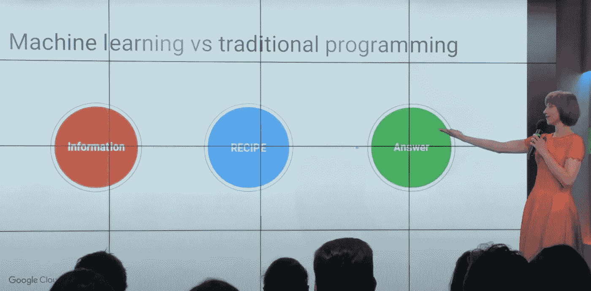
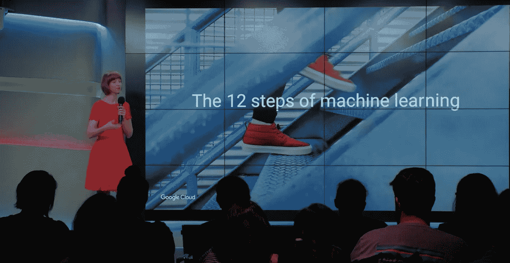
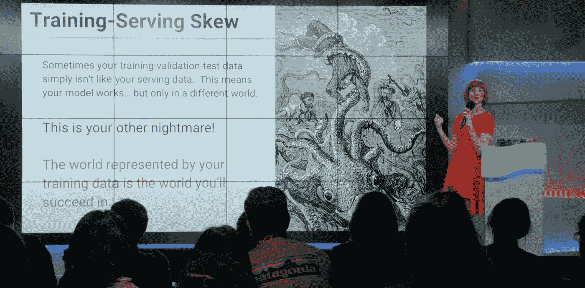
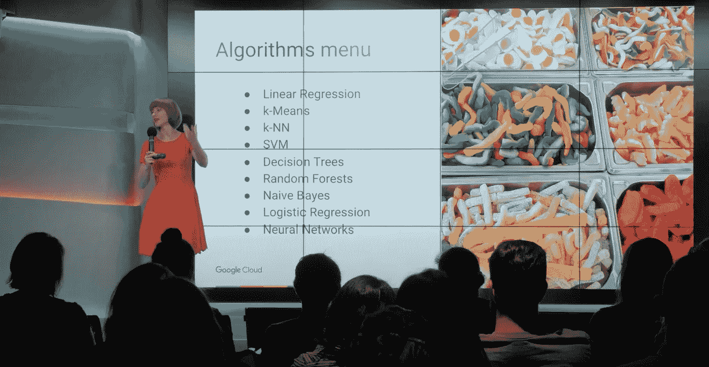

# 与机器学习交朋友

> 原文：<https://towardsdatascience.com/making-friends-with-machine-learning-5e28d5205a29?source=collection_archive---------8----------------------->

## 谷歌传奇的应用人工智能课程为初学者和专家设计

与机器学习交朋友是一门仅供内部使用的谷歌课程，专门为启发初学者和娱乐专家而创建。*这是谷歌有史以来最受欢迎的教育产品之一。好奇里面有什么吗？今天，你可以！

你可以在 YouTube 上找到完整的课程:

完整的课程可以在 YouTube 这里免费获得:[**bit.ly/funaicourse**](https://bit.ly/funaicourse)

该课程旨在为每个人(无论你的角色如何)提供有效参与机器学习所需的工具，以解决商业问题，并在一个日益以人工智能为燃料的世界中成为一个好公民。

MFML 对各种各样的人来说都是完美的；它侧重于概念理解(而不是数学和编程细节)，并通过形成机器学习成功方法基础的思想来指导您。它有适合每个人的东西！

整个 6.5 小时的课程分为 4 个部分:

*   [第 1 部分——ML 简介](http://bit.ly/mfml_part1)

*   [第二部分——机器学习项目的生命周期](https://bit.ly/mfml_part2)

*   [第 3 部分—来自原型和生产的人工智能](http://bit.ly/mfml_part3)

*   [第 4 部分—打开黑盒](https://bit.ly/mfml_part4)

# 三种方式来享用整个课程

1)每隔几个月通过这份简讯获取完整的章节。[第 1-4 部分的拖车。](https://www.youtube.com/watch?v=41FsWdYqNo8)

2)在 YouTube 上订阅并欣赏短视频，因为他们每隔几天就会加入 [MFML 播放列表](http://bit.ly/mfml_000)。

3)跳过视频，直接进入 [MFML 播放列表](http://bit.ly/mfml_000)每集描述中链接的博客文章。

# 课程介绍

***与机器学习交朋友*** 是一门仅供内部使用的谷歌课程，专为启发初学者和娱乐专家而创建。*今天，每个人都可以使用它！

该课程旨在为您提供有效参与机器学习所需的工具，以解决商业问题，并在一个日益以人工智能为燃料的世界中成为一个好公民。MFML 对所有人类来说都是完美的；它侧重于概念理解(而不是数学和编程细节)，并通过形成机器学习成功方法基础的思想来指导您。它有适合每个人的东西！

**完成本课程后，您将:**

*   获得对核心机器学习概念的直观而正确的理解。
*   了解几种流行的机器学习方法的味道。
*   避免机器学习中的常见错误。
*   了解机器学习如何帮助你的努力。
*   深入了解领导机器学习项目从概念到启动及以后的各个步骤。
*   提高你与 ML 专家和非专家沟通的能力。

# 寻找动手 ML/AI 教程？

以下是我最喜欢的 10 分钟演练:

*   [汽车](https://console.cloud.google.com/?walkthrough_id=automl_quickstart)
*   [顶点艾](https://bit.ly/kozvertex)
*   [人工智能笔记本](https://bit.ly/kozvertexnotebooks)
*   [表格数据的 ML](https://bit.ly/kozvertextables)
*   [文本分类](https://bit.ly/kozvertextext)
*   [图像分类](https://bit.ly/kozverteximage)
*   [视频分类](https://bit.ly/kozvertexvideo)

# *课程适合你吗？看看人们对此有什么看法

她演讲的质量简直让我震惊。这是一个 6 小时(！)绝技；在每一分钟里，凯西都清晰、风趣、充满活力、平易近人、见解深刻、知识丰富。麻省理工学院计算机科学教授哈尔·艾伯森

这门课程是针对普通大众的，我怎么强调都不为过 —人力资源专家

*“神奇的课，再加上很爆笑！”* —软件工程师

“我现在对自己对 ML 的理解更有信心了……我喜欢它。” —通信经理

“在这方面，比我在大学里学的任何课程都有用。” —可靠性工程师

“我喜欢她组织课程的方式，了解课程内容，并在一整天的课程中游刃有余。因此，我在这一课中学到了两件事。1)机器学习，2)演示技巧。” —主管

很棒的东西:我会推荐它 — ML 研究科学家

“…总是很有趣，吸引我的注意力。” —工程高级主管

*“…结构良好，清晰，适合像我这样的人，充满有用的视觉效果和故事，有助于我理解和记忆。我学到了很多。”* —高级销售主管

“MFML 的课程是非凡的。它为理解最佳实践奠定了基础，并增强了我尝试应用 ML 的信心。” —产品技术经理

*“这一次我觉得我已经理解了 90%以上的内容。平时我一直很失落，觉得自己极其愚蠢，想哭。”* —项目经理

*“比其他课程高级得多，但也更普遍、更完整。提供了一个很好的主题概述…填补了我的许多“漏洞”。它真的揭开了很多事情的神秘面纱。”* —软件工程师

*“虽然我在过去(大约 8 年前)学习和使用过 ML，但我已经厌倦了，所以我对最近的趋势不太感兴趣……经过这次更新，我觉得我可以重建这种关系，并再次与 ML 成为朋友。”* —产品经理

“由于凯西深厚的专业知识、机智和幽默，原本深奥的材料变得通俗易懂，令人愉快。” —用户体验设计师

# 如果你喜欢它，那么你应该分享它…

外面有很多垃圾，所以万一你认为这个课程比大多数选择都好，请通过与你的社区分享来帮助它脱颖而出:[bit.ly/mfml_part1](http://bit.ly/mfml_part1)

# 超越机器学习

如果你对超越 ML 的[数据科学](http://bit.ly/quaesita_datasci)主题感兴趣，请查看我的迷你课程:

*   [分析](https://bit.ly/quaesita_sminianalytics)
*   [统计数据](https://bit.ly/quaesita_sministats)

# 还在找课程链接？

他们又来了:

*   第一部:[bit.ly/mfml_part1](http://bit.ly/mfml_part1)
*   第二部分:[**bit.ly/mfml_part2**](https://bit.ly/mfml_part2)
*   第三部分:[**bit.ly/mfml_part3**](http://bit.ly/mfml_part3)