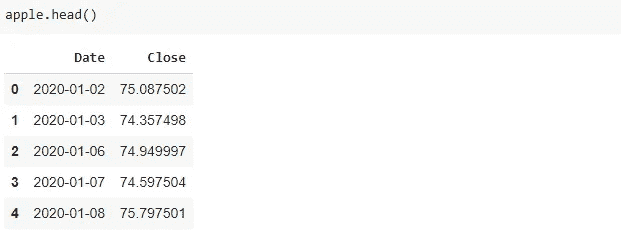
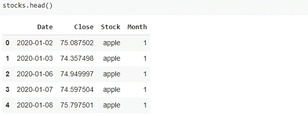
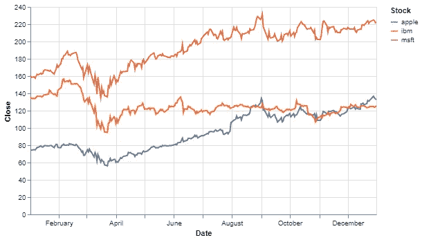
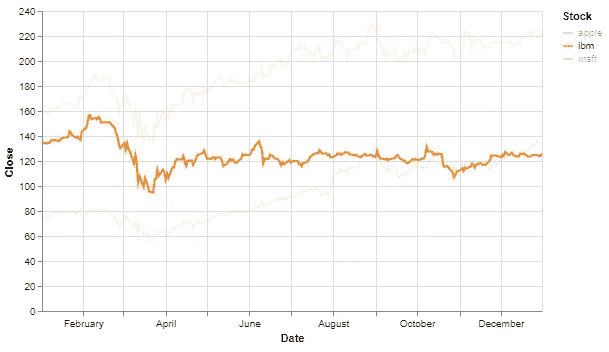
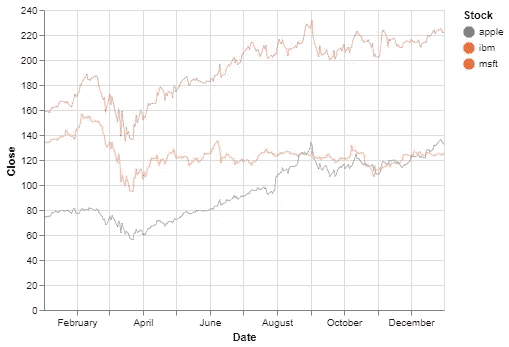
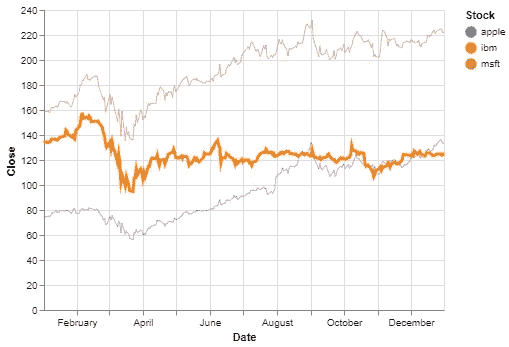

# 用 Python 熊猫和牛郎星制作交互式线条图

> 原文：<https://towardsdatascience.com/making-interactive-line-plots-with-python-pandas-and-altair-7ee1d109e3dd?source=collection_archive---------21----------------------->

## 将增强你的 EDA 过程的图


由 [Neven Krcmarek](https://unsplash.com/@nevenkrcmarek?utm_source=unsplash&utm_medium=referral&utm_content=creditCopyText) 在 [Unsplash](https://unsplash.com/s/photos/stock-price?utm_source=unsplash&utm_medium=referral&utm_content=creditCopyText) 上拍摄的照片

线图是数据分析的重要部分。它让我们了解了一个量在连续测量中是如何变化的。在处理时间序列的情况下，线图的重要性变得至关重要。

趋势、季节性和相关性是可以在精心生成的线图上观察到的一些特征。在本文中，我们将使用两个 Python 库创建交互式线图:Pandas 和 Altair。

Pandas 提供数据，Altair 制作美丽且信息丰富的线图。虽然 Pandas 也能够绘制数据，但它不是一个显式的数据可视化库。此外，我们将使情节互动，这是熊猫无法做到的。

让我们从生成数据开始。折线图的一个典型用例是分析股票价格。获取股价数据最简单的方法之一就是`pandas-datareader`库。我们首先需要将它与 Pandas 一起导入(已经安装在 Google Colab 中)。

```
import pandas as pd
from pandas_datareader import data
```

我们将得到 3 种不同股票在 1 年内的价格。需要指定开始日期、结束日期和来源。

```
start = '2020-1-1'
end = '2020-12-31'
source = 'yahoo'
```

还有一个必需的信息是股票的名称。

```
apple = data.DataReader("AAPL", start=start ,end=end, data_source=source).reset_index()[["Date", "Close"]]ibm = data.DataReader("IBM", start=start ,end=end, data_source=source).reset_index()[["Date", "Close"]]microsoft = data.DataReader("MSFT", start=start ,end=end, data_source=source).reset_index()[["Date", "Close"]]
```



(图片由作者提供)

我们现在有苹果、IBM 和微软在 2020 年的股价。最好将它们放在一个数据框中。在合并之前，我们需要添加一个列来指示特定价格属于哪只股票。

下面的代码块添加相关的列，然后使用`concat`函数组合数据帧。

```
apple["Stock"] = "apple"
ibm["Stock"] = "ibm"
microsoft["Stock"] = "msft"stocks["Month"] = stocks.Date.dt.monthstocks = pd.concat([apple, ibm, microsoft])
```



(图片由作者提供)

我们还添加了可能对分析有用的月份信息。我们现在可以开始创建情节。

## 阿尔泰尔

Altair 是 Python 的统计可视化库。它的语法清晰易懂，我们将在示例中看到。用 Altair 创建交互式可视化也非常简单。

我将简要说明牵牛星的结构，然后重点介绍如何创建交互式线条图。如果你是牛郎星的新手，这里有一个牛郎星的 4 部分系列教程:

*   第一部分:[简介](/altair-statistical-visualization-library-for-python-cfb63847c0c0)
*   第 2 部分:[过滤和转换数据](/altair-statistical-visualization-library-for-python-part-2-4c8ce134e743)
*   第 3 部分:[互动情节和动态过滤](/altair-statistical-visualization-library-for-python-part-3-c1e650a8411e)
*   第 4 部分:[定制可视化](/altair-statistical-visualization-library-for-python-part-4-9ec970fb12e8)

这是一个简单的线图，不具备任何交互性。

```
alt.Chart(stocks).mark_line().encode(
   x="Date",
   y="Close",
   color="Stock"
).properties(
   height=300, width=500
)
```



(图片由作者提供)

基本结构从顶级图表对象开始。数据可以是 Pandas 数据框的形式，也可以是指向 json 或 csv 文件的 URL 字符串。然后指定可视化的类型(例如，`mark_circle`、`mark_line`等等)。

`encode`函数告诉 Altair 在给定的数据帧中绘制什么。因此，我们在`encode`函数中写的任何东西都必须链接到数据。`color`参数区分不同的股票名称。与 Seaborn 的`hue`参数相同。最后，我们使用`properties`函数指定绘图的某些属性。

为情节增加交互性的一种方法是通过选择。Altair 中的一个选择捕获了用户的交互。

```
selection = alt.selection_multi(fields=["Stock"], bind="legend")alt.Chart(stocks).mark_line().encode(
   x="Date",
   y="Close",
   color="Stock",
   opacity=alt.condition(selection, alt.value(1), alt.value(0.1))
).properties(
   height=300, width=500
).add_selection(
   selection
)
```

上面的选择对象基于包含股票名称的股票列。它必然与传说有关。我们将其传递给`opacity`参数，这样线条的不透明度会根据所选股票名称而变化。

我们还需要使用`add_selection`函数将选择添加到绘图中。下面两幅图像演示了选择是如何工作的。我们只需要点击图例中的股票名称。然后，相应地更新绘图。


(图片由作者提供)



(图片由作者提供)

Altair 提供了其他选项来捕捉用户交互。例如，我们可以创建一个交互式的线图，将鼠标悬停在图上就可以更新。

下面的代码创建了一个 selection 对象，它执行我们刚刚描述的选择。

```
hover = alt.selection(
   type="single", on="mouseover", fields=["Stock"], nearest=True
)
```

我们将使用选择对象来捕捉图上最近的点，然后突出显示该点所属的线。

下面的代码中有 3 个组件。第一个创建线形图。第二个是绘制在线图上的散点图，用于识别最近点。我们调整不透明度，使散点图不可见。

第三个负责突出显示第二个图中包含捕获点的线。

```
# line plot
lineplot = alt.Chart(stocks).mark_line().encode(
   x="Date:T",
   y="Close:Q",
   color="Stock:N",
)# nearest point
point = lineplot.mark_circle().encode(
   opacity=alt.value(0)
).add_selection(hover)# highlight
singleline = lineplot.mark_line().encode(
   size=alt.condition(~hover, alt.value(0.5), alt.value(3))
)
```

现在可以通过合并第二个和第三个图来生成交互式线图。

```
point + singleline
```



(图片由作者提供)



(图片由作者提供)

第一个图像显示了原始或原始的情节。第二张图显示了我悬停在图上时的更新版本。

## 结论

Altair 在向可视化添加交互式组件方面非常灵活。一旦你对交互性的元素有了全面的理解，你就可以丰富你的可视化。

感谢您的阅读。如果您有任何反馈，请告诉我。